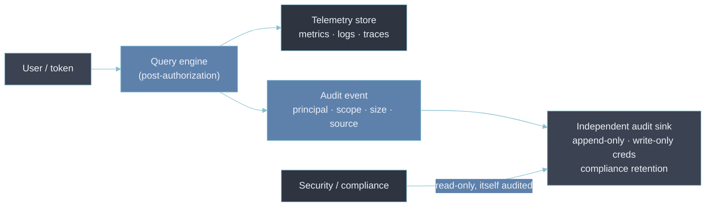

# 6 — Audit Logging

- [[05-security-and-compliance]] makes the case in one line: "who queried which tenant's data, and
  when, is usually the fastest way to reconstruct what an engineer actually saw during a security
  review."
- This section is that query audit log treated as a control in its own right — what it has to
  record, why it has to live apart from everything it records, and how it stays trustworthy.

---

## The query audit log is not the platform's operational telemetry

Two things get called "observability of the platform", and they are different:

- **Self-observability** ([[08-self-observability]]) — is the pipeline healthy, is data flowing, is
  the query tier within its SLO. Operational; consumed by SRE.
- **The access audit log** — which principal ran which query against which tenant's data, when, from
  where, and how much came back. Security; consumed by compliance and incident responders.

- Different consumers, different retention drivers (ops need vs regulation), different integrity bar
  — a dropped health metric is a gap; a dropped or altered audit record is a failed control.
- Routing audit events through the same pipeline as health metrics is the first mistake.

---

## What a query-audit event has to capture

| Field              | Why it's needed                                                            | Common gap                                          |
| ------------------ | -------------------------------------------------------------------------- | --------------------------------------------------- |
| Principal          | A person (SSO identity) or a service account / token ID                    | Logging the token but not which human holds it      |
| Timestamp          | To the second, in UTC                                                      | —                                                   |
| Query text         | What was asked                                                             | Captured — but see the next row                     |
| **Resolved scope** | The tenant(s) / label selector the query _actually ran against_ after LBAC | Most often missing — the field forensics needs      |
| Result size        | Rows / series / bytes returned — separates a check from a bulk extraction  | Not recorded, so exfiltration looks like normal use |
| Source             | UI vs API, client IP, session / request ID, user agent                     | Partially recorded                                  |
| Outcome            | Success, denied, error, partial                                            | —                                                   |

- The resolved-scope row is the one worth dwelling on.
- The raw query `up` tells you nothing.
- `up` _resolved against tenant `payments-prod`, run by an engineer on the `search` team under a
  break-glass grant_ is the whole story.
- Record the post-authorization scope, not just the request.

---

## It has to outlive what it audits

- This is the bootstrapping problem [[08-self-observability]] describes, applied to access records
  instead of health signals.
- If the audit log is written to the same store, through the same pipeline, under the same
  credentials as the telemetry it records, then the event you most need — "what did the attacker
  query while they had access" — is exactly the one they can suppress or rewrite.

The requirements that follow:

- **Independent sink** — a different store or account from the telemetry backend: a SIEM, an
  append-only log service, a dedicated bucket.
- **Write-only from the query tier** — the component emitting audit events can append but cannot
  read or delete them; a separate, tightly held credential reads them.
- **Tamper-evidence** — append-only / WORM storage, optionally hash-chaining each record to the
  previous one so a deletion or edit breaks the chain visibly.
- **Access to the audit log is itself audited** — reading it is a privileged action that generates
  its own record.

---

## Retention is set by compliance, not by the ops budget

- Operational telemetry retention is a [[04-retention-policies|cost decision]] — keep detail while
  it's useful for debugging, then downsample or drop.
- Audit-log retention is a control requirement: SOC 2 and ISO 27001 programs typically expect on the
  order of a year, often a shorter hot window plus a longer cold archive, and some regimes require
  more.
- Set it from the obligation.
- Keep it separate from the [[06-log-retention]] policy for application logs, so a cost-driven trim
  of the latter never quietly shortens the former.

---

## What the log is actually for

- An audit log nobody reads is a storage line item. It earns its cost through three uses:
  - **Incident forensics** — "what did this account see between 02:00 and 04:00 on the day of the
    breach." Minutes to answer if resolved scope and result size are recorded; a research project if
    they aren't.
  - **Access review** — periodic confirmation that the people and tokens querying a sensitive tenant
    are the ones who should be. Pairs with the [[01-rbac|break-glass]] signal: elevated grants
    should correlate with elevated activity and nothing else.
  - **Anomaly detection** — off-hours access, a sudden bulk export, a service account querying a
    tenant it has never touched, a spike in denied queries (someone probing their scope). Detections
    built _on_ the audit stream, correlated with change events the way
    [[03-cross-signal-correlation]] correlates signal types.

---

## Bad → better: the audit log in the store it audits

- **Bad.** Query audit events are shipped as structured logs into the same log tenant the platform
  uses for its own operational logs, on the platform team's standard 30-day retention.
- **Why it's bad.**
  - Anyone who compromises the platform's log-write credential can delete or forge audit records.
  - 30 days is too short for a compliance review that happens quarterly.
  - Every access review has to filter audit events out of a stream full of pipeline noise.
- **Better.** Emit audit events to a dedicated append-only sink with write-only credentials from the
  query tier, a compliance-set retention of a year, hash-chained records, and read access limited to
  security. Operational logs stay where they are.

---

## Why this matters for an Observability Architect

- The question to ask of an audit design is "if the query tier were compromised right now, could the
  attacker's own queries be erased from this log."
- If the answer is anything but a clear no, the log is a convenience, not a control.
- After that, check that resolved scope and result size are recorded — a log that captures _which_
  query but not _what it touched_ or _how much came back_ can't answer the one question an incident
  will ask of it.

## Metadata

| Dimension | Detail        |
| --------- | ------------- |
| Author    | Amit Singh    |
| Scope     | observability |
