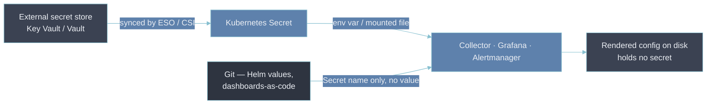

# 7 — Secret Management

- A secret _in_ telemetry and a secret _in_ the observability plane's own config are two different
  failures wearing one name.
  - The first is a credential you didn't mean to collect.
  - The second is a credential you did mean to use, sitting in plaintext where the wrong person can
    read it.
- Both hand an attacker a working key. They are found and fixed differently.

---

## Problem 1 — credentials leaking into telemetry

- The entry points are the same ones [[04-pii-redaction]] lists — headers captured as span
  attributes, tokens in URLs and query strings, connection strings in log lines, API keys
  interpolated into exception messages.
- The threat and the detection are not:
  - **Threat.** Not a privacy exposure — a live credential. Anyone who can read the telemetry (see
    [[01-rbac]], [[06-audit-logging]]) now holds it, and it has been replicated into backups and, on
    a SaaS backend, into a third party's storage.
  - **Detection.** PII scanning looks for _shapes of personal data_. Secret scanning looks for
    _high-entropy strings_ and _known prefixes_ — `glc_`, `glsa_`, `AKIA…`, `ghp_`, `xoxb-`,
    `-----BEGIN … PRIVATE KEY-----`. Both run as [[04-pii-redaction|collector-stage redaction]],
    with different rule sets: an allowlist of safe headers/attributes plus an entropy check on the
    rest.
- The redaction _mechanism_ is shared with [[04-pii-redaction]]; the _response_ differs. A leaked
  secret means **rotate the credential**, not just scrub the record — the record already shipped.

---

## Problem 2 — plaintext secrets in the observability plane's own config

The platform authenticates to a lot of things, and every one of those credentials lives somewhere:

- **Write credentials** — the `glc_` access-policy token an agent uses to push to Mimir/Loki/Tempo;
  a remote-write bearer token; an OTLP exporter `Authorization` header.
- **Read credentials** — data-source basic-auth passwords in Grafana, a federation token.
- **Notification secrets** — a PagerDuty routing key, a Slack/Teams webhook URL, an SMTP password in
  an Alertmanager receiver.
- **Provisioning secrets** — the API token Terraform or a GitOps controller uses to manage
  dashboards and alert rules.

The failure mode:

- any of these ending up in `values.yaml`, a `ConfigMap`, a committed data-source JSON, or a
  dashboard definition in the as-code repo
- readable by anyone with repo access or `Editor` on the Grafana instance
- preserved in git history forever even after a later "fix" commit

---

## The control: secrets live in a store, config references them at runtime



- **External store as the source of truth** — [[key-vault-secrets|Azure Key Vault]] here, synced
  into the cluster by the External Secrets Operator or the CSI Secrets Store driver. The Helm chart
  references a `Secret` by name; the value is never in the chart.
- **Runtime interpolation, not baked config** — the OpenTelemetry Collector and Alloy support
  `${env:OTLP_TOKEN}` substitution; use it so the config on disk has no secret in it.
- **Workload identity removes the long-lived secret entirely** — an agent that federates to cloud
  IAM via OIDC (the pattern [[security-access-compliance]] uses for CI → Azure) holds no static
  token; it exchanges a short-lived identity assertion for a scoped credential at startup.

---

## Scope and blast radius: a leaked write token is not a read-only problem

- A leaked _read_ token exposes data.
- A leaked _write_ token lets an attacker inject or overwrite telemetry — suppress the metric that
  would have alerted, flood a tenant to bury a signal, forge traces to misdirect an investigation.
- That is the [[05-36-q11-answer-compromised-agent-threat-model|compromised-agent threat model]]:
  the component producing telemetry is itself a position of trust.
- The mitigations all narrow what one token can do:
  - **Write-only, single-tenant, single-signal.** A token that can push metrics for `payments-prod`
    and nothing else. The `glc_` access-policy token vs `glsa_` service-account token distinction is
    exactly this — an access-policy token scoped to `metrics:write` on one stack, not an admin
    service-account token that happens to also work.
  - **One token per workload / environment**, so revocation is surgical.
  - **A rotation cadence** — short enough that a leak has a bounded life, automated so it actually
    happens. See [[key-vault-secrets]] and the token-rotation runbook it links.

---

## Bad → better: the shared god token

- **Bad.** Every collector across every environment authenticates with one `glc_` token that has
  write access to all tenants, set as `remoteWrite.token` in a `values.yaml` committed to the
  platform repo.
- **Why it's bad.**
  - Anyone with repo read access has estate-wide telemetry write.
  - It is in git history permanently, so a later move to a `Secret` doesn't undo the exposure.
  - Rotating it means a coordinated redeploy of every collector, so in practice it never rotates.
  - One leak compromises every environment at once.
- **Better.** One access-policy token per environment, scoped write-only to that environment's
  tenant, stored in [[key-vault-secrets|Key Vault]], synced to the cluster as a `Secret`, referenced
  by name in the chart, rotated on a schedule. A leak is one environment, revocable without touching
  the others.

---

## Config example

```yaml
# OTLP exporter reads its credential from the environment, never from the file.
exporters:
  otlphttp/grafana:
    endpoint: https://otlp-gateway.example.net/otlp
    headers:
      Authorization: "Bearer ${env:OTLP_WRITE_TOKEN}"
```

```yaml
# The token is synced from the external store, not authored here.
apiVersion: external-secrets.io/v1
kind: ExternalSecret
metadata:
  name: otlp-write-token
spec:
  refreshInterval: 1h
  secretStoreRef:
    name: azure-key-vault
    kind: SecretStore
  target:
    name: otlp-write-token          # creates Secret 'otlp-write-token'; Deployment maps its key to $OTLP_WRITE_TOKEN
  data:
    - secretKey: OTLP_WRITE_TOKEN
      remoteRef:
        key: obs-collector-otlp-write-token-prod
```

- Validate that the collector config still resolves with the variable set —
  `otelcol validate --config config.yaml`, or `alloy fmt` for the Alloy form.

---

## Why this matters for an Observability Architect

- The observability plane holds credentials to every environment it watches — a high-value target
  precisely because it touches everything.
- Three questions cover most of the risk:
  - could someone with `Editor` or repo access read this secret
  - what can a leaked _write_ token do beyond expose data
  - how, and how often, does it rotate
- A design that keeps secrets in a store, references them at runtime, and scopes each token to one
  job answers all three.
- One god token in a `values.yaml` fails all three at once.

## Metadata

| Dimension | Detail        |
| --------- | ------------- |
| Author    | Amit Singh    |
| Scope     | observability |
