# 8 — Observability as Policy

- **Observability as Policy** — observability treated not as a per-team add-on, but as an
  **organizational engineering policy**: mandatory standards, controls, governance.
- The question changes.

Instead of:

> “Does this application have dashboards?”

the organization asks:

> “Does this system satisfy our observability requirements before it is allowed into production?”

- Structure it as: **What → Why → How → Enforcement → Evidence**

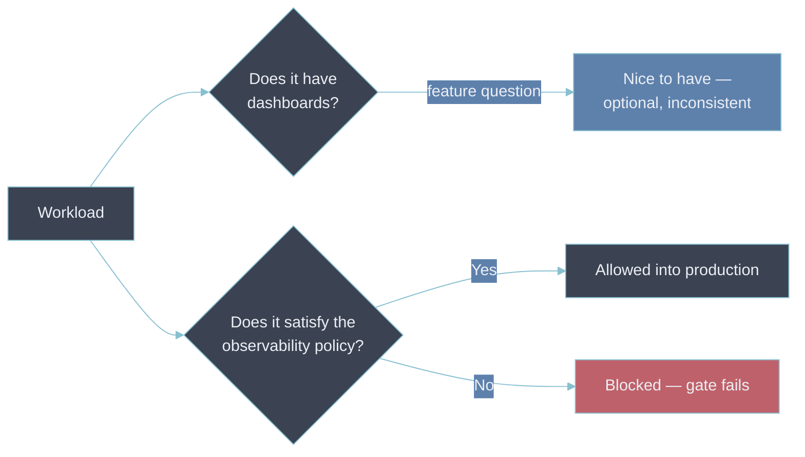

- The feature question has no consequence for a "no."
- The policy question is a **gate** — it decides whether the workload ships.

---

## 1. What is Observability as Policy?

- An observability policy defines the **minimum observability requirements every system must
  satisfy**.
- It covers:

| Area           | Policy question                               | Example requirement                                                        | Related note                                               |
| -------------- | --------------------------------------------- | -------------------------------------------------------------------------- | ---------------------------------------------------------- |
| **Metrics**    | What metrics must every service expose?       | RED for every request path, USE for every resource                         | [[02-the-signals]]                                         |
| **Logs**       | What must be logged, and in what format?      | Structured JSON, one event per line, `trace_id` present                    | [[02-the-signals]]                                         |
| **Traces**     | Which requests must be traceable?             | Every inbound request on a Tier-1 service                                  | [[02-the-signals]]                                         |
| **Naming**     | One name per concept, across the estate       | HTTP latency is `http.server.request.duration`, never `latency_ms`         | [[06-semantic-conventions]], [[05-label-schema-design]]    |
| **Context**    | Which attributes must exist across telemetry? | `service.name`, `service.namespace`, `deployment.environment`, owning team | [[07-resources]]                                           |
| **Alerting**   | Which failure conditions require alerts?      | SLO fast-burn, and any hard dependency down                                | [[01-alerting-and-routing]]                                |
| **Dashboards** | What operational visibility is mandatory?     | One RED dashboard per Tier-1 service                                       | —                                                          |
| **SLOs**       | Which critical services require SLOs?         | Tier-1: one availability and one latency SLO with burn-rate alerts         | [[02-slos-and-error-budgets]]                              |
| **Security**   | What telemetry data must never be collected?  | No secrets, tokens, card numbers, or free-text PII in labels               | [[05-security-and-compliance]]                             |
| **Retention**  | How long is telemetry retained?               | Metrics 13 months, logs 30 days hot, traces 7 days                         | [[04-retention-policies]]                                  |
| **Cost**       | How much telemetry can a workload generate?   | Active-series and ingest GB/day budget per team, alert at 80%              | [[07-finops-for-observability]], [[ingest-budget-by-team]] |
| **Ownership**  | Who owns the telemetry and alerts?            | Every Tier-1 and Tier-2 service maps to a team and a rotation              | [[error-budget-policy]]                                    |
| **Compliance** | What evidence must be retained?               | The scorecard result for every production deploy                           | —                                                          |

- The policy is a **contract** between platform engineering, application teams, SRE, security, and
  operations.
- Two things separate a policy from a wish list:
  - It is **tiered** (§9), so the requirements are not uniformly heavy.
  - Every requirement is **checkable** — a machine or a reviewer answers pass/fail without a
    judgment call.

---

## 2. Why Observability as Policy?

- Without policy, observability drifts per team:

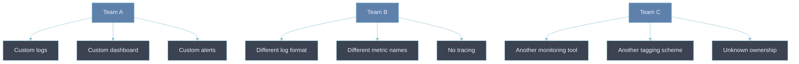

- Result: fragmented observability.
- With policy:

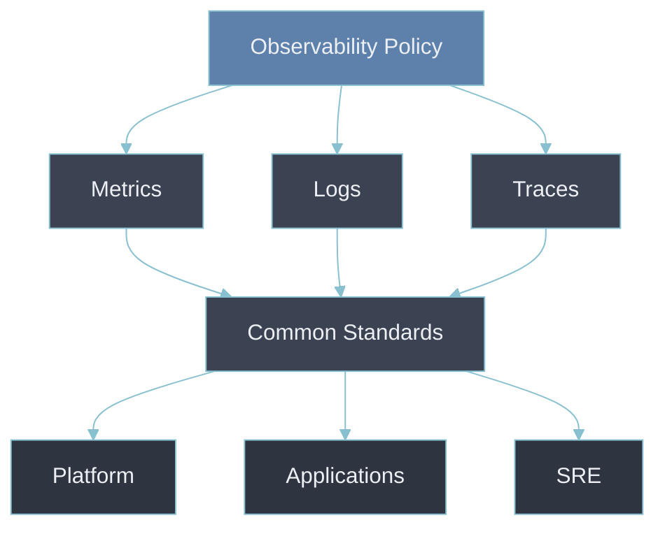

- The distinction:

| Monitoring asks      | Observability policy asks                          |
| -------------------- | -------------------------------------------------- |
| "Can we monitor it?" | "What level of observability is mandatory for it?" |

- That shift matters at scale.

---

## 3. What Problem Does It Solve?

Several problems.

### 3.1 Inconsistent telemetry

- Same measurement, three names:

```text
request_time
duration_ms
latency
```

- Policy establishes naming and semantic standards:

```text
http.server.request.duration
http.server.request.count
```

---

### 3.2 Missing telemetry

- A service ships, then mid-incident someone says:

> “We don't have traces for this service.”

- Policy stops this from being an operational surprise.

---

### 3.3 Observability becoming optional

- Without policy:

> “We'll add it when we have time.”

- With policy:

> “This is part of the definition of production readiness.”

---

### 3.4 Excessive telemetry

- The opposite failure — teams collect:

```text
Everything → everywhere → forever
```

- Cost of that:
  - storage cost
  - ingestion cost
  - query cost
  - noise
  - privacy risk
- Policy defines **what should and should not be collected**.

---

### 3.5 Security and compliance

- Observability systems frequently carry sensitive data:

```text
Authorization headers
Tokens
Passwords
PII
Customer identifiers
Request payloads
```

- Policy can prohibit it explicitly:

> Secrets, authentication tokens, passwords, and sensitive personal data SHALL NOT be emitted into
> logs or telemetry.

- See [[05-security-and-compliance]] — how sensitive data reaches telemetry, and the pipeline-layer
  check that strips it.
- Policy makes that check mandatory rather than optional.

---

## 4. How Do You Implement Observability as Policy?

- A mature implementation has **five layers**:

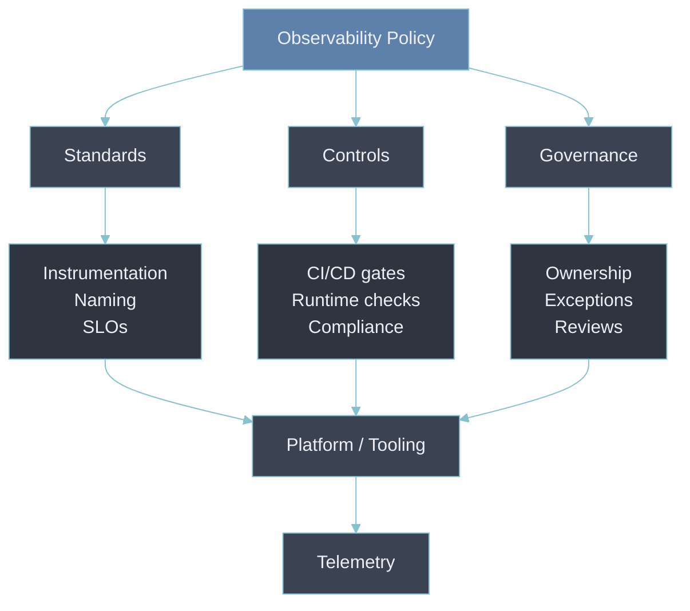

---

## 5. Layer 1 — Define the Policy

- Start with **principles**, not Grafana dashboards:

> All production workloads must provide standardized metrics, structured logs, distributed tracing
> where applicable, service ownership metadata, health indicators, and operational alerting.

- Then define specific requirements.
- **Required metadata** — every telemetry event should carry:

```text
service.name
service.version
deployment.environment
cloud.provider
cloud.region
team
```

- And potentially:

```text
application
business_unit
environment
criticality
```

- This becomes extremely valuable in a large environment.

---

## 6. Layer 2 — Define Observability Standards

- Policy → **what must exist**.
- Standards → **how it's implemented** (naming + semantics: [[06-semantic-conventions]]).

### Logging standard

- Require structured events:

```json
{
  "timestamp": "...",
  "severity": "ERROR",
  "service.name": "orders-api",
  "trace_id": "...",
  "span_id": "...",
  "message": "...",
  "error.type": "...",
  "error.message": "..."
}
```

- Not arbitrary text:

```text
ERROR: something failed
```

### Metrics standard

- Mandatory metric categories:

```text
Request rate
Error rate
Latency
Availability
Resource saturation
Dependency health
```

- Gives every service a common **RED + USE foundation** — see [[02-the-signals]].

### Tracing standard

- Define:

```text
Trace propagation
Sampling
Span naming
Required attributes
Cross-service correlation
```

- A request should stay correlated across the entire path:

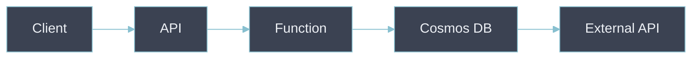

---

## 7. Layer 3 — Turn Policy into Engineering Controls

- This is where **Observability as Policy becomes powerful**.
- Don't rely on documentation — automate it:

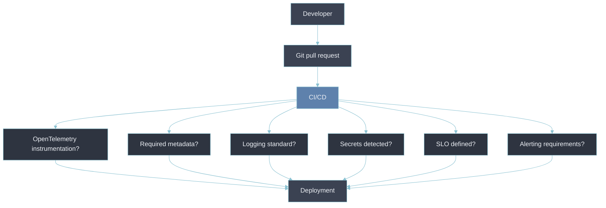

- Example policies:

```text
IF environment == production
THEN service.owner MUST exist
```

```text
IF service.criticality == Tier-1
THEN SLO MUST exist
AND alerting MUST exist
AND distributed tracing MUST be enabled
```

---

## 8. Policy-as-Code

- The natural evolution of Observability as Policy. Full treatment: [[09-policy-as-code]].
- Instead of prose rules, encode them:

```yaml
service:
  production: true

observability:
  metrics: required
  logs: required
  traces: required

ownership:
  team: required

slo:
  required: true
```

- Automated systems then validate this.
- Integrates with:
  - Azure Policy
  - OPA / Gatekeeper
  - Terraform validation
  - CI/CD pipelines
  - Kubernetes admission controllers
  - GitHub Actions
  - OpenTelemetry configuration
  - Grafana provisioning APIs

---

## 9. Layer 4 — Establish Observability Tiers

- Not every application needs the same requirements. **This is important.**
- A single bar for every workload:
  - over-engineers the internal batch utility
  - under-engineers the revenue-critical API
- Define **tiers** instead:

| Tier       | System            | Requirements                                          |
| ---------- | ----------------- | ----------------------------------------------------- |
| **Tier 1** | Business critical | Metrics + logs + traces + SLO + alerting + dashboards |
| **Tier 2** | Important         | Metrics + logs + traces + basic alerting              |
| **Tier 3** | Non-critical      | Metrics + logs + basic health monitoring              |

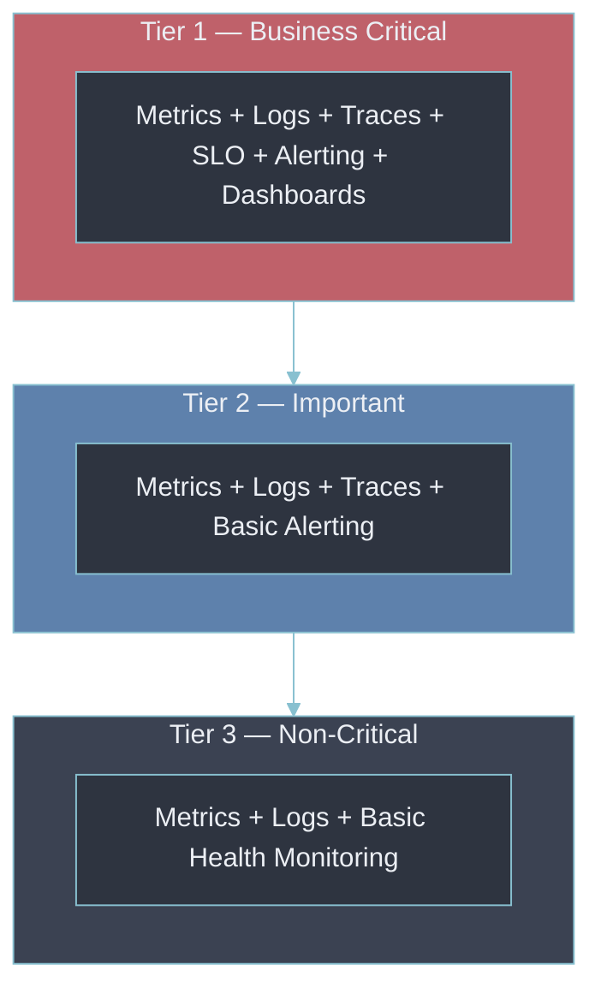

- Prevents over-engineering — an internal batch utility does not need the observability maturity of
  a revenue-critical API.
- Tier-1's SLO requirement is exactly [[02-slos-and-error-budgets]]. Policy makes the SLO mandatory,
  not a best practice teams skip under deadline pressure.

---

## 10. Layer 5 — Measure Compliance

- You cannot manage what you don't measure.
- **Observability Compliance Score:**
  - each tier's requirements → a per-service scorecard
  - every check is pass/fail
  - result is one number, trackable across the whole estate

| Check               | Orders API (Tier 1) | Legacy API (Tier 1) |
| ------------------- | :-----------------: | :-----------------: |
| Metrics             |          ✓          |          ✓          |
| Structured logs     |          ✓          |          ✗          |
| Distributed tracing |          ✓          |          ✗          |
| Ownership metadata  |          ✓          |          ✓          |
| Dashboard           |          ✓          |          ✗          |
| SLO                 |          ✓          |          ✗          |
| Alerts              |          ✓          |          ✓          |
| **Compliance**      |      **100%**       |       **43%**       |

- The Legacy API scores low on the checks that only surface during an incident:
  - no owner to page
  - no SLO to tell whether it's degraded
  - no traces to explain why
- Observability becomes measurable at organizational scale.

---

## 11. Rolling It Out Without a Big-Bang Block

- A policy fails on day one if a hard gate meets an estate that was never built to pass it.
- 200 services at ~40% average compliance + a blocking gate:
  - every deployment in the company stops
  - the policy is rolled back the same week
- The compliance score enables a phased rollout instead:

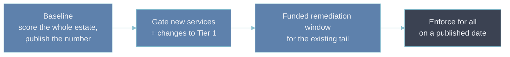

- **Baseline and publish** — score everything; share the number even when it's low. The trend
  matters, not the starting point.
- **Gate the frontier first** — new services and Tier-1 changes must pass now; everything else is
  measured but not blocked. New work is cheap to make compliant; retrofits are not.
- **Fund the tail** — give non-compliant services a real remediation window with allocated time, not
  a "please fix by Q3" email. The platform team ships paved-road defaults that make compliance close
  to free.
- **Enforce on a date everyone saw coming** — each check moves through audit → warn → enforce on a
  published schedule (see [[09-policy-as-code]]). A block is the last step of a plan, not a
  surprise.
- Trade-offs:
  - standardization vs team autonomy
  - speed vs control
  - months in "measured but not blocked" on purpose — slower convergence, no big-bang political cost

---

## 12. The Policy Needs an Owner and a Change Process

- A policy with no owner drifts:
  - keeps demanding a name the semantic conventions moved past two years ago
  - teams learn to ignore it
  - stays a document, stops being a standard
- A working policy has:
  - an **owner** — usually the platform / observability guild, with standing input from SRE,
    security, and application engineering
  - a **version**
  - a **review cadence**
  - a **change process** — the same review a code change gets
- On change: existing services get a grace period against the new version — same phased approach as
  adoption.

---

## 13. Observability Policy Should Cover More Than the Three Pillars

- Traditional focus: metrics, logs, traces.
- A modern policy goes further:

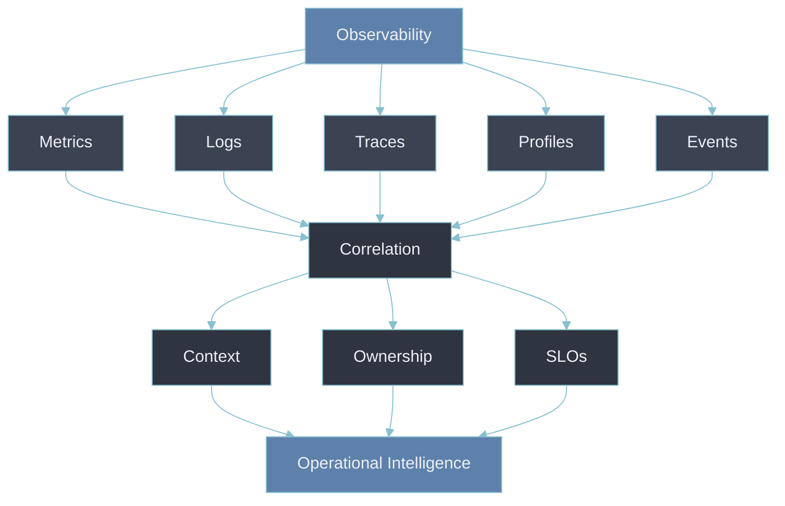

- Also include: **cost, security, privacy, retention, reliability, governance.**

---

## 14. The Most Important Principle

> **Observability should become a property of a production workload, not a feature of an
> observability platform.**

- Instead of:

> “We use Grafana Cloud.”

- The organization should say:

> “Every production workload must satisfy the observability baseline.”

- Grafana, Azure Monitor, OpenTelemetry, Prometheus — implementation mechanisms.
- The **policy stays tool-independent** wherever possible.
- Maturity mapping:
  - defined + tiered + enforced + measured = **Level 4** of the
    [[04-observability-maturity-model|observability maturity model]]
  - - error-budget + cost governance = **Level 5**
- Next step for a defined, tiered policy: automate enforcement → [[09-policy-as-code]] (how the
  requirement survives contact with a CI/CD pipeline instead of living only in a document).

---

## 15. Example Enterprise Policy

- **1. Telemetry** — all production services MUST emit:
  - standardized metrics
  - structured logs
  - distributed traces where applicable
- **2. Metadata** — telemetry MUST contain: `service.name`, `service.version`, `environment`,
  `owner`, `region`, `criticality`
- **3. Correlation** — logs and traces MUST correlate through: `trace_id`, `span_id`
- **4. Alerting** — Tier-1 services MUST alert on: availability, error rate, latency, saturation,
  critical dependencies
- **5. SLOs** — Tier-1 services MUST document: SLI, SLO, error budget
- **6. Security** — telemetry MUST NOT contain: passwords, secrets, tokens, sensitive customer data
- **7. Cost** — telemetry volume MUST be controlled through: sampling, retention, aggregation,
  cardinality controls
- **8. Ownership** — every production workload MUST have: technical owner, business owner, support
  group, escalation path
- **9. Compliance** — production deployment MUST pass the observability compliance check

---

## 16. Where This Fits in Your Azure + Grafana Environment

- Given an environment such as:

```text
Azure Container Apps
Azure Functions
Azure Logic Apps
Azure Cosmos DB
Azure SQL MI
On-prem infrastructure
```

- Don't create an **"Azure observability policy"**.
- Create an **enterprise observability policy** and map each platform to it:

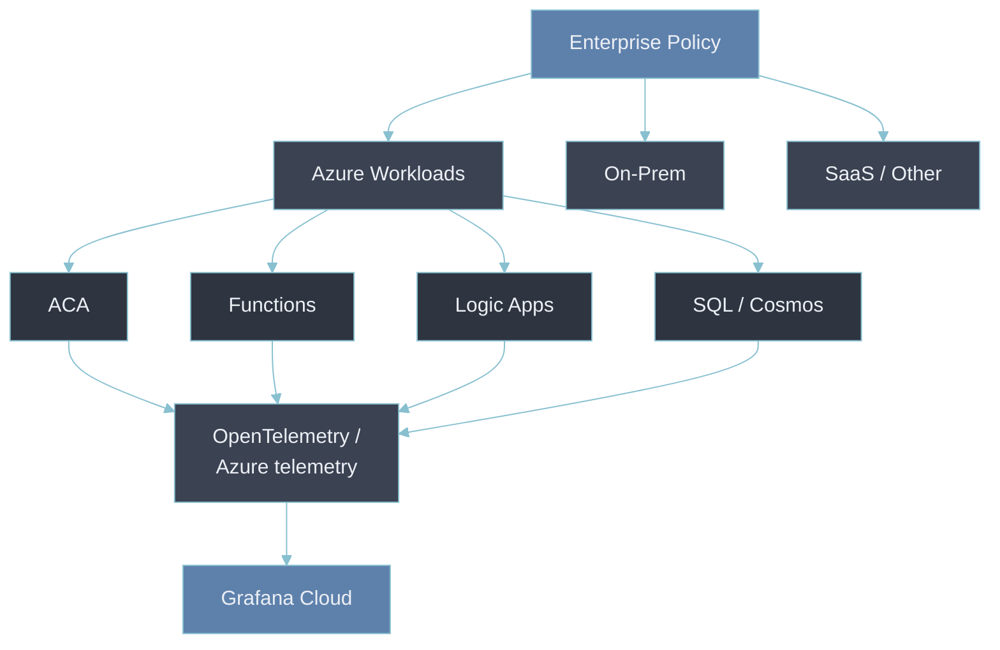

- Grafana = the **observability consumption and analysis layer**.
- Policy defines what telemetry must exist.

---

## 17. A Useful Maturity Model

| Level | Name                             | What it looks like                                                            |
| ----- | -------------------------------- | ----------------------------------------------------------------------------- |
| **0** | Reactive                         | Something broke, someone investigates                                         |
| **1** | Monitoring                       | Metrics, alerts, dashboards                                                   |
| **2** | Observability                    | Metrics, logs, traces, correlation                                            |
| **3** | Standardized Observability       | Common instrumentation, schemas, metadata, SLO practice                       |
| **4** | Observability as Policy          | Standards, automation, CI/CD controls, compliance scoring                     |
| **5** | Observability as Eng. Governance | Continuous compliance, error budgets, reliability governance, cost governance |

```mermaid
%%{init: {'theme':'base','themeVariables':{'primaryColor':'#3b4252','primaryTextColor':'#eceff4','primaryBorderColor':'#88c0d0','lineColor':'#88c0d0','secondaryColor':'#5e81ac','tertiaryColor':'#2e3440'}}}%%
flowchart LR
    L0["0 — Reactive"] --> L1["1 — Monitoring"] --> L2["2 — Observability"] --> L3["3 — Standardized"] --> L4["4 — Policy"] --> L5["5 — Governance"]

    classDef low fill:#3b4252,stroke:#88c0d0,color:#eceff4
    classDef mid fill:#5e81ac,stroke:#88c0d0,color:#eceff4
    classDef high fill:#2e3440,stroke:#88c0d0,color:#eceff4
    class L0,L1 low
    class L2,L3 mid
    class L4,L5 high
```

---

## 18. The Core Idea

> **Observability as Policy = Define the minimum observability capabilities every workload must
> have, express those requirements as enforceable standards, automate compliance, and continuously
> measure adherence.**

- The progression:

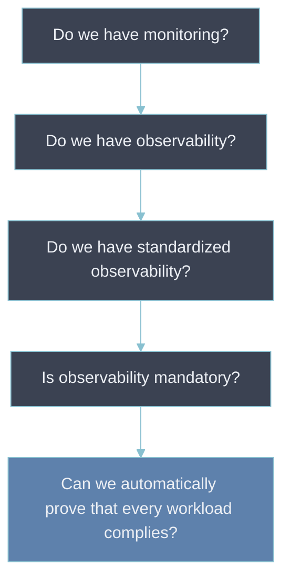

- That final step is where **Observability as Policy** becomes an architectural / governance
  discipline rather than just an implementation exercise.

---

## Bad → better: the 40-page policy nobody reads

- **Bad.**
  - long document
  - mandates specific tools ("all services use the Grafana Agent and internal logging library v4")
  - written once, never measured
- **Why it's bad.**
  - too long to consult under deadline pressure, so nobody does
  - specifies implementation → obsolete the moment the platform swaps a component, and blocks a team
    with a legitimate reason to differ
  - no compliance score → "are we following it" has no answer, so drift is invisible
- **Better.**
  - state outcomes, not tools — "HTTP latency is exposed as a histogram under the
    semantic-convention name," not "use library X"
  - keep it short and tiered
  - measure adherence with the scorecard
  - enforce the mechanical parts with [[09-policy-as-code]]; leave the judgment calls to the
    Production Readiness Review

---

## Why this matters for an Observability Architect

- A policy that only lives as a wiki page competes with a deadline and loses.
- The value isn't the document — it's that the document becomes:
  - the thing a Tier-1 launch can be blocked on
  - the thing a compliance score is measured against
  - the thing that lets "is this system production-ready" get answered the same way for every team,
    instead of depending on which reviewer was paying attention that week

## Metadata

| Dimension | Detail        |
| --------- | ------------- |
| Author    | Amit Singh    |
| Scope     | observability |
