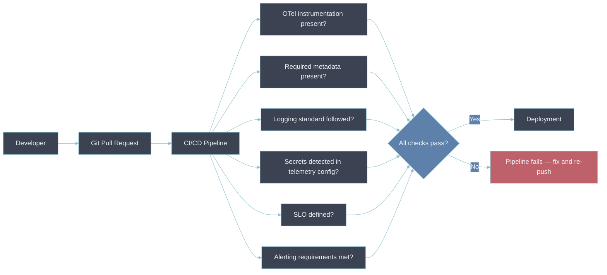
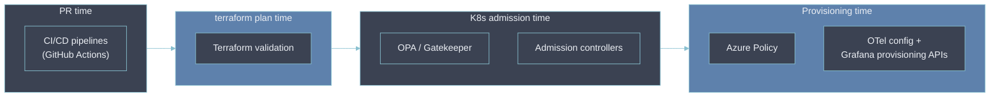
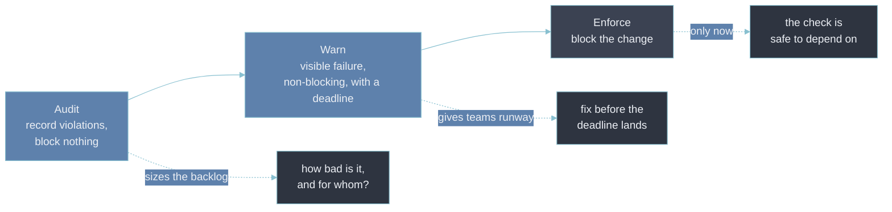

# 9 — Policy-as-Code Enforcement

- [[08-observability-as-policy|Observability as Policy]] defines what every workload must have.
- This chapter is how that requirement survives contact with a deadline — as a gate a pipeline
  enforces automatically, not a document a reviewer might skip when they're busy.

---

## From documentation to CI/CD gate

- A policy stated only in prose relies on someone remembering to check it.
- Automating it moves the check into the path every change already has to pass through:



- The rules read like the tiering table in [[08-observability-as-policy|Observability as Policy]],
  just made executable:

```text
IF environment == production
THEN service.owner MUST exist

IF service.criticality == Tier-1
THEN SLO MUST exist
AND alerting MUST exist
AND distributed tracing MUST be enabled
```

- In a real policy language — here Open Policy Agent's Rego, evaluating a service's deployment
  manifest joined with its catalog entry — the same rules are executable:

```rego
package observability.policy

# Production services must declare an owner.
deny contains msg if {
  input.manifest.labels["deployment.environment"] == "production"
  not input.manifest.annotations["service.owner"]
  msg := "production service must set the service.owner annotation"
}

# Tier-1 services must have an SLO, alerting, and tracing.
deny contains msg if {
  input.catalog.tier == 1
  some capability in {"slo", "alerting", "tracing"}
  not input.catalog.capabilities[capability] == true
  msg := sprintf("Tier-1 service is missing a required capability: %s", [capability])
}
```

- A non-empty `deny` set fails the check; the messages are what the developer sees in the pipeline
  output.
- The same rules run unchanged whether the caller is a CI job, a Kubernetes admission controller, or
  a `conftest` invocation in a pre-commit hook — which is the point of expressing the policy as data
  rather than as a script wired into one pipeline.

---

## Policy-as-code mechanisms

- **OPA / Gatekeeper** — evaluates policy at Kubernetes admission time, rejecting a manifest that
  doesn't satisfy it before it's ever scheduled.
- **Azure Policy** — the equivalent enforcement point for Azure-hosted resources outside Kubernetes.
- **Terraform validation** — catches a missing tag or telemetry config at `plan` time, before
  `apply` ever touches real infrastructure.
- **Kubernetes admission controllers** — the general mechanism Gatekeeper is one implementation of.
- **CI/CD pipelines (e.g. GitHub Actions)** — where the PR-time checks in the diagram above actually
  run.
- **OpenTelemetry configuration and Grafana provisioning APIs** — enforcing the collector- and
  dashboard-side half of the policy, not just the application code half.

- Each mechanism intercepts at a different point in a change's lifecycle — the earlier the catch,
  the cheaper the fix:



---

## Roll it out: audit, then warn, then enforce

- A gate that starts blocking on day one, against services never built to pass it, gets disabled
  within a week — a 60%-failure gate that halts every deployment is not a policy, it's an outage.
- Every check goes through the same three modes before it blocks anything:



- **Audit** runs the rule and records the pass/fail, blocking nothing. This produces the number the
  [[08-observability-as-policy|policy]] rollout needs — how many services fail, which teams own
  them, how far off they are.
- **Warn** surfaces the failure in the pipeline output or PR check, still without blocking, and
  attaches a date after which it becomes an error. Teams get real runway instead of a surprise.
- **Enforce** blocks. By the time a rule reaches this mode the backlog is near zero, so a block is
  rare and almost always a genuine regression rather than legacy debt.

- The trade-off is developer friction against operational control.
- Spending weeks in audit and warn buys the trust that a rule blocking prematurely destroys — once a
  team has force-merged past a policy check twice, they treat every future failure as noise.

---

## Every gate needs a waiver path

- A blocking check with no exemption route gets bypassed structurally: a team copies the pipeline,
  deletes the step, and now the policy doesn't apply to them and nobody can see that.
- A waiver mechanism keeps the exception visible and bounded — a `policy-waiver.yaml` in the repo,
  or an annotation, naming the rule, the reason, an approver, and an expiry:

```yaml
waivers:
  - rule: tier1-requires-tracing
    reason: "tracing SDK blocked on framework upgrade — JIRA OBS-4812"
    approved_by: platform-oncall
    expires: 2026-11-30
```

- The check reads the waiver, downgrades that one rule to warn for that one service, and re-blocks
  the moment it expires.
- Every grant and expiry is an event worth logging — see [[06-audit-logging]] — because a spike in
  waivers for the same rule means the rule, or the paved road behind it, needs work.

---

## A complement to the launch-gate, not a duplicate

- [[04-observability-driven-development|Observability-Driven Development]]'s
  [[production-readiness-review|Production Readiness Review]] is a human checklist gate, exercised
  once, at launch.
- Policy-as-code is the automated version of the same instinct, exercised on every single pull
  request rather than once before a launch — the two overlap in intent but not in mechanism.
- A mature platform runs both: the PRR for the judgment calls a human still has to make,
  policy-as-code for the mechanical checks that don't need one.

The line between them is what makes or breaks a policy-as-code effort:

- **Bad.** A rule tries to gate quality — "the SLO target must be _appropriate_," "alerts must be
  _meaningful_," "the dashboard must be _useful_."
- **Why it's bad.** None of those are machine-decidable, so the rule is implemented as a crude proxy
  (an SLO exists at all; an alert count is above zero) that is simultaneously too strict for some
  services and trivially satisfied by a useless SLO. Teams learn the check is arbitrary and
  force-merge past it, which trains them to ignore the checks that _are_ real.
- **Better.** Gate only the objective facts: an SLO object exists, `service.owner` resolves to a
  real team, tracing is enabled, no secret pattern appears in the collector config. Whether the SLO
  is the _right_ one stays a PRR conversation.

---

## Where policy-as-code still bites

- **A gate is only as good as its input data.** The tier and owner a rule checks against come from a
  service catalog or a manifest ([[signal-catalog]], [[service-catalog]]); a rule evaluating against
  a stale or empty catalog passes everything and reports green. The catalog's own freshness needs
  its own check.
- **False positives cost more than they look like they should.** A flaky rule that blocks a
  legitimate change even once a month is enough for a team to route around the whole gate. The bar
  for shipping a blocking rule is "wrong essentially never," not "usually right."
- **Policy code is code someone maintains.** Rules drift out of sync with the semantic conventions,
  break on a manifest-schema change, and accumulate special cases. An unowned policy repo rots the
  same way an unowned service does.

---

## Why this matters for an Observability Architect

- A policy that isn't enforced by tooling is enforced by whoever remembers to look — which in
  practice means inconsistently, and mostly during code review, right when reviewer attention is
  already spread thinnest.
- Moving the same rules into an admission controller or a CI/CD check doesn't change what the policy
  says.
- It changes whether "we require this" is actually true on the day a deadline makes it inconvenient.

## Metadata

| Dimension | Detail        |
| --------- | ------------- |
| Author    | Amit Singh    |
| Scope     | observability |
