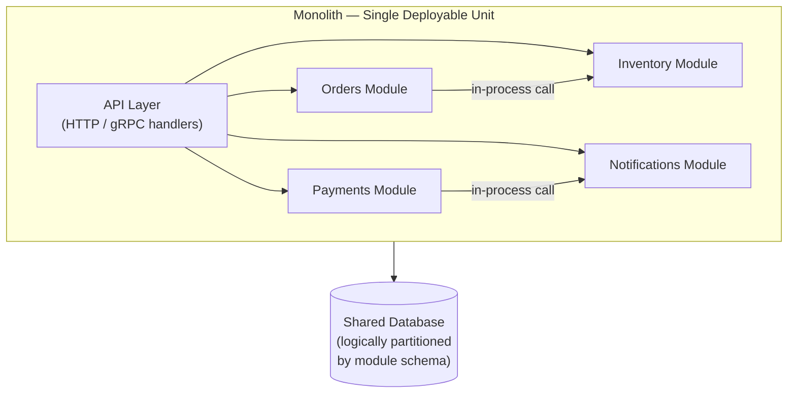
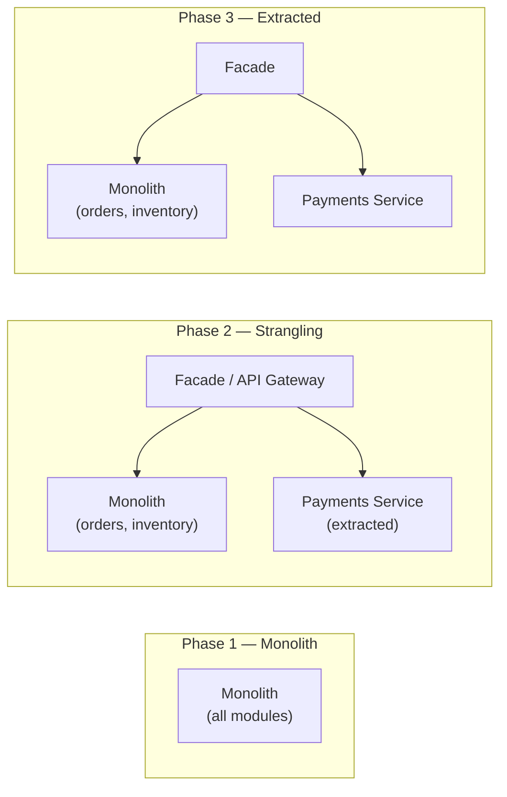

## 01 — Monolith — Modular and Majestic

> **Interview level:** Principal / Staff (L6/L7) — the signal here is knowing _when not_ to
> decompose. Candidates who default to microservices for every system fail the trade-off question.
> The mature answer: start modular-monolith, extract services only when a specific forcing function
> appears.

---

## Context

A system is being designed or evaluated for decomposition. The team is small, the domain is not
fully understood, or the operational maturity for running many independent services is not yet in
place. The alternative to microservices is not a "big ball of mud" — it is a **modular monolith**
with clean internal boundaries.

---

## Problem

| Force                   | Description                                                                                   |
| ----------------------- | --------------------------------------------------------------------------------------------- |
| Premature decomposition | Distributed systems add latency, partial failure, and network cost to every inter-module call |
| Domain uncertainty      | Splitting before the domain is understood locks in wrong service boundaries                   |
| Operational overhead    | Each service needs its own CI/CD, alerting, on-call rotation, and SLO                         |
| Team size               | A 3-person team operating 15 microservices spends more time on infra than product             |

---

## Solution



The critical discipline: **treat module boundaries as if they were service boundaries** even though
the calls are in-process.

### What "modular" means in practice

```
src/
  orders/
    api.go          ← HTTP handlers only
    service.go      ← business logic
    repository.go   ← data access
    types.go        ← domain types; exported only what other modules need
  inventory/
    ...
  payments/
    ...
```

- **No cross-module direct struct access** — modules communicate through defined interfaces
- **No cross-module database queries** — each module owns its schema tables; `orders` module never
  SELECTs from `inventory` tables
- **Dependency direction is one-way** — define a directed acyclic graph of module dependencies;
  enforce with a linter (ArchUnit in Java, `depcheck` rules in Go/TS)

### The "Majestic Monolith" variant

Coined by DHH. A single deployable unit that is the _right_ architecture for the problem: simple
ops, fast in-process calls, easy transactions, trivial consistency. Not a stepping stone — a
destination. Basecamp, GitHub (for years), Shopify (the core) all ran on well-structured monoliths
at significant scale.

### Database partitioning inside a monolith

Even in a shared database, enforce logical partitions:

```sql
-- Orders module schema
CREATE SCHEMA orders;
CREATE TABLE orders.orders (...);

-- Inventory module schema
CREATE SCHEMA inventory;
CREATE TABLE inventory.products (...);

-- Cross-module joins are via views or application-layer, not ad-hoc
```

This makes the future extraction of a module into a service a schema migration, not a data
archaeology expedition.

---

## When to Extract a Module into a Service

The forcing functions that justify decomposition:

| Signal                          | Why it justifies extraction                                                            |
| ------------------------------- | -------------------------------------------------------------------------------------- |
| Independent scaling requirement | One module is the bottleneck; rest of monolith is fine                                 |
| Independent deployment cadence  | One module needs 10× daily deploys; the rest deploy weekly                             |
| Technology mismatch             | One module genuinely needs a different language/runtime (ML inference in Python)       |
| Team autonomy at scale          | > 8–10 engineers working on the same codebase creates coordination overhead            |
| Compliance isolation            | One module must be in a separate security/audit boundary (PCI DSS, HIPAA)              |
| Failure isolation               | One module's failures cascade to take down the entire monolith (CPU/memory exhaustion) |

**Not valid forcing functions:**

- "Microservices are modern" — this is fashion, not engineering
- "We'll scale better" without a measured bottleneck
- "Each team should own their service" when the team is 2 people

---

## The Extraction Path — Strangler Fig

When a forcing function appears, extract one module at a time using the
[[02-strangler-fig|Strangler Fig]] pattern:



See [[02-strangler-fig|Strangler Fig pattern]] for the full extraction playbook.

---

## Consequences

### Gains

- **Operational simplicity**: one deployment, one build, one log stream, one alert, one SLO
- **Transaction consistency**: ACID transactions across modules — no distributed transaction
  complexity
- **Refactoring agility**: rename, move, merge modules without changing an API contract or a network
  boundary
- **Latency**: in-process calls are nanoseconds vs. microseconds for localhost and milliseconds for
  network

### Trade-offs

- **All-or-nothing deploy**: a bug in one module requires redeploying the entire binary (mitigated
  with feature flags, but the blast radius is wider)
- **Shared failure domain**: a memory leak or CPU spike in one module degrades the entire process
- **Technology lock-in**: all modules must use the same language, runtime, and major dependency
  versions
- **Scaling granularity**: you can only scale the entire monolith, not individual hot paths
  (mitigated by read replicas and caching for most workloads)

---

## Observability

A monolith is not invisible — instrument it with the same rigour as microservices:

```
# Per-module metrics (via labels, not separate services)
http_request_duration_seconds{module, handler, status_code}
db_query_duration_seconds{module, query_type}
module_errors_total{module, error_type}

# Process-level
process_resident_memory_bytes     # detect memory leaks per module via heap profiling
process_cpu_seconds_total         # CPU saturation
go_goroutines (or JVM thread count)
```

**The advantage**: distributed tracing is free. A request that crosses Orders → Payments →
Notifications is a single in-process call stack — a profiler or APM agent captures the full call
tree without injecting trace context across network hops.

---

## MAANG Interview Anchors

- "My default starting point for a new system is a modular monolith, not microservices. The forcing
  functions for extraction are specific and measurable: independent scaling bottleneck, independent
  deployment cadence, team size exceeding 8–10 on the same codebase. I can name them. If none of
  those are true, I'm adding distributed-systems tax without a return."

- "The failure mode of premature decomposition is not obvious. You split into 15 services, now every
  feature requires coordinating 3 teams, 3 deploys, and 3 schema migrations. The velocity loss is
  invisible in a postmortem — there's no incident for 'we moved too slowly.' I've seen it kill
  product velocity at 18 months."

- "A modular monolith with schema-partitioned modules is 80% of the extraction work. When a forcing
  function appears, I can extract one module in a sprint because the boundaries already exist in
  code. If I'd built a ball-of-mud monolith, extraction is a multi-quarter archaeology project."

- "Observability of a modular monolith is actually _easier_ than microservices. One log stream, one
  trace per request (no distributed trace stitching), one profiler. The complexity cost of
  distributed tracing across 15 services is non-trivial — I've instrumented both, and the monolith
  wins on time-to-insight."

---

## Known Uses

| System         | Monolith rationale                                                                    |
| -------------- | ------------------------------------------------------------------------------------- |
| Basecamp / HEY | Deliberately runs on a Rails monolith at millions of users; DHH's "Majestic Monolith" |
| Shopify (core) | Monolith with module boundaries; selective extraction of high-scale paths             |
| GitHub (early) | Rails monolith until specific scaling bottlenecks justified extraction                |
| Stack Overflow | Monolith serving billions of requests; Dapper SQL approach                            |
| Notion         | Monolithic Node.js backend; scalable via replicas, not service decomposition          |
