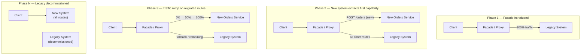
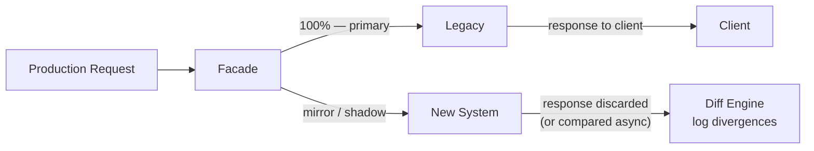

## 02 — Strangler Fig

> **Interview level:** Principal / Staff (L6/L7) — the canonical answer to "how do you migrate off a
> legacy system without a big-bang rewrite?" Appears in platform migration, monolith decomposition,
> and API versioning questions. The L6/L7 answer covers the proxy/facade mechanics, dark launch,
> traffic percentage ramp, rollback strategy, and data migration sequencing.

---

## Context

A legacy system ([[01-monolithic|monolith]], old microservice, SOAP API, on-prem database) needs to
be replaced. A big-bang rewrite (build the new system in parallel, cut over all at once) is
high-risk: the new system is unproven at production scale; the cutover is irreversible; bugs
discovered post-cutover require rollback of the entire system. Most big-bang rewrites fail or take
2–5× their estimated time.

---

## Problem

| Force          | Description                                                                            |
| -------------- | -------------------------------------------------------------------------------------- |
| Risk           | Big-bang cutover has a single failure mode that affects 100% of traffic simultaneously |
| Scope creep    | Full rewrites accumulate new requirements mid-build, pushing completion further        |
| Continuity     | The legacy system must continue serving production traffic during the migration        |
| Data migration | The legacy data store may contain years of data that must move or be dual-written      |
| Rollback       | If the new system fails post-cutover, reverting a big-bang is often impossible         |

---

## Solution



### The three phases

**Phase 1 — Introduce the facade.** All traffic continues to go to the legacy system, but now via a
proxy layer
([[patterns/07-api-patterns/03-api-gateway-patterns/03-api-gateway-patterns|API Gateway]], Nginx,
[[envoy|Envoy]], or application-level router). The facade is transparent at this point. The value:
you can now route individual paths without touching clients.

**Phase 2 — Extract by capability, not by layer.** Identify one bounded capability (e.g.,
`POST /orders`) that can be moved independently. Build the new service, run it in production behind
the facade but with 0% traffic (dark launch — see below). Validate.

**Phase 3 — Ramp traffic.** Move the new route from 0% to 1% → 5% → 25% → 50% → 100% over days or
weeks. At each step, compare error rates, latency, and output correctness between legacy and new.
Roll back (route back to legacy) if metrics regress. When 100% is stable for a defined period,
decommission the legacy path for that capability.

Repeat Phase 2 + 3 for each capability until the legacy system has no remaining routes.

---

## Dark Launch

Before any production traffic hits the new system, validate it against real production inputs
without real production consequences:



The new system receives a copy of every production request but its response is thrown away (or
silently compared to the legacy response). This is the safest validation mechanism: real traffic
load, real input distribution, zero user impact from new-system bugs.

Use dark launch for at minimum 1 week before any real traffic ramp. Alert on: response divergence
rate, new-system error rate, new-system latency vs. legacy.

---

## Data Migration Sequencing

Data migration is where Strangler Fig migrations most commonly stall. Two patterns:

**Dual-write (preferred for active data):**

```
Phase A: Legacy writes to legacy DB + replicates to new DB (dual-write in legacy code)
Phase B: New service reads from new DB; writes go to both (via legacy or via dual-write in new)
Phase C: New service reads and writes to new DB only; legacy DB stops receiving writes
Phase D: Legacy DB decommissioned after validation period
```

**Backfill + cutover (for archival data):**

1. Backfill historical data from legacy to new DB (offline job)
2. Capture all writes since backfill start in a change log
3. Replay the change log to close the gap
4. Cut reads over to new DB; verify; decommission

**Anti-corruption layer:** if the legacy data model is incompatible with the new service's model,
introduce a translation layer at the migration boundary. The new service uses its own domain model;
the ACL translates to/from the legacy schema. Remove the ACL when the legacy DB is gone.

---

## Rollback Strategy

Define rollback criteria before starting any traffic ramp:

```yaml
rollback_triggers:
  - error_rate_new_system > error_rate_legacy * 1.5   # 50% worse error rate
  - p99_latency_new_system > p99_latency_legacy * 1.2 # 20% worse tail latency
  - divergence_rate > 0.1%                            # responses disagree > 0.1%

rollback_action:
  - set facade weight: new_system=0%, legacy=100%
  - duration: instant (traffic weight change at proxy)
  - post-rollback: preserve new system state for debugging
```

The rollback action at the facade is instant — a single config change routes all traffic back to
legacy with no deployment required. This is the reason the facade is introduced first: rollback is
always available regardless of what state the new system is in.

---

## Consequences

### Gains

- Zero-downtime migration: legacy continues serving 100% of traffic until the new system is proven
- Incremental validation: each capability is proven independently at production scale before the
  next is migrated
- Instant rollback: traffic weight at the facade is the rollback mechanism; no re-deploy required
- Scope control: migrating one capability at a time prevents scope creep; the team delivers working
  increments

### Trade-offs

- **Facade is a new component** to build, operate, and keep reliable; it becomes a critical path
  dependency
- **Dual-write complexity**: running two data stores simultaneously multiplies write paths and
  consistency risks
- **Migration takes longer** than a big-bang (by design) — months to years for large systems;
  requires organisational patience
- **Feature freeze on the legacy path**: new features built in the legacy system during migration
  must also be built in the new system, or migrated later

---

## Observability

```
# Traffic split
facade_requests_total{backend}            # requests routed to legacy vs new per path
facade_route_weight{path, backend}        # current traffic weight (0–100%)

# Comparison / dark launch
shadow_divergence_total{path}             # response mismatches between legacy and new
shadow_new_error_rate{path}              # error rate of new system under shadow load
shadow_latency_delta_seconds{path}       # latency difference (new minus legacy)

# Migration progress
migrated_routes_total                    # how many routes have hit 100% new
legacy_routes_remaining                  # routes still partially or fully on legacy
```

Dashboard: traffic weight per route over time — the visual of old routes going from 100% → 0% legacy
is the migration progress chart. The facade is the single source of truth for migration state.

---

## MAANG Interview Anchors

- "The Strangler Fig is the answer to 'how do you avoid a big-bang rewrite?' The key insight is that
  you introduce a facade first — before any new system exists — so that routing control is yours
  from day one. The legacy system doesn't know it's being strangled."

- "Dark launch is the mandatory first step before any real traffic ramp. You need to know the new
  system's error rate and latency under real production input distribution before any user is
  affected. A week of dark launch data is worth more than a month of unit tests."

- "The hardest part is data migration, not service migration. Dual-write with a validation period is
  the safe path: write to both, read from legacy, compare reads from both, then switch reads. Never
  cut the write side over before reads have been validated at production volume."

- "I'd define rollback criteria before starting the ramp — not during it. 'We'll roll back if things
  look bad' is not a plan; 'we'll roll back if p99 exceeds 120% of legacy' is a plan. The rollback
  mechanism at the facade is instant; the hard part is having the discipline to use it."

---

## Known Uses

| System                   | Strangler Fig application                                                       |
| ------------------------ | ------------------------------------------------------------------------------- |
| Netflix                  | Gradual migration of monolithic DVD-rental system to microservices (2008–2016)  |
| Shopify                  | Core monolith extraction — individual capabilities moved to services over years |
| Amazon                   | Service extraction from early monolith; facade pattern via API Gateway          |
| Martin Fowler            | Original pattern description (2004); named after the Queensland strangler fig   |
| IBM mainframe migrations | Facade layer over COBOL systems; new services consume via API                   |
