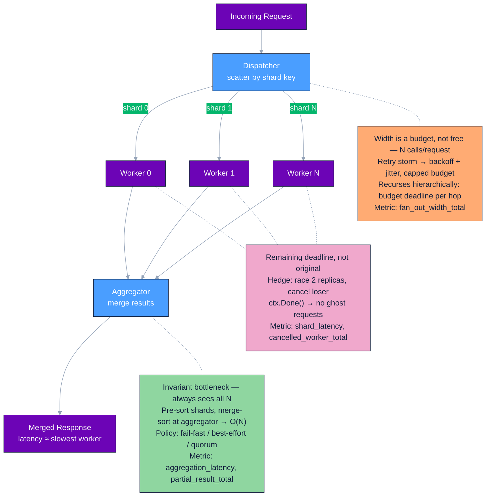
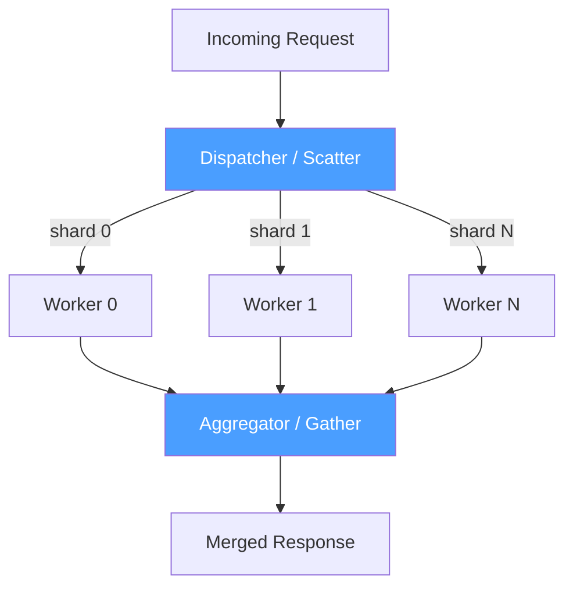

## 04 — Fan-Out / Fan-In

> **Interview level:** Principal / Staff (L6/L7) — appears in search, aggregation, distributed
> query, and scatter-gather problems. Your angle: you've seen this in Mimir's Querier (fan-out to
> store-gateways) and Loki's query-frontend (fan-out to ingesters). Use concrete numbers.

---

## Concept Map



---

## Context

A single client request requires data or computation from N independent sources. Fetching them
serially introduces additive latency. The system must complete the aggregate response within a tight
SLO (e.g., P99 < 200ms for a search API).

---

## Problem

> What are the challenges faced in fan out, fan in pattern?

| Force                  | Description                                                  |
| ---------------------- | ------------------------------------------------------------ |
| Latency                | Serial N calls = sum of all latencies; unacceptable at scale |
| Partial failure        | One slow/failed backend should not block the entire response |
| Result aggregation     | Independent results must be merged into a coherent response  |
| Resource amplification | Fan-out multiplies load on downstream systems                |

---

## Solution



**Dispatcher** splits the request: by shard key (consistent hash), by time range
([[08-query-sharding|query sharding]]), or by data partition. **Workers** execute concurrently —
each owns a bounded chunk. **Aggregator** collects results via channels or a barrier, merges, and
returns.

### Implementation skeleton (Go)

```go
func fanOut(ctx context.Context, shards []Shard, query Query) ([]Result, error) {
    ctx, cancel := context.WithTimeout(ctx, 200*time.Millisecond)
    defer cancel()

    results := make(chan Result, len(shards))
    errs    := make(chan error, len(shards))

    for _, s := range shards {
        go func(shard Shard) {
            r, err := shard.Query(ctx, query)
            if err != nil { errs <- err; return }
            results <- r
        }(s)
    }

    var merged []Result
    for i := 0; i < len(shards); i++ {
        select {
        case r := <-results:
            merged = append(merged, r)
        case err := <-errs:
            // decide: fail-fast or partial result
            return nil, err
        case <-ctx.Done():
            return nil, ctx.Err()
        }
    }
    return merge(merged), nil
}
```

### Implementation skeleton (Python)

```python
import asyncio
from typing import Any

async def fan_out(shards: list, query: Any, timeout: float = 0.2) -> list:
    # Closure captures `query` so each coroutine is a clean unit of work
    async def _query(shard):
        return await shard.query(query)

    try:
        # Deadline shared across ALL shards — cancels the entire gather if exceeded
        async with asyncio.timeout(timeout):
            results = await asyncio.gather(
                *[_query(s) for s in shards],   # fan-out: one coroutine per shard
                return_exceptions=False,          # fail-fast: first error aborts all
            )
    except TimeoutError:
        # Re-raise with context so callers know which deadline was breached
        raise TimeoutError(f"fan-out exceeded {timeout}s deadline")

    # Fan-in: reduce N shard results into a single merged response
    return merge(results)
```

---

## Failure Handling — The Hard Part

This is what separates L5 from L6/L7 answers.

### Deadline propagation

The parent context deadline **must** be inherited by every worker goroutine/thread. A worker that
ignores the deadline will hold resources long after the client has given up.

[[08-deadline-propagation|More Reading...]]

### Partial results vs fail-fast

| Policy                              | When to use                                          | Consequence                                    |
| ----------------------------------- | ---------------------------------------------------- | ---------------------------------------------- |
| Fail-fast (any error = abort)       | Correctness required; missing a shard = wrong answer | Higher error rate visible to client            |
| Best-effort (return what succeeded) | Read-heavy search, recommendations, dashboards       | Risk of silently incomplete results            |
| Minimum quorum (K of N required)    | Replication reads, voting systems                    | Must define K explicitly and surface shard gap |

**Default to fail-fast and make it explicit** — "I'd fail-fast unless the product spec says partial
results are acceptable, because silently incomplete results are harder to debug than explicit
errors."

[[05-partial-results-vs-fail-fast|More Reading...]]

### Hedged requests

For latency-critical paths (P99 SLO < 100ms): send the same request to 2 replicas simultaneously,
use the first response, cancel the other. Adds ~2× load but eliminates
[[02-tail-latency|tail latency]] from slow replicas.

```
t=0ms    Send to replica A and replica B
t=45ms   Replica B responds → use result, cancel A's request
t=120ms  Replica A would have responded (tail latency, avoided)
```

Netflix uses hedged requests extensively in their fan-out to microservices. The cost is ~2× upstream
load on average, but the P99 latency improvement is often 3–5×.

[[10-hedged-requests|More Reading...]]

---

## Consequences

### Gains

- Request latency ≈ slowest worker, not sum of all workers
- Independent shards fail independently; failure blast radius bounded per shard
- Throughput scales horizontally by adding [[02-shards-workers|shards/workers]]

### Trade-offs

- **Load amplification**: 1 request → N backend calls. At 10K RPS fan-out-to-100-shards = 1M backend
  calls/sec. Size backends accordingly.
- **Context cancellation overhead**: Go runtime and JVM both have cost per goroutine/thread. At
  fan-out of 10K, goroutine-per-shard is fine; beyond that, use worker pools.
- **Aggregator becomes a bottleneck**: if merge is O(N log N) (e.g., sorted merge of N result sets),
  aggregator CPU grows with fan-out width. Pre-sort within each shard; merge-sort at aggregator.
- **Deadline amplification**: parent has 200ms; worker has 200ms minus already-elapsed time. If the
  dispatcher itself takes 10ms to shard, workers effectively have 190ms. Propagate the _remaining_
  deadline, not the original.

---

## Observability

```
fan_out_width_total{service, operation}          # how many sub-requests per request
fan_out_shard_latency_seconds{shard_id}          # per-shard latency histogram
fan_out_aggregation_latency_seconds              # time in the aggregator
fan_out_partial_result_total{reason}             # partial failures
fan_out_cancelled_worker_total                   # workers cancelled by parent deadline
fan_out_hedged_requests_used_total               # how often hedging kicked in
```

Alert: `fan_out_cancelled_worker_total` rising → parent deadline too tight or a shard is slow.
Correlate with `fan_out_shard_latency_seconds{shard_id=X}` P99 to identify the culprit shard.

**Trace shape to describe in interviews:** parent span covers the whole fan-out; each worker creates
a child span with the shard ID as an attribute. The aggregation step is a sibling span of the last
worker to complete. This makes waterfall charts instantly reveal which shard is the tail.

[[09-trace-shape|More Reading...]]

[[04-2-fan-out-olly-kpis|Observability KPIs for the Fan-out / Fan-in Pattern]]

---

## MAANG Interview Anchors

- "Fan-out width is a budget, not a free variable. At 10K shards and 5K RPS you're generating 50M
  backend calls per second. I'd cap the fan-out width with a shard count limit and route overflow to
  a secondary tier."

- "The aggregator is the invariant bottleneck — it always sees all N results regardless of fan-out
  width. I'd make merge stateless and O(N) or O(N log N) at worst, and measure aggregation latency
  separately from per-shard latency so the two don't contaminate each other in dashboards."

  - **Why it's invariant:** fan-out parallelizes the _gather_ side — latency there is bounded by the
    slowest worker (see Gains, above). But there is exactly one merge step, and it's inherently
    serial: it can't return until it has all N (or K, under partial-results/quorum) results. Adding
    workers or shards never changes this — the aggregator's input size scales 1:1 with fan-out width
    no matter how wide you go.
  - **Stateless:** no shared mutable state across merge calls, so a late-arriving shard result after
    a timeout can't corrupt partial state, and the merge stays safe to retry.
  - **O(N) or O(N log N) at worst:** this is the payoff of "pre-sort within each shard; merge-sort
    at aggregator" from the Trade-offs section above. If each shard returns pre-sorted results
    (sorting parallelized across worker CPU you already have), the aggregator only needs an N-way
    merge — O(N) with a heap, not a full O(N log N) sort of concatenated unsorted results. The naive
    mistake is concatenate-then-sort at the aggregator, which turns the invariant bottleneck into a
    growing one as fan-out width increases.
  - **Why separate the metrics:** with only one end-to-end latency number, a P99 regression is
    ambiguous — a slow shard and a merge algorithm whose cost grows with N look identical. Splitting
    `fan_out_shard_latency_seconds{shard_id}` from `fan_out_aggregation_latency_seconds` (see
    Observability, below) stops you from reaching for the wrong fix, e.g. adding hedged requests for
    a regression that's actually an O(N²) dedup loop in the merge.

- "Hedged requests solve P99 latency at the cost of P50 load. I'd only enable hedging after I've
  instrumented per-shard [[02-tail-latency|tail latency]] — otherwise I'm paying the load tax
  without knowing if I have a tail latency problem at all."

  - **Why the cost lands on P50, not P99:** hedging fires the duplicate request for _every_ call (or
    every call past a hedge delay), not just the slow ones — you can't know in advance which request
    will be the 1% straggler. So the ~2× load tax (per the Hedged requests section above) is paid on
    the common case to protect against the rare case. That's the trade being named: median load goes
    up permanently so p99 comes down.
  - **Why instrument before enabling:** hedging only pays off if the per-shard/replica latency
    distribution actually has a heavy tail with independent, uncorrelated causes (e.g. GC pause on
    one replica, not a shared bottleneck). If shard latency is tight, or if both replicas share the
    same underlying cause of slowness (same storage layer, same network segment, same noisy
    neighbor), the hedge loses in lockstep with the original and buys nothing for the 2× spend. You
    need `fan_out_shard_latency_seconds{shard_id}` p99/p999 evidence of real, uncorrelated tail
    behavior before committing the budget — see [[02-tail-latency]] for why fan-out width compounds
    the odds of hitting someone's tail in the first place.
  - **What to keep watching after enabling:** `fan_out_hedged_requests_used_total` (from
    Observability, below) as a hedge win-rate, not just an on/off flag — if hedged responses rarely
    win, you're carrying the load cost without the latency payoff, and that's a signal to revisit
    root cause (e.g. the aggregator bottleneck above) rather than tune the hedge delay further.

- "Context cancellation is the contract that makes fan-out safe at scale. If workers don't propagate
  context cancellation to their own downstream calls, you get ghost requests: the client got an
  error 200ms ago and N×M downstream calls are still running."

---

## Known Uses

| System                | Fan-out pattern                                                     |
| --------------------- | ------------------------------------------------------------------- |
| Grafana Mimir Querier | Fan-out to store-gateways per block shard; merge sorted time series |
| Elasticsearch         | Scatter search request to all shards; fan-in sorted top-K hits      |
| Google Bigtable       | Fan-out read to tablet servers; merge at client                     |
| Kafka Consumer Group  | Fan-out partition assignment; each consumer is a fan-out worker     |
| MapReduce Map phase   | Classic scatter to N mappers; reduce phase is the fan-in            |

---

## Practice Questions

**Q1 — Design the fan-out layer for a distributed search API** Your search service must query 200
shards in under 150ms P99. Walk through: how you partition the fan-out, deadline propagation
strategy, partial-result policy, and what you'd instrument first when P99 degrades in production.

<details>
<summary>Hint</summary>

Key points: propagate _remaining_ deadline (not original) to each worker; decide fail-fast vs.
quorum (correctness requirement determines this, not latency); `fan_out_cancelled_worker_total` is
your first alert — rising means either a deadline is too tight or a shard is slow; per-shard P99
histogram narrows the culprit.

[[04-3-q1-answer-search-fan-out-design|Full Answer...]]

</details>

---

**Q2 — Hedging trade-off** A recommendation service has a P99 of 280ms but a P50 of 30ms, with a
200ms SLO. An engineer proposes enabling hedged requests to all 50 shards. What is the load impact,
when would you enable hedging, and what would you instrument first to justify the decision?

<details>
<summary>Hint</summary>

Load impact: up to 2× at P50 (when both replicas respond before cancel lands). Hedging only makes
sense when you have measured per-shard tail latency and identified a slow-replica problem — not as a
first resort. Instrument `fan_out_shard_latency_seconds` P99 by shard_id before enabling hedging;
otherwise you're paying the load tax blindly. Consider hedging only the tail percentile shards
(e.g., the slowest 5%) rather than all 50.

[[04-4-q2-answer-hedging-trade-off|Full Answer...]]

</details>

---

**Q3 — Context cancellation leak** A fan-out to 30 downstream services looks healthy in the client
dashboard (errors < 0.1%), but infra cost is 3× higher than expected and downstream CPU is elevated.
What is the most likely root cause and how do you confirm it?

<details>
<summary>Hint</summary>

Classic ghost-request symptom: the parent context is cancelled (client got a timeout error) but
workers didn't propagate cancellation to their own downstream calls. Confirm with
`fan_out_cancelled_worker_total` vs. downstream request rate — if the latter doesn't drop when the
former rises, workers are ignoring `ctx.Done()`. Fix: ensure every `shard.Query(ctx, ...)` call
passes the derived context, not a fresh background context.

[[04-5-q3-answer-context-cancellation-leak|Full Answer...]]

</details>

---

**Q4 — Aggregator bottleneck** A fan-out of 500 shards each returns a sorted list of 1,000
time-series data points. The aggregator merges them into a global top-1,000. Describe the merge
strategy, its time complexity, and how you'd separate aggregator latency from per-shard latency in
your dashboards.

<details>
<summary>Hint</summary>

Merge strategy: min-heap (priority queue) across 500 sorted lists — O(K log N) where K=1000 (output
size) and N=500 (shards). Pre-sorting within shards is free since shards already return sorted
results; the aggregator only needs to merge, not sort from scratch. In dashboards, emit
`fan_out_aggregation_latency_seconds` as a separate histogram from `fan_out_shard_latency_seconds`
so that a slow aggregator doesn't look like a slow shard and vice versa. Alert when aggregator P99 >
20% of total request latency.

[[04-6-q4-answer-aggregator-bottleneck|Full Answer...]]

</details>

---

**Q5 — Sizing the fan-out width** A new feature requires fanning out a user request to all active
tenant shards. In dev there are 10 shards; in prod there will be 8,000. The service receives 2,000
RPS. What questions do you ask before accepting this design, and what safeguards would you add?

<details>
<summary>Hint</summary>

Immediate red flags: 2,000 RPS × 8,000 shards = 16M backend calls/sec — likely unsustainable.
Questions: is fan-out to _all_ shards necessary or can a routing key reduce it? What is the
downstream QPS limit per shard? The aggregator sees all 8,000 results per request — what is the
merge cost? Safeguards: cap fan-out width with a hard limit and route overflow to a secondary tier;
use a worker pool instead of goroutine-per-shard at this scale; add `fan_out_width_total` histogram
so you know when prod drift occurs; load test at 10× target fan-out before launch.

[[04-7-q5-answer-sizing-the-fan-out-width|Full Answer...]]

</details>

---

**Q6 — Retry storm** A fan-out to 100 shards retries each failed call up to 3 times with no backoff.
During a transient regional network blip, 15 shards start timing out. Traffic to those 15 shards
triples within seconds and the blip turns into a full outage. What went wrong, and how do you fix
the retry policy?

<details>
<summary>Hint</summary>

This is retry amplification on top of fan-out amplification: 100 shards × 3 retries = up to 300
calls per client request once things start failing, concentrated on the shards already struggling —
a self-inflicted thundering herd that turns a transient blip into an outage. Fix:
[[08-retry-with-jitter|exponential backoff with jitter]] (never fixed-interval retries in a
fan-out), a retry budget capped as a percentage of total request volume (e.g., 10%) rather than
per-call retries, and a [[07-circuit-breaker|circuit breaker]] per shard that stops sending new
attempts after N consecutive failures instead of retrying indefinitely. Instrument
`fan_out_retry_total{shard_id}` as its own series, separate from `fan_out_shard_latency_seconds` —
retries are often invisible in latency dashboards until they've already caused cascading failure.

[[04-8-q6-answer-retry-storm|Full Answer...]]

</details>

---

**Q7 — [[05-backpressure|Backpressure]] and load shedding** During a traffic spike, a fan-out target
shard's CPU hits 95% and it starts rejecting connections. The dispatcher keeps fanning out to it at
full rate because average latency across all 500 shards still looks healthy. What is the fix, and
where does it live — dispatcher, worker, or shard?

<details>
<summary>Hint</summary>

Averages hide localized overload — one shard at 95% CPU doesn't move a 500-shard aggregate latency
number. Fix lives primarily at the dispatcher: track per-shard health (rolling error rate or
latency, not global average) and shed or reroute load to that shard before it collapses — analogous
to AIMD-style adaptive concurrency limits. Pair with a [[09-bulkhead]] per shard-pool so one
overloaded shard's slow calls don't exhaust the worker pool / thread pool that healthy shards depend
on. Instrument `fan_out_shard_reject_total{shard_id}` and a per-shard concurrency-limit gauge; alert
when a shard's rejection rate rises even if aggregate P99 looks fine — the aggregate is the wrong
signal for this failure mode.

[[04-9-q7-answer-backpressure-and-load-shedding|Full Answer...]]

</details>

---

**Q8 — Hierarchical (multi-level) fan-out** A Loki-style system fans out a query from the
query-frontend to N queriers, and each querier fans out again to M ingesters. The end-to-end SLO is
5s. How do you propagate the deadline across both levels, and how do partial failures compose across
levels without silently degrading correctness?

<details>
<summary>Hint</summary>

Deadline must be budgeted per hop, not copied unchanged: the frontend allocates 5s minus its own
dispatch/aggregation overhead to the querier level, and each querier further subtracts its own
overhead before propagating the _remaining_ deadline to its ingesters — the same "remaining, not
original" rule as single-level fan-out, applied recursively. Partial failure composes
multiplicatively if left implicit: if each level independently tolerates 1% shard loss, two
independent levels can silently compound into a higher effective loss rate at the top. Make the
contract explicit — a querier should report "N of M ingesters answered" up to the frontend rather
than silently returning a partial merge, so the top level's fail-fast/best-effort policy is applied
to real completeness, not assumed completeness. Instrument with a `level` label —
`fan_out_shard_latency_seconds{level="querier"}` vs. `{level="ingester"}` — so a slow layer isn't
misattributed to the wrong hop in trace waterfalls.

[[04-10-q8-answer-hierarchical-fan-out|Full Answer...]]

</details>

---

**Q9 — Validating deadline propagation and hedging before rollout** A team is about to ship hedged
requests and a deadline-propagation rewrite to a fan-out layer serving 50K RPS. A bug here causes
silent resource leaks (ghost requests) or subtly wrong partial results rather than a loud crash. How
do you validate correctness before this reaches production?

<details>
<summary>Hint</summary>

This is a fault-injection problem, not a unit-test problem: inject artificial per-shard latency and
forced cancellations in a staging fan-out and confirm goroutine/thread counts don't grow unbounded
after the parent context is cancelled (proves `ctx.Done()` is actually respected downstream, not
just accepted). For hedging, confirm the losing replica's request is actually cancelled, not merely
ignored — check downstream connection/CPU metrics on the "losing" replica during a hedge, not just
the winning path. Load test at the real 50K RPS with induced shard slowness to confirm the claimed
P99 improvement actually materializes under contention, not just in isolation. Roll out as a canary
and diff `fan_out_cancelled_worker_total` and `fan_out_hedged_requests_used_total` pre/post — a
discrepancy here (e.g., cancelled-worker count not dropping when it should) is the leading indicator
of a leak, and it's cheap to catch in canary but expensive to catch after wide rollout.

[[04-11-q9-answer-validating-hedging-and-deadline-propagation|Full Answer...]]

</details>
