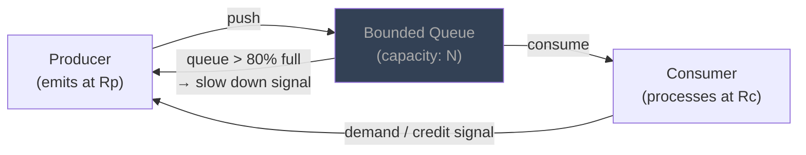
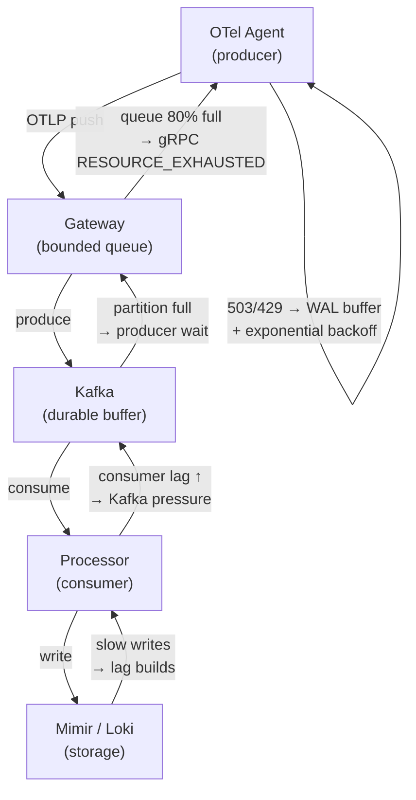

## 05 — Backpressure

> **Interview level:** Principal / Staff (L6/L7) — critical in streaming, telemetry pipeline, and
> queue design questions. Your angle: you've designed Alloy → Kafka → Mimir pipelines where
> backpressure is the mechanism that prevents data loss during storage outages.

---

## Context

In any producer-consumer system, the producer can generate data faster than the consumer can process
it. Without a feedback mechanism, the gap is absorbed by an unbounded queue that grows until memory
is exhausted, or by silently dropping data. Neither is acceptable at MAANG scale.

---

## Problem

| Force              | Description                                                                     |
| ------------------ | ------------------------------------------------------------------------------- |
| Rate mismatch      | Producer bursts faster than consumer's sustained throughput                     |
| Unbounded queues   | Without limits, queues grow until the process OOMs                              |
| Silent data loss   | Dropping without signalling hides the overload from operators                   |
| Cascading overload | A slow consumer causes its upstream to back up, which backs up further upstream |

---

## Solution

The consumer signals its capacity to the producer, which adjusts its emission rate accordingly.



When the queue depth exceeds a high-water mark, the producer receives a signal to slow down or
pause. When the queue drains to a low-water mark, production resumes.

### Backpressure strategies

| Strategy          | Mechanism                                   | Data loss       | Latency impact         | When to use                                   |
| ----------------- | ------------------------------------------- | --------------- | ---------------------- | --------------------------------------------- |
| **Blocking**      | Producer blocks until consumer has capacity | None            | High — producer stalls | Batch jobs; internal in-process pipelines     |
| **Buffering**     | Queue absorbs burst up to bounded size      | None until full | Low (absorbs spike)    | Message queues (Kafka); async pipelines       |
| **Dropping**      | Newest or oldest items dropped when full    | Yes — explicit  | Low                    | Metrics (samples are aggregatable); UI events |
| **Load shedding** | Reject requests at ingestion boundary       | Yes — with 429  | Low (reject fast)      | HTTP APIs; telemetry gateways                 |
| **Rate limiting** | Cap producer emission rate at source        | None (delays)   | Medium                 | API clients; scheduled jobs                   |

### In a telemetry pipeline



The backpressure signal flows upstream: storage slowness → processor lag →
[[system-design/08-observability/05-telemetry-ingestion-pipeline/05-05-layer-2-durable-buffer-kafka|Kafka]]
depth → gateway queue → agent. Each layer has a bounded buffer; the agent's Write-Ahead Log is the
last-resort absorber. Data loss occurs only if the WAL fills up — which gives minutes of warning
time.

---

## Reactive Streams — Formal Backpressure Model

The Reactive Streams specification (Java 9+, RxJava, Project Reactor, Akka Streams) formalises
backpressure as a **demand protocol**:

```
Subscriber → Publisher: request(N)   "I can consume N more items"
Publisher  → Subscriber: onNext(x)   "here is item x" (only if demand > 0)
```

The publisher never emits without explicit demand from the subscriber. This eliminates the "push too
fast" problem at the protocol level.

```java
// Reactor (Project Reactor) — backpressure via request(n)
Flux.range(1, 1_000_000)
    .onBackpressureBuffer(1000)     // buffer up to 1000 items
    .publishOn(Schedulers.boundedElastic())
    .subscribe(new BaseSubscriber<Integer>() {
        @Override
        protected void hookOnSubscribe(Subscription subscription) {
            request(10);  // pull 10 at a time
        }
        @Override
        protected void hookOnNext(Integer value) {
            process(value);
            request(10);  // pull 10 more after processing
        }
    });
```

---

## gRPC Flow Control

[[networks/05-http-ecosystem/05-grpc/05-grpc|gRPC]] implements backpressure at the HTTP/2 layer via
**flow-control windows**:

```
Connection-level window: 65KB default (how much data can be in-flight on the connection)
Stream-level window:     65KB default (per gRPC call)

When consumer is slow:
  → Stream window fills up
  → Publisher blocks sending (kernel-level)
  → No data loss; natural backpressure
```

Increase window sizes for high-throughput streams:

```go
grpc.NewServer(
    grpc.InitialWindowSize(1 << 20),           // 1MB per stream
    grpc.InitialConnWindowSize(1 << 20 * 100), // 100MB per connection
)
```

---

## Consequences

### Gains

- Bounded memory usage: queue depth is capped; OOM is prevented
- Explicit signal: producers know the system is overloaded; they can buffer, retry, or alert
- Data integrity: blocking and buffering strategies preserve data; dropping is explicit and
  measurable

### Trade-offs

- **Latency**: blocking backpressure adds latency to the producer (it must wait)
- **Complexity**: reactive streams and flow-control windows add API complexity
- **Deadlocks**: if A blocks waiting for B which blocks waiting for A, the system deadlocks — always
  have a timeout escape hatch on any blocking wait
- **Dropping vs. blocking trade-off**: blocking preserves data but stalls the producer; dropping
  loses data but keeps the producer moving — the right choice depends on signal type (metrics
  tolerate dropping; billing events do not)

---

## Observability

```
# Queue / buffer health
queue_depth{queue}                         # current depth
queue_capacity{queue}                      # max configured
queue_high_water_mark_total{queue}         # times HWM was crossed

# Producer signals
producer_blocked_duration_seconds          # time producer spent blocked on backpressure
producer_backpressure_events_total         # backpressure signal received count

# Consumer throughput
consumer_throughput_items_per_second       # track vs. producer rate
consumer_lag_seconds{queue}               # how far behind the producer

# Drop tracking (if using drop strategy)
items_dropped_total{queue, reason}         # must always be visible — never silent
```

Alert: `consumer_lag_seconds > SLO` — consumer is falling behind; risk of queue overflow. Alert:
`items_dropped_total > 0` (if in a no-drop SLO context) — immediate escalation.

---

## MAANG Interview Anchors

- "Backpressure is the contract between producer and consumer about who controls the flow rate. The
  producer pushing without a signal from the consumer is a design for eventual OOM or data loss.
  Every async pipeline I design has an explicit backpressure mechanism, and it shows up in the
  architecture diagram."

- "In a telemetry pipeline, Kafka is the backpressure buffer: when Mimir is slow, processor lag
  builds in Kafka, which creates producer backpressure at the gateway, which 429s the agents, which
  activate their WALs. The WAL is the last-resort absorber — if it fills, you lose data. Monitor
  consumer lag as a leading indicator, not the WAL as a lagging one."

- "Dropping is sometimes the right answer — but it must be explicit and measured. Metrics are
  aggregatable; dropping 1% of samples during a burst doesn't change the P99 latency trend. But if
  I'm dropping billing events, that's a revenue impact and I need a no-drop guarantee. The strategy
  depends on the signal type, not a blanket policy."

- "gRPC flow control is backpressure for free — HTTP/2 connection and stream windows block the
  sender when the receiver is slow. Most teams don't realise this and add an application-level queue
  unnecessarily. Profile first; add an explicit buffer only if the built-in flow control window is
  the wrong granularity."

---

## Relation to Fan-Out

In a [[04-1-fan-out-fan-in]], an aggregate latency metric across hundreds of shards can hide a
single overloaded one — the dispatcher keeps fanning out at full rate because the average still
looks healthy. Applying backpressure per-shard (AIMD-style adaptive concurrency, shedding load to
the specific shard under pressure) rather than gating on a global average is what catches this
failure mode before the shard collapses entirely.

---

## Known Uses

| System            | Backpressure mechanism                                                                     |
| ----------------- | ------------------------------------------------------------------------------------------ |
| Kafka             | Consumer lag as signal; producer blocks when broker queue is full (`block.on.buffer.full`) |
| gRPC              | HTTP/2 flow-control windows; `RESOURCE_EXHAUSTED` status code                              |
| Reactor / RxJava  | Reactive Streams `request(n)` demand protocol                                              |
| Akka Streams      | Demand-driven graph; stages only pull when downstream has capacity                         |
| Grafana Alloy WAL | Write-Ahead Log absorbs backpressure from Mimir/Loki write path                            |
| TCP               | Receive window in TCP header — the original backpressure mechanism                         |
