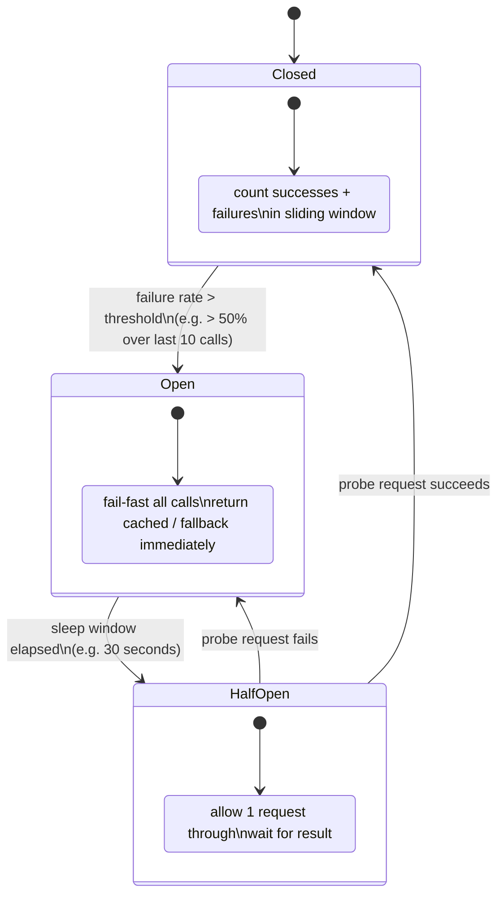

## 07 — Circuit Breaker

> **Interview level:** Principal / Staff (L6/L7) — appears in every "design for resilience"
> question. The L5 answer names the pattern; the L6/L7 answer covers the state machine, the
> threshold calibration, the distributed state problem, and the half-open probe strategy.

---

## Context

Service A calls Service B synchronously. B becomes slow or unavailable — GC pause, database
overload, network partition. Without a circuit breaker, A's threads pile up waiting for B's timeout,
exhausting A's connection pool and thread pool. A becomes slow, which cascades to Service C calling
A. One dependency failure takes down the call graph.

---

## Problem

| Force                 | Description                                                                              |
| --------------------- | ---------------------------------------------------------------------------------------- |
| Cascading failure     | A slow dependency consumes caller threads; caller becomes slow; its callers become slow  |
| Wasted resources      | Requests queued behind a broken dependency consume memory, threads, and connection slots |
| Recovery interference | A recovering dependency is overwhelmed by the backlog of retries from all callers        |
| Slow timeouts         | Default TCP timeouts (minutes) are far too long; threads block for the full window       |

---

## Solution



### State definitions

| State         | Behaviour                                                | Exit condition                   |
| ------------- | -------------------------------------------------------- | -------------------------------- |
| **Closed**    | All calls pass through; count outcomes in sliding window | Failure rate > threshold → Open  |
| **Open**      | All calls fail-fast immediately; no network call made    | Sleep window expires → Half-Open |
| **Half-Open** | Allow one probe request through                          | Success → Closed; Failure → Open |

### Threshold calibration

The two knobs that matter most:

```
failure_threshold:  50%      # open when >50% of calls in window fail
window_size:        10 calls # minimum sample size before tripping
sleep_window:       30s      # how long to stay Open before probing
```

- **Too sensitive** (low threshold, small window): the breaker trips on transient blips — a single
  GC pause opens the circuit and cuts traffic for 30 seconds unnecessarily.
- **Too sluggish** (high threshold, large window): the breaker only trips after 1000 failed calls,
  by which time the caller's thread pool is already exhausted.
- **Calibrate from measured P99 and error rate baselines**, not from defaults.

---

## The Distributed State Problem

A single-process circuit breaker (Hystrix, Resilience4j) maintains state in memory on one instance.
At 100 instances of Service A, each has its own independent circuit breaker for Service B. An
instance that hasn't hit the threshold stays Closed while others have already Opened.

```
Instance A-1: 60% error rate → OPEN   ✓ stops traffic
Instance A-2: 30% error rate → CLOSED ✗ still hammering broken B
Instance A-3: 45% error rate → CLOSED ✗ still hammering broken B
```

Solutions:

**Option 1 — Accept the inconsistency.** Each instance independently protects itself. Eventually all
instances open (within seconds of each other). Acceptable for most use cases.

**Option 2 — Shared state in Redis.** Centralise the sliding window counter in Redis. All instances
share the failure count; when threshold is hit, all open simultaneously. Adds a Redis dependency to
the breaker itself — if Redis is slow, the breaker adds latency to every call.

**Option 3 — Load-balancer level.** [[envoy|Envoy]]/Linkerd [[01-sidecar]] implements outlier
detection at the proxy level. One proxy per pod, but the control plane coordinates ejection across
pods via xDS. Effectively gives fleet-wide circuit breaking without a shared state store. This is
the preferred approach in a service mesh.

---

## Fallback Strategies

An open circuit must return something. Options ranked by user impact:

| Fallback                         | Quality          | When to use                                                |
| -------------------------------- | ---------------- | ---------------------------------------------------------- |
| Cached last-known-good response  | Stale but useful | Read-heavy; staleness is acceptable                        |
| Degraded response (partial data) | Reduced          | Some data is better than none                              |
| Empty / default response         | Minimal          | Caller can handle absence gracefully                       |
| Error to caller                  | None             | Caller must handle failure; fail-fast is better than lying |

**Never silently return empty as if it were a valid response** — callers can't distinguish "no data"
from "error". Return HTTP 503 with a `Retry-After` header, or a structured error with a
`circuit_open` flag.

---

## Consequences

### Gains

- Fail-fast eliminates thread/connection exhaustion on the caller side
- Recovery window lets the dependency heal before being re-hit at full load
- Fallback path makes failures visible and predictable instead of invisible and cascading

### Trade-offs

- State machine adds complexity; incorrect thresholds cause spurious trips or false safety
- Half-open probe must be representative; a cheap probe that always succeeds while real traffic
  fails gives false confidence
- Distributed state problem means per-instance breakers can diverge significantly under partial
  failure
- Not a substitute for timeouts — always set aggressive timeouts _in addition to_ the circuit
  breaker; the breaker is the second line of defence

---

## Observability

```
circuit_breaker_state{service, dependency}          # 0=closed, 1=open, 2=half-open
circuit_breaker_requests_total{state, outcome}      # calls by state and result
circuit_breaker_fallback_total{reason}              # fallback invocations
circuit_breaker_open_duration_seconds               # how long the circuit stayed open
circuit_breaker_failure_rate{dependency}            # current rolling failure rate
```

Alert on `circuit_breaker_state == 1` (open) for > 60 seconds — this means the dependency hasn't
recovered within the sleep window and may need intervention. Correlate with the dependency's own
error rate metric to confirm the root cause is in the dependency, not the breaker threshold.

---

## MAANG Interview Anchors

- "The circuit breaker is the second line of defence after the timeout. Timeouts bound how long a
  single call blocks; the circuit breaker prevents the 1000th call from being made after the first
  500 have timed out. Without both, you have incomplete protection."

- "At 100 instances, distributed circuit breaker state is a real problem. My default answer is to
  push the circuit-breaking logic into the sidecar proxy (Envoy outlier detection) because the
  control plane gives fleet-wide coordination without a shared state store dependency."

- "The half-open probe must be a real request, not a health-check ping. A dependency can pass a
  `/health` check while still failing real queries — I've seen this when a database primary is up
  but a table lock prevents actual writes. The probe must exercise the actual call path."

- "Calibrate thresholds from data, not defaults. I'd run a week of baseline metrics, look at P99
  error rate and P99 latency for each dependency, and set the threshold at 3σ above the baseline
  error rate. A threshold set below normal variability will produce alert fatigue from spurious
  trips."

---

## Relation to Fan-Out

In a [[04-1-fan-out-fan-in]], a per-shard circuit breaker stops the dispatcher from retrying into a
shard that's already failing consistently, which breaks the feedback loop where retries make the
failure worse and trigger even more retries. Without it, one bad shard out of N can consume a
disproportionate share of the fan-out's retry budget while contributing nothing to the merged
result.

---

## Known Uses

| System                  | Implementation                                                        |
| ----------------------- | --------------------------------------------------------------------- |
| Netflix Hystrix         | Original circuit breaker library; now in maintenance mode             |
| Resilience4j            | JVM replacement for Hystrix; supports sliding window by count or time |
| Envoy outlier detection | Proxy-level circuit breaking via consecutive 5xx ejection             |
| Linkerd                 | Per-route failure accrual; exponential backoff on ejected backends    |
| AWS SDK                 | Built-in retry + circuit breaker via `RetryMode: adaptive`            |
