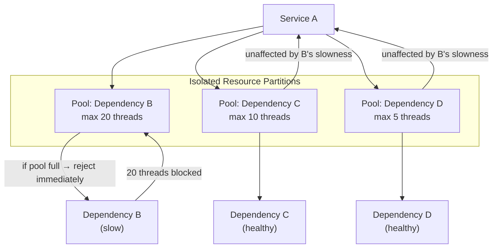
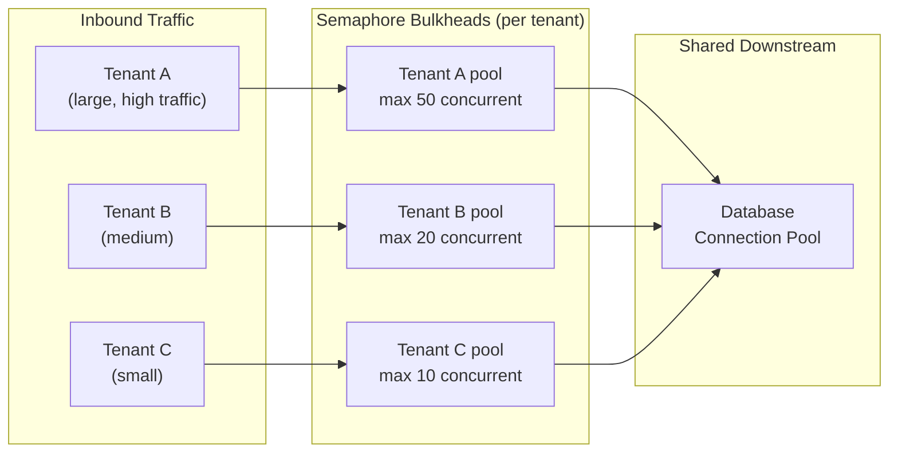

## 09 — Bulkhead

> **Interview level:** Principal / Staff (L6/L7) — the answer to "how do you prevent one tenant from
> degrading all other tenants?" Almost always paired with [[07-circuit-breaker|Circuit Breaker]] and
> Rate Limiting. Named after the watertight compartments in a ship's hull: one compartment floods,
> the ship stays afloat.

---

## Context

Service A calls multiple downstream dependencies (B, C, D) using a shared thread pool or connection
pool. Dependency B becomes slow. Threads pile up waiting for B to respond. The shared pool is
exhausted — calls to C and D, which are healthy, also queue and time out. One slow dependency
degrades the entire service.

---

## Problem

| Force                      | Description                                                                           |
| -------------------------- | ------------------------------------------------------------------------------------- |
| Shared resource exhaustion | A single bottleneck consumes all threads/connections in a shared pool                 |
| Blast radius amplification | One slow dependency takes down all call paths through the service                     |
| Tenant noisy-neighbour     | One tenant's traffic spike starves all other tenants                                  |
| Priority inversion         | Low-priority background work consumes resources needed by high-priority user requests |

---

## Solution



Each dependency gets its own bounded resource partition. When B is slow and its 20-thread pool is
full, new requests for B are **rejected immediately** (fail-fast) rather than queuing. Pools for C
and D are untouched.

### Two implementation variants

**Thread-pool bulkhead** — each partition has its own thread pool. Calls to the dependency execute
on that pool's threads. When the pool is saturated, the rejection is instant (no waiting for a
thread to free up). Higher isolation; higher context-switch overhead (one pool per dependency).

**Semaphore bulkhead** — a counting semaphore limits concurrent in-flight calls. No separate
threads; the calling thread acquires the semaphore, makes the call, releases on return. Lower
overhead; the calling thread is still blocked during the call, so a slow dependency still holds
calling threads — it just limits _how many_ can be held simultaneously.

|                     | Thread Pool                        | Semaphore                              |
| ------------------- | ---------------------------------- | -------------------------------------- |
| Isolation           | Full (separate threads)            | Partial (shared caller threads)        |
| Overhead            | Higher (thread context switches)   | Lower                                  |
| Timeout granularity | Per-pool timeout enforceable       | Caller thread blocks for full duration |
| Use when            | I/O-heavy calls that block threads | CPU-light calls; high concurrency      |

---

## Per-Tenant Bulkheads

The most common MAANG interview context: multi-tenant platforms.



When Tenant A sends a traffic spike (DDoS, runaway job), its bulkhead caps its concurrent DB
connections at 50. Tenant B and C are unaffected. Without the bulkhead, Tenant A's spike exhausts
the shared DB connection pool and every other tenant gets connection timeouts.

**Pool sizing formula:**

```
tenant_pool_size = (tenant_P99_concurrency × burst_multiplier) + headroom
example: P99=20 concurrent × 2.0 burst + 10 headroom = 50
```

Use production metrics (P99 concurrency per tenant) as the baseline. Never use "max possible" as the
pool size — that defeats the bulkhead's purpose.

---

## Combining Bulkhead with Circuit Breaker

These two patterns are complementary, not alternatives:

```
Circuit Breaker: stops calls to a *failing* dependency (protects the dependency's recovery)
Bulkhead:        limits concurrent calls to a *slow* dependency  (protects the caller's resources)
```

A slow dependency that isn't failing (it responds eventually) won't trip the circuit breaker — but
it _will_ exhaust thread pools. The bulkhead catches what the circuit breaker misses.

```
Request → Bulkhead check (is pool saturated? → reject) → Circuit Breaker check (is circuit open? → reject) → Call
```

---

## Consequences

### Gains

- One slow dependency can exhaust only its own partition; other call paths remain healthy
- Rejection under saturation is fast and deterministic, not a queue that grows unboundedly
- Per-tenant bulkheads give enforceable resource quotas without complex quota accounting systems

### Trade-offs

- Pool sizing requires ongoing tuning; an undersized pool rejects valid traffic; an oversized pool
  provides no isolation
- Thread-pool bulkheads add memory and scheduling overhead proportional to the number of pools
- Rejected calls must have a fallback or explicit error — bulkhead rejection surfaces to the caller
  as an error, not transparent queuing
- Per-tenant bulkheads require tenant identification early in the request path (before any I/O)

---

## Observability

```
bulkhead_pool_active{pool}           # currently executing calls
bulkhead_pool_queued{pool}           # calls waiting for a thread (should be ~0 with bulkhead)
bulkhead_pool_size{pool}             # configured max
bulkhead_rejected_total{pool}        # calls rejected due to pool saturation
bulkhead_execution_duration_seconds  # latency inside the bulkhead (per pool)
```

Alert: `bulkhead_rejected_total{pool="tenant-A"} > 0` — a tenant is hitting their bulkhead ceiling.
Either the tenant is misbehaving (throttle them) or the pool is undersized (review sizing).

Dashboard: `bulkhead_pool_active / bulkhead_pool_size` as a utilisation gauge per pool. Above 80%
sustained = pool will saturate on any burst; resize proactively.

---

## MAANG Interview Anchors

- "The bulkhead is the answer to the noisy-neighbour problem. Without it, a single misbehaving
  tenant or a single slow dependency can exhaust the shared resource pool and take down all other
  tenants. The circuit breaker doesn't help here — it only trips on failures, not on slowness."

- "I'd size pools from production P99 concurrency metrics, not from theoretical maximums. Setting a
  pool to 'max possible' defeats the isolation guarantee — it just renames the shared pool."

- "Thread-pool bulkheads add memory overhead that's measurable. At 50 dependencies with 20-thread
  pools each, that's 1000 threads per service instance. At 500 instances, 500K threads total. I'd
  profile the thread overhead before committing to thread-pool isolation — semaphore bulkheads are
  often sufficient and much cheaper."

- "Bulkhead rejection under saturation must be explicit, not silent. The caller gets a 503 with a
  `bulkhead_exhausted` error code; the dashboard shows the rejection rate per pool. Silent rejection
  — returning an empty response — is worse than an error because it hides the saturation event."

---

## Relation to Fan-Out

A [[04-1-fan-out-fan-in]] to N shards sharing one worker pool has no isolation: a single slow shard
can exhaust the pool that healthy shards depend on, even while the dispatcher's aggregate latency
across all shards still looks fine. Partitioning the worker pool per shard (or per shard group)
contains that blast radius — this is what a per-shard circuit breaker misses, since a
slow-but-not-yet-failing shard won't trip a breaker but will still hold threads.

---

## Known Uses

| System                          | Bulkhead application                                                           |
| ------------------------------- | ------------------------------------------------------------------------------ |
| Netflix Hystrix                 | ThreadPool isolation per dependency; semaphore mode available                  |
| Resilience4j                    | Bulkhead module with thread pool and semaphore variants                        |
| Envoy                           | Connection pool limits per cluster (`max_connections`, `max_pending_requests`) |
| Kubernetes ResourceQuota        | Per-namespace CPU/memory bulkheads                                             |
| AWS Lambda reserved concurrency | Per-function bulkhead — reserves execution capacity                            |
