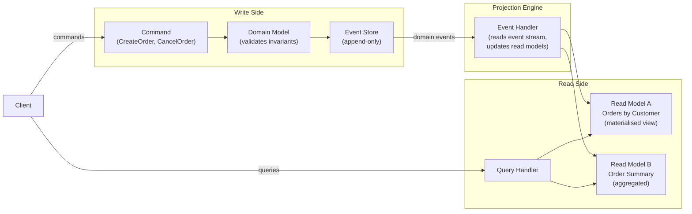
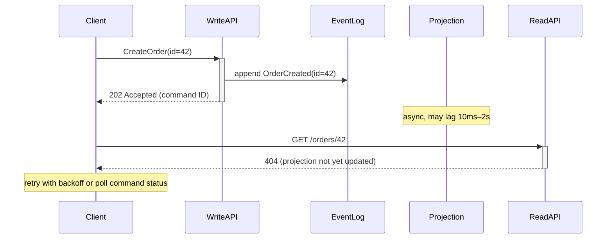

## 12 — CQRS — Command Query Responsibility Segregation

> **Interview level:** Principal / Staff (L6/L7) — almost always paired with
> [[13-event-sourcing|Event Sourcing]] in MAANG interviews. The key signal: can you articulate
> _when_ CQRS is the right call vs. overkill? Most candidates know the pattern; few can argue the
> trade-off honestly.

---

## Context

A system's read and write access patterns diverge significantly. The write side enforces invariants
and emits domain events; the read side serves queries at high throughput with complex projections
(joins, aggregations, materialized views) that the write model doesn't support efficiently.

---

## Problem

| Force                | Description                                                                           |
| -------------------- | ------------------------------------------------------------------------------------- |
| Read/write asymmetry | Reads are 10–100× more frequent than writes; optimising one degrades the other        |
| Schema tension       | The normalised write schema is expensive to query; query views need denormalised data |
| Scaling asymmetry    | Read and write tiers need independent scaling units                                   |
| Audit / history      | Write model loses history on update; queries need temporal snapshots                  |

---

## Solution



**Write side** is the authority: it validates commands against the domain model and appends
immutable events. **Projection engine** is an async subscriber that transforms events into
read-optimised views — one per query pattern. **Read side** is a set of eventually-consistent,
denormalised stores optimised for specific queries (PostgreSQL materialized views, Elasticsearch,
Redis hashes, etc.).

---

## Implementation Decisions

### How many read models?

One per query shape. Resist the urge to build a "general-purpose" read model — that's just the write
model with a different name.

```
Query: "all orders for customer X, sorted by date"   → read model: orders_by_customer (hash keyed by customer_id)
Query: "order summary for dashboard"                  → read model: order_summary (pre-aggregated counts)
Query: "full-text search on order description"        → read model: Elasticsearch index
```

### Projection rebuild

When the projection logic changes (new field, bug fix), you must replay all events to rebuild the
view. Design for this from day one:

1. Write events to an **append-only event log** (Kafka, EventStoreDB, PostgreSQL table with sequence
   ID)
2. Keep the **consumer group offset** separate from the read model state — you can reset the offset
   and replay without touching the write side
3. **Blue/green projection rebuild**: build the new projection in parallel from offset 0, then
   atomically swap read traffic to the new view once it catches up

### Command acknowledgement and the consistency gap



This is the **most common production bug** in CQRS systems: clients issue a command, then
immediately query the read model and get stale data. Solutions:

- **Optimistic UI**: update the client's local state immediately; treat the read-model response as
  an eventual confirmation
- **Command receipt token**: return a `command_id` on write; read API accepts `?after_command=id`
  and waits until the projection has processed at least that command
- **Polling endpoint**: `GET /commands/{id}/status` returns `pending | completed | failed` —
  projection marks commands complete after applying the event

---

## Consequences

### Gains

- Read and write tiers scale independently (write side: vertically for consistency; read side:
  horizontally for throughput)
- Read models are purpose-built: no JOIN overhead, no lock contention with writes
- Event log is an audit trail by default — no extra instrumentation needed
- Multiple read models can serve the same events with different projections simultaneously

### Trade-offs

- **Eventual consistency is non-negotiable**: reads lag behind writes by the projection processing
  delay. If the business requires read-your-own-writes consistency, CQRS requires extra machinery
  (see above). Not every domain can tolerate this.
- **Projection rebuild cost**: at 10M events, a full replay takes time and compute. Plan the rebuild
  strategy before you need it.
- **Operational complexity**: two data stores, an event log, a projection service, and a consistency
  lag to monitor. Adds at least 3 new failure modes.
- **Not worth it for simple CRUD**: if reads and writes are symmetric and volume is low, CQRS is
  overengineering. Say this in the interview.

---

## When NOT to use CQRS

State this proactively — it signals maturity:

- CRUD-heavy systems with no complex query patterns
- Teams that don't yet have the operational maturity to run distributed event logs
- Low-traffic systems (< 1K RPS) where a single well-indexed database handles both reads and writes
  comfortably
- Systems without a genuine audit or history requirement

---

## Observability

```
cqrs_command_latency_seconds{command_type}         # write-side latency
cqrs_projection_lag_events{projection}             # events behind the write head
cqrs_projection_lag_seconds{projection}            # time lag of slowest projection
cqrs_read_model_query_latency_seconds{model}       # read-side latency
cqrs_command_failures_total{command_type, reason}  # write-side rejections
cqrs_projection_rebuild_duration_seconds           # how long a replay takes
```

The **critical alert**: `cqrs_projection_lag_seconds > SLA_THRESHOLD` — projection is falling behind
faster than it can process. Root causes: projection consumer is undersized, event log partition
count too low, read model write is slow. Correlate with event log consumer lag.

---

## MAANG Interview Anchors

- "CQRS is a trade: you pay with eventual consistency and operational complexity to get independent
  read/write scaling and purpose-built projections. I'd only make that trade when the read/write
  asymmetry is real and measurable — not as a default architecture."

- "The hardest operational problem in CQRS isn't the pattern itself — it's the projection rebuild.
  At 100M events, a full replay can take hours. I'd design the event log to be replayable from any
  offset, run blue/green projection rebuilds in parallel, and gate traffic switchover on projection
  lag dropping to < 1 second."

- "Read-your-own-writes is the gap that bites every team. My answer is a command receipt token: the
  write API returns a `command_sequence_number`; the read API accepts `?consistent_after=N` and
  returns 503 with a Retry-After header if the projection hasn't caught up. This makes the
  consistency guarantee explicit in the API contract, not buried in an SLA footnote."

- "I'd instrument projection lag as a first-class SLO, not a background metric. If the projection is
  10 seconds behind, the business impact is that 10 seconds of orders are invisible in the
  dashboard. That's a customer-visible SLO breach, not a platform warning."

---

## Known Uses

| System                                   | CQRS application                                                |
| ---------------------------------------- | --------------------------------------------------------------- |
| Axon Framework                           | Canonical CQRS + Event Sourcing in Java/Spring                  |
| EventStoreDB                             | Purpose-built event log with projection engine                  |
| Kafka + Materialized views               | Kafka Streams aggregates into read models                       |
| Microsoft Azure Event Sourcing reference | CQRS + ES with Azure Service Bus                                |
| Uber's domain events                     | Write to Kafka; downstream services build their own read models |
