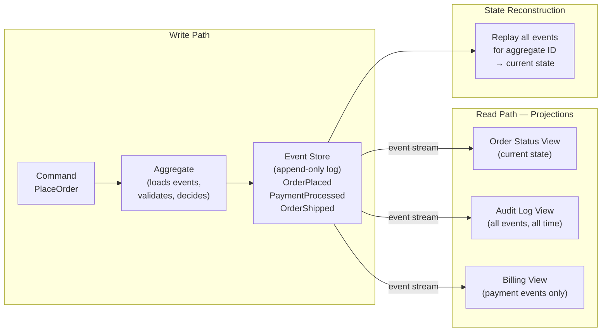
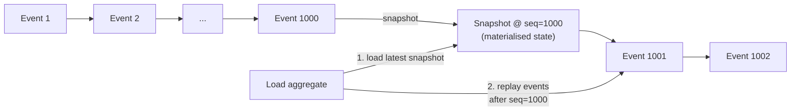

## 13 — Event Sourcing

> **Interview level:** Principal / Staff (L6/L7) — almost always paired with [[12-cqrs|CQRS]]. The
> L5 answer describes the pattern; the L6/L7 answer covers snapshot optimisation, event schema
> versioning, upcasting, and when the audit trail alone doesn't justify the complexity.

---

## Context

A system needs to answer not just "what is the current state?" but "what was the state at time T?"
or "what sequence of decisions produced this state?" Traditional CRUD systems overwrite state on
every update; the history is lost. Event sourcing keeps the full history as the source of truth.

---

## Problem

| Force                    | Description                                                                                     |
| ------------------------ | ----------------------------------------------------------------------------------------------- |
| Audit requirement        | Regulators or business need a complete, tamper-evident history of every state change            |
| Temporal queries         | "What did the account balance look like at 14:32:07 on March 3rd?"                              |
| Debugging                | Production bug: "Why did this order end up in state X?" — with CRUD, the previous state is gone |
| Projection flexibility   | Different consumers need different views of the same state (billing view, shipping view)        |
| Event-driven integration | Downstream services need to react to state changes; the event log _is_ the integration point    |

---

## Solution



**Every state change is captured as an immutable event** (`OrderPlaced`, `ItemAdded`,
`PaymentProcessed`, `OrderCancelled`). The event store is append-only — events are never updated or
deleted. To reconstruct current state, replay all events for a given aggregate from the beginning of
its log.

### Event structure

```json
{
  "event_id":      "a3f8...",
  "aggregate_id":  "order-42",
  "aggregate_type":"Order",
  "event_type":    "OrderPlaced",
  "sequence":      1,
  "occurred_at":   "2026-06-30T10:00:00Z",
  "payload": {
    "customer_id": "cust-7",
    "items":       [{"sku": "widget", "qty": 2}],
    "total":       49.99
  },
  "metadata": {
    "correlation_id": "req-abc",
    "causation_id":   "cmd-xyz",
    "actor":          "user:amit@example.com"
  }
}
```

`metadata.correlation_id` and `causation_id` are load-bearing for debugging: they link the event to
the originating request and the command that caused it.

---

## Snapshot Optimisation

Replaying 10 years of events for an account with 100K events on every read is prohibitive. Snapshots
checkpoint the aggregate state periodically:



**Snapshot strategy:**

- Snapshot every N events (e.g., every 100 events) — simple; may snapshot unnecessarily
- Snapshot when aggregate state size exceeds a threshold
- Snapshot on explicit command ("prepare for archival")

Snapshots are an optimisation, not part of the core model. The system must work correctly without
them; snapshots only affect performance.

---

## Event Schema Versioning

Events are immutable and live forever. Inevitably the schema changes. This is the most
underestimated problem in event sourcing.

**The problem:**

```json
// v1 event (stored 3 years ago)
{ "event_type": "OrderPlaced", "customer_name": "Amit Singh" }

// v2 event (current)
{ "event_type": "OrderPlaced", "customer": { "id": "cust-7", "name": "Amit Singh" } }
```

Old events still exist in the store and must be replayed. Options:

**Upcasting (preferred):** Apply a transformation at read time; old events are converted to the
current schema on the fly. No data migration required.

```python
def upcast(event: dict) -> dict:
    if event["event_type"] == "OrderPlaced" and "customer_name" in event["payload"]:
        # v1 → v2 upcast
        name = event["payload"].pop("customer_name")
        event["payload"]["customer"] = {"name": name, "id": None}
    return event
```

**In-place migration:** Update existing event payloads in the store. Breaks immutability. Only do
this for security (PII removal) with an audit trail of the migration.

**Versioned event types:** `OrderPlacedV1`, `OrderPlacedV2` — the handler dispatches on type. Works
but creates an explosion of types over time.

Rule: **never change the meaning of an existing field; only add optional fields or use upcasting**.

---

## Consequences

### Gains

- Complete, tamper-evident audit log by construction — no extra audit table needed
- Temporal queries trivially answered by replaying events up to time T
- Projection flexibility: the same event stream feeds multiple read models; add a new projection
  without touching the write side
- Event log is the natural integration point for downstream services (via Kafka or direct
  subscription)
- Bug diagnosis: replay events to reproduce exact state at time of bug

### Trade-offs

- **Eventual consistency**: projections lag behind the event log (see CQRS trade-offs)
- **Snapshot complexity**: without snapshots, aggregate load time grows linearly with event count;
  with snapshots, you have another artifact to manage
- **Event schema versioning**: the hardest long-term cost; upcaster chain grows with every schema
  change
- **Not suitable for simple CRUD**: if there's no audit requirement, no temporal query need, and no
  downstream projection requirement, event sourcing is overengineering with significant operational
  cost
- **Storage cost**: storing all events forever is expensive at scale; archival strategy required

---

## Observability

```
event_store_append_duration_seconds{aggregate_type}     # write latency
event_store_events_appended_total{event_type}           # throughput by event type
event_store_replay_duration_seconds{aggregate_type}     # how long replays take
event_store_replay_events_count{aggregate_type}         # events replayed per load
snapshot_age_events{aggregate_type}                     # events since last snapshot
upcaster_applied_total{from_version, to_version}        # upcast frequency
projection_lag_seconds{projection}                      # how far behind projections are
```

Alert: `event_store_replay_events_count{p99} > 1000` — aggregates are growing too large; check
snapshot frequency. Alert: `projection_lag_seconds > SLO` — projection is falling behind event
stream.

---

## MAANG Interview Anchors

- "Event sourcing gives you audit trail, temporal queries, and projection flexibility for free — but
  it costs you schema versioning complexity and eventual consistency. I'd only adopt it when at
  least two of those three gains are explicit requirements. The audit trail alone rarely justifies
  the complexity; append-only tables or database triggers can give you that more cheaply."

- "Event schema versioning is the tax that compounds over time. Three years in, you have 47 event
  types with 3–5 versions each. The upcaster chain becomes load-bearing infrastructure. I'd enforce
  an 'additive changes only' rule from day one and require a postmortem process for any breaking
  schema change."

- "Snapshots are the performance escape hatch, not a core feature. Design the system to work
  correctly without them; add snapshots when aggregate replay time exceeds the SLO. The mistake is
  building snapshots first and then treating them as required — they add operational complexity that
  isn't needed at low event counts."

- "The event log is also your integration bus. Downstream services subscribe to the event stream
  instead of polling the write model. This eliminates the **[[14-outbox|dual-write problem]]**: the
  event is the source of truth; projections and downstream consumers derive from it. I'd surface
  this in the architecture diagram as the single place where state changes cross service
  boundaries."

---

## Known Uses

| System                        | Event Sourcing application                                         |
| ----------------------------- | ------------------------------------------------------------------ |
| EventStoreDB                  | Purpose-built event store with built-in projection engine          |
| Axon Framework                | CQRS + ES in Java; snapshot support built in                       |
| Kafka (log compaction off)    | Used as an event store for high-throughput streams                 |
| Martin Fowler's reference app | Canonical ES example: `AccountingEntry` ledger                     |
| Banking core systems          | Ledger as append-only event log; balance = sum of credits − debits |
| Git                           | Every commit is an immutable event; `HEAD` = replay of all commits |
