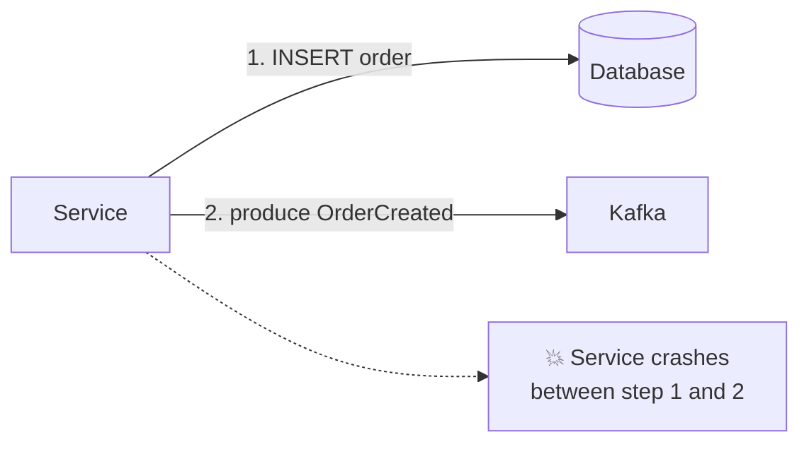
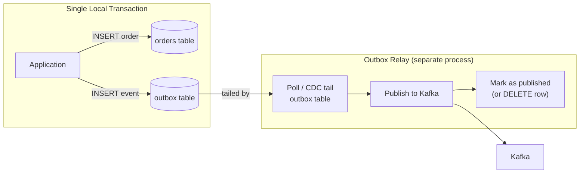
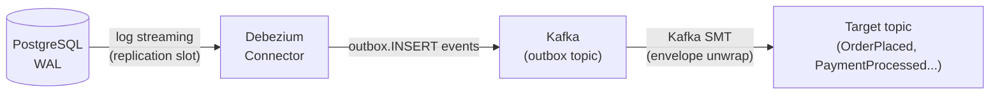

## 14 — Transactional Outbox

> **Interview level:** Principal / Staff (L6/L7) — the canonical answer to "how do you atomically
> update the database and publish an event?" If a candidate jumps to Kafka transactions or 2PC, ask
> them to explain the outbox. It's simpler, more portable, and better understood.

---

## Context

A service must update its database _and_ publish a message (to
[[system-design/08-observability/05-telemetry-ingestion-pipeline/05-05-layer-2-durable-buffer-kafka|Kafka]],
SQS, a webhook) as part of the same logical operation. A failure between the two writes leaves the
system in an inconsistent state: the database is updated but no event was published (or vice versa).

---

## Problem



| Failure scenario                          | Outcome                                                           |
| ----------------------------------------- | ----------------------------------------------------------------- |
| Crash after DB write, before Kafka write  | Order exists in DB; no event published; downstream never notified |
| Crash after Kafka write, before DB commit | Event published; DB rolls back; ghost event in Kafka              |
| Kafka unavailable at write time           | DB write succeeds; event lost                                     |

Neither XA/2PC (requires distributed transaction coordinator) nor "write to Kafka then DB" solves
this without introducing tight coupling or significant operational overhead.

---

## Solution



**Step 1 — In the same database transaction:**

```sql
BEGIN;

INSERT INTO orders (id, customer_id, status, created_at)
VALUES ('order-42', 'cust-7', 'PENDING', NOW());

INSERT INTO outbox (id, aggregate_type, aggregate_id, event_type, payload, created_at, published)
VALUES (
  gen_random_uuid(),
  'Order', 'order-42', 'OrderPlaced',
  '{"customer_id":"cust-7","total":49.99}',
  NOW(), false
);

COMMIT;
```

Either both rows commit or neither does. The event is durably stored in the database before Kafka is
even contacted.

**Step 2 — Outbox Relay publishes asynchronously:**

```python
while True:
    rows = db.query("""
        SELECT * FROM outbox
        WHERE published = false
        ORDER BY created_at
        LIMIT 100
        FOR UPDATE SKIP LOCKED
    """)
    for row in rows:
        kafka.produce(
            topic=f"domain.{row.aggregate_type.lower()}",
            key=row.aggregate_id,
            value=row.payload,
            headers={"event_type": row.event_type},
        )
        db.execute("UPDATE outbox SET published=true WHERE id=%s", row.id)
    sleep(0.1)
```

`FOR UPDATE SKIP LOCKED` is load-bearing: it prevents two relay instances from picking up the same
row (enabling multiple relay workers for throughput without duplicate publishes).

---

## CDC Variant — Debezium

Polling the outbox table adds latency proportional to the poll interval. The
[[data-engineering/03-data-ingestion/03-change-data-capture/03-change-data-capture|CDC (Change Data Capture)]]
variant uses database transaction log tailing to detect new outbox rows in near-real-time (< 1
second latency vs. poll interval of 100ms–1s).



Debezium's **Outbox Event Router** SMT (Single Message Transformation) reads the outbox table
`INSERT` events from Kafka (produced by Debezium from the WAL) and routes them to per-aggregate
topics based on `aggregate_type`. The outbox table never grows unboundedly — CDC captures the
insert; the row can be deleted immediately after (or kept for a TTL-based audit).

**Trade-off vs. polling:**

|                        | Polling                   | CDC (Debezium)                                               |
| ---------------------- | ------------------------- | ------------------------------------------------------------ |
| Latency                | ~poll interval (100ms–1s) | < 500ms                                                      |
| Operational complexity | Low — it's a query loop   | High — Debezium, Kafka Connect, replication slot management  |
| DB load                | Constant poll queries     | WAL read (low CPU; replication slot must be maintained)      |
| Replication slot risk  | None                      | Stale replication slot blocks WAL cleanup → DB disk fills up |

Start with polling. Migrate to CDC only when sub-second publication latency is required.

---

## Idempotency at the Consumer

The relay publishes at-least-once (a relay restart may re-publish unpublished rows). Consumers must
be idempotent:

```python
# Consumer with idempotency check
def handle_order_placed(event):
    if db.exists("processed_events", event_id=event["event_id"]):
        return  # already processed — safe to skip
    with db.transaction():
        process_order(event)
        db.insert("processed_events", event_id=event["event_id"], processed_at=now())
```

Alternatively, design the handler as a natural idempotent operation (upsert instead of insert;
set-based updates instead of increment-based).

---

## Consequences

### Gains

- Atomic write to DB and event "publication" in a single local transaction — no distributed
  transaction, no 2PC, no XA
- Works with any database that supports transactions (PostgreSQL, MySQL, SQL Server)
- Kafka unavailability does not block the application — the event is safely in the outbox
- Replay is possible: re-publish all unprocessed outbox rows after a consumer outage

### Trade-offs

- **Publication latency**: relay poll interval adds end-to-end latency (mitigated by CDC)
- **At-least-once delivery**: consumers must be idempotent
- **Outbox table growth**: if the relay stops, the outbox table grows; needs monitoring and alerting
- **Replication slot risk (CDC)**: a stale Debezium slot prevents WAL cleanup; PostgreSQL disk fills
  if the slot is not consumed — this is a production incident at scale
- **Extra table + relay process**: more moving parts than "just write to Kafka"

---

## Observability

```
outbox_unpublished_rows{aggregate_type}           # rows waiting to be published
outbox_publication_lag_seconds                    # age of oldest unpublished row
outbox_publish_rate_per_second                    # relay throughput
outbox_relay_failures_total{reason}               # Kafka producer errors
cdc_replication_slot_lag_bytes{slot}              # WAL bytes behind (CDC variant)
cdc_connector_status{connector}                   # RUNNING | PAUSED | FAILED
```

Alert: `outbox_publication_lag_seconds > 30` — relay is stuck or Kafka is unavailable. Alert:
`cdc_replication_slot_lag_bytes > 1GB` — Debezium is falling behind; disk pressure imminent.

---

## MAANG Interview Anchors

- "The dual-write problem is solved by not having two writes. Write to the database and the outbox
  table in the same transaction; let the relay handle Kafka asynchronously. The atomicity guarantee
  comes from the database, not from a distributed transaction coordinator."

- "CDC with Debezium is the right answer for sub-second publication latency, but the replication
  slot is a sharp edge. A stale slot in PostgreSQL blocks WAL cleanup and the disk fills up. I'd
  alert on `replication_slot_lag_bytes` before it reaches disk pressure, and have a runbook for slot
  recreation."

- "Consumers must be idempotent because the relay publishes at-least-once. This is non-negotiable —
  I'd enforce it in code review. The simplest pattern is a `processed_events` table with a unique
  index on `event_id`; the consumer checks this before processing."

- "The outbox table is not just a reliability mechanism — it's a useful audit trail. I can query
  'all events published for order-42' directly from the outbox without going to Kafka. I'd keep rows
  for 7 days before pruning, giving operational debugging access without Kafka retention
  complexity."

---

## Known Uses

| System          | Outbox application                                        |
| --------------- | --------------------------------------------------------- |
| Debezium        | CDC connector that natively supports outbox event routing |
| Axon Framework  | Built-in outbox pattern with JPA entities                 |
| NServiceBus     | Outbox feature for NHibernate/SQL Server                  |
| Eventuate Tram  | Microservices transaction library built on outbox         |
| Spring Modulith | Built-in event publication log (outbox variant)           |
