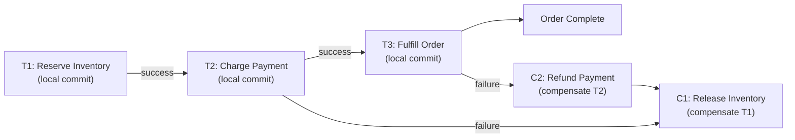
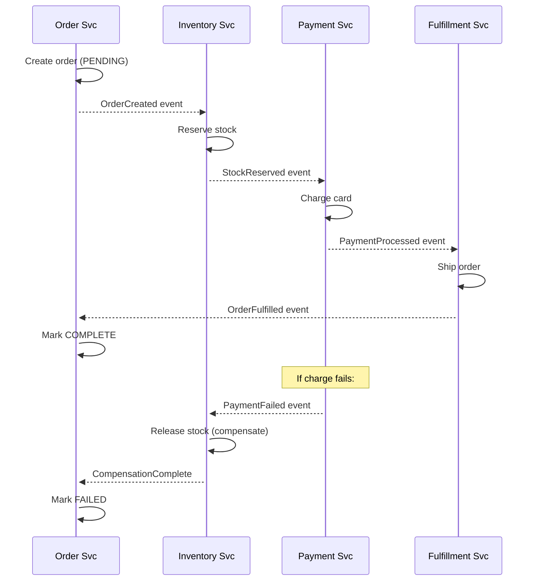
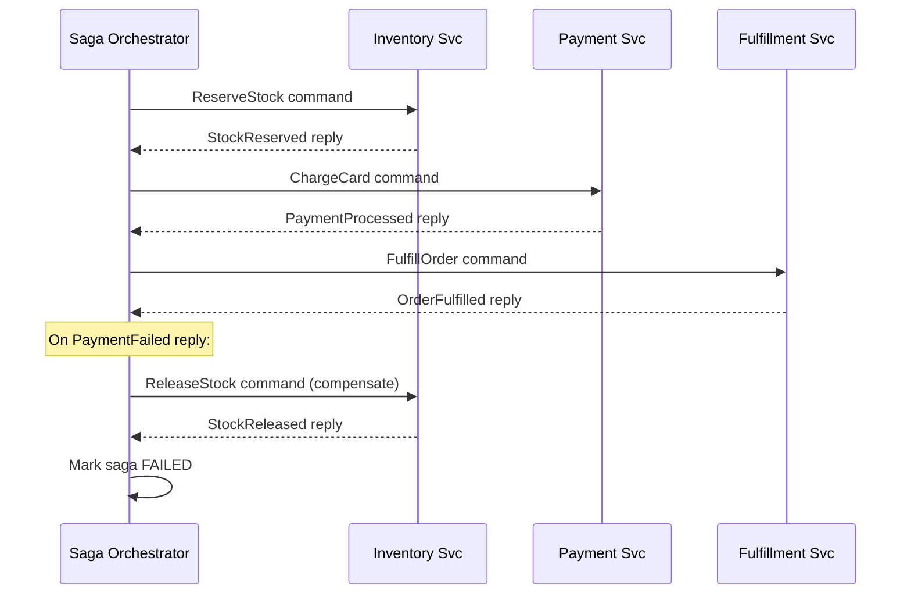

## 15 — Saga

> **Interview level:** Principal / Staff (L6/L7) — the definitive answer to "how do you handle
> [[system-design/02-distributed-systems-theory/05-distributed-transactions/05-distributed-transactions|distributed transactions]]
> in microservices?" The L5 answer names Saga. The L6/L7 answer covers choreography vs.
> orchestration, compensation design, idempotency, and the stuck-saga problem.

---

## Context

A business operation spans multiple services, each with its own database. A traditional ACID
transaction (or 2PC) requires all participants to hold locks until the coordinator decides to commit
or abort. In a microservices system this creates: tight coupling between services, blocking during
network partitions, and a coordinator that is a single point of failure. 2PC does not work at
microservices scale.

---

## Problem

| Force                  | Description                                                                                        |
| ---------------------- | -------------------------------------------------------------------------------------------------- |
| Distributed atomicity  | "Either all steps succeed or none of their effects persist" — across service boundaries            |
| 2PC unavailability     | Two-phase commit blocks all participants until coordinator responds; unacceptable in async systems |
| Service autonomy       | Services own their databases; no shared transaction manager                                        |
| Long-running workflows | A business process (book flight + hotel + car) may take seconds to minutes                         |

---

## Solution

A Saga decomposes the distributed transaction into a sequence of local transactions T1, T2, … Tn.
Each Ti is committed immediately and locally. If Ti fails, compensating transactions C(i-1) … C1 are
executed to undo the preceding steps.



### Variant 1: Choreography

Each service publishes events; downstream services subscribe and react. No central coordinator.



**Pros:** No single point of failure; services are loosely coupled.

**Cons:** Hard to reason about the overall workflow state; debugging requires correlating events
across multiple services; adding a new step means modifying multiple services; cyclic event chains
are easy to create accidentally.

### Variant 2: Orchestration

A central Saga Orchestrator coordinates the workflow by sending commands and receiving replies.



**Pros:** Single place to see and change the workflow; easy to add steps; orchestrator holds the
saga state; simpler to debug (one log stream for the full workflow).

**Cons:** Orchestrator is a new component to build, deploy, and operate; becomes a logic bottleneck
if not designed carefully; coupling: all participants know the orchestrator's API.

**Default recommendation:** orchestration for complex multi-step workflows (> 3 steps); choreography
for simple 2-step reactions (event → one compensating action).

---

## Compensation Design

Compensations are the hardest part. Rules:

1. **Compensations must be idempotent.** The orchestrator may retry a compensation if the reply is
   lost. A compensation that runs twice must produce the same result both times.
2. **Compensations are not rollbacks.** By the time compensation runs, T1 has committed and may have
   observable effects (an email was sent, a webhook fired). Compensation undoes the _business
   effect_, not the database row. "Send a cancellation email" compensates "send a confirmation
   email".
3. **Some steps are pivot points — they cannot be compensated.** Sending a physical package is
   non-compensatable. Design the saga to place non-compensatable steps last.
4. **Model compensation failure.** What happens if `ReleaseStock` fails? The saga must retry
   compensation until it succeeds (requiring idempotency) or escalate to a human operator.

---

## The Stuck-Saga Problem

A saga step receives no reply — the downstream service is down, the message was lost, the network
partitioned. The saga is now stuck waiting. Mitigation:

```
Orchestrator                   Inventory Svc
  |─── ReserveStock ──────────>|
  |                            ✗ (service restarts, reply lost)
  |
  [timeout: 30s]
  |─── ReserveStock (retry) ──>|  ← must be idempotent
  |<── StockReserved ──────────|
```

- **Timeout + retry** on each step command; exponential backoff with jitter.
- **Idempotency key** on every command so the retry is safe.
- **Max retry limit** after which the orchestrator escalates to a dead-letter saga queue for
  operator intervention.
- **Saga state persistence**: the orchestrator must persist its state (current step, command
  history) in a durable store. If the orchestrator restarts mid-saga, it recovers state and
  continues from the last confirmed step.

---

## Consequences

### Gains

- No distributed locks or 2PC; each service commits locally and immediately
- Services remain autonomous; they only need to handle commands/events, not coordinate locks
- Long-running workflows (minutes to hours) are modelled explicitly with durable state

### Trade-offs

- **No isolation between T1 and T2**: after T1 commits, other sagas can read the intermediate state
  (dirty reads across saga boundaries). This is ACD without I — accepted in most business workflows.
- **Compensation complexity**: every forward step needs a compensating step; compensation can fail;
  compensation logic often mirrors business logic in complexity.
- **Eventual consistency**: the system is inconsistent during saga execution; consumers may see
  partial states.
- **Stuck sagas require operational tooling**: saga state dashboard, manual retry/abort UI for
  operators.

---

## Observability

```
saga_started_total{saga_type}                     # new sagas initiated
saga_completed_total{saga_type, outcome}          # success | compensated | stuck
saga_step_duration_seconds{saga_type, step}       # per-step latency
saga_step_retries_total{saga_type, step}          # retry count per step
saga_compensation_total{saga_type, step}          # how often each step was compensated
saga_stuck_total{saga_type, step}                 # sagas that exceeded max retries
saga_age_seconds{saga_type, state}                # how long sagas are in each state
```

Alert: `saga_stuck_total > 0` — requires operator intervention. Alert:
`saga_age_seconds{state="running"} > SLA` — saga taking longer than expected; risk of stuck
transition.

---

## MAANG Interview Anchors

- "2PC doesn't work in microservices — it requires all participants to hold locks until the
  coordinator decides, which blocks under network partitions and creates tight coupling. Saga gives
  you ACD without I: each step commits locally; compensation undoes business effects, not database
  rows."

- "I default to orchestration over choreography for anything beyond 2 steps. Choreography looks
  clean on a diagram but becomes a nightmare to debug in production — you're correlating events
  across 5 service logs to reconstruct the flow. With orchestration, the saga log is the source of
  truth."

- "Compensation failure is the edge case most candidates miss. If the compensating step for step 3
  fails, the saga is stuck in a partially compensated state. I'd design a dead-letter saga queue and
  an operator dashboard for manual resolution — some saga failures require human judgment, and the
  system must support that gracefully."

- "Non-compensatable steps define the saga's structure. Place them last so that if anything before
  them fails, you compensate before the non-reversible action. If the non-reversible step must come
  first, the saga needs a different design — consider an [[14-outbox]]-based notification that fires
  only after all preceding steps succeed."

---

## Known Uses

| System                  | Saga application                                              |
| ----------------------- | ------------------------------------------------------------- |
| Uber Cadence / Temporal | Workflow engine for orchestration-style sagas at scale        |
| Netflix Conductor       | Saga orchestration for microservices workflows                |
| Axon Framework          | Saga support built into CQRS/ES framework                     |
| Amazon Step Functions   | Serverless saga orchestrator; built-in retry and compensation |
| Eventuate Tram Sagas    | Library for choreography and orchestration sagas in JVM       |
