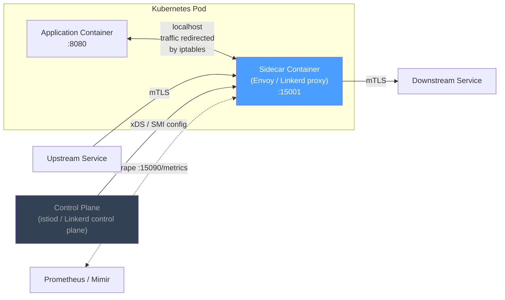

## 01 — Sidecar

> **Interview level:** Principal / Staff (L6/L7) — central to service-mesh and platform engineering
> questions. Your angle: you run Alloy as a DaemonSet (close cousin) and Linkerd sidecars in Runway
> (n-devx/01-runway). Ground every trade-off in that experience.

---

## Context

Microservices architectures require a consistent set of cross-cutting capabilities: mutual TLS,
traffic observability (metrics, traces), [[08-retry-with-jitter|retries with jitter]],
[[07-circuit-breaker|circuit breaking]], header propagation. Re-implementing these in every service
in every language is expensive, inconsistent, and impossible to upgrade atomically.

---

## Problem

| Force                | Description                                                                               |
| -------------------- | ----------------------------------------------------------------------------------------- |
| Polyglot services    | Services are in Go, Java, Python, Node — no single library works everywhere               |
| Library sprawl       | Each team pins a different version of the retry/auth library; upgrades are per-team       |
| Operational coupling | Adding observability requires a code change + deploy for every service                    |
| Blast radius of bugs | A bug in the shared library ships to all services simultaneously on the next version bump |

---

## Solution



The sidecar proxy runs in the **same network namespace** as the application. `iptables` rules
(injected by an init container or CNI plugin) redirect all inbound and outbound TCP traffic through
the sidecar transparently — the application opens a socket to `service-b:8080` but the kernel routes
it through the proxy at `localhost:15001` first.

The **control plane** distributes configuration (mTLS certificates, retry policies, circuit breaker
thresholds, traffic weights) to sidecars via an API (xDS in Istio; SMI in Linkerd). No service
restart is needed to update policy.

### What the sidecar owns

| Concern            | Implementation                                              |
| ------------------ | ----------------------------------------------------------- |
| mTLS               | Terminate and originate TLS; rotate certs via SPIFFE/SPIRE  |
| Retries            | Exponential backoff with jitter; per-route retry budgets    |
| Circuit breaking   | Outlier detection (consecutive 5xx → eject upstream)        |
| Observability      | Emit RED metrics + traces per request; inject trace headers |
| Load balancing     | Least-request, round-robin, consistent hashing              |
| Header propagation | Forward `X-Request-Id`, `b3` trace headers automatically    |
| Traffic shaping    | Canary splits, header-based routing, fault injection        |

### DaemonSet variant (Alloy / Fluent Bit)

When the cross-cutting concern is **node-level** (log collection, host metrics), a DaemonSet is
preferred over a per-pod sidecar:

```
Node
  ├── Pod A (app)    ─┐
  ├── Pod B (app)    ─┼─→ DaemonSet Pod (Alloy) → Loki / Mimir
  └── Pod C (app)    ─┘
```

DaemonSet trades per-pod isolation for lower resource overhead (one collector per node vs. one per
pod). Use DaemonSet for collection; use sidecar for per-request traffic interception.

---

## Lifecycle Coupling — The Critical Gotcha

The sidecar and the application share the Pod lifecycle. This creates non-obvious ordering issues:

**Startup race:** the application starts and immediately calls a downstream service, but the sidecar
proxy hasn't finished loading its xDS configuration yet → the first few requests fail.

Mitigation: add a `postStart` hook or a readiness probe that waits for the sidecar's admin endpoint
(`localhost:15000/ready`) before declaring the application ready.

**Shutdown race (the Kubernetes job killer):** when a Job pod completes, Kubernetes sends SIGTERM to
all containers simultaneously. The application exits; the sidecar exits. But if the sidecar exits
first, any final network calls from the application's shutdown handler fail.

Mitigation: set `preStop` on the sidecar container with a `sleep 5` to give the application time to
drain. Linkerd's `--wait-before-exit-seconds` flag handles this.

**Init container ordering:** iptables rules are set by the proxy init container. If the init
container fails, the application container's network is in an indeterminate state. Monitor init
container failures separately — they won't show up in the application's own error metrics.

---

## Consequences

### Gains

- Cross-cutting concerns implemented once, deployed to all services via control plane config
- Zero application code changes for adding mTLS, retries, or tracing to an existing service
- Atomic policy updates (cert rotation, retry budget changes) across the entire fleet
- Language-agnostic: Java, Go, Python, Node all get the same capabilities

### Trade-offs

- **Resource overhead**: each sidecar adds ~50–100MB memory and ~0.1–0.5 vCPU at idle per pod. At
  1000 pods, that's 50–100GB RAM and 100–500 vCPU consumed by proxies.
- **Latency overhead**: every request traverses two extra network hops (into sidecar, then out). At
  Linkerd: ~0.5ms P99 overhead. At Istio/[[envoy|Envoy]]: ~1–3ms P99. Budget for this in SLOs.
- **Lifecycle coupling**: sidecar bugs can crash or delay the application pod (see above).
- **Debugging complexity**: `tcpdump` on the pod no longer shows plaintext traffic (it's mTLS'd).
  Need the proxy's access logs or trace context to correlate.
- **Control plane is a new critical dependency**: if the control plane is unavailable, sidecars
  continue with their last-known config — but cert rotation and policy updates stall.

---

## Observability

Sidecars are the **best instrumentation point in the stack** — they see every byte crossing the
service boundary without application cooperation.

```
# RED metrics — emitted by every sidecar automatically
envoy_cluster_upstream_rq_total{cluster, response_code}
envoy_cluster_upstream_rq_time_ms (histogram — P50/P95/P99)
envoy_cluster_upstream_cx_active  # active connections per upstream

# Linkerd equivalents
request_total{direction, authority, tls}
response_latency_ms_bucket
tcp_open_connections

# Sidecar health
envoy_server_memory_heap_size_bytes     # proxy memory
envoy_server_total_connections          # connection pool pressure
envoy_server_uptime_seconds             # restart detection
```

**Golden signal dashboards come for free** with a service mesh — you have R/E/D for every
service-to-service call without a line of instrumentation code. This is the production argument for
sidecars: "I can show you latency percentiles and error rates for any service pair in the mesh
without touching the application."

---

## MAANG Interview Anchors

- "The sidecar is a platform tax: you pay ~100MB RAM and ~1ms latency per pod to get mTLS, retries,
  and observability for free. At 1000 pods that's a meaningful resource bill. I'd quantify it before
  proposing it — and I'd always compare against the alternative cost of every team implementing auth
  and retry independently."

- "The shutdown race condition is the one that bites everyone with Kubernetes Jobs. The application
  completes, Kubernetes sends SIGTERM to all containers simultaneously, the sidecar exits before the
  app's shutdown HTTP call lands. Fix is a `preStop` sleep on the sidecar — 5 seconds is usually
  enough to drain."

- "I've run Linkerd in Runway. The control plane is a new critical dependency: certs rotate every 24
  hours via SPIFFE. If the control plane is down for > 24 hours and certs expire, service-to-
  service mTLS breaks fleet-wide. I monitor control plane availability as an SLO, not just a health
  check."

- "DaemonSet vs sidecar is a scope question. If the concern is per-request (auth, retry, tracing),
  use a sidecar. If the concern is per-node (log collection, host metrics, GPU telemetry), use a
  DaemonSet. I run Alloy as a DaemonSet for log and metric collection at ShipSolid — it's ~10×
  cheaper than a sidecar per pod for that use case."

---

## Known Uses

| System                    | Sidecar application                                        |
| ------------------------- | ---------------------------------------------------------- |
| Istio / Envoy             | Full service mesh: mTLS, traffic management, observability |
| Linkerd                   | Lightweight mesh: ultra-low latency proxy (Rust-based)     |
| Grafana Alloy (DaemonSet) | Log/metric collection from all pods on a node              |
| Consul Connect            | Service discovery + mTLS via Envoy sidecar                 |
| AWS App Mesh              | Envoy sidecar for ECS/EKS workloads                        |
| SPIRE agent               | Sidecar issues SVID certificates to workloads              |
