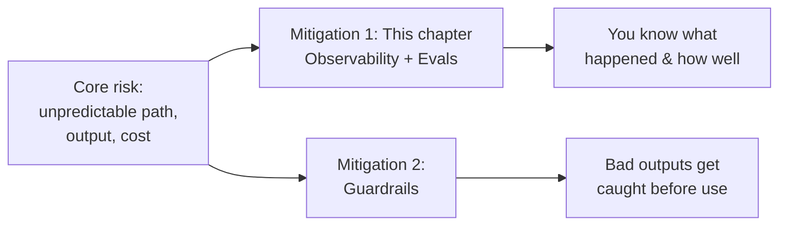

## AI Observability Fundamentals

> Chapter of [[production-agent-systems/readme#01 — Observability|Observability]], part of
> [[production-agent-systems/readme|Production Agent Systems]].

## What you will understand at the end

- Why handing control to an agent makes three specific things unpredictable — **path**, **output**,
  and **cost** — and why that's the same coin as the flexibility that makes agents worth building at
  all, not a separate downside to eliminate
- The two distinct mitigations for that unpredictability: **observability** (seeing what happened)
  and
  [[production-agent-systems/02-reliability-security-and-governance/01-guardrails/01-guardrails|guardrails]]
  (stopping bad outputs before they propagate) — and why this chapter covers the first, not the
  second
- The two kinds of eval that matter most, and why a business/commercial eval is the more important
  of the two whenever you can define one
- Why "the LLM hallucinated" is not an excuse available to the engineer who built the system — this
  chapter's tools are what turn that excuse into a requirements gap you can actually close

---

## The core risk: unpredictability

A fixed script always does the same thing. An agent's control flow is partly or fully decided by an
LLM call at runtime, and an LLM is a probabilistic model, not a deterministic function — every extra
decision delegated to the model (which branch, which tool, when to stop) is one more place where the
exact path, output, and cost can drift from run to run. Three concrete symptoms follow directly from
this:

- **Path** — which route the agent takes through the system varies run to run, even on the same
  input.
- **Output** — outputs are not always deterministic; the same input can produce different results.
- **Cost** — token and compute spend varies run to run along with the path.

Flexibility and unpredictability are the same property viewed from two angles — you cannot have one
without some of the other, and neither mitigation eliminates it. Observability and evals (this
chapter) make the unpredictability _observable_;
[[production-agent-systems/02-reliability-security-and-governance/01-guardrails/01-guardrails|Guardrails]]
make its _worst case bounded_. A system with only the second and not the first can be safe but blind
— you'd know bad outputs are being blocked, but not why they're being generated in the first place,
or whether the rate is getting worse. This chapter is the "know what happened" half of that pair.

---

## 1. Observability — having the right information

Observability, in the agentic-systems sense, is having the right information — traces of what
happened on each LLM call and each tool invocation — to see exactly what an agent did, in
development and in production alike. The analogy worth keeping: **observability is the flight data
recorder.** It records what happened, step by step, without judging whether any of it was good.
Judging whether it was good is the job of evals, covered next.

Without this layer, an agent's variable path (Section above) is invisible until a user complains —
you have no way to distinguish "this run took an unusual path and got the right answer anyway" from
"this run took an unusual path and that's exactly why it got the wrong answer," because both look
identical from the outside without a trace of the path itself.

## 2. Evals — judging whether it was good

Evals measure an agentic system's performance. Two distinct kinds matter most, and they answer
different questions:

| Eval type                 | What it measures                            | Example                                                          |
| ------------------------- | ------------------------------------------- | ---------------------------------------------------------------- |
| **Business / commercial** | Real-world outcome tied to your actual goal | New leads generated; revenue attributable to agent-driven sales  |
| **LLM-as-judge**          | Whether an individual output looks/is good  | A judge LLM scores a generated email for quality before it ships |

**The business eval is the more important of the two whenever you can define one.** It's the only
eval that tells you the system is actually working for the reason you built it, rather than just
producing plausible-looking outputs — an agent can score well on every LLM-as-judge check you can
write and still fail to move the metric you actually care about, because judge evals are a proxy for
quality, and business evals are the thing itself.

LLM-as-judge is precisely the
[[agentic-ai-engineering/03-planning-and-reasoning-algorithms/10-debate-and-critic-agents/10-debate-and-critic-agents|critic-agent (evaluator-optimizer)]]
mechanism applied to evaluation instead of iterative refinement — one LLM generates, a second LLM
judges. Every caution that chapter gives about a miscalibrated evaluator applies identically here:
an LLM's self-reported judgment of quality correlates only loosely with ground truth unless it has
been validated against a held-out labeled set, so treat a judge score as a signal to calibrate, not
a number to trust at face value the moment it's wired up.

---

## 3. Whose job this actually is

An **AI user** — someone using ChatGPT or Claude as a product — who hits a hallucination or an
off-path answer can reasonably complain about it; they're a consumer of someone else's system. An
**AI engineer** building an agentic system is not in that position. Choosing to build on a
token-prediction engine means its probabilistic nature is a known property you signed up for, not a
surprise defect you get to blame after the fact. The job, stated plainly: **align next-token
prediction with a business outcome** — and observability plus evals, the two tools this chapter
covers, are how that alignment gets measured rather than assumed. "The LLM hallucinated" is not a
valid excuse for the person who built the system; it's a requirements gap in the observability and
eval coverage that should have caught it before a user did. See
[[ai-foundations/01-language-models-in-practice/08-hallucination-management/08-hallucination-management|Hallucination Management]]
for the mechanisms behind why hallucination happens and the mitigations that reduce its rate — this
chapter's tools are how you find out, in production, whether those mitigations are actually working.

---

## Concept check

| Question                                                                                                    | Answer hint                                                                                                                                                                           |
| ----------------------------------------------------------------------------------------------------------- | ------------------------------------------------------------------------------------------------------------------------------------------------------------------------------------- |
| What three things become unpredictable once an LLM decides control flow at runtime?                         | Path (which route it takes), output (non-determinism), and cost (token/compute spend varies with path)                                                                                |
| What's the difference between observability and guardrails as mitigations for that unpredictability?        | Observability makes the unpredictability visible after the fact; guardrails bound its worst case before a bad output propagates — you need both, they're not substitutes              |
| Why is a business/commercial eval usually more important than an LLM-as-judge eval when both are available? | It measures the real-world outcome the system was built for; a judge eval is only a proxy for quality and can score well while the actual business metric doesn't move                |
| Why is "the LLM hallucinated" not a valid excuse for an AI engineer, even though it is for an AI user?      | The engineer chose to build on a probabilistic model — its statistical nature is a known property they're responsible for handling via observability and evals, not a surprise defect |

---

## Vocabulary glossary

| Term                       | Definition                                                                                                                                               |
| -------------------------- | -------------------------------------------------------------------------------------------------------------------------------------------------------- |
| Observability              | Having the right information — traces of each LLM call and tool invocation — to see exactly what an agent did                                            |
| Eval                       | A measurement of an agentic system's performance; business/commercial and LLM-as-judge are the two kinds this chapter covers                             |
| Business / commercial eval | An eval measured against the real-world outcome the system was built for, not against the AI system in isolation                                         |
| LLM-as-judge eval          | Using a second LLM to judge whether an output is good — the critic-agent mechanism applied to evaluation                                                 |
| AI user vs. AI engineer    | A user of an AI product can blame a hallucination; an engineer building on top of an LLM cannot — it's a known property they're responsible for handling |

## Metadata

|        |                          |
| ------ | ------------------------ |
| Author | Amit Singh               |
| Scope  | production-agent-systems |
