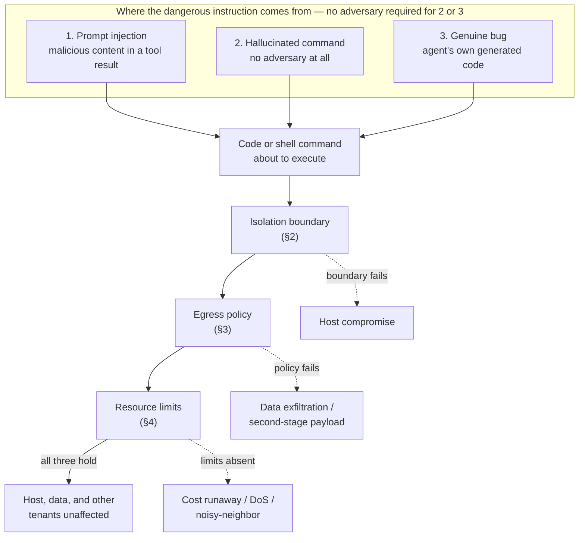

## Sandboxing

> Chapter of
> [[production-agent-systems/readme#02 — Reliability, Security & Governance|Reliability, Security & Governance]],
> part of [[production-agent-systems/readme|Production Agent Systems]].

## What you will understand at the end

- Why sandboxing is a **threat-model problem**, not a packaging choice — you design the boundary for
  the code that is malicious or broken, not the code that works as intended
- Why code-execution and shell-access tools sit in a risk class of their own among agent tools, and
  why a shell tool is often the more dangerous of the two even though it looks like "just running a
  command"
- The isolation technology spectrum (subprocess/seccomp, containers, gVisor, Firecracker microVMs,
  WASM) read through an **escape-surface** lens — what an attacker has to actually break, not just
  what the marketing diagram shows
- Why network egress is an independent control that a strong isolation boundary does not give you
  for free — and why an agent's sandboxed code phoning home is the exfiltration path most reviews
  miss
- Why resource limits belong in a security review, not just a capacity-planning one — an
  isolated-but-unbounded sandbox is still a denial-of-service and cost-runaway risk
- How GitHub Copilot's coding agent and GitHub Actions runner isolation instantiate this entire
  chapter as shipped product behavior, not theory

---

## The mental model

Every other control in this Part assumes the agent's _instructions_ might be adversarial and defends
the prompt. Sandboxing assumes something stronger and more uncomfortable: that the **action** the
agent is about to take — a snippet of generated code, a shell command — might be actively malicious
or simply wrong, and that you cannot tell which before it runs. You are not reviewing the command
for correctness. You are building a box that limits the damage regardless of whether the command was
correct, buggy, or hostile.

That framing matters because it changes what "done" looks like. A guardrail that catches 95% of bad
prompts is a good guardrail. A sandbox that contains 95% of bad executions is a **failed** sandbox —
the 5% is exactly the case the control exists for, and it is the case an adversary or a bad day will
find. Sandboxing is written for the tail, not the median.

Three distinct sources feed that tail, and none of them requires an adversary at the keyboard:

1. **Prompt injection** — a tool result (a fetched webpage, a file the agent read, an issue
   description) contains text engineered to make the agent emit a dangerous command. See
   [[02-prompt-injection|Prompt Injection]] for how that content gets into the loop in the first
   place; this chapter picks up once the dangerous instruction has already been generated.
2. **A hallucinated dangerous command** — no adversary anywhere. The model confidently generates
   `rm -rf` against the wrong path, a shell one-liner that pipes an untrusted URL into `bash`, or a
   SQL statement without a `WHERE` clause, because that is a plausible completion, not because
   anyone tricked it.
3. **A genuine bug** — the agent's own generated code has a real defect: an unbounded recursive
   loop, an off-by-one that walks outside the intended directory, a dependency it pulled in that
   turns out to be misbehaved.

All three land in the same place — code or a shell command about to execute — and the sandbox cannot
distinguish which one it is looking at. So it does not try. It applies the same containment to all
three, every time.

Read the diagram as three independent gates, not one. A sandbox that nails isolation but leaves
egress open is not "mostly safe" — it is exactly as exposed to exfiltration as no sandbox at all,
because exfiltration never needed to cross the isolation boundary in the first place. The rest of
this chapter is each gate in turn.

---

## 1. Why code-execution and shell-access tools get the strongest isolation of any tool category

[[08-code-execution|Code Execution]] (Part 04 of Agentic AI Engineering) makes the core argument in
detail: every other tool in an agent's toolset hands the LLM a narrow capability bounded by an API
you wrote — `search_web` cannot delete a file no matter what string the model constructs. Code
execution and shell access are different in kind, not degree, because the LLM is not calling a
function you wrote — it is authoring the function body, or the command line, itself. The tool schema
is narrow (`run_code(code: str)`, `run_shell(cmd: str)`); the capability behind it is a
general-purpose computer.

**Shell-access tools deserve their own line in this argument, not a footnote.** It is tempting to
treat a `run_shell` tool as a lighter-weight sibling of a code interpreter — "it just runs one
command, how bad can it be?" — but a shell command has direct access to everything already installed
on the host: package managers, `curl`/`wget`, `sudo` if the process has it, every other process's
`/proc` entry on Linux, and the full PATH of system binaries. A Python sandbox at least constrains
you to what the interpreter and its installed packages expose. A shell has no such built-in
narrowing — `bash -c "$LLM_GENERATED_STRING"` is, by default, exactly as capable as whatever user
account it runs as. **The most common sandboxing failure in production agent code is not a broken
container — it is a shell tool that was never containerized at all**, because it "looked like" a
simple command-runner rather than the same Turing-complete capability grant that Part 04 of Agentic
AI Engineering already argued code execution is.

The practical consequence: treat `run_shell` and `run_code` as the same risk tier and give them the
same isolation review. Don't let a tool's small schema (`{command: string}`) talk you into a smaller
threat model than the one its runtime capability actually has.

---

## 2. The isolation boundary, through an escape-surface lens

Part 04 of Agentic AI Engineering catalogs the four-plus-one isolation options (subprocess+seccomp,
containers, gVisor, Firecracker microVMs, WASM) by what they share with the host and their
cold-start latency — the practitioner's "which do I pick" table. This chapter asks the adjacent
security-review question: **what specifically does an attacker have to break to get out**, and how
much has to go wrong before that break becomes a host compromise rather than a contained failure.

| Mechanism                            | What an attacker must break to escape                                                                     | Historical escape class                                                                                                                            | Isolation strength (assume-breach posture)                                                              | Startup latency                |
| ------------------------------------ | --------------------------------------------------------------------------------------------------------- | -------------------------------------------------------------------------------------------------------------------------------------------------- | ------------------------------------------------------------------------------------------------------- | ------------------------------ |
| Subprocess + seccomp/AppArmor        | The syscall filter itself — one un-denied syscall is a direct path to the real kernel                     | Seccomp policy gaps, filter bypass via an allowed-but-dangerous syscall combination                                                                | Lowest — same kernel, same process tree, no real second layer                                           | Near-zero (~ms)                |
| Container per-run (Docker/OCI)       | Kernel namespace/cgroup isolation — a shared kernel is a single attack surface for every tenant           | Container-escape CVEs (`runc`, kernel privilege-escalation bugs reachable from a container) recur on a roughly annual cadence across the ecosystem | Moderate — real isolation, but the kernel is the one thing every tenant still shares                    | Low (~100s of ms to seconds)   |
| gVisor (userspace kernel)            | The userspace-kernel's own syscall emulation — narrower and more auditable than the real kernel           | Bugs in the sandboxed kernel's syscall emulation itself, not the host kernel                                                                       | Low — real kernel sees a deliberately narrowed subset of syscalls                                       | Low–moderate (slower syscalls) |
| Firecracker microVM                  | The hypervisor / virtual device boundary — an entirely different exploitation class than a syscall filter | Hypervisor-level bugs (rare, high-severity when they occur — VM-escape research, not routine CVEs)                                                 | Lowest realistic escape risk for general-purpose code — full hardware-virtualized boundary              | Moderate (~100ms boot)         |
| WASM sandbox (Wasmtime, V8 isolates) | Whatever host functions you explicitly exposed — there are no ambient syscalls to escape through at all   | Almost entirely shifts to "did you expose a dangerous host function," not a runtime escape                                                         | Very low for memory safety; risk is entirely in what capabilities you grant, not what the sandbox leaks | Fastest (~single-digit ms)     |

**The reframe that matters at Staff level:** for subprocess and container isolation, "escape" means
finding a flaw in a mechanism designed to filter or namespace a _shared_ kernel — the attack surface
is the entire syscall interface, audited or not. For Firecracker, escape means breaking a hardware
virtualization boundary, a categorically harder problem with a much smaller and better-studied
attack surface. For WASM, there is no ambient escape path at all — the entire security question
collapses into "what host functions did you grant," which is a much smaller, much more reviewable
surface than "is this kernel's syscall filter airtight." That's why a public-facing "run untrusted
code" product reaches for Firecracker or WASM rather than a bare container: the escape surface, not
the cold-start number, is the design-driving variable once the code you're running is genuinely
untrusted rather than merely unreviewed.

None of this makes container-per-run wrong as a default — Part 04 of Agentic AI Engineering is right
that it composes best with existing CI/CD and registry tooling, and for an internal agent generating
code for one authenticated user, the container-escape risk is real but small. The point of the table
above is to make that risk legible enough to state in a design review, not to argue everyone should
jump to microVMs.

---

## 3. Egress restrictions: the exfiltration path an otherwise-contained sandbox doesn't close

This is the control most likely to be missing even when the isolation boundary above is done well —
because it doesn't show up in the "which sandbox tech did we pick" conversation at all.

**A perfectly contained sandbox with open network egress has not contained anything that matters for
data theft.** Firecracker's hardware-virtualized boundary stops the sandboxed process from reading
your host's disk or hijacking your host's kernel. It does nothing to stop the sandboxed process from
reading whatever data _it was legitimately given for the task_ — the CSV it was asked to analyze,
the repository it was asked to refactor, any credential present in its own environment — and sending
that data to an attacker-controlled endpoint over the network the isolation boundary happily routes
through. The isolation boundary answers "can it touch my host." Egress policy answers "can it leave
with what it can already see." These are different questions, and a strong answer to the first tells
you nothing about the second.

**Worked reasoning — the failure chain egress policy exists for.** An agent has a shell tool for
running CI checks against a pull request. A prompt-injected instruction, buried in a code comment or
an issue description the agent read as context, tells it to run a one-liner that fetches and
executes a remote script. Assume the isolation boundary is a well-configured container — it holds;
the host is never touched. If egress is open by default (the common state, because network policy is
rarely the thing a container image's Dockerfile enforces), the fetched script now runs with:

1. Read access to anything mounted into the sandbox — the checked-out repository, any build
   artifacts, any credential present in the process environment for the CI job to function
2. An outbound network path to send that data anywhere
3. No requirement to ever return control to the agent loop cleanly — it can exfiltrate and exit, or
   persist and wait

The sandbox, by the narrow definition of "did the host get compromised," worked. The mission — don't
let this task's blast radius include data leaving the environment — still failed, because egress was
never independently locked down. This is precisely the least-privilege argument from
[[06-authorization-and-permissions|Authorization & Permissions]] applied to network reachability
instead of API scopes: default deny, enumerate exceptions, and treat "whatever the container runtime
ships with" as the wrong answer, the same way you would treat an IAM role with `*:*`.

**What deny-by-default egress actually requires, layered:**

| Layer                                   | What it stops                                                                                                                                   | Where it lives                                                                       |
| --------------------------------------- | ----------------------------------------------------------------------------------------------------------------------------------------------- | ------------------------------------------------------------------------------------ |
| Network namespace with no default route | Any outbound connection at all, until explicitly attached to a network                                                                          | Container runtime / microVM network configuration                                    |
| Destination allow-list                  | Connections to anything other than the specific hosts the task needs (a package registry, a specific internal API)                              | Egress proxy or firewall rule evaluated per-destination                              |
| DNS filtering                           | DNS-based exfiltration and tunneling — data smuggled out inside DNS queries themselves, which a naive IP allow-list doesn't catch               | A filtering resolver the sandbox is forced to use, not the host's default resolver   |
| No SSRF path to internal services       | The sandbox reaching internal-only endpoints (metadata services, internal admin APIs) that were never meant to be reachable from untrusted code | Network policy scoped to exclude the private address ranges the platform itself uses |

The DNS row is the one teams most often miss: an IP-level allow-list that still permits arbitrary
DNS resolution leaves a data-exfiltration channel open (encode stolen data as subdomain labels,
resolve them against an attacker-controlled nameserver) even though every HTTP/TCP connection is
correctly blocked. If a sandbox needs _any_ network access, the filtering has to sit above the raw
socket/IP layer, not just at it.

---

## 4. Resource limits as isolation-in-depth, not just performance hygiene

Part 04 of Agentic AI Engineering catalogs the specific mechanism for each resource limit — cgroups
for CPU/memory/pids, orchestrator-enforced wall-clock deadlines, size-capped ephemeral filesystems —
in enough detail that this chapter won't re-derive it. What belongs here is the framing: **a sandbox
with a perfect isolation boundary and locked-down egress, but no resource limits, is still a live
security and availability risk** — just a different one than escape or exfiltration.

Two failure modes fall entirely inside an otherwise-flawless sandbox:

- **Cost runaway.** A sandboxed process that can never leave and can never touch the host can still
  spin every CPU core it's given for as long as it's allowed to run. Crypto-mining payloads don't
  need an escape or an exfiltration path — CPU cycles are the entire payoff, and a sandbox with no
  CPU quota or wall-clock deadline hands that over for free. This is a genuine security incident (an
  attacker monetizing access you gave them) that never crosses the isolation boundary at all.
- **Denial-of-service against shared infrastructure.** If the execution service is multi-tenant —
  the common production shape — an unbounded sandbox is a noisy-neighbor problem even with zero
  malicious intent. One hallucinated infinite loop or fork bomb (see the mental model's "genuine
  bug" source) can starve every other tenant's sandbox on the same node, which is an availability
  incident with the same operator impact as a deliberate DoS.

Both of these are **contained by definition** under the isolation boundary — the code never got
anywhere near the host kernel or another tenant's filesystem — and are still incidents. That is the
argument for putting resource limits in a security review rather than leaving them to a performance
or capacity-planning pass: the isolation boundary was never the control these two failure modes
needed. CPU quota, memory limits, wall-clock timeouts, disk/tmpfs caps, and process/fork limits are
what stops them, and — same rule as egress — every one of those limits has to be enforced from
_outside_ the sandboxed process. A `timeout` the LLM was asked to put inside its own generated
script is not a resource limit; it's a request the untrusted code is free to ignore.

---

## Worked example: GitHub Copilot's coding agent and GitHub Actions runner isolation

### GitHub Copilot in practice

GitHub's own documentation describes Copilot's coding agent as running each assigned task inside an
**ephemeral, isolated development environment** — a fresh, container-based session provisioned per
task rather than a long-lived shared sandbox that accumulates state or risk across unrelated work.
Mapped onto this chapter's three gates:

- **Isolation boundary (§2)** — a new environment per task, scoped to one repository and one working
  branch, torn down when the task ends. There is no persistent state for a later task (or a later
  attacker) to inherit.
- **Egress (§3)** — the environment supports an explicit allow-list of network destinations (the
  package registries and services a given build actually needs) rather than defaulting to open
  internet access — the same deny-by-default posture argued for in §3, configured per repository
  rather than left to whatever the base image ships with.
- **Credential scope** — the agent operates with repository-scoped access for that task rather than
  a standing credential with broader account permissions, which is the resource-limit argument's
  security cousin: even a fully successful compromise of one task's sandbox has a bounded blast
  radius on the credential side, not just the compute side.
- **The human gate** — generated and _executed_ code lands as commits on a branch and a draft pull
  request, never a direct push to a protected branch. Every effect of the sandbox's execution is
  reviewable as a diff before it becomes permanent — the approval-gate pattern from
  [[08-human-approval-systems|Human Approval Systems]] applied to the single highest-risk tool
  category in this book.

### GitHub Actions runner isolation as the CI-triggered analog

The same shape generalizes to any agent triggered by a GitHub Actions workflow rather than assigned
an issue directly — a bot that reacts to a label, a comment, or a scheduled job. Two behaviors here
are well-documented GitHub Actions defaults worth naming explicitly because they map onto this
chapter's controls without any extra engineering:

- **Fresh runner per job.** GitHub-hosted runners are ephemeral — each job gets a new instance, used
  once and discarded. This is the isolation-boundary argument (§2) for free at the CI layer: no
  cross-job state to leak or escape into.
- **Scoped, non-default-broad credentials.** The `GITHUB_TOKEN` a workflow receives is scoped by the
  `permissions:` block in the workflow file (least-privilege by explicit declaration, not by
  accident), and — critically for agent-triggered-by-fork scenarios — workflows triggered by a
  `pull_request` from a fork do not receive repository secrets by default. That is a documented,
  built-in egress/credential control (§3's argument, again) that stops the most common CI-triggered
  attack shape: an external contributor's PR content driving a workflow into exfiltrating secrets it
  was never granted in the first place.

**Flagging the generalization:** the exact virtualization technology underlying GitHub-hosted
runners and the precise configuration surface of Copilot's egress allow-list are not something this
chapter asserts firmly — treat "fresh VM/container per job" and "configurable egress allow-list" as
the load-bearing, documented claims, and treat any specific hypervisor or CVE-level detail beyond
that as outside what's verified here. The pattern — ephemeral environment, scoped credentials,
default-deny egress, human review before permanence — is the transferable lesson regardless of the
underlying implementation, and it is the same pattern §2–§4 argue for from first principles.

---

## 5. Putting it together — a threat-model checklist

Before shipping a code-execution or shell-access tool, the sandboxing review should answer each of
these independently — a "yes" on isolation does not imply a "yes" on the rest:

- **Threat model stated explicitly:** does the design doc name all three sources from the mental
  model (prompt injection, hallucinated command, genuine bug), or does it only defend against the
  one the team happened to be worried about?
- **Shell tools reviewed at the same tier as code-execution tools:** has `run_shell` been given the
  same isolation review as `run_code`, or did its smaller schema talk the review into a smaller
  threat model?
- **Escape surface named, not assumed:** for the chosen isolation mechanism, can you state in one
  sentence what an attacker has to break — and does that match the trust level of who supplies the
  code (§2)?
- **Egress default is deny, with an enumerated allow-list** — not "whatever the container runtime
  ships with" — and does the filtering sit above the raw IP layer so DNS-based exfiltration is
  covered too (§3)?
- **Every resource limit (CPU, memory, wall-clock, disk, process count) is enforced from outside the
  sandboxed process**, with numbers someone chose on purpose, framed as a security control and not
  only a cost control (§4)?
- **Credential exposure inside the sandbox is minimized to exactly what the task needs**, cross-
  checked against [[07-secrets-management|Secrets Management]] rather than inherited from whatever
  environment the orchestrator happened to run in?
- **A human gate exists before the sandbox's effects become permanent** for anything beyond a
  read-only, throwaway run — mirroring the draft-PR pattern in the Copilot worked example above?

---

## Concept check

| Question                                                                                                             | Answer hint                                                                                                                                              |
| -------------------------------------------------------------------------------------------------------------------- | -------------------------------------------------------------------------------------------------------------------------------------------------------- |
| Why does a sandbox that contains 95% of bad executions count as failed?                                              | The remaining 5% is exactly the tail case sandboxing exists for — the median case was never the risk.                                                    |
| Why can a shell-access tool be more dangerous than a code-interpreter tool with the same schema?                     | A shell has unmediated access to every installed binary, `sudo` if granted, and the full PATH — no interpreter layer narrows it by default.              |
| What does "escape surface" mean for Firecracker versus a bare container?                                             | Firecracker requires breaking a hardware-virtualization/hypervisor boundary; a container requires exploiting the one kernel every tenant already shares. |
| Why is open network egress a problem even inside a hardware-virtualized microVM?                                     | Isolation stops host compromise; it does nothing to stop the sandbox from sending data it can legitimately see to an attacker's endpoint.                |
| Why can an IP-level egress allow-list still leak data?                                                               | DNS resolution can smuggle data as subdomain labels unless filtering sits above the raw IP/socket layer.                                                 |
| Why do resource limits belong in a security review, not just a performance one?                                      | Cost runaway (crypto-mining) and noisy-neighbor DoS both happen entirely inside a correctly isolated, correctly egress-locked sandbox.                   |
| What two things does the GitHub Actions default of withholding secrets from fork-triggered PR workflows demonstrate? | A built-in, documented instance of default-deny credential scoping tied to trust level of the triggering content.                                        |

---

## Vocabulary glossary

| Term                               | Definition                                                                                                                |
| ---------------------------------- | ------------------------------------------------------------------------------------------------------------------------- |
| Threat model                       | The explicit statement of what an attacker or failure source might do, used to drive control design rather than intuition |
| Blast radius                       | The maximum scope of damage possible if a given control fails                                                             |
| Escape surface                     | The specific mechanism an attacker must break to leave an isolation boundary                                              |
| Assume-breach posture              | Designing controls on the premise that one layer will eventually fail, so no single control is load-bearing alone         |
| Deny-by-default egress             | A network policy where no outbound connection is permitted unless explicitly allow-listed                                 |
| DNS exfiltration                   | Smuggling data out of a network by encoding it in DNS queries, bypassing IP-level allow-lists that don't filter DNS       |
| SSRF (server-side request forgery) | A sandboxed process reaching an internal-only service it was never meant to have network access to                        |
| Noisy-neighbor DoS                 | One tenant's unbounded resource use degrading or denying service to other tenants sharing the same infrastructure         |
| Ephemeral environment              | A sandbox or runner provisioned fresh per task/job and destroyed afterward, with no persistent state across runs          |
| Scoped credential                  | A credential limited to exactly the permissions and resources one task needs, rather than a standing broad-access secret  |

## Metadata

|        |                          |
| ------ | ------------------------ |
| Author | Amit Singh               |
| Scope  | production-agent-systems |
