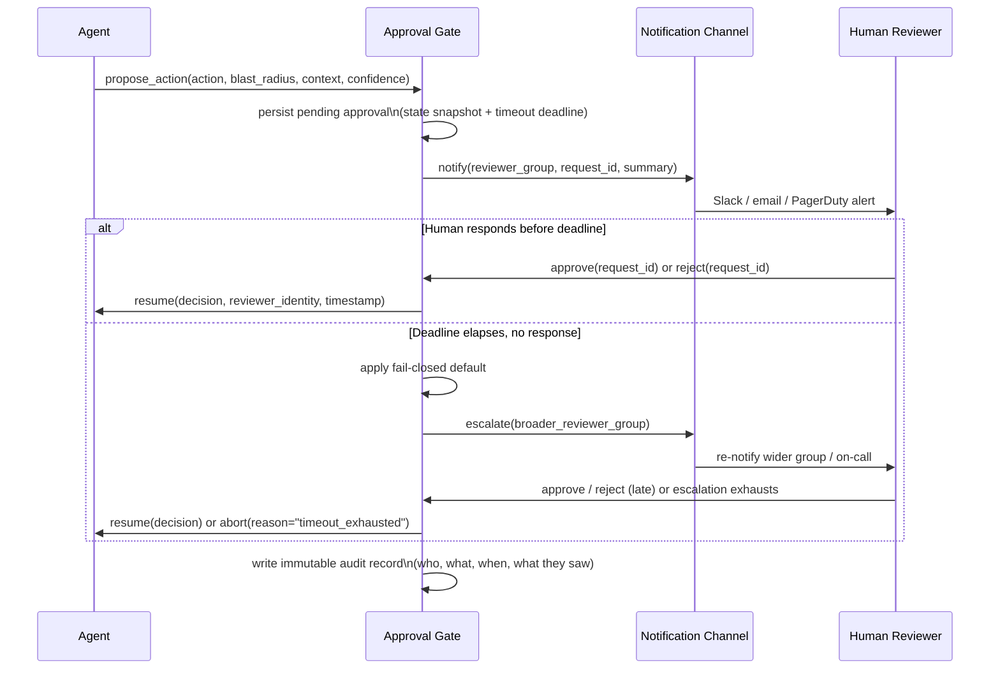

## Human Approval Systems

> Chapter of
> [[production-agent-systems/readme#02 — Reliability, Security & Governance|Reliability, Security & Governance]],
> part of [[production-agent-systems/readme|Production Agent Systems]].

## What you will understand at the end

- What a "request approval" call must convey to a human reviewer to produce a fast, _correct_
  decision — not the degenerate case of a bare "approve this?" prompt
- Why synchronous blocking approval and asynchronous queued approval are different architectures
  with different throughput and failure properties, not two skins on the same mechanism
- Why silent, indefinite blocking on a missing human response is itself a production failure mode —
  and what a fail-closed default with escalation actually looks like in practice
- What makes an audit trail meaningful six months later, versus a decorative "approved ✓" checkbox
  nobody could reconstruct the reasoning behind
- The central tension this chapter keeps returning to: gates that catch genuinely risky actions
  without training reviewers to rubber-stamp everything that reaches them — approval fatigue is a
  real, well-documented failure mode, not a hypothetical one
- How GitHub's required-reviewer, branch-protection, and environment-protection model implements
  this pattern concretely for agent-authored changes, and how it composes with an agent's autonomy
  level

---

## The mental model

An approval gate is not a UI widget bolted onto an agent's action — it is a **synchronization point
between two independent clocks**: the agent's execution loop, which wants to keep moving, and a
human's attention, which is a scarce, unscheduled resource. Every design decision in this chapter is
really a decision about what happens while those two clocks are out of sync.



**Reading the diagram:** the agent does not poll or busy-wait — it hands off a fully-specified
proposal and a deadline, and the gate owns the waiting. Two branches leave the gate: a human decides
in time, or the deadline elapses and the gate's own policy (fail-closed, then escalate) takes over.
Both branches converge on the same final step — an immutable audit record is written regardless of
which path produced the decision. That convergence is deliberate: an audit trail that only captures
the happy path (human approved) is missing exactly the incidents you'll need it for later — the
timeouts, the escalations, and the fail-closed aborts.

---

## 1. The approval UI/API contract — what a reviewer actually needs

The naive version of a "request approval" call is a boolean prompt: _"Agent wants to run
`terraform apply`. Approve?"_ This fails for a specific, mechanical reason: it gives the reviewer
nothing to reason with. Faced with that prompt, a reviewer has exactly two options — stop and go dig
up the context themselves (which erases the latency the automation was supposed to buy), or click
approve on trust (which erases the safety the gate was supposed to add). Neither is what the gate
was built for.

A contract that actually supports a fast, correct decision has to convey the same things a good
incident handoff conveys — not "something happened, is it OK," but the specific facts a reviewer
needs to reason about consequence:

| Field                       | What it answers                                                           | Why a bare "approve this?" omits it and what breaks without it                                   |
| --------------------------- | ------------------------------------------------------------------------- | ------------------------------------------------------------------------------------------------ |
| `action`                    | Exactly what will execute — the literal command, diff, query, or API call | Without it the reviewer is approving a description, not the actual payload                       |
| `blast_radius`              | What/who is affected, and whether the action is reversible                | Without it, a one-line log delete and a production data-loss event look identical                |
| `context`                   | Why the agent believes this is the right action — its reasoning trace     | Without it, the reviewer can't tell a well-grounded proposal from a hallucinated one             |
| `confidence` / `risk_score` | How certain the agent itself is, if the runtime tracks this               | Without it, a low-confidence guess and a high-confidence, well-evidenced plan get equal scrutiny |
| `alternatives_considered`   | What else the agent could have done instead, and why it didn't            | Without it, the reviewer can't tell if this is the least-risky path to the goal                  |
| `requester_identity`        | Which agent, which version/prompt revision, which session                 | Without it, a regression in agent behavior across versions is invisible in the approval log      |
| `expires_at`                | The deadline before timeout/escalation policy kicks in                    | Without it, the reviewer has no signal for how urgently to respond                               |
| `prior_decisions`           | Links to past approvals for structurally similar requests                 | Without it, every request is judged in isolation — no pattern recognition across time            |

A minimal contract in practice looks closer to this than to a yes/no prompt:

```json
{
  "request_id": "appr_9f3a1c",
  "agent": { "name": "deploy-agent", "version": "2026.08.03-1", "session_id": "sess_771" },
  "action": {
    "type": "database_migration",
    "summary": "Add NOT NULL column `tenant_id` to `orders`, backfilled from `accounts.tenant_id`",
    "payload_ref": "s3://migrations/2026-08-08/0142_orders_tenant_id.sql",
    "reversible": false
  },
  "blast_radius": {
    "scope": "production",
    "affected_tables": ["orders"],
    "estimated_rows": 48000000,
    "downstream_services": ["billing", "reporting"]
  },
  "context": "Requested by issue #1187. Column is required before the tenant-isolation rollout in #1190. Backfill tested against a prod snapshot in staging; ran in 4m12s.",
  "confidence": 0.81,
  "alternatives_considered": ["Nullable column + app-level enforcement — rejected: doesn't satisfy the audit requirement in #1190"],
  "expires_at": "2026-08-08T14:30:00Z",
  "escalation_policy": "db-oncall-tier1"
}
```

Notice what this buys the reviewer: they can approve or reject in the time it takes to read one
paragraph, because the payload, the blast radius, and the reasoning are all sitting in front of them
— not scattered across a Slack thread, a Jira ticket, and a terminal they'd have to open themselves.
**The contract's job is to make the fast decision also the correct one.** That framing matters later
in this chapter, when we come back to approval fatigue: a well-designed contract is itself the
primary lever against fatigue, not a separate control bolted on top of it.

---

## 2. Synchronous blocking approval vs. asynchronous queued approval

Once the contract is defined, the next design decision is architectural: does the agent's execution
literally pause and wait for the decision, or does it checkpoint and hand the decision off to a
separate resume path? These are not interchangeable implementation details — they have materially
different throughput and failure characteristics.

| Dimension                         | Synchronous blocking approval                                                                                                            | Asynchronous queued approval                                                                                                                                                                                                                                                 |
| --------------------------------- | ---------------------------------------------------------------------------------------------------------------------------------------- | ---------------------------------------------------------------------------------------------------------------------------------------------------------------------------------------------------------------------------------------------------------------------------- | ------------------------------------------------------- |
| Agent behavior while waiting      | The executing process/thread blocks; the agent run stays "in-flight" for the entire wait                                                 | The agent checkpoints its state and exits; a separate resume path re-enters when a decision lands                                                                                                                                                                            |
| Impact on agent throughput        | Every blocked run occupies a worker slot until decided — a queue of high-risk actions can starve the whole agent pool                    | Agent capacity is fully decoupled from approval latency; the pool keeps processing other work                                                                                                                                                                                |
| Impact on reviewer behavior       | Immediate push, implicit pressure — something is visibly waiting on the reviewer right now                                               | Batched into a review queue the reviewer works through on their own cadence, unless SLA-driven                                                                                                                                                                               |
| Failure mode if the human is slow | The blocked run (and often the underlying request/session that triggered it) ties up resources the entire time                           | No resource cost while pending, but an unescalated item can silently age out of relevance                                                                                                                                                                                    |
| State management complexity       | Low — the running process itself is the state holder; resume is "just keep executing"                                                    | Higher — requires durable state persistence and an explicit resume mechanism (this is exactly what the PR-as-checkpoint pattern in [[agentic-ai-engineering/04-tools-and-environment-interaction/13-agents-in-ci-cd-and-sdlc-workflows/13-agents-in-ci-cd-and-sdlc-workflows | Agents in CI/CD & SDLC Workflows]] uses under the hood) |
| Best fit                          | Low-volume, high-stakes, latency-sensitive single actions — an interactive coding agent pausing before a destructive command mid-session | High-volume approval-gated pipelines — PR merges, batched deployments — where reviewer throughput, not agent throughput, is the actual constraint                                                                                                                            |

The practical takeaway: **synchronous approval trades agent throughput for simplicity; async queued
approval trades implementation complexity for agent throughput.** Most production agent-authored-PR
pipelines land on async by necessity — an agent blocking on every PR review would mean your agent
fleet's capacity is bounded by your reviewers' calendars, which is precisely the coupling a coding
agent was supposed to remove. A single interactive session pausing on one destructive confirmation,
by contrast, is exactly where synchronous blocking is the right and simpler choice — there's one
agent, one human, and no fleet-throughput concern to protect.

---

## 3. Timeout and escalation behavior

A pending approval with no deadline is not a safety control — it is an unbounded wait that happens
to look like one. This is the same failure shape as a paging alert with no escalation policy: it
fires once, nobody happens to see it, and the incident festers in a state nobody is actively
watching. "Wait forever for a human" is not a policy; it's the absence of one, and it fails silently
in both directions — a blocked agent run burns resources indefinitely, or a queued item ages out of
anyone's attention and the underlying task simply never completes.

Three decisions have to be made explicitly, in advance, for every approval gate:

**1. What happens at the deadline — the default must be fail-closed.** If no human has decided by
`expires_at`, the default outcome is _reject / abort_, never _silently proceed as if approved_. A
gate that times out into approval defeats its own purpose: the one moment the gate exists to protect
against — nobody having actually reviewed the action — is exactly the moment it lets the action
through. Fail-closed preserves the safety property even when the human side of the system degrades.

**2. Who gets escalated to, and on what SLA.** A single non-responsive reviewer group should
broaden, not just re-notify the same people harder. A representative escalation ladder:

| Tier | Reviewer group                                    | SLA before escalating | Action if SLA breached                                   |
| ---- | ------------------------------------------------- | --------------------- | -------------------------------------------------------- |
| T0   | Primary approver (e.g. requesting team's on-call) | 15 minutes            | Escalate to T1                                           |
| T1   | Broader team (e.g. full owning team channel)      | 1 hour                | Escalate to T2                                           |
| T2   | On-call manager / secondary on-call rotation      | 4 hours               | Apply fail-closed default; open an incident/audit entry  |
| —    | Fail-closed abort                                 | (terminal)            | Agent action is rejected; requester notified with reason |

**3. Whether a defined safe fallback exists, distinct from a hard abort.** Fail-closed doesn't
always have to mean "do nothing" — for some action classes there's a genuinely safer fallback than
either proceeding or aborting outright: roll back to the last known-good state instead of applying a
pending change, or downgrade to a narrower, lower-blast-radius variant of the same action (e.g.
"stage the migration but don't run it" instead of "run the migration"). Where such a fallback
exists, encode it explicitly in the escalation policy rather than leaving the terminal state as a
bare abort — an explicit, reasoned fallback is auditable and intentional; a bare timeout-to-abort
that happens to coincide with a safe outcome is not the same thing, even if the immediate result
looks identical.

The design principle underneath all three: **the agent should never be the thing deciding how long
"too long" is.** Timeout and escalation policy is organizational risk tolerance encoded as
configuration, set by the humans accountable for the outcome — not a parameter the agent tunes based
on its own read of urgency.

---

## 4. Audit-trail requirements

An approval only means something after the fact if it's reconstructable. "Approved ✓" as a boolean
column on the action's own row is not an audit trail — it's a checkbox that happens to be true. The
question an audit trail actually has to answer, months later, during an incident review or a
compliance audit, is not just _was this approved_ but _who approved exactly what, when, and with
what information in front of them at that moment_ — because the UI, the underlying system state, and
even the action's own description can all have changed since.

| Field                     | Why it has to be captured, specifically                                                                                                                               |
| ------------------------- | --------------------------------------------------------------------------------------------------------------------------------------------------------------------- |
| `requested_at`            | When the agent proposed the action — start of the clock the SLA/escalation policy runs against                                                                        |
| `notified_at`             | When the human was actually alerted — distinguishes "gate was slow" from "human was slow"                                                                             |
| `decided_at`              | When the decision was made — the interval to `requested_at` is your real approval-latency SLI                                                                         |
| `executed_at`             | When the action actually ran — may differ from `decided_at` if execution is itself queued                                                                             |
| `payload_snapshot` / hash | An immutable copy (or content hash) of exactly what was shown to the reviewer — proves what was approved, immune to the action's description changing later           |
| `approver_identity`       | The specific human (not "the on-call team") — required for accountability and for detecting rubber-stamp patterns per reviewer                                        |
| `approval_channel`        | Slack, CLI, web UI, API — matters for reconstructing what the reviewer's actual view looked like                                                                      |
| `decision`                | approve / reject / timeout-default / escalated-then-approved / escalated-then-aborted                                                                                 |
| `escalation_path_taken`   | Which tiers actually fired — silence at T0/T1 escalating to a manager override is a different story than a clean T0 approval, even if the final decision is identical |
| `rationale` / comment     | Free-text reviewer justification, when captured — the difference between a reasoned approval and a fast click                                                         |
| `outcome_verified`        | Did execution actually match the approved payload? Closes the loop between "what was approved" and "what happened"                                                    |

The load-bearing field in that table is `payload_snapshot`. Without it, an audit trail degrades into
"someone approved something resembling this action" — which is worthless the moment the action's
live description, dashboard, or ticket has been edited since. Snapshotting (or hashing) exactly what
the reviewer saw at decision time is what turns "approved" from a vague assertion into a verifiable
claim. Append-only storage for the audit log follows from the same logic covered in
[[production-agent-systems/02-reliability-security-and-governance/10-ai-governance/10-ai-governance|AI Governance]]
and
[[production-agent-systems/02-reliability-security-and-governance/09-compliance/09-compliance|Compliance]]
— an audit record that can be edited after the fact isn't an audit record, it's a log with extra
steps.

---

## 5. The central tension: catching real risk without training reviewers to stop reading

Every approval gate design eventually runs into the same failure mode, and it's worth naming
directly: **approval fatigue**. If a reviewer sees ten approval requests a day and nine are
obviously fine, they learn — correctly, from a pure time-optimization standpoint — that reading
carefully rarely changes the outcome. By the time the tenth, genuinely risky request arrives, it
gets the same half-second glance and reflexive click as the other nine. The gate is still
technically "working" — every request still gets an "approval" — but it has stopped doing the one
thing it exists for. This is arguably worse than having no gate at all, because a system with no
gate at least doesn't manufacture false confidence that a human reviewed the risky change.

This is not a hypothetical concern the exam framing gestures at abstractly — it is the direct
tension between two things a Staff/Principal-level design has to hold simultaneously: **configure
human intervention without slowing delivery down**, and **make sure the intervention still catches
what it's supposed to catch**. Optimizing purely for either side breaks the other — gate everything
and delivery grinds to a halt while reviewers rubber-stamp out of exhaustion; gate nothing and
you've removed the safety net entirely.

The levers that actually resolve this tension, in order of leverage:

1. **Risk-tiering the gate scope itself.** Not every agent action warrants a human in the loop.
   Reserve approval gates for actions above an explicit blast-radius threshold — irreversible,
   production-scoped, or crossing a trust boundary — and let everything below that threshold run
   through automated guardrails instead (see
   [[production-agent-systems/02-reliability-security-and-governance/01-guardrails/01-guardrails|Guardrails]]).
   The single biggest cause of approval fatigue is gating things that never needed a human opinion
   in the first place — every one of those requests is pure noise competing for the same finite
   reviewer attention as the requests that actually matter.
2. **Consolidating related low-risk requests into one review** instead of firing N separate approval
   prompts for what is functionally one change. A reviewer evaluating one batched request with full
   context reads more carefully than one evaluating five near-identical fragments.
3. **Front-loading the contract with triage information (Section 1)**, so a reviewer can approve
   genuinely low-risk, well-evidenced requests in seconds and knows a request needs the slower,
   careful read precisely because the contract itself signals higher blast radius, lower confidence,
   or no clear precedent. The contract design is the fatigue mitigation — it isn't a separate
   concern from it.
4. **Tracking approval latency and rubber-stamp signal per reviewer and per gate**, the same way
   you'd track any other operational metric — a reviewer whose median decision time on high-risk
   requests is implausibly fast, or a gate whose approval rate is indistinguishable from 100%, is
   itself a signal the gate has stopped functioning as a control and needs to be re-scoped.

The failure mode to avoid on both ends is treating "more approval gates" as strictly safer. A gate
that nobody reads carefully anymore isn't a safety control — it's latency with a false sense of
security attached to it.

---

## GitHub Copilot in practice

GitHub's platform-native controls are a concrete, shipped implementation of everything above, and
worth walking through directly because they answer the exam-relevant question — "configure human
intervention without slowing delivery" — with a specific, composable mechanism rather than a
custom-built approval service.

**Required reviewers + branch protection is the approval gate, mechanically.** A branch protection
rule on `main` requiring N approving reviews (and, via `CODEOWNERS`, requiring specific
teams/individuals to approve changes to specific paths) _is_ the approval-gate contract from this
chapter, expressed as repository configuration instead of a custom API. The PR diff is the `action`
field; the changed files and their `CODEOWNERS` routing encode `blast_radius` (a change under
`payments/` requires the payments team, a change under `docs/` doesn't); the PR description and
linked issue supply `context`; required status checks (CI green) are the automated pre-condition
layered underneath the human one — exactly the guardrail-plus-approval composition from Section 5,
where automated checks absorb what doesn't need human judgment so the human review can focus on what
does.

**Environment protection rules are the higher-risk deployment gate, and a distinct gate from branch
protection.** GitHub Environments let a repository require reviewers (and an optional wait timer)
specifically for deployments targeting a named environment — e.g. a `production` environment
configured to require two approvers from a specific team before a deployment workflow is allowed to
proceed, independent of whatever approval already happened to merge the underlying PR. This matters
because merging to `main` and deploying to production are two different blast-radius events, and
treating them as one gate would either over-gate every merge (approval fatigue again) or under-gate
the actual production exposure. Modeling them as two separate, independently configurable approval
points is the risk-tiering principle from Section 5 applied directly to the SDLC.

**Composition with autonomy level.** This is where the pattern closes the loop with
[[agentic-ai-engineering/04-tools-and-environment-interaction/13-agents-in-ci-cd-and-sdlc-workflows/13-agents-in-ci-cd-and-sdlc-workflows|Agents in CI/CD & SDLC Workflows]]:
an agent may be granted full autonomy to plan a change, edit files, run tests, and open a PR — none
of that requires a human turn, because none of it is irreversible or visible outside the agent's own
branch. But required reviewers on branch protection still gate the merge, and environment protection
rules still gate the subsequent deployment if one is configured. Two independent human checkpoints
cover two independent irreversible transitions — code landing on a shared branch, and code running
against production — and neither depends on the agent's own confidence in its diff. This is
precisely the pattern this chapter argues for structurally: gate the transitions where blast radius
actually changes, not every step an agent takes to get there. Crucially, none of this is
special-cased for agent authorship — the same required-reviewer, `CODEOWNERS`, and
environment-protection rules apply identically whether the PR was opened by Copilot's coding agent
or a human contributor, which is exactly why the mechanism scales to agent-authored changes without
a team having to design a new review process from scratch.

**Where this section is generalizing rather than citing an exact documented mechanic.** The precise
configuration surface for required reviewers (minimum/maximum counts, whether dismissed reviews
reset approval, exact interaction with auto-merge settings) and environment-protection wait-timer
behavior vary by GitHub plan tier and change between releases. The durable, architecture-level
takeaway — branch protection as the merge gate, environment protection as the deploy gate, both
applied uniformly regardless of whether a human or an agent authored the change — is what should
transfer to any coding-agent platform; verify the exact current configuration options against
GitHub's own documentation before designing a specific rollout around them.

---

## Concept check

Before moving on, you should be able to answer these without notes:

| Question                                                                                                           | Answer hint                                                                                                                    |
| ------------------------------------------------------------------------------------------------------------------ | ------------------------------------------------------------------------------------------------------------------------------ |
| Why does a bare "approve this?" prompt fail as an approval contract?                                               | It gives the reviewer nothing to reason with — they either dig up context themselves or approve on blind trust.                |
| What's the throughput cost of synchronous blocking approval at scale?                                              | Every blocked run occupies a worker slot until decided — a backlog of approvals can starve the agent pool.                     |
| Why must the default at a missed deadline be fail-closed, not silent proceed?                                      | A gate that times out into approval defeats its purpose — it lets the action through at the exact moment nobody reviewed it.   |
| What's the single most load-bearing field in an audit record, and why?                                             | `payload_snapshot` — without an immutable copy of what was shown, "approved" isn't a verifiable claim later.                   |
| Why can more approval gates make a system less safe, not more?                                                     | Reviewers habituate to low-stakes requests and stop reading carefully — the genuinely risky one gets the same reflexive click. |
| In GitHub's model, what actually gates a deployment to a protected environment, separate from the PR merge itself? | Environment protection rules — a second, independent reviewer requirement scoped to the deployment, not the merge.             |

---

## Vocabulary glossary

| Term                          | Definition                                                                                                                        |
| ----------------------------- | --------------------------------------------------------------------------------------------------------------------------------- |
| Approval gate                 | A synchronization point where an agent's proposed action pauses for an explicit human decision before proceeding                  |
| Approval contract             | The structured payload (action, blast radius, context, confidence, alternatives) a gate presents to a reviewer                    |
| Synchronous blocking approval | The agent process itself waits for a decision; resume is implicit continuation of the same run                                    |
| Asynchronous queued approval  | The agent checkpoints and exits; a separate resume path re-enters once a decision lands                                           |
| Fail-closed default           | The policy that a missed approval deadline resolves to reject/abort, never silent approval                                        |
| Escalation ladder             | The sequence of progressively broader reviewer groups a pending approval moves through as SLAs are missed                         |
| Audit trail                   | An immutable record of who approved what, when, and with what information available to them at decision time                      |
| Payload snapshot              | An immutable copy or hash of exactly what a reviewer saw, proving what was approved independent of later edits                    |
| Approval fatigue              | The habituation failure where reviewers stop reading carefully after repeated low-stakes approval requests                        |
| Risk-tiering                  | Scoping approval gates to actions above a blast-radius threshold, routing everything below it to automated guardrails             |
| Environment protection rule   | A GitHub-native gate requiring reviewer approval for deployments to a specific named environment, separate from branch protection |
| Branch protection             | Platform-enforced merge requirements (required reviewers, required checks) applied uniformly regardless of PR author              |

## Metadata

|        |                          |
| ------ | ------------------------ |
| Author | Amit Singh               |
| Scope  | production-agent-systems |
