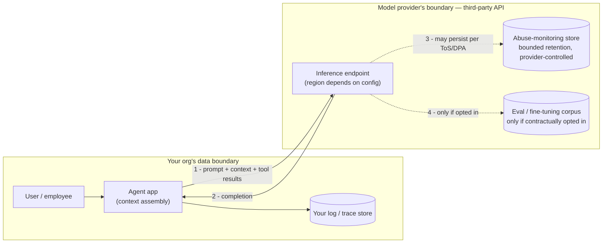

## Compliance

> Chapter of
> [[production-agent-systems/readme#02 — Reliability, Security & Governance|Reliability, Security & Governance]],
> part of [[production-agent-systems/readme|Production Agent Systems]].

## What you will understand at the end

- Why data residency is a genuinely new question for agent systems, not just a relabeled version of
  "where does the database live" — because the model call itself crosses a boundary your traditional
  data-flow diagram never had to draw
- Why "delete this user's data" is harder for an agent pipeline than for a normal application, once
  prompts and tool logs have been sampled into eval sets or fine-tuning corpora
- What a compliance review concretely asks for — specific artifacts, not an abstract "is this safe"
  verdict — and how to have each one ready before the audit starts
- How GitHub Copilot's organization-level audit log and enterprise data-handling controls serve as a
  worked example of the evidence base other agent platforms need to provide

---

## The mental model

Compliance work fails when it's treated as a policy document nobody operationalizes. It succeeds
when every question an auditor could ask maps to one artifact that already exists — a config, a log
export, a signed contract clause — that someone can produce in minutes, not weeks.

For agent systems specifically, the new wrinkle is that the trust boundary moved. A traditional
three-tier app keeps data inside infrastructure you control end to end. An agent calling a
third-party model API sends the constructed prompt — which may contain user PII, internal documents
pulled by RAG, or raw rows returned by a tool call — across that boundary on every single turn.

Two things this diagram is doing on purpose:

1. **Solid arrows are what you can prove happens on every call.** Dotted arrows are what you can
   only prove via a contract — the provider's data processing agreement (DPA) — because you have no
   technical visibility into their internal retention systems.
2. **"Your log store" is the one box you fully control.** Everything downstream of the inference
   endpoint is governed by paperwork, not code. That distinction is the whole chapter: compliance
   engineering is the discipline of turning as much of the dotted-line world as possible into
   solid-line, verifiable controls — and documenting the rest.

This chapter deliberately does not cover _who approves what agent gets built_ — that's
[[10-ai-governance|AI Governance]] — or _how an agent proves it's acting as a specific user_ —
that's [[05-identity-and-authentication|Identity & Authentication]]. This chapter is narrower: once
an agent is built and running, what data does it move, where does that data end up, and what
evidence proves it to an auditor.

---

## 1. Data residency for agent systems

Traditional data residency is a solved, boring problem: pin your database and compute to a region,
put it in a data-flow diagram, done. Agent systems break the assumption underneath that answer,
because the "database" is no longer the only place data lives — the **prompt itself is a data
export**, assembled fresh on every turn and shipped to wherever the model happens to run.

**What actually gets processed and stored, and where:**

| Artifact                                                  | Where it's assembled                              | Where it goes                                                                                      | Who controls retention there                                                        |
| --------------------------------------------------------- | ------------------------------------------------- | -------------------------------------------------------------------------------------------------- | ----------------------------------------------------------------------------------- |
| System prompt + user message                              | Your app, in-region                               | Model provider's inference endpoint                                                                | You (static content)                                                                |
| Retrieved context (RAG chunks)                            | Your app, pulled from your vector store           | Model provider's inference endpoint                                                                | You control the source; provider controls the copy in-flight                        |
| Tool call results (DB rows, file contents, API responses) | Your app, at tool-execution time                  | Fed back into the next model call                                                                  | Same as above — this is often the _most_ sensitive artifact, and the least reviewed |
| Model completion                                          | Provider's inference endpoint                     | Back to your app                                                                                   | You, once received                                                                  |
| Provider-side abuse/safety logging                        | Provider's infrastructure                         | Provider's store, bounded window (commonly ~30 days for API traffic, longer for consumer products) | Provider — governed by DPA, not your access controls                                |
| Eval / fine-tuning samples                                | Wherever you or the provider pipe sampled traffic | A training/eval corpus                                                                             | Whoever owns that pipeline — frequently under-governed                              |

Three things make this a genuinely new compliance question, not a re-skin of an old one:

- **The control point isn't the database, it's the prompt-assembly step.** The only place you have
  full authority over what leaves your boundary is the code that decides what goes into `messages`.
  If a tool result contains a customer's SSN and nothing strips it before the next model call, that
  SSN just crossed a jurisdiction boundary — even though your database itself never moved.
- **Region pinning for inference is a real but partial control.** Several providers offer
  region-scoped or in-region-processing deployment options (e.g., cloud-hosted model endpoints tied
  to a specific Azure/GCP/AWS region, or enterprise data-residency commitments from the model vendor
  directly). Using the provider's default global endpoint when your data-residency obligation says
  "stays in the EU" is a finding waiting to happen — verify and pin explicitly, don't assume.
- **Multi-agent and multi-hop calls multiply the mapping problem.** A supervisor agent in one region
  calling a specialist sub-agent that hits a differently-routed model deployment means your
  residency map is now a graph, not a single arrow. If you can't produce that graph on request, you
  don't actually know your residency posture — you're guessing.

**The artifact that answers "where does our data go" is not a sentence in a security
questionnaire.** It's a current data-flow diagram (the mermaid above, made specific to your system)
plus the subprocessor list and DPA that back up every dotted-line arrow in it. Build that diagram
once per architecture change, not once per audit.

---

## 2. Retention and deletion policy

Ask three separate questions, because they have three separate answers:

1. **How long do we keep it?**
2. **Where does "it" actually live, across every system it touched?**
3. **Can we delete it end to end when asked — not just from the system we remembered?**

**Three artifact classes, tracked separately** — treating "conversation data" as one blob is where
retention policies quietly become unenforceable:

| Artifact class  | Typical contents                                               | Common failure mode                                                                              |
| --------------- | -------------------------------------------------------------- | ------------------------------------------------------------------------------------------------ |
| Prompts (input) | User message, system prompt, RAG context                       | Logged verbatim for debugging, with no TTL, alongside PII that was never meant to be retained    |
| Tool call logs  | Raw tool inputs/outputs — DB rows, file contents, API payloads | Usually the _most_ sensitive and _least_ reviewed artifact; treated as "just infra logs"         |
| Outputs         | Final model response                                           | Assumed low-risk because it's "just text," but can echo back PII from the prompt or tool results |

**Why "can we delete it" is harder than it sounds:**

A normal application's deletion story is: find the row by user ID, delete it, confirm cascade
deletes fired. An agent pipeline's deletion story has to answer for every downstream copy:

- The primary log/trace store (the one place you fully control — should be the easy case)
- The observability backend, if traces were exported separately (spans containing prompt content
  living in a different retention regime than the app's own logs)
- Any **eval dataset** that sampled this conversation for regression testing — once a trace is
  promoted into a golden set, "delete the source" doesn't touch the copy that's now checked into an
  eval repo or a labeling tool
- Any **fine-tuning corpus** built from production traffic — this is the sharpest edge case, because
  a model that was fine-tuned on data containing a since-deleted user's PII can't have that
  influence surgically "un-trained" out of it; the practical mitigation is scrubbing PII _before_
  promotion to a training set, not after
- The model provider's own bounded-retention copy (their abuse-monitoring log) — outside your
  deletion authority entirely; you can only contractually require deletion, and the DPA is your only
  evidence that you did

This is the same right-to-erasure problem GDPR and CCPA already forced onto analytics pipelines, but
agent systems make the blast radius wider: every turn can spawn a log line, a trace span, an eval
sample, and a fine-tuning candidate, and each of those four has a different owner and a different
default retention window.

**What a defensible policy actually states, per artifact class:**

- An explicit operational TTL (e.g., prompts and tool logs: 30–90 days at full fidelity, then
  aggregated or dropped)
- A promotion gate before anything moves from "operational log" to "durable eval/training asset" —
  PII scrubbing happens _at promotion time_, not as a cleanup pass afterward
- A deletion runbook that fans out to every store in the list above, with an owner and an expected
  completion time for each fan-out target — not a single `DELETE FROM logs WHERE user_id = ?`
- A DPA clause with the model provider stating their retention window and their deletion commitment
  on request, cited by section number — "trust me" is not evidence a compliance review accepts

See
[[production-agent-systems/01-observability/04-prompt-observability/04-prompt-observability|Prompt Observability]]
for the redaction-at-capture mechanics that make the promotion gate above enforceable rather than
aspirational.

---

## 3. What a compliance review actually asks for

The unhelpful mental model is "prove the agent is safe." Nobody can answer that in the abstract, and
treating it as the question is how compliance prep turns into a philosophical debate the week before
an audit. The useful mental model: **a compliance review is a fixed list of specific, boring,
artifact-based questions.** Your job is to have each artifact sitting ready, not to argue the agent
is trustworthy in general.

The recurring shape of these questions:

- **Access** — who, and what service accounts, can read prompts and logs that contain PII? Answered
  by IAM role bindings and an access-review log, not a policy paragraph.
- **Logging** — what's captured on every agent turn (prompt, tool calls, tool results, final
  answer), and what's redacted before it's written anywhere durable? Answered by the logging schema
  / redaction config itself, with a sample redacted-vs-raw log pair as evidence.
- **PII handling in the request/response path** — is there a scanning or redaction layer between
  "data enters the agent's context" and "data leaves as a prompt to the model," and between "tool
  result comes back" and "tool result gets logged"? Answered by pointing at the actual pipeline
  stage, not by asserting it exists.
- **Incident response** — if an agent's response leaked PII, or a manipulated agent executed a
  destructive tool call, is there a defined severity/escalation path and has it been exercised?
  Answered by an IR runbook plus a record of the last tabletop or real incident that used it.
- **Vendor / subprocessor mapping** — which third-party model APIs are subprocessors for this
  system, are they on the approved vendor list, and what does their DPA actually commit to on data
  use and retention? Answered by the subprocessor list and the DPA itself, not a verbal assurance
  that "we checked, it's fine."
- **Audit trail** — for any agent action with real-world effect (a tool call that wrote data, sent
  an email, merged code), can you show what happened, what/who triggered it, and when? Answered by
  an exportable, tamper-evident audit log — the GitHub Copilot example below is a concrete instance
  of this requirement being met at platform scale.

### Compliance evidence checklist

The table below is the artifact translation layer — the thing an engineering team can actually
produce, mapped to the question a reviewer is really asking.

| What the auditor asks                                                                   | The artifact that answers it                                                                 | Where it comes from                                                                |
| --------------------------------------------------------------------------------------- | -------------------------------------------------------------------------------------------- | ---------------------------------------------------------------------------------- | ---------------------------- |
| Where is agent-processed data stored and processed, geographically?                     | Data-flow diagram + subprocessor list + DPA residency clause                                 | Security/legal-maintained diagram, updated on every model-routing change           |
| Who can access prompts and logs containing PII?                                         | IAM role bindings + quarterly access-review record                                           | Platform team, backed by the identity system (see [[05-identity-and-authentication | Identity & Authentication]]) |
| What's logged per agent turn, and is it redacted before persistence?                    | Logging schema / redaction-processor config, with sample output                              | Observability team                                                                 |
| How long is data retained, and can it be deleted end to end on request?                 | Retention policy doc (per artifact class) + deletion runbook + provider DPA retention clause | Data governance + legal, executed by platform engineering                          |
| Was PII scrubbed before promotion into an eval or fine-tuning corpus?                   | Dataset promotion-gate config + scrub attestation per promoted batch                         | ML platform team                                                                   |
| What's the incident response process if agent-processed data leaks?                     | IR runbook + record of the most recent tabletop exercise or real incident                    | SRE / security                                                                     |
| Which third-party model APIs are subprocessors, and what are their data-handling terms? | Vendor DPA + approved-subprocessor list                                                      | Legal / procurement                                                                |
| Is there an audit trail of agent actions — what happened, what triggered it, when?      | Exportable, tamper-evident audit log covering agent-initiated actions                        | Platform/security, via the agent runtime and/or the underlying dev platform        |
| Was a high-risk agent action gated by human approval, and is that gate logged?          | Approval-workflow audit trail                                                                | See [[08-human-approval-systems                                                    | Human Approval Systems]]     |

If any row's "artifact" column is currently a sentence someone would have to write during the audit
rather than a file, config, or export they already have, that row is the actual compliance backlog —
not the audit itself.

---

### GitHub Copilot in practice

GitHub Copilot for Business/Enterprise is a useful worked example precisely because it's a widely
deployed agent-adjacent system that already had to answer these exact questions for a large,
regulated customer base — it's a reference implementation of the evidence base this chapter argues
for, not a template to copy blindly.

**Organization-level audit logs as the evidence base.** GitHub's organization audit log captures
Copilot-related events — policy changes (enabling/disabling Copilot org-wide or per-repository, seat
management, feature toggles like Copilot Chat or the coding agent), and, for the more autonomous
Copilot coding-agent features, actions the agent itself took (for example, a pull request opened by
the `copilot` actor is attributable in the same audit trail as a human-initiated one). For GitHub
Enterprise Cloud organizations, that audit log can be exported via the UI, queried via the audit-log
REST/GraphQL API, or streamed continuously to an external SIEM/storage target — which is exactly the
"what changed, who/what triggered it, when" artifact a compliance review asks for in the checklist
above, produced by the platform rather than assembled ad hoc.

**Enterprise data-handling settings as the residency/boundary control.** Org owners on Copilot
Business/Enterprise plans get explicit policy toggles that govern whether Copilot-processed code and
prompts can leave the org's boundary in ways that matter for compliance: content-exclusion settings
to keep specific paths or repositories out of what Copilot ever sends as context, and a documented
platform-level commitment that Business/Enterprise usage isn't used to train GitHub's or its model
partners' underlying models on your private code. Those toggles are the practical answer to "can
this agent's processed data leave our boundary" — they turn what would otherwise be a trust
assumption into an inspectable, org-level configuration state.

**What I'd flag as a generalization rather than something to cite verbatim in an audit:** exact
retention windows, the precise set of audit-log event types, and the specific wording of
training-data commitments differ by plan tier (Individual vs. Business vs. Enterprise) and change
over time as GitHub ships new Copilot features (notably the agentic ones). Treat the pattern —
org-scoped audit log plus explicit data-boundary policy toggles, both independently verifiable
rather than self-attested — as the transferable lesson, and pull the current wording from GitHub's
own Trust Center and Copilot documentation for anything that goes into an actual audit response.

---

## Concept check

Before moving on, you should be able to answer these without notes:

| Question                                                                                           | Answer hint                                                                                                                                                   |
| -------------------------------------------------------------------------------------------------- | ------------------------------------------------------------------------------------------------------------------------------------------------------------- |
| Why is data residency a new question for agent systems, not just a relabeled database question?    | The prompt itself is a data export, assembled fresh per turn and shipped to wherever inference runs — the control point moved to prompt assembly, not storage |
| Why can't a normal "delete this user's row" runbook satisfy an agent system's deletion obligation? | Prompts/tool logs get copied into eval sets, fine-tuning corpora, and trace exports — each a separate store with a separate owner and default retention       |
| What does a compliance review actually ask for?                                                    | Specific artifacts (IAM bindings, logging schema, DPA clauses, audit exports) — not an abstract safety verdict                                                |
| What's the most under-reviewed artifact in a typical agent pipeline?                               | Tool call logs — often treated as "just infra logs" despite frequently containing the rawest PII in the whole system                                          |
| What turns a dotted-line (provider-controlled) data flow into evidence you can show an auditor?    | The DPA / subprocessor agreement — it's the only proof for anything outside your own infrastructure                                                           |

---

## Vocabulary glossary

| Term                            | Definition                                                                                                                    |
| ------------------------------- | ----------------------------------------------------------------------------------------------------------------------------- |
| Data residency                  | Where data is processed and stored, geographically, and the regulatory obligations tied to that location                      |
| DPA (Data Processing Agreement) | The contract clause governing how a vendor (e.g., a model provider) may process, retain, and delete your data                 |
| Subprocessor                    | A third party (e.g., the underlying model API) that processes your data on behalf of a vendor you contracted with             |
| Right to erasure                | The GDPR/CCPA obligation to delete a data subject's personal data on request, across every system it reached                  |
| Promotion gate                  | The checkpoint where operational log data is reviewed/scrubbed before becoming a durable eval or training asset               |
| Zero data retention (ZDR)       | A provider commitment (often contractual, sometimes plan-gated) not to retain request/response content beyond the call itself |
| Audit log                       | A tamper-evident record of who/what did what, when — the primary evidence artifact for "what happened" questions              |
| Content exclusion               | A platform control that prevents specific paths/repositories from ever being sent as model context                            |

## Metadata

|        |                          |
| ------ | ------------------------ |
| Author | Amit Singh               |
| Scope  | production-agent-systems |
