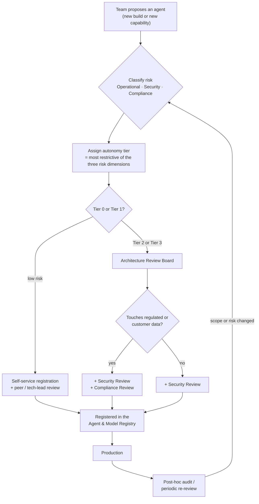

## AI Governance

> Chapter of
> [[production-agent-systems/readme#02 — Reliability, Security & Governance|Reliability, Security & Governance]],
> part of [[production-agent-systems/readme|Production Agent Systems]].

## What you will understand at the end

- Why organizational AI governance is a distinct layer sitting **above** guardrail and approval-gate
  engineering — the policy question of _which_ agent gets _which_ autonomy tier and _who decides_,
  not the mechanics of enforcing a tier once one has been assigned
- A four-tier autonomy model (Tier 0–3) and how to derive a tier from an agent action's operational,
  security, and compliance risk — with worked reasoning, not vibes
- How to size the "may we build this?" gate to actual risk, so governance calibrates friction
  instead of maximizing it — the same framing GH-600's "define autonomy levels" skill is graded on
- What belongs on an approved-model list, and the data-handling implication that actually
  distinguishes one tier of model from another
- Who signs off before an agent reaches production, why that body should change by tier, and what an
  exception path looks like when a team needs to move faster than the default gate allows
- How GitHub Copilot's coding-agent admin controls are a concrete, shippable instance of this whole
  model — not a hypothetical

---

## The mental model

The previous chapters in this Part build mechanics. [[01-guardrails|Guardrails]] constrain what an
agent can say or do at the input/output boundary.
[[08-human-approval-systems|Human Approval Systems]] build the UI/API contract for a
human-in-the-loop gate. Both chapters assume someone has already decided _that_ a gate is needed and
_how strict_ it should be — they answer "how do we enforce this policy," not "what should the policy
be."

Governance is the layer that answers the second question. It is an organizational function, not a
runtime component: it decides, for a given proposed agent and the access it wants, which autonomy
tier is warranted, who has the authority to make that call, and — critically — who has the authority
to revisit it later when the agent's blast radius changes. A guardrail engineer builds the fence.
Governance decides where the fence line goes, and whether this particular field even needs one.

**Reading the diagram:** the loop back from post-hoc review to risk classification is the point.
Governance is not a one-time gate a team clears once — an agent that shipped as Tier 1 (narrow,
human-approved) and later gets a new tool granting write access to a production database has
silently changed risk category, and the registry entry is what catches that drift instead of a
security review discovering it after an incident.

---

## 1. Why this is a distinct layer, not more guardrail engineering

Three roles get conflated when "AI governance" is treated as an afterthought bolted onto guardrail
work, and keeping them separate is the actual skill:

| Role                     | Question it answers                                                                                                                       | Where it lives                                                              |
| ------------------------ | ----------------------------------------------------------------------------------------------------------------------------------------- | --------------------------------------------------------------------------- |
| Guardrail engineer       | "How do we technically stop this specific bad output?"                                                                                    | Runtime, per-agent — [[01-guardrails\|Guardrails]]                          |
| Approval-system engineer | "How does a human say yes/no to this specific action, and what happens on timeout?"                                                       | Runtime, per-action — [[08-human-approval-systems\|Human Approval Systems]] |
| Governance               | "Should this agent be allowed to take this class of action without a human at all — and who gets to decide that, and re-decide it later?" | Organizational — this chapter                                               |

The failure mode when governance is missing isn't that agents run wild with no guardrails — most
teams build _some_ guardrails instinctively. The failure mode is **inconsistent risk tolerance
across teams with no one accountable for the inconsistency**: one team's "internal tool" quietly
gets write access to the billing database because nobody outside that team ever looked at what it
was allowed to do, while another team's genuinely low-risk read-only agent sits in a six-week
architecture review queue because the review process doesn't know how to say "this one's fine,
fast-track it." Governance exists to make that calibration an explicit, owned decision instead of
whatever each team happens to default to.

---

## 2. What agents may be built — sizing the build gate

The naive answer is a binary: either every team can spin up an agent unsupervised, or every new
agent needs a formal proposal before a single line of code is written. Both extremes fail, and they
fail in opposite directions:

- **No gate at all** produces shadow AI — agents with real tool access built and shipped by teams
  who never told security or compliance they existed, discovered for the first time during an
  incident review.
- **A uniform heavy gate on everything** — including a prototype that reads a public API and drafts
  a Slack message a human sends — pushes teams to either quietly not use the sanctioned path, or to
  burn weeks of calendar time on review for something with essentially zero blast radius. Either
  outcome makes the governance function look like the obstacle, which is how governance programs
  lose executive support and get bypassed entirely.

The gate that actually works is **staged, and its weight is a direct function of what the agent can
touch, not what it's built to eventually do**:

1. **Prototype / no real data, no prod access, no external side effects** — no gate. A developer
   sandbox, a synthetic dataset, a read-only call to a public API. This is where most agent ideas
   should start and most should die, cheaply.
2. **First real integration — read access to internal systems, or write access to a non-production
   environment** — self-service registration in the agent registry (see §5) plus a peer or tech-lead
   review. Same-day turnaround. This is the step that actually catches shadow AI: the registry entry
   is the paper trail, not the review itself.
3. **Write access to a production system, or read access to regulated/customer data, or any
   externally-facing action taken on a user's behalf** — this is where the formal review in §4 and
   §5 kicks in, sized to the tier the risk classification produces.

The design principle worth stating explicitly, because it's the one the GH-600 skill is actually
testing: **governance's job is to calibrate friction to risk, not to maximize friction.** A gate
that treats a read-only internal-tools agent the same as an agent that can issue refunds is not
"being careful" — it's misallocating review capacity away from the things that actually need it.

---

## 3. What models they may use — the approved model list

The model choice is itself a governance surface, independent of what the agent is allowed to _do_
once it's running. The axis that matters is not capability — it's **where prompts and outputs go,
and under what contractual terms.**

| Model tier                          | Examples                                                                                                 | Data-handling implication                                                                                                                                                      | Typical approval bar                                                                                 |
| ----------------------------------- | -------------------------------------------------------------------------------------------------------- | ------------------------------------------------------------------------------------------------------------------------------------------------------------------------------ | ---------------------------------------------------------------------------------------------------- |
| Vendor API, standard consumer terms | A personal API key against a public model endpoint, no enterprise agreement                              | Prompts/outputs leave the org's network boundary under whatever the vendor's default retention/training terms are — usually **not** acceptable for anything beyond public data | Not approved for org use — this is the shadow-AI case governance exists to prevent                   |
| Vendor API, enterprise agreement    | Anthropic Claude via a business/enterprise API contract, zero-data-retention or no-training terms signed | Prompts/outputs still leave the network boundary, but under a contract that disables training use and defines retention — the DPA is the control, not the model                | Approved for internal + most customer data once legal has signed the DPA                             |
| Cloud-hosted enterprise tenancy     | Claude via Bedrock/Vertex/Azure inside the org's own cloud tenant and region                             | Traffic stays within the customer's cloud account/region boundary; inherits the org's existing cloud IAM and network controls instead of a separate vendor trust boundary      | Preferred default for compliance-sensitive or regulated-data workloads                               |
| Self-hosted / open-weight           | Llama, Mistral, or similar run on internal infrastructure                                                | No data leaves the network at all; in exchange, the org now owns model risk directly — safety eval, bias testing, and patching are no longer the vendor's job                  | Reserved for air-gapped environments or data classes that can't leave the network under any contract |

The list itself is the governance artifact — not a one-time decision. A model that was approved last
year under one vendor's terms can become non-compliant the moment that vendor changes its default
retention policy or the org signs a new customer contract with stricter data-residency terms. The
approved-model list needs an owner and a review cadence for exactly the same reason the agent
registry in §5 does.

---

## 4. Autonomy tiers mapped to risk — the centerpiece

This is the actual "define autonomy levels" exercise: given a proposed agent action, classify its
risk along three independent dimensions — **operational** (can it break something running),
**security** (can it widen an attack surface or exfiltrate something sensitive), and **compliance**
(can it violate a regulatory or contractual data obligation) — and derive the autonomy tier from the
answer.

| Tier                                                                   | Definition                                                                                                                                                                                                                    | Operational risk ceiling                                                                                                                                                   | Security risk ceiling                                                                                                                    | Compliance risk ceiling                                                                               | Example                                                                                                                                 |
| ---------------------------------------------------------------------- | ----------------------------------------------------------------------------------------------------------------------------------------------------------------------------------------------------------------------------- | -------------------------------------------------------------------------------------------------------------------------------------------------------------------------- | ---------------------------------------------------------------------------------------------------------------------------------------- | ----------------------------------------------------------------------------------------------------- | --------------------------------------------------------------------------------------------------------------------------------------- |
| **0 — Read-only / suggest-only**                                       | Agent observes and drafts; it cannot execute any state-changing action. A human decides whether the suggestion is even used.                                                                                                  | No ceiling — nothing executes, so nothing can operationally break                                                                                                          | No ceiling — no new write path exists to attack                                                                                          | No ceiling — no data leaves its normal handling path by virtue of the agent alone                     | Code-review comments, a drafted incident summary, a suggested runbook step                                                              |
| **1 — Act with mandatory per-action approval**                         | Agent proposes one specific, fully-specified action; a human must explicitly approve **that instance** before it executes. No batching, no "approve the class."                                                               | Medium-high — appropriate for actions that could take down or degrade a running system if wrong                                                                            | Medium — appropriate where the action could touch credentials or widen access, provided a human reviews the exact diff/command each time | Medium-high — appropriate for actions that write to regulated data, since a human attests to each one | A drafted PR that a human merges; a proposed prod scale-down an SRE approves before it runs                                             |
| **2 — Autonomous within a narrow pre-approved scope, post-hoc review** | Agent executes without per-action approval, but only within a scope defined in advance (specific repos, specific alert patterns, specific action types); every action is logged and sampled or fully reviewed after the fact. | Low-medium — the pre-approved scope must be narrow enough that the worst in-scope action is tolerable without a human catching it in real time                             | Low — the scope must exclude anything that touches secrets, IAM, or external-facing surface, since nothing blocks it in the moment       | Low — the scope must exclude any action that creates, modifies, or deletes regulated data             | Auto-remediating a known, runbook-documented alert pattern; a coding agent auto-merging lint-only PRs in a low-risk internal-tools repo |
| **3 — Fully autonomous within a domain**                               | Agent operates end-to-end inside a well-defined domain boundary with no per-action gate at all; governance review is periodic (e.g., quarterly), not per-action or even per-batch.                                            | Very low — the domain boundary itself must guarantee the blast radius is contained even in a total-failure scenario (sandboxed repo, non-prod environment, synthetic data) | Very low — no path to credentials, prod systems, or external users exists inside the domain by construction                              | Very low — the domain must contain zero regulated or customer data by construction                    | Dependency-bump PRs merged automatically in a sandboxed repo with no production dependency; a fully synthetic test-data pipeline        |

**Worked reasoning — how you actually use this table:** classify the proposed action against all
three risk dimensions independently, then **take the most restrictive tier across the three** — the
ceiling is a ceiling, not an average. Two examples that show why this matters:

- _An agent that runs a database migration in production._ Security risk might be genuinely low (it
  uses a scoped service credential, no secrets are exposed, no new external surface is created). But
  operational risk is high — a bad migration can take down the service — and compliance risk is high
  if the schema touches regulated fields. The correct tier is **Tier 1**, driven entirely by the
  operational and compliance columns; the low security score doesn't buy back autonomy the other two
  dimensions veto.
- _An agent that files a Jira ticket summarizing an incident it observed._ Operational risk is near
  zero (filing a ticket doesn't change running state), security risk is low (it only needs read
  access to the incident and write access to the ticketing system), and compliance risk depends on
  whether the incident summary might include customer PII — if the redaction is solid, this is
  comfortably **Tier 2**: pre-approved scope (this alert class, this ticketing project), post-hoc
  sampling review.

The mistake to avoid is scoring risk _per agent_ instead of _per action class within an agent_. Real
agents mix action types — the same coding agent that safely auto-merges Tier 2 lint fixes should
**not** inherit that tier for a change to a CI deployment workflow file, even though it's "the same
agent." Tier assignment belongs to the action class the review scoped, not to the agent as a
monolith — which is exactly why the registry in §5 tracks scope, not just an agent name.

---

## 5. Who signs off before production

The sign-off body should scale with tier for the same reason the build gate in §2 does — routing a
Tier 0 suggestion-only agent through the same board that reviews a Tier 3 autonomous-remediation
agent either bottlenecks the board on trivial cases or rubber-stamps the dangerous ones because the
board is too busy to give either one real attention.

| Tier | Sign-off body                                                                                                   | Review artifact                                                                                                                                                                                                                | Typical turnaround | Re-review cadence                                                                                                                |
| ---- | --------------------------------------------------------------------------------------------------------------- | ------------------------------------------------------------------------------------------------------------------------------------------------------------------------------------------------------------------------------ | ------------------ | -------------------------------------------------------------------------------------------------------------------------------- |
| 0    | Self-service — team lead attests in the registry                                                                | One registry entry: owner, scope, model used                                                                                                                                                                                   | Same day           | Annual, or on scope change                                                                                                       |
| 1    | Peer/tech-lead review + automated security scan of tool permissions                                             | One-page design note: what it does, what it can touch, rollback plan                                                                                                                                                           | 2–3 days           | Semi-annual                                                                                                                      |
| 2    | Architecture Review Board + Security Review                                                                     | RFC/ADR with an explicit blast-radius section and the pre-approved scope boundary, written the way [[05-engineering-rfcs-and-adrs\|Engineering RFCs & ADRs]] (Part 01 of Agentic AI: Projects & Engineering Mastery) describes | 1–2 weeks          | Quarterly                                                                                                                        |
| 3    | Architecture Review Board + Security Review + Compliance Review (+ Legal if personal data is anywhere in scope) | Full design doc, threat model, and a DPIA-equivalent if personal data is touched anywhere in the domain                                                                                                                        | 2–4 weeks          | Quarterly, non-negotiable — this tier has the least in-the-moment human oversight, so the periodic review is the only check left |

**The exception path matters as much as the default path.** A team that genuinely needs to move
faster than its tier's default review — a production incident that needs an autonomous remediation
shipped this week, not next quarter — should have a documented fast-track: a named accountable owner
(not a committee) signs a time-boxed risk acceptance with an explicit expiry date, and the action
reverts to its governed tier automatically when the exception lapses. Without an expiry, "temporary"
exceptions are how Tier 3 agents accumulate scope nobody ever formally approved — the single most
common way governance programs get bypassed isn't teams ignoring the process, it's legitimate
exceptions that never got closed out.

**The registry is what makes any of this auditable.** An internal agent-and-model registry —
referenced in this chapter's own frontmatter description — should record, per agent: owner, tier,
action scope, models it's permitted to call, tools/data it can touch, the sign-off artifact and
date, and the next re-review date. Without it, "who signed off on this" is a question that gets
answered by searching Slack history during an incident, which is the worst possible time to discover
the answer is "nobody, actually."

---

### GitHub Copilot in practice

GitHub Copilot's coding agent is a concrete, shipped instance of this whole model — worth walking
through because it maps the abstract tiers onto real, clickable admin settings rather than a
hypothetical policy engine.

The controls that matter for governance sit at two levels:

- **Org/enterprise policy** — an organization owner can enable or disable Copilot's coding agent
  capability org-wide, and (this is the governance-relevant part) scope it further to specific
  repositories or teams rather than turning it on for every repo at once. This is the build-gate
  from §2 made literal: a low-risk internal-tools org can flip the coding agent on broadly, while a
  production-critical org enables it repo-by-repo as each one clears review.
- **Per-repository controls** — content exclusions (paths/files Copilot's context should never
  include, the mechanism for keeping secrets and sensitive paths out of what the agent can see), and
  the network firewall around the coding agent's sandboxed development environment, which by default
  restricts outbound network access to an explicit allowlist of domains rather than open egress.
  That firewall is the security-risk-ceiling control from the Tier table in §4 — it's what keeps a
  Tier 2 coding agent from becoming a Tier 3 one by accident via an unreviewed dependency fetch.
- **Branch protection as the merge-time gate** — regardless of how autonomously the coding agent
  works inside its sandbox, the PR it opens still has to clear whatever branch protection rules and
  CODEOWNERS-driven required reviewers are configured on that branch. This is the mechanism that
  keeps a coding agent from ever being able to silently promote itself past Tier 1 in a repo where a
  human reviewer is still required on every merge — the org-level enablement decides _whether the
  agent can propose_, branch protection decides _whether a human still has to say yes_.

**Mapping tiers onto real settings:**

- A **low-risk internal-tools repo** (docs, internal scripts, no production dependency) is a
  reasonable candidate for **Tier 2**: coding agent enabled for the whole repo, a broad but
  pre-approved action scope (open PRs, run tests, fix lint), lightweight required review or even
  auto-merge on green CI for narrowly-scoped changes, with periodic sampling of merged PRs instead
  of per-PR sign-off.
- A **production-critical repo** stays at **Tier 1**: coding agent can still be invoked to propose a
  change, but content exclusions keep it away from secrets and deploy configuration, the network
  firewall allowlist is minimal or empty, and branch protection requires a named human reviewer on
  every PR regardless of what CI says — the agent proposes, a human still explicitly approves each
  instance.

The specific menu names and toggle locations in GitHub's admin console are the kind of detail that
shifts release to release — treat the _shape_ of the controls above (org/team enablement scope,
content exclusion, sandboxed-environment network allowlist, branch-protection as the durable
merge-time gate) as the durable governance mental model, and verify the exact current settings
against GitHub's own documentation before writing this into an actual org policy.

---

## Concept check

Before moving to the next chapter, you should be able to answer these without notes:

| Question                                                                                              | Answer hint                                                                                                                   |
| ----------------------------------------------------------------------------------------------------- | ----------------------------------------------------------------------------------------------------------------------------- |
| What question does governance answer that guardrail engineering doesn't?                              | Whether this class of action should run without a human at all, and who has authority to decide that                          |
| How do you derive an autonomy tier from operational/security/compliance risk?                         | Score each dimension independently, then take the **most restrictive** tier across all three — it's a ceiling, not an average |
| Why is a uniform heavy review gate on every agent a governance failure, not a safety win?             | It misallocates review capacity away from genuinely risky agents and pushes low-risk teams toward shadow AI                   |
| What's the actual control that distinguishes "approved" from "unapproved" model use?                  | The data-handling contract (retention/training terms, tenancy boundary) — not the model's capability                          |
| Why does an exception path need a mandatory expiry date?                                              | Undated "temporary" exceptions are how agents accumulate ungoverned scope — the most common way governance gets bypassed      |
| In GitHub Copilot's coding agent, what plays the role of the Tier 1 "per-action human approval" gate? | Branch protection / required reviewers at merge time — the agent proposes, a human still approves each PR                     |

---

## Vocabulary glossary

| Term                      | Definition                                                                                                      |
| ------------------------- | --------------------------------------------------------------------------------------------------------------- |
| Autonomy tier             | A classification (0–3 in this chapter) of how much an agent may act without a per-action human gate             |
| Risk dimension            | One of operational / security / compliance — scored independently, then combined by taking the most restrictive |
| Build gate                | The review a team clears before an agent is allowed to move from prototype to real access                       |
| Approved model list       | The set of models cleared for use, keyed to their data-handling/contractual terms, not their capability         |
| Zero-data-retention (ZDR) | A vendor contract term under which prompts/outputs are not retained or used for training                        |
| Agent registry            | The system of record for every agent's owner, tier, scope, models, and next re-review date                      |
| Architecture Review Board | The governance body that reviews Tier 2+ proposals for blast radius and design soundness                        |
| Exception path            | A time-boxed, named-owner override of the default gate, with an automatic expiry back to the governed tier      |
| Content exclusion         | GitHub Copilot's mechanism for keeping specific paths/files out of the agent's context                          |
| Sandboxed dev environment | The isolated, firewalled execution environment GitHub's coding agent runs in before opening a PR                |

## Metadata

|        |                          |
| ------ | ------------------------ |
| Author | Amit Singh               |
| Scope  | production-agent-systems |
