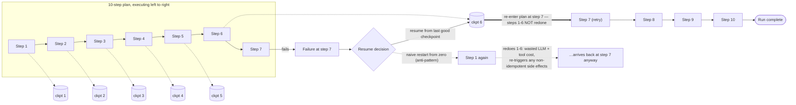

## Failure Recovery

> Chapter of
> [[production-agent-systems/readme#02 — Reliability, Security & Governance|Reliability, Security & Governance]],
> part of [[production-agent-systems/readme|Production Agent Systems]].

## What you will understand at the end

- Why a multi-step agent run needs its own checkpointing discipline, distinct from tool-call-level
  retry — what a checkpoint has to contain to make resuming _safe_, not just fast
- The retry-with-backoff vs. fail-fast question restated as a **workflow-level policy decision**,
  not a per-tool-call setting, and why both failure modes it trades off — wasted spend vs. silent
  damage — get more expensive the higher up the stack you apply it
- Why nested retry budgets (tool-call retries inside step retries inside run retries) multiply
  instead of add, and the worked math on why that matters
- Why classifying a run-level failure as transient or genuine is a harder problem than classifying
  one API error — you are reading a trajectory, not a status code — and why the honest answer is
  sometimes neither "retry" nor "fail," but "replan"
- How GitHub Copilot's coding agent gets partial-completion checkpointing and stuck-run escalation
  essentially for free from git and PR review, without building either mechanism itself

---

## The mental model

Keep this chapter's altitude distinct from
[[agentic-ai-engineering/04-tools-and-environment-interaction/14-safe-execution-paths-and-error-handling/14-safe-execution-paths-and-error-handling|Safe Execution Paths & Error Handling]].
That chapter classifies and recovers from the failure of **one tool call** — is this specific API
response transient, genuine, or ambiguous, and what do you do about it right now. This chapter is
about recovering the **run**: a plan of several steps, each of which may itself contain several tool
calls, when something inside that plan fails partway through. The unit of recovery moves from a
single action to a trajectory.

The central idea an agent runtime has to be built around: a run is a sequence of durable
checkpoints, not one atomic unit that either fully completes or fully restarts. A failure at step 7
of 10 should cost you the retry of step 7 — not a redo of steps 1 through 6.

Two things to notice before going section by section:

1. **The checkpoint, not the step, is the unit of resumption.** `ckpt 6` has to contain everything
   the runtime needs to re-enter the plan at step 7 without re-deriving it — not just a marker that
   says "step 6 done." Section 1 works through exactly what that state has to include.
2. **The dotted "naive restart" path is not a strawman.** It is the default behavior of any agent
   runtime that treats a run as one big synchronous function call with no persisted state in the
   middle. That is the failure mode this chapter exists to design out of the system.

---

## 1. Partial-completion checkpointing

An agent run produced by a planner
([[agentic-ai-engineering/03-planning-and-reasoning-algorithms/07-plan-and-execute/07-plan-and-execute|Plan-and-Execute]]
or the interleaved variant in
[[agentic-ai-engineering/03-planning-and-reasoning-algorithms/02-react/02-react|ReAct]]) is,
structurally, a sequence of steps with state accumulating between them. If that sequence lives only
in an in-memory Python variable for the duration of one process, a crash, a timeout, or a deploy in
the middle of step 7 loses everything — and the only recovery option is starting over. Checkpointing
is the practice of persisting durable state after each completed step so that "start over" becomes
"resume from the last good checkpoint."

### What a checkpoint has to contain

A checkpoint is not just a step counter. To make step 8 pick up correctly, it has to carry:

| Element                               | Why it's required                                                                                                                                                                       |
| ------------------------------------- | --------------------------------------------------------------------------------------------------------------------------------------------------------------------------------------- | ----------------------------------------------------------------------------------------------------------------------------------------------------------- |
| The plan itself                       | So resuming doesn't require the planner to re-derive the same plan from scratch — unless the plan is what's invalidated (Section 3)                                                     |
| Which steps are complete              | The obvious part — but expressed as a durable record, not an assumption held in memory                                                                                                  |
| The **result** of each completed step | The next step's reasoning depends on prior outputs, not just on "step 6 succeeded"                                                                                                      |
| A record of **side effects** produced | The same durable action record from [[agentic-ai-engineering/04-tools-and-environment-interaction/14-safe-execution-paths-and-error-handling/14-safe-execution-paths-and-error-handling | Safe Execution Paths & Error Handling]] §5 — you cannot safely decide whether step 7's retry is a duplicate without knowing exactly what step 6 already did |
| Enough context for the LLM to resume  | Not the full raw transcript necessarily — see the compression tradeoff below — but enough that the model isn't reasoning from a blank slate mid-trajectory                              |

The reason this list is longer than "just remember which step you're on" is the same reason a
database write-ahead log records more than a commit counter: resuming correctly requires the state
needed to make the _next_ decision, not just proof that a prior decision was made.

### Why granularity is a real design choice, not a detail

Checkpoint after every tool call, or after every planned step (which may itself contain several tool
calls)?

- **Fine-grained (every tool call):** cheapest possible redo on failure, but more storage writes,
  more state-machine complexity, and a real risk of over-coupling the checkpoint schema to your
  current tool-calling implementation.
- **Coarse-grained (every planned step):** simpler to reason about and cheaper to operate, but a
  step that itself contains three tool calls means a failure on the third one still redoes the first
  two — which is fine if those two are idempotent reads, and a correctness problem if they are not.

There is no universally correct answer — the right granularity is wherever the boundary between
"cheap to redo" and "has a real side effect" falls for your specific workflow. What matters is that
the boundary is chosen deliberately, using the same idempotency lens from the tool-call chapter, not
left as an implementation accident of wherever your framework happens to serialize state.

### Where checkpoint state lives

This is an infrastructure question this chapter deliberately does not re-solve —
[[production-agent-systems/00-production-infrastructure/03-state-persistence/03-state-persistence|State Persistence]]
covers durable stores for message history and working memory, and
[[production-agent-systems/00-production-infrastructure/06-workflow-engines/06-workflow-engines|Workflow Engines]]
covers the durable-execution engines (Temporal, Step Functions, LangGraph's own persistence layer)
that implement exactly this checkpoint/resume pattern as a platform primitive rather than something
you hand-roll per agent. The reliability _policy_ in this chapter — what to checkpoint, when to
resume vs. replan vs. escalate — is the same regardless of which of those substrates you build it
on.

**The payoff, stated plainly:** checkpointing buys you two separate things, and it's worth keeping
them separate in your own head because they justify the engineering cost differently.

1. **Cost** — a failure at step 7 of 10 shouldn't re-spend the LLM tokens and tool-call latency of
   steps 1-6. At scale, this is the difference between a retry costing 10% of a run and costing 100%
   of it.
2. **Correctness** — if steps 1-6 had real side effects (a resource was created, a record was
   written, a message was sent), blindly redoing them risks duplicating those effects. Checkpointing
   isn't just an optimization; without it, "just restart the run" is not a safe recovery action at
   all once the plan has touched anything outside its own memory.

---

## 2. Retry-with-backoff vs. fail-fast: a workflow-level policy

[[agentic-ai-engineering/04-tools-and-environment-interaction/14-safe-execution-paths-and-error-handling/14-safe-execution-paths-and-error-handling|Safe Execution Paths & Error Handling]]
§2 designs retry for _one tool call_: is this action idempotent, back off with jitter, cap the
attempts. This section asks the same question at the next altitude — when a **step**, or the **run
as a whole**, fails after its own internal retries are exhausted, should the orchestrator retry the
step (or the run) again, or should it stop and surface the failure immediately? That is a policy set
at the workflow level — a property of the _workflow definition_, decided at design time — not a
runtime coin flip made independently at each failure.

| Dimension                        | Retry-with-backoff (workflow-level)                                       | Fail-fast (workflow-level)                                                                                      |
| -------------------------------- | ------------------------------------------------------------------------- | --------------------------------------------------------------------------------------------------------------- |
| **Cost of a redo**               | Acceptable — steps are cheap (small model, cheap tool calls) or read-only | High — steps involve expensive model calls, slow tools, or real infra spend                                     |
| **Side-effect risk**             | Low — steps are idempotent or read-only (search, retrieval, diagnostics)  | High — steps write, mutate, or trigger irreversible actions (deploys, payments, external notifications)         |
| **Latency/SLA sensitivity**      | Slack exists — an async batch job, a background investigation             | Tight — a synchronous user-facing request with a real latency budget                                            |
| **What a failure usually means** | Environment flakiness (rate limits, transient 5xx, model overload)        | Often a signal the plan itself is wrong, not that the environment hiccuped                                      |
| **Typical workloads**            | Investigative/read-heavy agents (SRE triage, research, RAG retrieval)     | Write-heavy or high-blast-radius workflows (infra changes, financial actions, anything gated by human approval) |
| **Default posture**              | Keep trying — a human isn't blocked waiting on this                       | Stop and surface — continuing without a human is the higher-risk choice                                         |

**The single sentence that decides which default a given workflow should use:** if redoing the
failed step is cheap and safe, default to retry-with-backoff; if redoing it is expensive or risky,
default to fail-fast and let a human — or the replanning path in Section 3 — decide the next move.

### Worked reasoning: nested retry budgets multiply

This is the mistake that's easy to make once retry logic exists at more than one layer. Suppose:

- Each **tool call** is allowed 3 retries (the tool-call-level policy from the sibling chapter).
- Each **step** — which may itself call the same tool — is allowed 3 retries at the step level
  before the step is considered failed.

Read carelessly, "3 retries" sounds like a bounded, modest safety margin at either layer alone. But
if step-level retries re-run the whole step including its tool calls, the actual worst-case work
done before the step is declared failed is **up to 3 × 3 = 9 attempts** at the underlying action —
not 3, and not 6. Add a **run-level** retry policy on top ("retry the whole run up to 3 times if a
step ultimately fails") and the worst case becomes 3 × 3 × 3 = 27 attempts at the bottom-most
action, for what three separate config values each individually described as "just 3 retries."

The fix is not to remove layered retries — layering is often correct, because a step-level retry
after replanning is a different, more informed attempt than a blind tool-call retry. The fix is to
enforce a **single run-level budget expressed in absolute terms** — total wall-clock time, total
token spend, or total dollar cost — that every layer's retries draw down against, the run-level
analog of the retry-budget requirement from the tool-call chapter. Layered _attempt counts_ are a
design tool; a layered _unbounded_ multiplication of attempt counts is a cost incident waiting to be
discovered in a billing dashboard.

This is also where retry policy and SLO policy meet directly: an unbounded or overly generous retry
budget is, functionally, an error-budget decision, and belongs in the same conversation as
[[production-agent-systems/01-observability/08-ai-slos/08-ai-slos|AI SLOs]] — token cost and
wall-clock latency are first-class SLIs for an agent workload, and a workflow-level retry policy is
one of the levers that spends that budget.

---

## 3. Transient vs. genuine failure, one level up

At the single-tool-call level, classifying a failure is reading the shape of _one response_: a 429
is almost always transient, a 403 is almost always genuine, an ambiguous timeout needs more signal.
At the run level, you are not reading one response — you are reading a **trajectory**, and the same
question gets meaningfully harder: was this step's failure a one-off blip in an otherwise sound
plan, or is it a symptom that the plan itself doesn't fit reality? Retrying a bad plan doesn't fix
it — it fails again, more expensively, and possibly with different, harder-to-diagnose side effects
the second time.

That reframes the binary retry-or-fail-fast choice from Section 2 into three legitimate exits, not
two:

| Exit                     | When it's the right call                                                                                                                                        | What actually happens                                                                                                                  |
| ------------------------ | --------------------------------------------------------------------------------------------------------------------------------------------------------------- | -------------------------------------------------------------------------------------------------------------------------------------- |
| **Retry verbatim**       | The failure looks like environment noise: the same tool call has succeeded moments earlier in this run, or the error shape matches known-transient patterns     | Re-attempt the identical step from the checkpoint, no change to the plan                                                               |
| **Replan**               | The step failed in a way that implies the plan's assumption was wrong (a resource the plan assumed exists doesn't; a precondition the plan didn't check failed) | Return the failure as new context to the planner, generate a _revised_ step or sub-plan, then resume — not a repeat of the same action |
| **Escalate / fail-fast** | The failure is ambiguous, cascading across multiple unrelated steps, or touches a side effect with no clean rollback (§3 of the sibling chapter)                | Stop the run, hand off to a human with the full trajectory and checkpoint state as context                                             |

Concretely, the heuristics that separate these three at the run level:

- **Did the same kind of action succeed earlier in this run?** If step 3 called the same tool
  successfully and step 7's structurally identical call fails now, that's evidence toward transient
  — the environment, not the plan, is the variable that changed.
- **Is the failure isolated to one step, or cascading across several?** A single stumble suggests a
  local blip; failures spreading across unrelated steps suggest a systemic issue (the environment
  underneath the whole run is degraded) — a different problem than any single step's classification,
  and often itself a signal to fail-fast the run rather than keep spending budget step by step.
- **Does the error describe something structurally wrong with the plan, or with the infrastructure
  underneath it?** "Resource not found," "precondition failed," or "this action is invalid in the
  current state" point at the plan's assumptions; "timeout," "connection reset," or "rate limited"
  point at the environment. This is the same transient/genuine taxonomy from the tool-call chapter,
  now applied to _why the step's premise held or didn't_, not just to one API's response code.

None of these heuristics work without the checkpoint history from Section 1 — you cannot tell
whether step 7's failure is a first occurrence or the third time this exact action has failed across
retries without a durable record of the earlier attempts. Checkpointing and run-level failure
classification are not two separate concerns bolted together; the classification step reads directly
off the same durable record the checkpoint mechanism produces.

---

### GitHub Copilot in practice

GitHub Copilot's coding agent is a clean illustration of run-level recovery working _without_ a
purpose-built checkpoint-and-resume engine, because it inherits both properties this chapter cares
about from infrastructure that already existed: git and the PR review workflow.

**Each commit is a durable, inspectable checkpoint.** Copilot's coding agent works through a task in
an isolated environment and pushes progress as commits to a branch, opening a draft pull request. A
multi-step task — fix a bug across several files, add a test, update a doc — accumulates as a
sequence of commits, each one a durable record of what changed and why. If the agent's session is
interrupted, or a later step fails, the branch already holds every commit that landed successfully;
picking the task back up means building on top of that branch, not starting the diff over from an
empty checkout. This is Section 1's checkpoint list mapped onto git primitives almost exactly: the
plan-so-far is the commit history, the completed-step results are the diffs themselves, and the
side-effect record is the same commit history a human reviewer would read.

**A stuck or repeatedly-failing run surfaces for review instead of looping silently.** A coding
agent that keeps pushing commits that fail the same CI check, or that cannot resolve review
feedback, doesn't have a hidden internal state that a human has to go hunting for — it's sitting
right there as an open, not-yet-mergeable draft PR with its full commit and check-run history
attached. That's the fail-fast/escalate exit from Section 3's table, satisfied by the shape of the
workflow itself: the run doesn't declare success by merging its own work, so a run that can't reach
a passing, reviewable state simply stays open rather than either looping forever or silently
disappearing.

**Where I'm generalizing, flagged explicitly:** I'm confident in the two mechanics above — commits
as the checkpoint unit, and the draft-PR-not-merged pattern as the structural stop condition. I am
_not_ citing a specific documented iteration cap, an exact "give up and mark this stuck" mechanic,
or a guarantee that every review comment triggers another autonomous attempt versus requiring a
human nudge. Treat the general shape as reliable and the precise autonomy boundary as something to
verify against current product docs before asserting it in an interview answer — the same caveat
[[agentic-ai-engineering/04-tools-and-environment-interaction/14-safe-execution-paths-and-error-handling/14-safe-execution-paths-and-error-handling|Safe Execution Paths & Error Handling]]
draws in its own Copilot section, applied here to the run level instead of the single-tool-call
level.

The through-line for an interview answer: Copilot's coding agent didn't need a bespoke
checkpoint-and-resume engine any more than it needed a bespoke rollback engine — it needed to run
inside a system (git + branch + PR review) that already solved "durable partial progress" and
"surface stuck work for a human" for every other contributor, human or agent.

### Where this ends and Circuit Breakers begins

This chapter's boundary: checkpointing (Section 1), retry-vs-fail-fast as a workflow-level policy
(Section 2), and classifying a run-level failure as transient or genuine (Section 3) are all about
_deciding what to do_ once you already know a step failed, and how to resume safely once you've
decided. None of that tells you how to keep one failing dependency from taking the whole run down
before you ever get to make that decision, or how to stop a "replan" loop from becoming an infinite
one.

[[13-circuit-breakers-and-timeout-strategies|Circuit Breakers & Timeout Strategies]] covers the
containment mechanics one level below the decision policy in this chapter: how a cascading failure —
one slow or dead dependency stalling every step that touches it — gets stopped at the edge instead
of propagating through the whole trajectory; how a timeout budget gets allocated across a multi-hop
tool chain so no single hop can silently consume the entire run's latency budget; the deadlock and
oscillation failure modes that show up specifically when two or more cooperating agents wait on each
other or flip-flop between conflicting plans; and the circuit-breaker pattern that caps a runaway
retry-or-replan loop before it turns into an incident.

Put concretely: Section 2 says a step's retry budget should be an absolute cap, not a per-layer
attempt count multiplied blindly against the others. The next chapter is the mechanism that enforces
that cap when a dependency is failing continuously rather than intermittently — and why that
mechanism has to trip _before_ the nested-retry math from Section 2 gets a chance to run its worst
case.

---

## Concept check

| Question                                                                                          | Answer hint                                                                                                                                       |
| ------------------------------------------------------------------------------------------------- | ------------------------------------------------------------------------------------------------------------------------------------------------- |
| What's the difference in scope between this chapter and Safe Execution Paths & Error Handling?    | That chapter recovers one failed tool call; this chapter recovers a whole multi-step run after a failure partway through                          |
| Why isn't "which step we're on" enough for a checkpoint?                                          | Resuming needs the plan, each completed step's result, and its side-effect record — not just a step counter                                       |
| Why does checkpointing matter for correctness, not just cost?                                     | If earlier steps had real side effects, a naive restart-from-zero can re-trigger them, not just waste tokens                                      |
| Why is retry-with-backoff vs. fail-fast a workflow-level policy rather than a per-failure choice? | It has to be decided at design time from the workflow's cost, side-effect risk, and latency budget — not improvised per incident                  |
| Why do nested retry budgets multiply instead of add?                                              | A step-level retry that re-runs its own tool calls compounds each layer's attempt count (e.g. 3 × 3 × 3 = 27 worst-case attempts)                 |
| What's the third option beyond retry-or-fail-fast at the run level?                               | Replan — return the failure to the planner as new context and generate a revised step, rather than repeating the same action or stopping outright |
| Why is run-level transient/genuine classification harder than tool-call-level classification?     | It requires reading a trajectory (did this kind of action succeed earlier? is the failure isolated or cascading?), not one response's status code |
| What plays the role of "checkpoint" in GitHub Copilot's coding agent workflow?                    | Each commit pushed to the agent's branch — durable, inspectable partial progress                                                                  |

---

## Vocabulary glossary

| Term                             | Definition                                                                                                                                                      |
| -------------------------------- | --------------------------------------------------------------------------------------------------------------------------------------------------------------- |
| Checkpoint                       | A durably persisted snapshot of run state — plan, completed-step results, and side-effect record — taken after a step completes                                 |
| Partial-completion checkpointing | Persisting state after each step so a mid-run failure resumes from the last good checkpoint instead of restarting the whole run                                 |
| Naive restart                    | Re-running a failed multi-step task from step 1 with no persisted intermediate state — the anti-pattern this chapter designs against                            |
| Workflow-level retry policy      | A design-time decision, set per workflow, for whether a failed step or run should be retried with backoff or fail fast                                          |
| Nested retry budget              | Retry allowances set independently at the tool-call, step, and run layers, whose worst-case attempt counts multiply rather than add                             |
| Replan                           | Returning a step's failure to the planner as new context to produce a revised plan, instead of retrying the identical action or escalating outright             |
| Cascading failure                | Failures spreading across multiple unrelated steps in a run, suggesting a systemic/environmental cause rather than one bad step                                 |
| Durable execution engine         | Infrastructure (Temporal, AWS Step Functions, a workflow-graph framework's own persistence layer) that implements checkpoint-and-resume as a platform primitive |

## Metadata

|        |                          |
| ------ | ------------------------ |
| Author | Amit Singh               |
| Scope  | production-agent-systems |
