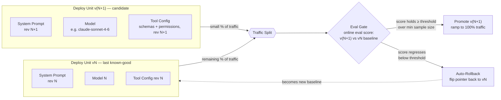

## Rollback Strategies

> Chapter of
> [[production-agent-systems/readme#02 — Reliability, Security & Governance|Reliability, Security & Governance]],
> part of [[production-agent-systems/readme|Production Agent Systems]].

## What you will understand at the end

- Why a prompt + model + tool-config combination must be treated as a single versioned, deployable
  artifact — never edited in place in a running production agent
- How canary rollout and shadow rollout apply to agent changes specifically, and which one earns its
  extra infrastructure cost for a given kind of change
- How to wire a rollback trigger to an evaluation regression so a bad deploy reverts itself before a
  human notices — closing the loop with this book's evaluation chapters instead of leaving rollback
  as a manual, vibes-based judgment call

---

## The mental model

Rollback, in this chapter, means one specific thing: **reverting the agent's own deployed
configuration** — the prompt, the model, the tool schema, the sampling parameters — back to a
previous version, because the current version is producing worse outcomes than the one before it.

This is a narrower claim than it sounds, and it is worth drawing the boundary precisely, because
this book uses "rollback" and "recovery" in three different scopes:

| Scope                              | Question it answers                                                   | Where it's covered                                                                                                                               |
| ---------------------------------- | --------------------------------------------------------------------- | ------------------------------------------------------------------------------------------------------------------------------------------------ |
| A single agent **run**             | "This run hit an error mid-task — retry, checkpoint, or fail fast?"   | [[production-agent-systems/02-reliability-security-and-governance/11-failure-recovery/11-failure-recovery\|Failure Recovery]] (previous chapter) |
| A single **action** the agent took | "The agent wrote a file / sent an email it shouldn't have — undo it." | Autonomous Execution (Part 01 of Agentic AI Engineering) — validation and rollback at the action level                                           |
| The agent's **deploy unit**        | "The new prompt/model version is worse than the old one — revert it." | This chapter                                                                                                                                     |

Failure Recovery is about a run surviving its own execution. This chapter is about the _next_
version of the agent surviving contact with production. A run can fail perfectly gracefully — every
checkpoint honored, every retry backed off correctly — and the deploy unit it was running can still
be the wrong one to keep serving traffic. Those are orthogonal failure axes, and conflating them is
the single most common design mistake in agent release engineering: teams build beautiful
retry/checkpoint logic and then ship prompt changes straight to 100% of traffic with no gate at all.

The mechanism that makes deploy-unit rollback possible in the first place is unglamorous: the
prompt, model, and tool config have to be **versioned artifacts**, not values mutated in place. If
"rolling back" means someone has to remember what the previous system prompt said and retype it, you
don't have a rollback strategy — you have an incident with extra steps.



**Reading the diagram:** the candidate and baseline deploy units run side by side, a traffic
splitter routes a controlled slice to the candidate, and an eval gate — not a human staring at a
dashboard — decides whether to widen that slice toward 100% or snap it back to zero. The rollback
path is not a separate incident-response process; it's the same pointer flip that promotion uses,
just pointed the other direction.

---

## 1. The deploy unit — prompt + model + tool config, versioned together

The temptation is to version these three things independently: a prompt in a prompt-management tool,
a model string in an env var, a tool schema in a separate repo. Resist it. Version them as **one
bundle**, because that's the only unit that was ever actually evaluated together.

A system prompt tuned against one model's instruction-following quirks can silently break on a
different model. A tool schema that assumes a particular prompt phrasing ("always confirm before
calling `delete_record`") stops being safe the moment the prompt that contains that instruction is
rolled back but the tool schema isn't. The combination is the thing with behavior — not any single
piece of it.

```yaml
# agent-deploy-unit.yaml — a versioned, immutable deploy unit
version: "v42"
system_prompt_ref: "prompts/support-agent@sha256:9f2c1a4e..."
model: "claude-sonnet-4-6"
tool_config_ref: "tools/support-agent-toolset@v7"
sampling:
  temperature: 0.3
  max_tokens: 2048
created_at: "2026-08-08T09:12:00Z"
promoted_from: "v41"
status: "canary" # canary | promoted | rolled_back
canary_traffic_pct: 5
```

Two properties matter more than the exact storage mechanism (a prompt registry service, a tagged
object-storage bundle, or — see the GitHub Copilot section below — a plain git-tracked file):

1. **Immutability.** Once `v42` exists, nothing about it changes. A fix is `v43`, not an edit to
   `v42`. This is what makes "rollback" a well-defined operation — you are always reverting _to_
   something, not trying to reconstruct it from memory.
2. **A `promoted_from` pointer.** Every version knows what it superseded. Rollback is then just
   "make `promoted_from` the active version again," which is a pointer flip, not a redeploy from
   scratch.

---

## 2. Why in-place edits make rollback impossible

This is worth stating bluntly because it's the failure mode that actually happens: someone opens the
system prompt in whatever admin console holds it, tweaks a paragraph to fix a complaint, saves, and
the change is live. No version bump, no baseline to compare against, no way back except retyping
from memory or grepping Slack for the old wording.

The cost isn't hypothetical rollback difficulty — it's that **you lose the ability to attribute a
regression to a cause at all.** If the prompt, the model routing, and the tool config all drift
independently and continuously, and a quality metric drops next Tuesday, you have no artifact
boundary to bisect against. Contrast this with treating each change as a new immutable version: now
"what changed between the good period and the bad period" is a diff between two version IDs, not an
archaeology project.

This is also why this chapter's scope — versioned deploy units — is the _precondition_ for
everything else in it. Canary rollout, shadow rollout, and automated rollback triggers are all
mechanisms for comparing version N+1 against version N. None of them are meaningful if there is no N
to compare against, only "whatever is currently in the prompt field."

---

## 3. Canary rollout for agent changes

Canary rollout routes a small percentage of **real** traffic to the candidate deploy unit and
compares outcomes against the baseline, before committing the rest of traffic to it. This is the
same idea as canarying a service deploy — but what you're watching is different. A bad HTTP service
canary shows up as elevated error rates or latency. A bad _agent_ canary can look perfectly healthy
on infrastructure metrics (200s, normal latency, normal token counts) while quietly giving worse
answers, calling the wrong tool, or hallucinating a citation — none of which a load balancer's
health check will ever see.

That's why an agent canary's gate has to be an **evaluation signal**, not an infra signal:
task-success rate from an LLM-as-judge, groundedness/hallucination score, tool-call correctness
rate, or an implicit signal like retry/regeneration rate from real users. Part 02 of Building &
Evaluating Agents's
[[building-agentic-systems/02-evaluation/03-online-evaluation/03-online-evaluation|Online Evaluation]]
chapter covers how those scores get produced continuously; this chapter is about what you _do_ with
the score once it exists.

**Practical shape of an agent canary:**

1. Route 1–5% of live traffic to v(N+1); the rest stays on vN.
2. Score both populations with the same evaluators, over a rolling window.
3. Require a minimum sample size before trusting any delta (see §6 — small-N deltas are noise, not
   signal).
4. Ramp progressively — 5% → 25% → 50% → 100% — re-gating at each step, rather than a single binary
   on/off canary. A regression that only shows up under a specific traffic mix (a heavier-than-usual
   share of a particular intent, a regional load pattern) can hide at 5% and surface at 50%.

The real cost of canary is that a slice of real users get the candidate's actual output while it's
still unproven. For a pure text-generation agent with no side effects, that's a low-stakes bet. For
an agent whose tools mutate state — send an email, charge a card, close a ticket — a regressed
canary means real mutations happened on bad reasoning, and "roll back the deploy unit" does not undo
them. That's the case shadow rollout exists for.

---

## 4. Shadow rollout for agent changes

Shadow rollout runs the candidate deploy unit **alongside** the baseline on real production input,
but the candidate's output is never actually used — it's logged and scored, then discarded. The user
only ever sees the baseline's response.

For an agent, this means executing the candidate's full reasoning loop — including tool calls — in a
context where its actions don't take effect: read-only tools can genuinely run twice at no risk;
mutating tools have to be mocked, sandboxed, or dry-run-flagged so the shadow path exercises the
agent's _decision_ to call them without the call actually happening. This is more engineering than
canary requires, and it costs roughly double the inference spend for whatever traffic you shadow
(every shadowed request now runs through two full agent loops instead of one).

What you get in exchange is the thing canary can't offer: a **paired comparison**. Because both
versions see the exact same input at the exact same moment, you can attribute a scoring difference
to the deploy-unit change with much higher confidence than a canary's two overlapping-but-distinct
traffic populations ever gives you. Shadow is the right tool when you need that precision before
you're willing to let the candidate touch anything real — which is precisely the situation a
mutating-tool agent is in.

---

## 5. Canary vs. shadow — choosing between them

| Dimension                   | Canary rollout                                                                   | Shadow rollout                                                                                 |
| --------------------------- | -------------------------------------------------------------------------------- | ---------------------------------------------------------------------------------------------- |
| What the user sees          | The candidate's real output, for a % of traffic                                  | Always the baseline's output — candidate output is discarded                                   |
| Risk if candidate regresses | A slice of real users get the worse behavior, including any mutating tool calls  | Zero user-facing risk — mutating tool calls must be mocked/dry-run, so nothing real happens    |
| Inference cost              | ~1x — traffic is _split_, not duplicated                                         | ~2x for shadowed requests — every request runs through both deploy units                       |
| Comparison quality          | Two distinct (if similar) traffic populations — some noise from population drift | Paired — identical input to both versions, higher-confidence attribution                       |
| Extra engineering required  | Traffic splitter + eval scoring                                                  | Traffic splitter + eval scoring + a way to neutralize side effects on the shadow path          |
| Best fit                    | Text-generation-heavy agents, read-only tool agents, once an eval gate exists    | Agents with mutating tools, or any change you want validated before it can touch anything real |

They're not mutually exclusive. A common progression: shadow the candidate first to get a paired,
low-risk read on quality; once it clears that bar, canary it at 5% to validate against real user
behavior signals shadow can't produce (does latency hold under real concurrency, do users actually
stop regenerating responses); then ramp.

---

## 6. Rollback triggers — closing the loop with evaluation

Everything above is plumbing. The part that actually makes this a _rollback strategy_ rather than a
monitoring dashboard is this: **the decision to revert is automated and tied to a specific,
pre-committed evaluation threshold — not a human noticing something feels off.**

That distinction matters because "feels off" doesn't scale and doesn't page anyone at 2 a.m. A
concrete trigger does:

```python
def evaluate_canary(candidate: DeployUnit, baseline: DeployUnit) -> RolloutDecision:
    scores = eval_gate.score_window(candidate, min_samples=MIN_SAMPLES)
    baseline_scores = eval_gate.rolling_baseline(baseline, window="7d")

    if scores.sample_count < MIN_SAMPLES:
        return RolloutDecision.HOLD  # not enough signal yet — don't flap on noise

    regression = baseline_scores.task_success_rate - scores.task_success_rate
    if regression > REGRESSION_THRESHOLD:
        return RolloutDecision.ROLLBACK  # flip the pointer back to `promoted_from`

    return RolloutDecision.PROMOTE
```

A few design decisions in that gate are load-bearing, and each maps to a lesson SRE practice already
teaches about noisy signals:

- **Minimum sample size before trusting a delta.** An LLM-as-judge score on 12 canary requests is
  not a signal, it's noise wearing a signal's clothes. Set `MIN_SAMPLES` from the eval's own
  observed variance, the same way you'd size a burn-rate alert window — too small and you roll back
  on chance, too large and a real regression runs against users for hours before the gate fires.
- **A threshold, not a vibe.** `REGRESSION_THRESHOLD` is a number someone committed to in advance,
  ideally derived from the offline eval baseline in
  [[building-agentic-systems/02-evaluation/04-offline-evaluation/04-offline-evaluation|Offline Evaluation]]'s
  regression gate — this is the same regression-gate idea, just moved from pre-merge CI to
  post-deploy production traffic.
- **The rollback target is `promoted_from`, not "some earlier version."** This is why §1's
  immutable-artifact discipline matters: the gate doesn't need judgment about _which_ earlier
  version is safe, because every version already carries a pointer to the one it superseded, and
  that one was — by definition — the last version that cleared this same gate.
- **Rollback becomes the new baseline immediately, not eventually.** The moment the pointer flips
  back to vN, vN is what the _next_ candidate gets compared against. This prevents a subtle trap:
  treating a rolled-back version's score as still "the bar," which would let a second bad candidate
  sneak through by only being slightly less bad than the first one.

The loop this closes: Part 02 of Building & Evaluating Agents builds the scoring machinery (online
eval, offline eval, eval frameworks); this chapter is where that scoring becomes a release-blocking,
and release-reverting, control — not a chart someone checks on a cadence.

---

## 7. Worked example — a canary that should have rolled back

A support agent is on deploy unit v41. A prompt change to shorten responses ships as v42 —
`promoted_from: v41`. Canary starts at 5%.

| Metric (rolling window, LLM-judge scored) | v41 baseline | v42 canary (first 400 samples) |
| ----------------------------------------- | ------------ | ------------------------------ |
| Task success rate                         | 94.1%        | 87.3%                          |
| Groundedness score                        | 0.91         | 0.79                           |
| Avg response length                       | 210 tokens   | 96 tokens                      |

The response-length change is the _intended_ effect of the prompt edit — it worked. But the eval
gate isn't scoring length, it's scoring task success and groundedness, and both dropped well past
`REGRESSION_THRESHOLD`. The shorter prompt trimmed exactly the sentences that were carrying
citations and caveats — a plausible, easy-to-miss side effect of a change that looked purely
stylistic in review.

`MIN_SAMPLES` (say, 300) is already cleared at 400 samples, so the gate doesn't hold-and-wait — it
fires: the pointer flips back to v41, v42 is marked `rolled_back`, and an alert links the regression
delta straight to the diff between v41 and v42's system prompt. Nobody had to notice degraded
answers in a support queue three days later and trace it backward. The version boundary from §1 is
what makes "the diff between v41 and v42" a well-formed, one-hop question instead of an
investigation.

---

### GitHub Copilot in practice

GitHub Copilot's custom agents — defined as markdown files with YAML frontmatter under
`.github/agents/*.md`, specifying an agent's name, description, and tool access — are, by virtue of
living in the repo, already version-controlled deploy units in the sense this chapter cares about.
Every commit that touches one of those files is a new version; git history _is_ the version history;
`git blame` and `git log` already answer "what changed and when" for free, without a bespoke
prompt-registry service.

That gives you the rollback mechanism this chapter has been building toward, for free: a regression
in a custom agent's behavior after an instruction change is reverted **the same way any other code
regression is** — revert the commit or the PR. There's no separate "agent rollback" tooling to
learn; it's the same `git revert` your team already runs for a bad application deploy.

What it does _not_ give you for free is the eval gate from §6. As far as documented behavior goes,
merging a change to `.github/agents/*.md` does not trigger any canary or shadow traffic split on
GitHub's side — the file simply takes effect for subsequent invocations of that agent. If you want
the "auto-revert on regression" half of this chapter rather than just the "revert is cheap" half,
you have to build it the same way you'd build it for any config file: a required CI status check
that runs your eval suite (this book's Offline Evaluation regression gate) against the changed agent
definition before the PR merges, using branch protection to make that check mandatory rather than
advisory. That turns a plain git revert into the same regression-gated release process this chapter
describes — pre-merge instead of post-deploy, since there's no live traffic-splitting primitive to
gate against in production the way an LLM API deploy unit would.

One more connection worth flagging explicitly, since it's an inference rather than something GitHub
documents: if a custom agent is mid-session — partway through a multi-step task — when its
definition file gets reverted, how gracefully that lands depends entirely on the runtime's own
checkpoint and resumption discipline, which is exactly the previous chapter's territory
([[production-agent-systems/02-reliability-security-and-governance/11-failure-recovery/11-failure-recovery|Failure Recovery]]).
A revert that takes effect cleanly between sessions is a non-event. A revert that lands mid-task,
against a runtime with no checkpointing, is indistinguishable from an unannounced mid-flight config
change — the in-progress reasoning was built against instructions and tool permissions that no
longer exist. This isn't a documented Copilot behavior so much as the general principle: rollback
safety at the deploy-unit level and failure-recovery discipline at the run level are two different
investments, and skipping the second one doesn't make the first one free.

---

## Concept check

Before moving to the next chapter, you should be able to answer these questions without notes:

| Question                                                                             | Answer hint                                                                                                                                      |
| ------------------------------------------------------------------------------------ | ------------------------------------------------------------------------------------------------------------------------------------------------ |
| Why must prompt, model, and tool config be versioned as one bundle?                  | Only the combination was ever actually evaluated together — versioning them separately creates untested combinations.                            |
| What's the difference between this chapter's "rollback" and Chapter 11's "recovery"? | Recovery is a single run surviving its own execution; rollback is the _next deploy version_ surviving contact with production.                   |
| Why does canary risk more than shadow?                                               | Canary exposes real users (and real mutating tool calls) to the candidate's actual output; shadow never lets the candidate's output take effect. |
| What decides a rollback — a person or a threshold?                                   | A pre-committed evaluation threshold, checked against a minimum sample size, not a human judgment call.                                          |
| Why is `promoted_from` on every deploy unit important?                               | It makes rollback a pointer flip to a known-good target instead of a judgment call about which earlier version is safe.                          |

---

## Vocabulary glossary

| Term              | Definition                                                                                                      |
| ----------------- | --------------------------------------------------------------------------------------------------------------- |
| Deploy unit       | The versioned bundle of prompt + model + tool config that was evaluated and released together                   |
| Canary rollout    | Routing a small % of real traffic to a candidate version while comparing outcomes to the baseline               |
| Shadow rollout    | Running a candidate alongside the baseline on real input without its output ever being used                     |
| Eval gate         | The automated check that scores a candidate against a threshold before promoting or rolling it back             |
| Rollback trigger  | The pre-committed condition (score below threshold, over a minimum sample size) that fires a revert             |
| `promoted_from`   | The pointer on a deploy unit recording which prior version it superseded — the rollback target                  |
| Progressive ramp  | Widening a canary's traffic share in gated steps (5% → 25% → 50% → 100%) instead of a single cutover            |
| Paired comparison | Scoring two versions against the exact same input, as shadow rollout enables, for higher-confidence attribution |

## Metadata

|        |                          |
| ------ | ------------------------ |
| Author | Amit Singh               |
| Scope  | production-agent-systems |
