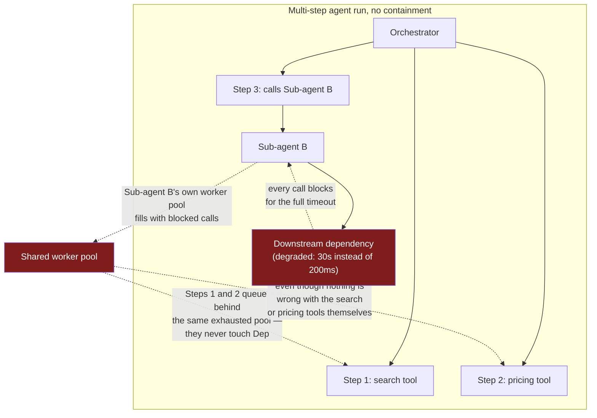
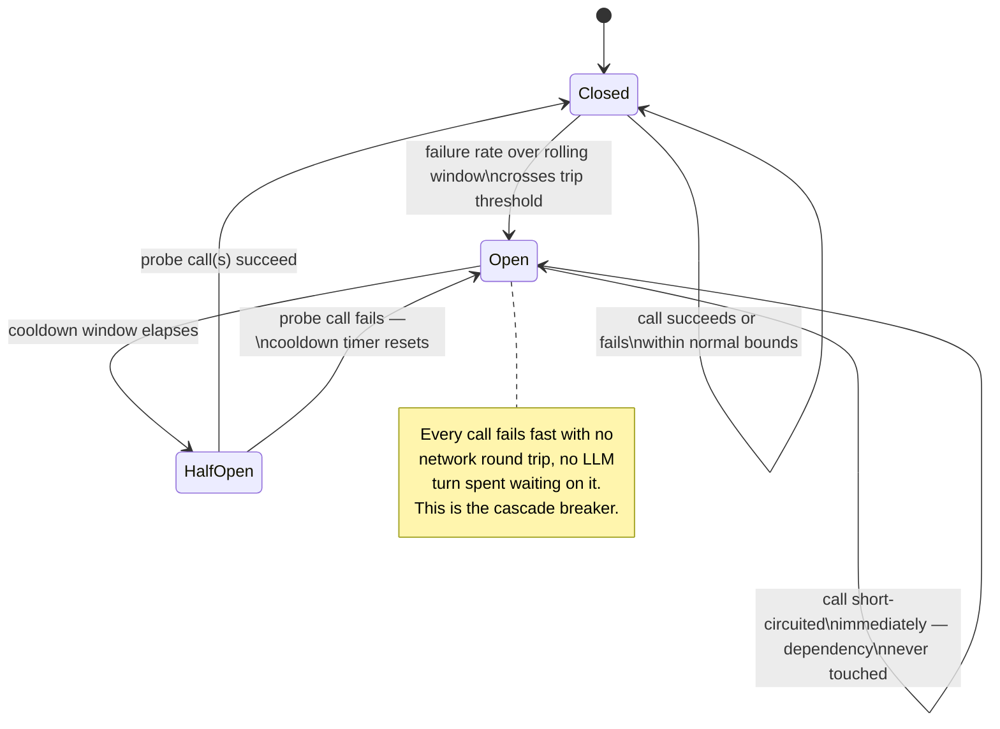
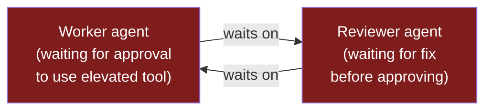
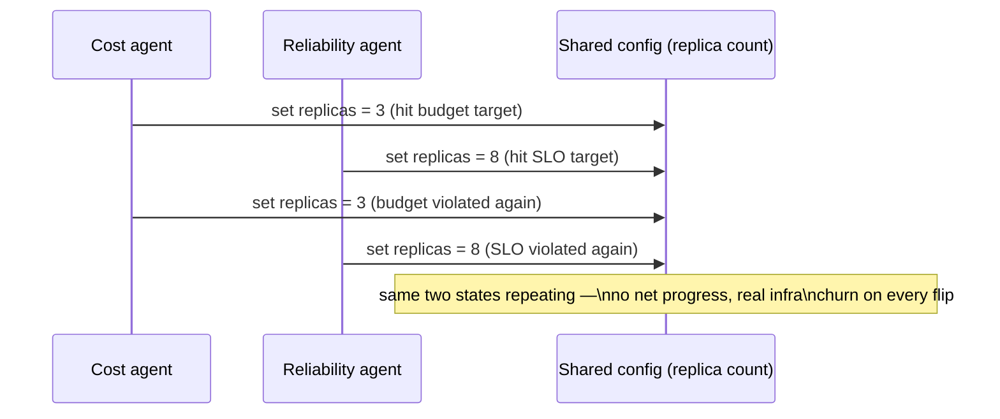

## Circuit Breakers & Timeout Strategies

> Chapter of
> [[production-agent-systems/readme#02 — Reliability, Security & Governance|Reliability, Security & Governance]],
> part of [[production-agent-systems/readme|Production Agent Systems]].

## What you will understand at the end

- Why "the tool call failed, retry it" does not prevent a cascading failure — and why a circuit
  breaker's aggregate-failure-rate-over-a-window trip condition is a mechanically different thing
  from any per-call retry policy, no matter how well-tuned that retry policy is
- How to apply the closed/open/half-open state machine to a tool call or a sub-agent invocation
  specifically, and why the breaker has to be scoped per-dependency rather than globally, or one
  flaky tool takes every other tool down with it
- Why a fixed per-hop timeout on each of N sequential tool calls does not compose into a
  request-level deadline — and the deadline-propagation fix: a single absolute deadline, computed
  once, decremented at every hop
- The two distinct failure shapes that appear only when two or more agents cooperate — deadlock
  (circular wait, with no OS-level detector watching agent-level "locks") and oscillation (repeated,
  uncoerced undoing of each other's own work) — and the detection heuristic that fits each
- The four concrete signals a runaway-loop breaker can trip on — iteration count,
  repeated-identical- call detection, cumulative cost, and progress stall — ranked by how early and
  how precisely each one catches the problem before it becomes a line item in a billing dashboard

---

## The mental model

[[11-failure-recovery|Failure Recovery]] answers "a step failed — retry, replan, or escalate?" and
[[12-rollback-strategies|Rollback Strategies]] answers "the last deploy is worse than the one before
it — revert to what?" Both assume you already know a failure happened. This chapter is about the
layer underneath both of those: the containment mechanics that stop one bad dependency, one
degenerate agent-to-agent interaction, or one unbounded loop from consuming the entire run — or the
entire fleet — before any policy decision ever gets a chance to run.

The failure mode this chapter exists to design out is thread-pool exhaustion wearing an agent
costume. It is the same shape that took down entire microservice fleets a decade ago whenever a
downstream dependency degraded without anything upstream noticing fast enough:



Nothing about Step 1 or Step 2 failed on its own terms — the search tool and the pricing tool are
healthy. They stall anyway, because they share a resource (a worker pool, a rate-limited API key, an
LLM call queue) with the one component that is actually degraded. A retry policy on Sub-agent B's
own calls does not fix this: retrying a slow dependency with backoff still holds a worker slot for
the full timeout duration on every attempt, and every additional attempt is additional queued time
for everyone else waiting on that same pool.

The fix in every section below shares one structural idea: **detect the degenerate pattern from
aggregate signal, and stop feeding it work — fast — instead of waiting for each individual attempt
to fail on its own.** A circuit breaker does this for a failing dependency. A timeout budget does it
for a chain that's about to blow its deadline. A deadlock/oscillation detector does it for two
agents stuck interacting with each other instead of the world. A runaway-loop breaker does it for a
single agent that's stuck interacting with itself.

---

## 1. Cascading-failure prevention: the circuit breaker

### Why retry alone doesn't contain a cascade

[[agentic-ai-engineering/04-tools-and-environment-interaction/14-safe-execution-paths-and-error-handling/14-safe-execution-paths-and-error-handling|Safe Execution Paths & Error Handling]]
designs retry for a single call: back off, add jitter, cap the attempt count. That policy is
_reactive per call_ — it decides what to do only after a specific call has already failed, and it
has no memory of any other call. A circuit breaker is a different kind of mechanism entirely: it
tracks the aggregate success/failure rate of a dependency **across a rolling window of recent
calls**, and once that rate crosses a threshold, it stops sending new calls to the dependency at all
— for every caller, not just the one that happened to fail last.

That distinction is the whole reason a breaker contains a cascade and a retry policy doesn't. Retry
answers "was this call unlucky?" one call at a time; a breaker answers "is this dependency currently
bad, in general?" once, and then short-circuits every subsequent call against that answer until the
dependency proves otherwise.

### The state machine: closed → open → half-open



| State         | What happens to a call                                                                 | What it's protecting                                                                                                                                               |
| ------------- | -------------------------------------------------------------------------------------- | ------------------------------------------------------------------------------------------------------------------------------------------------------------------ |
| **Closed**    | Passes through normally; outcome recorded into the rolling window                      | The steady state — dependency is healthy enough to keep using                                                                                                      |
| **Open**      | Short-circuited immediately — return a fallback/error, never touch the real dependency | The dependency itself (no more load on something already struggling) _and_ the rest of the run (no worker slot held, no LLM turn blocked waiting on a doomed call) |
| **Half-open** | A small number of probe calls are allowed through; the rest still short-circuit        | A cheap way to test recovery without fully re-opening the floodgates on something that might still be down                                                         |

The classic reference implementation for this exact shape is Netflix's Hystrix, and the commonly
cited defaults are worth knowing because they make "rolling window" and "trip threshold" concrete
instead of abstract: a 10-second rolling window split into 10 one-second buckets, a minimum of 20
requests in that window before the breaker will even evaluate a trip (so one unlucky call on a
low-traffic dependency can't trip anything), a 50% error-rate threshold to open, and a 5-second
sleep window before the first half-open probe. **Flagging explicitly:** those are the widely cited
OSS defaults from Hystrix's documentation, not something I've re-verified against current Netflix
internal practice — Hystrix itself has been in maintenance mode since around 2018, with Netflix's
own engineering blog describing a move toward adaptive concurrency limits instead of a fixed
error-percentage trip condition. Treat the state machine as the durable idea and the specific
numbers as illustrative defaults to verify before quoting in an interview.

### Applying it to a tool call

Scope the breaker **per tool, per downstream dependency** — not globally, and not even per agent. A
single global "any tool failure" breaker means one flaky web-search API trips a breaker that also
blocks your (healthy) database tool and your (healthy) calendar tool, because they share the same
trip condition even though they share nothing about their actual failure behavior. The granularity
question has a direct analog to the cardinality-of-labels tradeoff from metrics design: too coarse a
breaker key and unrelated dependencies get bundled into one blast radius; too fine (per-tool-per-
tenant-per-parameter-combination) and you never accumulate enough call volume in any one window to
evaluate a trip condition at all.

| Breaker scope            | Blast radius when it trips                                           | When it's the right call                                                                                                         |
| ------------------------ | -------------------------------------------------------------------- | -------------------------------------------------------------------------------------------------------------------------------- |
| Per tool                 | One tool becomes unavailable; everything else keeps running          | Default — matches the actual unit of failure for most external dependencies                                                      |
| Per tool + per tenant    | One tenant loses one tool; other tenants on the same tool unaffected | Multi-tenant platforms where one tenant's misbehaving downstream (their own webhook, their own API key) shouldn't degrade others |
| Per sub-agent invocation | One sub-agent's contribution to the plan is skipped/faulted-back     | The dependency being protected is itself a whole sub-agent, not a single API call — see below                                    |

### Applying it to a sub-agent invocation

The same state machine applies one level up when the "dependency" is an entire sub-agent rather than
a single tool. An orchestrator that repeatedly delegates to a research sub-agent, a code-review
sub-agent, or a pricing sub-agent should track that sub-agent's own success/timeout rate the same
way it would track any external API — because from the orchestrator's point of view, a sub-agent
that's stuck in its own bad loop or hammering a dead dependency of its own **is** an external
dependency. The concrete difference at this altitude: what "fallback" means when the breaker opens.

- **Skip and continue** — drop the sub-agent's planned contribution, and let the plan proceed with a
  gap noted, if the overall task tolerates a partial answer.
- **Use a stale/cached result** — if the sub-agent's last successful output is still usable (a price
  quote from 10 minutes ago, a search result from an earlier step), degrade to that instead of
  failing the whole run.
- **Replan around it** — feed the trip event back to the planner as new context, same replan exit as
  [[11-failure-recovery|Failure Recovery]] §3, but triggered by an aggregate breaker state instead
  of a single step's classification.

None of these fallbacks are available to a naive retry loop, because retry has no concept of "give
up on this dependency for now and do something else" — it only knows how to keep trying the same
thing, slower.

---

## 2. Timeout budgets across a multi-hop tool chain

### The bug: per-hop timeouts don't compose

Give each of five sequential tool calls in a chain its own independently configured 10-second
timeout, and every individual call can legitimately "succeed" — each one returns within its own
budget — while the chain as a whole still blows through whatever deadline actually mattered (a
synchronous user waiting 8 seconds for a response, or a batch job with a 60-second SLA). Nothing in
that design is watching the **sum**. A call that takes 9.8 seconds is a success by its own local
timeout and a silent, invisible SLA breach by the run's real deadline — and because every component
only ever asked "did _I_ time out," nobody ever raised the failure.

```mermaid
sequenceDiagram
    participant O as Orchestrator (deadline: 8s from now)
    participant T1 as Tool A (5s budget, cheap)
    participant T2 as Tool B (5s budget, cheap)
    participant T3 as Tool C (5s budget, slow today: 7.5s)
    participant T4 as Synthesis LLM call

    O->>T1: call (remaining budget 8.0s)
    T1-->>O: returns in 0.3s (remaining 7.7s)
    O->>T2: call (remaining budget 7.7s)
    T2-->>O: returns in 0.4s (remaining 7.3s)
    O->>T3: call (remaining budget 7.3s)
    Note over T3: takes 7.5s — inside T3's own\n5s config only if T3 ignores it;\nwith deadline propagation this\ncall is capped at 7.3s and aborted
    T3-->>O: aborted at 7.3s — budget exhausted
    O->>O: skip T4 entirely — no budget left\nfor synthesis, fail fast now\ninstead of returning a rushed\nor truncated final answer
```

### The fix: deadline propagation, not per-hop constants

This is the same mechanic gRPC and most service meshes use for deadline propagation across a call
graph — compute one absolute deadline (a wall-clock timestamp, not a duration) at the top of the
run, pass it down through every hop including sub-agent calls, and make each hop's _actual_ timeout
`remaining = deadline − now()` rather than a fixed constant baked into that hop's own config. Two
consequences fall out of doing it this way instead of configuring N independent constants:

1. **A hop that starts with an already-exhausted budget skips itself entirely.** If `remaining <= 0`
   before a call even begins, don't spend a network round trip finding that out — fail fast and hand
   control to whatever policy governs "we're out of time" (escalate, return partial results, or the
   fail-fast exit from [[11-failure-recovery|Failure Recovery]] §2).
2. **The deadline has to be a first-class field in the inter-agent/inter-tool message schema**, not
   an implementation detail one tool wrapper happens to check. If a sub-agent call doesn't forward
   the parent's deadline to _its own_ tool calls, the propagation breaks at that hop and you're back
   to independent per-hop constants for everything downstream of it — the composition guarantee only
   holds if every hop in the chain actually honors it.

| Approach               | Composes across N hops?                                                            | Operational cost                                                                             |
| ---------------------- | ---------------------------------------------------------------------------------- | -------------------------------------------------------------------------------------------- |
| Static per-hop timeout | No — worst-case sum can exceed the intended total by any margin                    | Low — configure each hop independently, no shared state to thread through calls              |
| Propagated deadline    | Yes, by construction — every hop's budget is derived from the same source of truth | Higher — deadline must be a schema field every hop (including sub-agents) reads and forwards |

### Allocating the budget across hops

A single total deadline still has to be spent somewhere. Three concrete allocation strategies, in
increasing order of sophistication:

- **Equal split** — `total / N` per hop. Simple, and wrong whenever hops have meaningfully different
  expected latency (a cache lookup and a third-party API call should not get the same slice).
- **Weighted by historical latency** — allocate proportionally to each tool's observed p50 or p95
  from
  [[production-agent-systems/01-observability/06-tool-invocation-metrics/06-tool-invocation-metrics|Tool Invocation Metrics]],
  so a chain's slowest, highest-variance hop gets the largest slice and a fast lookup doesn't hold
  unused budget hostage.
- **Reserved slack for synthesis** — deliberately hold back a fixed reserve (don't let tool calls
  consume 100% of the deadline) for the final LLM call that turns gathered results into an answer. A
  chain that spends its entire budget gathering data and has nothing left for synthesis either
  forces a timeout on the step that matters most to the user, or produces a truncated, rushed final
  response — the worst possible place in the chain to run out of budget.

This is also exactly where this budget intersects with the nested-retry math from
[[11-failure-recovery|Failure Recovery]] §2: a retry that doesn't check remaining deadline before
firing can blow through the whole run's budget on its own, even if each individual retry attempt
looks "fast" in isolation. Cap every retry — at any layer — by remaining deadline first, attempt
count second.

---

## 3. Deadlock and oscillation between cooperating agents

Both failure shapes below only exist once you have two or more agents genuinely cooperating on
shared state or a shared decision — they have no single-agent analog, which is why
[[11-failure-recovery|Failure Recovery]] doesn't cover them and
[[building-agentic-systems/01-multi-agent-systems/08-distributed-coordination/08-distributed-coordination|Distributed Coordination]]'s
partial-failure and race-condition triad is the right prior chapter to have read first — this is the
same distributed-systems lineage, applied to two specific pathologies instead of the general
coordination problem.

### Deadlock: circular wait

Agent A is blocked waiting on something only Agent B can provide; Agent B is blocked waiting on
something only Agent A can provide. Neither makes progress, and — unlike an OS-level deadlock —
there is no kernel watching a lock table for you. A concrete shape this takes in a
[[building-agentic-systems/01-multi-agent-systems/09-supervisor-architectures/09-supervisor-architectures|supervisor architecture]]:
a Reviewer agent won't approve a Worker agent's output until the Worker addresses a flagged concern,
but resolving that concern requires an elevated tool permission that's gated behind the Reviewer's
own approval. Worker waits on Reviewer; Reviewer waits on Worker's fix; the fix needs Reviewer's
sign-off to even attempt.



From the outside, this looks identical to "still working" — both agents are alive, neither has
crashed, no error has been raised, and nothing has technically timed out yet if neither side has an
independent timeout on its own wait. That's precisely why it needs its own detector rather than
riding along on existing error handling.

**Detection, two levels of rigor:**

- **Full wait-for graph** — track, per agent, what it's currently blocked on and who could unblock
  it; a cycle in that graph is a proven deadlock. Precise, but requires every agent to report its
  wait state into a shared structure the detector can actually traverse.
- **Wall-clock stall proxy** — simpler and far more commonly what actually ships: if two (or more)
  agents have each reported "waiting" with no state transition from _either_ side within window `W`,
  treat it as a stall and escalate, without ever proving a true cycle exists. This catches the
  practical cases — genuine deadlocks are a subset of "nobody has moved in a while" — at a fraction
  of the implementation cost, at the price of occasionally flagging a legitimately
  slow-but-unblocked wait as a false positive.

### Oscillation: uncoerced undoing

A different pathology: neither agent is blocked. Both are actively working, and their actions
directly cancel each other out, repeatedly, without converging. A concrete shape: a
cost-optimization agent scales a deployment's replica count down to hit a budget target; a
reliability agent, evaluating the same infra config against an SLO target, scales it back up on its
next turn; the cost agent sees the SLO-driven change violate its budget constraint and scales down
again. The config never converges, and every cycle burns real infra churn (rolling restarts, not
just wasted tokens) on top of the LLM cost of deciding to flip it again.



**Detection: state-hash cycle detection.** Hash the mutable shared state (the config, the file, the
plan) after every agent turn. If a hash reappears within a bounded lookback window — either the
exact same hash, or a short repeating cycle of hashes (A → B → A → B) — that's oscillation, not
progress, regardless of how much "activity" is happening. This is the same algorithmic shape as
detecting a cycle in a linked list: you don't need to understand _why_ the two agents disagree to
detect that they 're stuck, only that the state keeps returning to a value it's already visited.

### The fix for both is the same fix

Deadlock and oscillation look like different problems — one is a standstill, the other is
hyperactive — but they share a root cause: **neither peer agent has the authority to unilaterally
resolve the conflict**, so the interaction either stalls waiting for permission that never arrives,
or flip-flops forever because each agent is locally correct by its own objective and neither's
objective is allowed to lose. The fix is the same in both cases: introduce a tie-breaking authority.

[[building-agentic-systems/01-multi-agent-systems/05-agent-negotiation/05-agent-negotiation|Agent Negotiation]]'s
four bounding mechanisms — max rounds, forced tie-break, escalation, cost-of-delay — apply directly
once the detector above fires: cap the number of back-and-forth cycles, then force a decision (a
supervisor agent picks a winner, or the conflict escalates to a human) rather than letting the two
peers keep negotiating indefinitely. A
[[building-agentic-systems/01-multi-agent-systems/09-supervisor-architectures/09-supervisor-architectures|supervisor]]
with actual authority to overrule either peer breaks both pathologies for the same structural
reason: the circular wait and the infinite toggle both dissolve the moment a third party can
unilaterally say "this one wins, move on."

---

## 4. Runaway-loop circuit breakers

A single agent, not two, can also fail to converge — stuck re-attempting the same action,
re-deriving the same conclusion, or looping through a plan-execute-replan cycle that never
terminates. The execution-loop stopping conditions from
[[building-agentic-systems/00-building-single-agent-systems/01-agent-architecture/01-agent-architecture|Agent Architecture]]
name "max iterations" as one bullet among several; this section is what production- hardening that
bullet actually looks like, plus three sharper signals that catch the problem earlier and more
precisely than a raw iteration count can.

| Signal                                    | What it catches                                                                                                                                              | What it misses                                                                                             | False-positive risk                                                     |
| ----------------------------------------- | ------------------------------------------------------------------------------------------------------------------------------------------------------------ | ---------------------------------------------------------------------------------------------------------- | ----------------------------------------------------------------------- |
| **Max-iteration cap**                     | Everything, eventually — the unconditional backstop                                                                                                          | Nothing directly diagnostic — it fires on a healthy long task exactly the same way it fires on a stuck one | Low, but only because it's a blunt instrument, not because it's precise |
| **Repeated-identical-call detection**     | An agent stuck retrying the exact same failing action before max-iterations is even reached                                                                  | A loop that varies its arguments slightly each time while making zero real progress                        | Low — hashing `(tool name, serialized args)` is unambiguous             |
| **Cost-based (cumulative token/$ spend)** | A small number of iterations, each burning a large context window or an expensive sub-agent delegation — cases where iteration count is a bad proxy for cost | An agent that's cheap per-call but genuinely stuck for a very long time on a hard problem                  | Low — spend is measured directly, not inferred                          |
| **Progress-stall detection**              | An agent re-deriving the same conclusion in different words, or re-reading the same file with no new information                                             | Precise detection is genuinely hard — no simple equality check catches semantically-empty variation        | Higher — treat as a last-resort signal, not a primary trip condition    |

**Mechanics for the two signals worth building first:**

- **Repeated-identical-tool-call detection.** Hash `(tool_name, canonicalized_args)` for every call
  the agent makes this run. If the same hash appears more than `K` times within a lookback window
  (say, the last 5 calls), trip — this is diagnosing the _specific symptom_ (the agent is repeating
  itself) rather than a proxy for it (the agent has made a lot of calls), which is why it fires
  faster and with fewer false positives than the iteration cap alone.
- **Cost-based circuit breaker.** Track cumulative token spend (or $ cost, if sub-agent delegation
  invokes billed external calls) for the single request across every LLM call and every delegated
  sub-agent, and trip when cumulative spend crosses an absolute cap — independent of how many
  iterations that spend was spread across. This is the same SLI-as-error-budget framing
  [[11-failure-recovery|Failure Recovery]] §2 draws for retry policy, and it belongs in the same
  conversation as [[production-agent-systems/01-observability/08-ai-slos/08-ai-slos|AI SLOs]] and
  [[production-agent-systems/03-performance-and-cost-engineering/08-cost-engineering/08-cost-engineering|Cost Engineering]]
  for the same reason retry budgets do: token cost is a first-class SLI for an agent workload, and a
  runaway-loop breaker is the enforcement point for that budget at the single-request level.

**Why layer all four instead of picking one.** This is defense-in-depth, not redundancy: the
iteration cap is the backstop that fires eventually even if the other three have bugs or blind
spots; repeated-call and cost breakers are the ones that fire _earlier_ and with a clearer diagnosis
of what went wrong, which matters directly for the replan-vs-escalate decision in
[[11-failure-recovery|Failure Recovery]] §3 — "the same call failed 6 times in a row" is a much more
actionable signal to hand a human than "iteration 25 of 25." Put in the terms
[[11-failure-recovery|Failure Recovery]] §2 used for nested retry budgets: a runaway loop is the
same worst-case multiplication (3 × 3 × 3 = 27 attempts from three "reasonable" retry layers) except
the multiplier comes from an unbounded number of replan cycles instead of a bounded count of retry
layers. The runaway-loop breaker is what actually makes that math bounded in practice — it caps the
number of layers the run is allowed to accumulate, rather than trusting that every layer's own cap
will hold.

---

## Concept check

| Question                                                                                         | Answer hint                                                                                                                                                           |
| ------------------------------------------------------------------------------------------------ | --------------------------------------------------------------------------------------------------------------------------------------------------------------------- |
| Why doesn't a well-tuned retry policy prevent a cascading failure?                               | Retry decides per call, after that call fails; a circuit breaker looks at the aggregate failure rate across a window and stops sending calls at all, for every caller |
| Why does a circuit breaker have to be scoped per-dependency, not globally?                       | A global breaker means one flaky tool trips the same breaker guarding every unrelated, healthy tool                                                                   |
| What does "half-open" let you do that "closed" and "open" can't?                                 | Test whether the dependency has recovered with a small number of probe calls, without fully re-opening the floodgates                                                 |
| Why don't five independent 10-second per-hop timeouts guarantee an 8-second total deadline?      | Each hop can legitimately succeed within its own budget while the sum still exceeds the run's real deadline — nothing tracks the sum                                  |
| What has to be true of the deadline for propagation to actually compose across hops?             | It must be a first-class field every hop — including sub-agent calls — reads and forwards, not an implementation detail of one tool wrapper                           |
| Why does agent deadlock have no equivalent to an OS's lock-table detector?                       | Nothing external is watching agent-level "waiting" state by default; from outside, a deadlocked pair looks identical to "still working"                               |
| What do deadlock and oscillation have in common that produces the same fix for both?             | Neither peer agent has authority to unilaterally resolve the conflict — a tie-breaking authority (supervisor, escalation) fixes both                                  |
| Why is a repeated-identical-tool-call detector faster and more precise than a raw iteration cap? | It diagnoses the specific symptom (the agent is repeating itself) rather than a proxy for it (the agent has made many calls)                                          |

---

## Vocabulary glossary

| Term                       | Definition                                                                                                                                                        |
| -------------------------- | ----------------------------------------------------------------------------------------------------------------------------------------------------------------- |
| Circuit breaker            | A stateful guard that tracks a dependency's aggregate success/failure rate over a rolling window and short-circuits calls once a trip threshold is crossed        |
| Closed / open / half-open  | The breaker's three states: passing calls through normally, short-circuiting every call, and allowing a small number of probe calls to test recovery              |
| Trip threshold             | The failure-rate condition (e.g., error rate over a minimum call volume within a rolling window) that flips a breaker from closed to open                         |
| Deadline propagation       | Computing one absolute deadline once at the top of a run and forwarding it through every hop, so each hop's timeout is the remaining budget, not a fixed constant |
| Wait-for graph             | A graph of which agent is blocked waiting on which other agent; a cycle in it is a proven deadlock                                                                |
| Oscillation                | Two or more agents repeatedly undoing each other's changes to shared state without converging, despite neither being blocked                                      |
| State-hash cycle detection | Hashing shared mutable state after each turn and flagging a reappearing hash (or short repeating cycle) as oscillation rather than progress                       |
| Runaway loop               | A single agent's execution loop that fails to converge — repeating actions, re-deriving conclusions, or replanning without termination                            |
| Cost-based circuit breaker | A trip condition keyed on cumulative token/dollar spend for a single request, independent of iteration count                                                      |
| Progress-stall detection   | A softer, harder-to-compute signal that an agent's reasoning is varying in wording while conveying no new information                                             |

## Metadata

|        |                          |
| ------ | ------------------------ |
| Author | Amit Singh               |
| Scope  | production-agent-systems |
