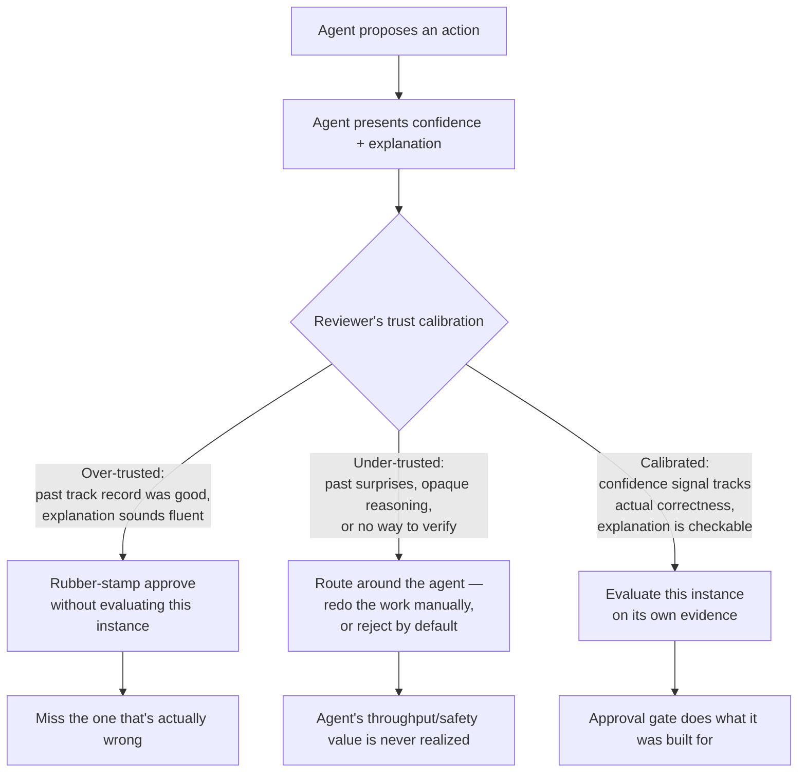
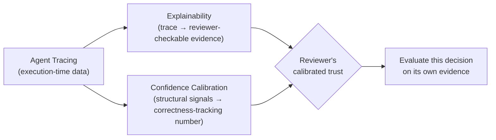

## Trust & Explainability

> Chapter of
> [[production-agent-systems/readme#02 — Reliability, Security & Governance|Reliability, Security & Governance]],
> part of [[production-agent-systems/readme|Production Agent Systems]].

## What you will understand at the end

- Why trust in an agent is not a single dial running from "none" to "full" — it's a calibration
  problem with two distinct failure modes, and the more dangerous one is usually invisible until an
  incident surfaces it
- Why an agent that sounds equally confident whether it's right or guessing is actively worse than
  one that sounds uncertain more often — and what it actually takes to produce a confidence signal
  that correlates with correctness instead of with fluency
- The difference between an explanation that lets a reviewer verify a decision and one that only
  lets them believe it — and why an LLM asked to explain itself defaults to producing the second
- Why explainability is a property you have to design the system to produce _while it runs_, not
  something you can reconstruct afterward by asking the model "why did you do that?"

---

## The mental model

[[production-agent-systems/02-reliability-security-and-governance/08-human-approval-systems/08-human-approval-systems|Human Approval Systems]]
designs the mechanism: the contract a gate presents, the clock it runs against, the audit record it
writes. This chapter is about what's sitting on the other side of that mechanism — a human being who
has to actually make a judgment call, repeatedly, based on incomplete visibility into a system that
sounds confident by default and reasons in ways that don't map cleanly onto how a human would
explain the same decision.

That human is not a passive component. They adapt to the gate's track record, the same way an
on-call engineer adapts to an alert's track record. And exactly like an alert, an approval gate that
usually turns out fine trains its reviewer to stop reading it carefully — which is the same fatigue
mechanism the approval-systems chapter names, but this chapter is about the underlying human-factors
condition that produces it, not the workflow design that mitigates it.

Both `D` and `E` are failure modes of the same underlying problem: the reviewer's trust level isn't
tracking the agent's actual, instance-by-instance reliability. `D` is over-trust — silent until the
one time it's wrong, at which point it's an incident, not a near-miss, because nobody was actually
looking. `E` is under-trust — quieter, more common, and almost never shows up in an incident
post-mortem, because its cost is a foregone efficiency gain rather than a broken system. Both are
addressed by the same two levers, covered in Sections 2 and 3: a confidence signal a human can
actually calibrate against, and an explanation a human can actually check instead of just read.

---

## 1. Trust calibration: two failure modes, not one

"Users don't trust the agent enough" is the complaint that gets raised in a retro. "Users trust the
agent too much" is the failure mode that shows up in an incident review. Both are real, they trade
off against each other, and a system that fixes one by brute force usually makes the other worse.

### Over-trust: rubber-stamping past actual competence

Over-trust is trust that has stopped tracking the agent's actual per-instance reliability and
started tracking something else instead — usually a track record, a fluent tone, or sheer
repetition. It shows up as exactly the approval-fatigue mechanism named in the sibling chapter, but
the causal chain underneath it is worth separating out:

1. The agent is right often enough, early, that the reviewer's prior shifts toward "this is usually
   fine."
2. The agent's explanations are fluent and confident regardless of whether the underlying reasoning
   was actually sound — see Section 2 on why fluency and correctness are not the same signal.
3. The reviewer's approval latency drops, because a fast approval is reinforced (nothing bad
   happens) far more often than a slow, careful one is rewarded (catching the rare bad case).
4. The gate becomes, functionally, an unconditional pass-through wearing an approval UI — which is
   worse than having no gate, because a system with no gate at least doesn't manufacture the false
   confidence that a human reviewed the risky change.

This is the same mechanism that makes automation complacency a well-documented failure mode in
aviation and industrial control long before LLM agents existed — a human monitoring a system that is
usually correct degrades at detecting the rare case where it isn't, and degrades faster the more
fluently the system presents itself. An LLM agent makes this worse on one specific axis: its fluency
doesn't dip when it's wrong the way a human's hedging or uncertainty markers usually do. A junior
engineer who isn't sure will often say so, visibly. A model that's about to hallucinate a config
value says it with the same tone it uses for a value it actually retrieved correctly — which is
exactly the hallucination-management chapter's point about fluency and factuality not being the same
optimization target, now showing up as a trust problem instead of a factual-accuracy problem.

### Under-trust: routing around the agent entirely

Under-trust is the quieter failure, and it's easy to miss because it doesn't produce an incident —
it produces a system that never gets used for what it was built to do. A reviewer who has been
surprised once by an opaque or wrong decision, and has no reliable way to tell a good decision from
a bad one in advance, adopts the only defensible strategy available to them: verify everything from
scratch, or reject by default and do the work manually. Once that happens, the agent's presence in
the workflow stops buying anything — the human is doing the full cognitive work anyway, plus the
overhead of reading the agent's proposal first.

Under-trust is rational, not irrational, given the reviewer's actual information. If the agent gives
no verifiable signal for when it's right versus wrong, "trust nothing, verify everything" is the
correct response to genuine uncertainty, not an overreaction. The fix isn't "convince the user to
trust the agent more" — that's asking a human to recalibrate against evidence they don't have. The
fix is giving them evidence they can actually calibrate against, which is Sections 2 and 3.

### The two failure modes trade off against each other

| Dimension                          | Over-trust                                                            | Under-trust                                                                                        |
| ---------------------------------- | --------------------------------------------------------------------- | -------------------------------------------------------------------------------------------------- |
| **Visible in an incident review?** | Yes — the miss becomes the postmortem                                 | Rarely — it shows up as a missing efficiency gain, not a failure event                             |
| **Root cause**                     | Confidence signal and explanation don't discriminate right from wrong | Confidence signal and explanation don't discriminate right from wrong                              |
| **Naive fix that backfires**       | Add more approval gates — trains reviewers to rubber-stamp faster     | Reduce gates / push for adoption — removes the human's only defense against an unverifiable system |
| **Actual fix**                     | Confidence calibration + real explainability (Sections 2–3)           | Confidence calibration + real explainability (Sections 2–3)                                        |

The row that matters most is the last one: **both failure modes share the same root cause and the
same fix.** This is why "just tune reviewer behavior" doesn't work as a standalone intervention —
you're not miscalibrating the human, the human is correctly calibrating to a signal that itself
isn't calibrated. Fix the signal, and both failure modes move in the right direction at once.

---

## 2. Confidence calibration: making "I'm sure" mean something

[[agentic-ai-engineering/01-agent-cognition/02-decision-making/02-decision-making|Decision Making]]
already names the core problem: "a model can be completely wrong about a fact and still phrase the
resulting decision with total certainty." This chapter picks that thread up specifically for the
human-approval context, because an approval gate is exactly the place where an uncalibrated
confidence signal does the most damage — it's the one number a busy reviewer is most tempted to use
as a shortcut for "do I need to read the rest of this."

### What calibration actually means

A confidence signal is calibrated if, across many decisions, "80% confident" decisions are correct
about 80% of the time — not 95%, not 40%. This is a statistical property you can measure, not a
vibe. It has nothing to do with how the number is phrased (a model saying "I'm fairly confident" is
not more or less calibrated than one saying "I'm 80% sure" — calibration is about the correctness
rate that phrase or number tracks, over many instances, not its wording in any one instance).

The reason this is hard for an LLM specifically: the token-generation process that produces the
_answer_ and the token-generation process that produces a stated _confidence level_ about that
answer are the same mechanism — next-token prediction conditioned on a fluent-sounding continuation.
There is no separate, independent circuit inside the model checking its own work before it reports a
confidence number. A self-reported "90% confident" is, structurally, just another generated string,
subject to the exact same fluency-over-accuracy pull that produces a hallucinated fact in the first
place. Asking the model "how confident are you?" gets you a plausible-sounding number, not a
calibrated one, for the same reason asking it "are you sure that citation is real?" gets you a
plausible-sounding reassurance rather than a genuine check.

### Where a real confidence signal actually comes from

Because self-report doesn't work as the primary source, calibrated confidence has to be assembled
from structural signals outside the model's own narration — the same move
[[ai-foundations/01-language-models-in-practice/08-hallucination-management/08-hallucination-management|Hallucination Management]]
makes for factual grounding, applied here to the decision itself:

| Signal source                         | What it actually measures                                                                                                                                                                                                                    | Where it breaks down                                                                                                                                                                                                                   |
| ------------------------------------- | -------------------------------------------------------------------------------------------------------------------------------------------------------------------------------------------------------------------------------------------- | -------------------------------------------------------------------------------------------------------------------------------------------------------------------------------------------------------------------------------------- |
| **Token-level probability / entropy** | How concentrated the model's output distribution was at each decision point — low entropy means one token dominated, high entropy means the model was choosing among several plausible continuations                                         | Doesn't capture confidence about _facts_, only about _phrasing_ — a model can be highly certain about a wrong fact phrased one specific way                                                                                            |
| **Retrieval/grounding coverage**      | Whether the claim underlying the decision is actually supported by retrieved source material, and how directly                                                                                                                               | Only as good as retrieval quality — a wrong-but-topically-similar document produces false grounding confidence                                                                                                                         |
| **Self-consistency across samples**   | Run the same decision multiple times (possibly at nonzero temperature) and check agreement — high agreement across independent samples correlates with genuine confidence better than a single fluent answer does                            | Expensive (multiplies inference cost by the sample count) and doesn't help when the model is _consistently_ wrong for a structural reason, not a random one                                                                            |
| **Independent verifier pass**         | A second model call, or a deterministic check, whose only job is to evaluate the first decision against evidence — not to generate a fresh answer                                                                                            | Only catches what the verifier is actually checking for; a verifier prompted the same way as the generator inherits the same blind spots                                                                                               |
| **Historical calibration curve**      | Tracking, per agent/version/decision-type, what fraction of past "high confidence" decisions were later confirmed correct — turning confidence into an empirically grounded, continuously-corrected number instead of a one-shot self-report | Requires enough decision volume and enough ground-truth feedback (from `outcome_verified` in the approval audit trail) to be statistically meaningful — cold-start and low-volume decision types have nothing to calibrate against yet |

The practical takeaway: **no single signal above is trustworthy alone, but a decision presented with
several of them agreeing is a materially different claim than a bare "confidence: 0.9" field.** The
`confidence` field in the approval contract from the sibling chapter is only as meaningful as what
actually produced it — a number generated the same way the rest of the response was generated is
decoration; a number backed by retrieval coverage, a verifier pass, or a historical calibration
curve is a real signal a reviewer can act on differently than they'd act on a guess.

### Why an uncalibrated confidence signal is worse than none

A gate with no confidence field at all forces the reviewer to actually read the `context` and
`blast_radius` fields every time — the reviewer knows they have no shortcut, so they don't take one.
A gate with a confidence field that _looks_ authoritative but isn't calibrated gives the reviewer
permission to skip the careful read on exactly the decisions where skipping it is most costly — the
high-stated-confidence ones that happen to be wrong. This is the specific mechanism by which bad
confidence signals actively manufacture the over-trust failure mode from Section 1, rather than
merely failing to prevent it. If you cannot produce a calibrated signal for a given decision class
yet, presenting no confidence number is the honest, lower-risk choice over presenting an
uncalibrated one dressed up as if it were meaningful.

---

## 3. Explainability as a design requirement, not a courtesy

The second lever, and the one that does the most work against under-trust specifically, is whether a
reviewer can actually _evaluate_ a decision after the fact — not just read a story about it that
sounds plausible.

### Post-hoc justification vs. a real causal trace

Ask an LLM "why did you do that?" after it's already taken an action, and it will answer — fluently,
specifically, and with total confidence. The problem is that this question is asked _after_
generation, using the same next-token mechanism that produced the original decision, over a context
that now includes the decision itself. The model is not consulting an internal decision log; it's
generating the most plausible-sounding explanation for an action it can already see it took,
conditioned on that action being correct. This is structurally the same failure mode as asking a
model to double-check its own hallucinated citation — the check runs through the same pathway that
produced the error, so it has no independent power to catch it.

The tell that separates a post-hoc justification from a real causal trace is falsifiability: could
the explanation be wrong in a way you could actually detect? A real causal trace points at specific,
independently-checkable facts — _this_ tool call returned _this_ value, which matched _this_
condition in the plan, which is why _this_ branch executed. A post-hoc justification is a coherent
narrative that's consistent with the outcome but was generated after the outcome, and consistency
with an outcome is a much weaker property than being the actual cause of it — a narrative can be
perfectly consistent with a wrong decision too.

| Property                                | Post-hoc justification                                                   | Real causal trace                                                                                   |
| --------------------------------------- | ------------------------------------------------------------------------ | --------------------------------------------------------------------------------------------------- |
| **When it's produced**                  | After the action, by asking the model to narrate its own reasoning       | During execution, as a byproduct of the execution itself (spans, tool inputs/outputs, plan state)   |
| **What it's grounded in**               | The model's own generated text about itself                              | Independently observable facts — actual tool calls, actual retrieved documents, actual branch taken |
| **Can it be wrong in a checkable way?** | Rarely — a fluent narrative and a fluent _wrong_ narrative look the same | Yes — a claimed tool result can be diffed against the actual logged tool result                     |
| **Cost to produce**                     | Cheap — one more generation call                                         | Requires instrumentation built in from the start; expensive to retrofit                             |
| **What it actually gives a reviewer**   | Something to _believe_                                                   | Something to _verify_                                                                               |

This is exactly why explainability cannot be bolted on after the system is built by adding a "please
explain your reasoning" step to the output — that step produces the left column, not the right one,
no matter how good the prompt is. A real causal trace has to be assembled from data that existed
_during_ execution, which is a data-source and instrumentation decision, not a prompting decision.

### Where the data for a real trace actually comes from

[[production-agent-systems/01-observability/02-agent-tracing/02-agent-tracing|Agent Tracing]] is the
mechanism this section depends on directly: spans around every LLM call and tool call, the actual
inputs and outputs at each step, and the full execution trajectory captured as it happens — not
reconstructed afterward. The relationship between the two chapters is direct and asymmetric: agent
tracing is the _data_ — capture everything, structurally, as a side effect of execution.
Explainability is what you _do_ with that data for a specific audience — a human reviewer trying to
evaluate one decision, right now, without needing to be the engineer who built the system.

Concretely, a decision is explainable in the sense this chapter means if a reviewer, given the
trace, can answer:

1. **What information did the agent actually have** at the moment of the decision — not what it
   claims to have had, but what was actually in its context (retrieved documents, prior tool
   results, memory reads)?
2. **What alternatives did it consider and reject**, and is that rejection reasoning visible in the
   trace rather than only in the final narrative — the `alternatives_considered` field from the
   approval contract is only trustworthy if it's populated from the plan's actual branching, not
   generated after the fact to look complete?
3. **Does the trace support the claimed reasoning**, or does the final narrative claim something the
   trace doesn't actually show — e.g., citing a source document that the retrieval step never
   actually returned?
4. **Would a different, equally plausible narrative also fit the same outcome?** If yes, the
   explanation hasn't actually pinned down causation — it's found _a_ story consistent with the
   result, not _the_ story that produced it.

A reviewer who can answer all four from the trace alone is evaluating the decision. A reviewer who
can only answer them by re-asking the model is being told a story about the decision — and a fluent
story about a wrong decision is indistinguishable, in the moment, from a fluent story about a right
one. That indistinguishability is precisely the gap between "explaining well enough to be believed"
and "explaining well enough to be checked," and it's the entire reason this section exists as design
requirement rather than a UX nicety.

### Explainability composes with the approval contract, not around it

The approval contract's `context` and `alternatives_considered` fields
([[production-agent-systems/02-reliability-security-and-governance/08-human-approval-systems/08-human-approval-systems|Human Approval Systems]]
§1) are where explainability actually surfaces to a reviewer in the moment of decision — but those
fields are only as trustworthy as what populates them. If `context` is generated by asking the model
to summarize its own reasoning after the plan is already built, it's a post-hoc justification
wearing the approval contract's clothing. If `context` is assembled from the actual trace — the
retrieved documents, the tool results, the plan's branch points — it's a real causal trace,
compressed for a human to read quickly rather than fabricated to sound complete. Same field, same
schema, structurally different content, and only one of the two versions gives a reviewer something
they can actually evaluate rather than merely believe.

---

## 4. Putting trust calibration and explainability together

The two levers in this chapter aren't independent — they're the input and the output of the same
loop. Explainability (Section 3) is what gives a reviewer evidence to calibrate their trust against
(Section 1) in the first place; confidence calibration (Section 2) is what tells the reviewer _how
hard_ to look at that evidence for this specific decision. A system with excellent traces but a
confidence number that doesn't correlate with anything still produces over-trust, because the
reviewer never gets the "look harder here" signal even though the evidence to look at exists. A
system with well-calibrated confidence but no real causal trace behind its explanations still
produces under-trust past a point, because "trust me, I'm 85% sure" without checkable reasoning is
still an unverifiable claim — a better-calibrated one, but unverifiable all the same.

Both levers trace back to the same upstream dependency: you cannot calibrate confidence or produce a
real explanation from data that was never captured. This is why this chapter sits downstream of
[[production-agent-systems/01-observability/02-agent-tracing/02-agent-tracing|Agent Tracing]] in the
book's dependency graph rather than beside it — the human-factors problem this chapter is about is
real, but the fix is not a better prompt or a better UI on top of an already-opaque agent. It's
building the agent so the evidence a reviewer would need already exists by the time the approval
gate fires.

---

## Concept check

Before moving on, you should be able to answer these without notes:

| Question                                                                                             | Answer hint                                                                                                                                                                          |
| ---------------------------------------------------------------------------------------------------- | ------------------------------------------------------------------------------------------------------------------------------------------------------------------------------------ |
| Why are over-trust and under-trust described as sharing the same root cause?                         | Both are a reviewer correctly calibrating to an unreliable signal — the fix is fixing the signal, not "convincing" the reviewer either way                                           |
| Why doesn't asking the model "how confident are you?" produce a calibrated confidence number?        | The confidence statement is generated by the same next-token mechanism as the answer itself — no independent check produced it                                                       |
| Name two structural sources of confidence that don't rely on the model's self-report.                | E.g. retrieval/grounding coverage, self-consistency across samples, an independent verifier pass, or a historical calibration curve                                                  |
| What makes a post-hoc justification different from a real causal trace, mechanically?                | A causal trace is assembled from data captured _during_ execution (tool calls, retrieved docs); a justification is generated _after_, conditioned on the outcome already being known |
| Why can't explainability be added by prompting the model to "explain your reasoning" after the fact? | That step generates a plausible-sounding narrative through the same pathway that can produce a wrong decision — it has no independent power to catch its own error                   |
| What's the falsifiability test for whether an explanation is a real causal trace?                    | Could the explanation be wrong in a way you could actually detect against independently logged data — not just "does it sound coherent"                                              |

---

## Vocabulary glossary

| Term                               | Definition                                                                                                                                                                             |
| ---------------------------------- | -------------------------------------------------------------------------------------------------------------------------------------------------------------------------------------- |
| Trust calibration                  | Matching a reviewer's actual trust level to an agent's real, instance-by-instance reliability, rather than to its track record or tone                                                 |
| Over-trust                         | Reviewer trust exceeding actual agent competence — produces rubber-stamping and a missed failure when the agent is wrong                                                               |
| Under-trust                        | Reviewer trust below actual agent competence — produces routing around the agent, erasing its efficiency/safety value                                                                  |
| Automation complacency             | The general human-factors failure where reliance on a usually-correct automated system degrades detection of its rare failures                                                         |
| Confidence calibration             | The property that a stated confidence level correlates with actual correctness rate across many decisions, not just one instance                                                       |
| Self-reported confidence           | A confidence number generated by the model narrating about itself — subject to the same fluency-over-accuracy pull as any other generated text                                         |
| Structural confidence signal       | A confidence source derived from something outside the model's own narration — token entropy, grounding coverage, self-consistency, an independent verifier, or historical calibration |
| Post-hoc justification             | An explanation generated after an action, conditioned on the outcome already being known — plausible, but not independently checkable                                                  |
| Real causal trace                  | An explanation assembled from data captured during execution — independently verifiable against logged facts, not just internally consistent                                           |
| Falsifiability (of an explanation) | Whether an explanation could be shown wrong against independently observable data — the property that separates a trace from a narrative                                               |

## Metadata

|        |                          |
| ------ | ------------------------ |
| Author | Amit Singh               |
| Scope  | production-agent-systems |
