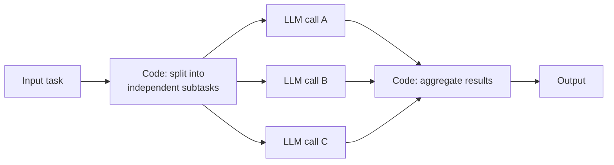

## Parallel Execution

> Chapter of
> [[production-agent-systems/readme#03 — Performance & Cost Engineering|Performance & Cost Engineering]],
> part of [[production-agent-systems/readme|Production Agent Systems]].

## What you will understand at the end

- The parallel execution pattern stated precisely: **code**, not an LLM, splits a task into
  independent subtasks up front and aggregates the results afterward — and why that single fact is
  what separates it from
  [[ai-architecture-and-system-design/00-ai-architecture-patterns/04-orchestrator-worker-pattern/04-orchestrator-worker-pattern|Orchestrator-Workers]],
  a pattern whose diagram looks nearly identical
- The two variants — sectioning and voting — and when each pays off
- How to bound concurrency against a provider's rate limits without either serializing everything
  back down or tripping a 429 storm
- The correctness hazard unique to this pattern: independent branches racing to write the same
  shared agent state, and why "it's just concurrent LLM calls" undersells the concurrency-control
  problem underneath

---

## The mental model

A task is broken into subtasks that don't depend on each other, so they can be dispatched to several
LLM calls at once instead of one after another. The decomposition and aggregation steps are
**ordinary code** — you already know in advance how many subtasks there are and what each one is, so
there is nothing for a model to decide at either boundary.

Compare this against
[[ai-architecture-and-system-design/00-ai-architecture-patterns/04-orchestrator-worker-pattern/04-orchestrator-worker-pattern|Orchestrator-Workers]]'
diagram: the shape is nearly identical, but there the split and combine boxes are LLM calls, decided
at runtime, because the decomposition genuinely can't be known in advance. Here, the split is a
fixed function of the input type, known and testable before the system ever runs. That one
difference carries a large practical consequence — this pattern pays for N LLM calls total;
orchestrator-workers pays for N+2 (the planning call and the synthesis call on top of the same N
workers) — which is exactly why reaching for the heavier pattern when a fixed split would do is
worth catching in review.

Two variations of this same mechanism, both still driven by fixed code at the split and merge:

- **Sectioning** — the task is genuinely divided into distinct, independent subtasks. One LLM call
  reviews a code change for security issues while another reviews it for performance issues; neither
  needs the other's output to do its job.
- **Voting** — the _same_ task is run multiple times, often with varied prompts, temperature, or
  models, to get diverse independent attempts. The results are combined by majority vote or another
  fixed aggregation rule to improve confidence over any single attempt.

---

## 1. When to use it

- The subtasks are genuinely independent — none needs another's output to run, and forcing a task
  with real dependencies into parallel branches produces subtly wrong results, because branches
  can't see each other's output
- The set of subtasks is known ahead of time, so code — not a model — can define the fan-out
- Latency matters: independent LLM calls overlapping in time beat one long sequential chain
- Diverse perspectives or repeated attempts would measurably improve accuracy or confidence, which
  is what the voting variant buys

## Examples

- **Guardrails** — one LLM instance processes the user's actual query while a second, running in
  parallel, screens the same input for policy violations; a downstream aggregation step (code)
  reconciles both before responding. See
  [[production-agent-systems/02-reliability-security-and-governance/01-guardrails/01-guardrails|Guardrails]]
  for the full input/output boundary architecture this feeds into — parallel execution is one way to
  run a content classifier without adding its full latency in front of the main call.
- **Code review** — separate parallel calls each check one dimension (security, performance, style)
  of the same change, instead of one call trying to catch everything at once — the sectioning
  variant.
- **Evaluating borderline content moderation decisions** — multiple prompts assess the same content
  independently, and majority vote reduces the odds of any single evaluation being an outlier — the
  voting variant. This is the same generator-diversity idea
  [[agentic-ai-engineering/03-planning-and-reasoning-algorithms/10-debate-and-critic-agents/10-debate-and-critic-agents|Debate and Critic Agents]]
  covers for using multiple LLM instances to arrive at a more reliable verdict than any one alone.

## Benefits

- Lower latency than running the same subtasks sequentially — independent calls overlap in time
- Higher-confidence outputs via voting, since a single call's error doesn't automatically become the
  final answer
- Clean separation of concerns per subtask (sectioning) — each call is a narrow, well-tuned prompt
  instead of one prompt trying to cover every case at once

---

## 2. Bounding concurrency against provider rate limits

Fanning a task out to N concurrent calls only works up to whatever ceiling the model provider (or
your own budget) actually allows. Two limits usually apply simultaneously and need to be bounded
independently:

| Limit type                                   | What trips it                                                                              | What bounding it looks like                                                                                                                                                |
| -------------------------------------------- | ------------------------------------------------------------------------------------------ | -------------------------------------------------------------------------------------------------------------------------------------------------------------------------- |
| Requests-per-minute / concurrent-request cap | Fan-out width exceeds the provider's per-account or per-key ceiling                        | A semaphore or worker pool capping in-flight calls, independent of how many subtasks the split produced                                                                    |
| Token-per-minute cap                         | Many concurrent calls each carrying a large prompt sum to more tokens/minute than allotted | Track token spend per rolling window, not just request count — a handful of large-context calls can exhaust a token budget well before they exhaust a request-count budget |

The naive implementation — fire all N calls at once and let the HTTP client queue what the provider
rejects — produces a burst of 429s that then have to be retried with backoff, which frequently ends
up _slower_ than a modestly-bounded concurrency pool would have been in the first place, on top of
spending retry budget for no benefit. The fix is a bounded worker pool: cap in-flight calls at a
number comfortably under the provider's stated limit, queue the rest, and let genuinely independent
work still overlap without saturating the ceiling. Where the fan-out width is itself large and
variable (voting with N=20 for a high-stakes decision, say), the pool size — not the subtask count —
is the number that should be tuned against the provider's published limits, and it's worth
revisiting whenever those limits change or a higher usage tier is negotiated.

A **fail-fast-per-branch** default is usually the right complement to bounding: if one of N parallel
calls is going to retry after a 429, that retry should happen on its own branch's timeline, not
block the branches that succeeded on the first attempt from proceeding to the aggregation step.
Aggregation logic that waits on the slowest branch by design (Section 3 below) needs a policy for
how long it's willing to wait before treating a not-yet-returned branch as failed rather than merely
slow.

---

## 3. The correctness hazard: parallel writes to shared agent state

Independent LLM calls are easy to reason about when each one only reads its own inputs and returns
its own output — the code diagram above assumes exactly this. The hazard appears the moment two or
more parallel branches are given write access to something they share: a conversation memory store,
a working-state object the agent updates as it goes, a shared cache, or a database row more than one
branch's tool call can touch.

This is an ordinary concurrent-writes problem wearing agentic-system clothing, and it doesn't get a
pass just because the writers are LLM-driven rather than hand-written threads:

- **Lost updates.** Branch A reads shared state, branch B reads the same state before A's write
  lands, both compute a new value from the same stale read, and whichever writes last silently
  overwrites the other's update — the same read-modify-write race any concurrent system has, except
  here the "modify" step is a non-deterministic LLM call instead of a deterministic function, which
  makes the race harder to reproduce in a test.
- **Interleaved partial writes.** If a branch's write to shared state isn't atomic (e.g., updating
  three related fields as three separate calls), another branch can observe the object mid-update —
  a state that was never a valid, fully-formed state at any point in time.
- **Aggregation reading before all writes land.** The aggregation step (Section 1's "Code: aggregate
  results" box) has to be certain every branch has actually finished writing before it reads — a
  fan-in that reads as soon as N responses arrive, without confirming any side-effecting writes
  those responses triggered have also completed, can aggregate against an incomplete picture.

**The mitigation is standard concurrency discipline, applied deliberately rather than assumed
away:** give each parallel branch its own isolated scratch state and merge explicitly in the
aggregation step, rather than letting branches write directly into a shared object; where a
genuinely shared resource must be written concurrently, protect it with the same locking,
optimistic-concurrency (version checks), or single-writer-queue patterns you'd use for any other
concurrent system. The sectioning/voting split from Section 1 already helps here structurally:
sectioning's independent subtasks rarely need to share mutable state at all if scoped correctly, and
voting's parallel attempts are naturally read-only against the same input, with the only write
happening once, in aggregation, after every vote is in. The hazard is specifically for designs that
reach for a shared mutable object as a shortcut around passing data through the aggregation step
explicitly — a shortcut that trades a visible data flow for an invisible race condition.

---

## Tradeoffs and pitfalls

- Only pays off when subtasks are truly independent — forcing a task with real dependencies into
  parallel branches produces subtly wrong results, because branches can't see each other's output
- Aggregation logic has to anticipate every shape the parallel outputs can take; a malformed or
  unexpected result from one branch can break the merge step if it isn't defensively handled
- Voting adds direct cost — running N calls instead of one costs roughly N times as much, so it's
  only worth it where the accuracy gain justifies the spend
- Easy to mistake for
  [[ai-architecture-and-system-design/00-ai-architecture-patterns/04-orchestrator-worker-pattern/04-orchestrator-worker-pattern|Orchestrator-Workers]]
  from the diagram shape alone — check whether the split/aggregate steps are code (this pattern) or
  an LLM (orchestrator-workers)

---

## Concept check

| Question                                                                                                                      | Answer hint                                                                                                                                                                                                                                                         |
| ----------------------------------------------------------------------------------------------------------------------------- | ------------------------------------------------------------------------------------------------------------------------------------------------------------------------------------------------------------------------------------------------------------------- |
| What single fact distinguishes Parallel Execution from Orchestrator-Workers?                                                  | Whether the split/aggregate steps are fixed code (this pattern) or LLM calls decided at runtime (orchestrator-workers) — the diagrams otherwise look alike                                                                                                          |
| What's the difference between sectioning and voting?                                                                          | Sectioning splits one task into distinct independent subtasks; voting runs the _same_ task multiple times and combines diverse attempts                                                                                                                             |
| Why does firing all N parallel calls at once with no concurrency cap often end up slower than a bounded pool?                 | It trips provider rate limits, producing a burst of 429s that then need backoff-retried, which frequently costs more time than a modestly-bounded pool would have                                                                                                   |
| What is a "lost update" in the shared-state hazard, and why is it worse here than in an ordinary concurrent system?           | Two branches read the same stale state and each write a value computed from it; the last write wins and silently discards the other's update — the LLM's non-determinism makes the race harder to reproduce in a test than an equivalent race in deterministic code |
| Why does sectioning rarely need shared mutable state if scoped correctly, but voting structurally avoids the hazard entirely? | Sectioning's subtasks are independent by design and can be given isolated scratch state; voting's parallel attempts are read-only against the same input, with the only write happening once, in aggregation, after every vote is in                                |

---

## Vocabulary glossary

| Term                     | Definition                                                                                                                                        |
| ------------------------ | ------------------------------------------------------------------------------------------------------------------------------------------------- |
| Sectioning               | Splitting a task into distinct, independent subtasks run in parallel, each covering a different part of the whole                                 |
| Voting                   | Running the same task multiple times in parallel and combining the results by majority vote or another fixed rule                                 |
| Fan-out / fan-in         | The split step that dispatches parallel calls (fan-out) and the aggregation step that collects their results (fan-in)                             |
| Bounded concurrency pool | A cap on in-flight parallel calls, set below a provider's rate limit, so excess work queues instead of tripping 429s                              |
| Lost update              | A concurrent-write race where two branches read the same stale state and one branch's write silently overwrites the other's                       |
| Read-modify-write race   | The general concurrency hazard where a value is read, computed on, and written back without protecting against a concurrent writer doing the same |

## Metadata

|        |                          |
| ------ | ------------------------ |
| Author | Amit Singh               |
| Scope  | production-agent-systems |
