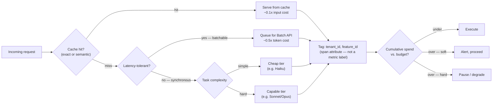

## Cost Engineering

> Chapter of
> [[production-agent-systems/readme#03 — Performance & Cost Engineering|Performance & Cost Engineering]],
> part of [[production-agent-systems/readme|Production Agent Systems]].

## What you will understand at the end

- Why "cost engineering" is a strategy layer sitting on top of mechanics you've already built —
  caching, model tiers, batch infrastructure — and what decisions actually live at this altitude
  versus the chapters that implement each mechanism
- The four levers that move agent spend in practice, what each one costs to operate, and the
  tradeoff each one trades away
- Why cost attribution has the exact same cardinality problem as any other high-churn label, and
  what to tag instead of a raw tenant ID
- Why a token-spend budget alert is the same design pattern as an SLO burn-rate alert, wearing a
  dollar sign instead of a percentage
- A worked cost breakdown showing what stacking three of these levers actually buys, in dollars, on
  a single hypothetical workload

---

## The mental model — engineering levers vs. the ROI story

[[08-ai-economics-and-roi|AI Economics & ROI (Part 01 of Agentic AI: Projects & Engineering Mastery)]]
is the chapter you hand to a CFO or VP Engineering: token spend, infra cost, and
engineering-time-saved rolled into a narrative that justifies the platform investment. This chapter
is the one you actually work from. It does not re-derive that narrative — it produces the numbers
that narrative depends on. If Part 01 of Agentic AI: Projects & Engineering Mastery's chapter says
"we cut agent cost 60% this quarter," this chapter is where that 60% actually came from, lever by
lever, and it's the chapter you reach for again next quarter when the number needs to move further.

The four levers below share a structure worth naming up front: each one has a **mechanics chapter**
that covers how the underlying feature works, and this chapter is where you decide **whether and how
hard to pull it** for your specific cost profile. [[06-semantic-caching|Semantic Caching]] and
[[07-response-caching|Response Caching]] explain how caching works; this chapter is where you decide
your caching _strategy_ — what to cache, for how long, and whether the hit rate you're getting
justifies the operational cost of running a cache at all.

Reading the diagram left to right is reading this chapter's structure: cache first (cheapest tokens
you'll ever buy are the ones you don't re-fetch), route what's left by latency tolerance and
complexity, tag every path with who's paying for it, and gate the whole thing against a budget
before letting spend happen — not after.

---

## The four levers, at a glance

| Lever                   | Decided here (this chapter)                                                        | Mechanics covered elsewhere                                                                      | Typical savings                                                     | Primary tradeoff                                                    |
| ----------------------- | ---------------------------------------------------------------------------------- | ------------------------------------------------------------------------------------------------ | ------------------------------------------------------------------- | ------------------------------------------------------------------- |
| Caching strategy        | What to cache, TTL, hit-rate target, when caching isn't worth the operational cost | [[06-semantic-caching\|Semantic Caching]], [[07-response-caching\|Response Caching]]             | ~90% off the cached fraction (cache reads run at ~0.1x input price) | Stale answers if invalidation lags the underlying data              |
| Batching                | Which requests can tolerate async turnaround; intra-request batching of sub-tasks  | Provider Batch API mechanics; request-shape decisions in your own harness                        | 50% off token cost (Batch API), plus fixed-overhead amortization    | Up to 24h turnaround; only fits latency-insensitive work            |
| Model routing / tiering | Cost ceiling per request class; % of traffic each tier should carry                | [[07-model-selection-and-routing\|Model Selection & Routing]]                                    | 3–5x per-request cost delta between tiers                           | Misclassification sends hard requests to a model that can't do them |
| Inference optimization  | How much context and output the task actually needs                                | [[04-token-optimization\|Token Optimization]], [[05-context-optimization\|Context Optimization]] | Directly proportional to tokens trimmed                             | Over-trimming degrades output quality before it shows up in evals   |

None of these levers is free to operate — each one adds a decision point, a failure mode, and
something to monitor. The rest of this chapter is about deciding _which_ of them earn their
complexity for a given workload, not about pulling all four reflexively.

---

## Lever 1 — Caching strategy

The mechanics chapters answer "how does the cache work." This chapter answers "should this workload
have one, and what exactly goes in it."

**What makes a workload cache-worthy:** a stable prefix that recurs across many requests within the
cache's TTL window. An agent's system prompt plus tool schemas is almost always this — it's
identical on request 1 and request 10,000, and at any real request volume, the 5-minute (or 1-hour)
TTL window contains many requests, so the cache stays warm continuously rather than cycling cold on
every gap. A workload that's bursty with long idle gaps between bursts is a worse fit — you pay the
cache-write premium on every burst and rarely live long enough inside the TTL to earn it back.

**The economics, stated plainly:** a cache write costs roughly 1.25x the base input price (2x for a
1-hour TTL); a cache read costs roughly 0.1x. Two things follow directly:

- **Break-even is a request-count question, not a "should I cache" binary.** At 5-minute TTL, two
  requests against the same cached prefix roughly break even versus not caching at all; every
  request after that is close to pure savings. At 1-hour TTL you need roughly three requests to
  break even, because the write premium is higher — but the entry survives longer gaps between
  requests. Pick the TTL based on your traffic's actual inter-arrival gaps, not by defaulting to
  whichever tier the SDK examples happen to show.
- **Hit rate is the KPI, and it belongs on a dashboard, not just in a design doc.** A caching layer
  with a 30% hit rate on a workload that could support 90% is a silent cost leak — the cache is
  running (write premium included) but not earning its keep. Track cache-read-to-write ratio per
  route; a route where writes dominate reads is either mis-cached (prefix changes too often to
  stabilize) or wrongly TTL'd.

**Semantic caching is a precision/savings tradeoff, made explicit at the strategy layer.**
[[06-semantic-caching|Semantic Caching]] covers the embedding and similarity-threshold mechanics;
the strategy decision is how much recall you're willing to trade for hit rate. A looser similarity
threshold catches more near-duplicate queries (higher hit rate, more savings) at the cost of
occasionally serving a plausible-but-wrong cached answer for a query that was subtly different. That
failure mode is invisible in a cost dashboard and only shows up in a correctness eval — so a
semantic-caching rollout needs a correctness gate in the loop, not just a cost target.

---

## Lever 2 — Batching

"Batching" collapses two genuinely different mechanisms that get conflated because they both
amortize a fixed cost across multiple units of work.

**Provider-level batch processing** (the Anthropic Batch API and its equivalents) trades latency for
a flat 50% discount on token cost, with turnaround typically under an hour and a documented ceiling
of 24 hours. This is the easy lever to reach for: any workload where nobody is waiting synchronously
on the response — nightly reclassification, bulk enrichment, backfilling embeddings, offline
evaluation runs — should default to batch pricing unless there's a concrete reason it can't.

**Intra-request batching** is the less obvious lever, and it's a design decision rather than a
provider feature: grouping several logically independent sub-tasks into _one_ model call instead of
one call each, to amortize the fixed overhead every call pays regardless of task size — the system
prompt, the tool schema list, the few-shot examples. If your system prompt and tool definitions run
2,000 tokens and you're making ten separate calls to classify ten short items, you're paying that
2,000-token overhead ten times. Batching those ten items into one call with one system-prompt
payment and ten items in the user turn pays the fixed cost once. This is the same overhead problem
prompt caching solves, attacked from the request-shape side instead of the caching side — the two
levers compose rather than compete: cache the system prompt _and_ batch the items, and the
fixed-cost payment nearly disappears either way.

**Where intra-request batching breaks down:** output quality on the batched items degrades if the
model has to hold too many independent judgments in one response — batching is for genuinely
independent, small, low-stakes classification-shaped work, not for anything where cross-item
reasoning or long individual outputs are expected. Above roughly a few dozen items per batched call,
you're usually better served by the provider Batch API's parallelism than by cramming more items
into one request.

---

## Lever 3 — Model routing / tiering

[[07-model-selection-and-routing|Model Selection & Routing]] covers the router itself — the
classifier, the fallback chain, the `effort` dial within a tier. At the cost-engineering altitude,
routing is a budget decision stated as a policy: _what's the cost ceiling for this request class,
and what fraction of traffic should each tier carry to stay under it._

Two things belong to this chapter specifically, not the routing mechanics chapter:

- **Tier mix as a FinOps metric, tracked over time.** The router's classifier accuracy is an
  eval-team concern; the _distribution_ of traffic across tiers is a cost-engineering concern. If
  your cheap-tier share of traffic drifts down over a few weeks with no corresponding change in
  request mix, that's a routing regression burning money silently — worth its own dashboard panel,
  not just a debugging afterthought when the monthly bill spikes.
- **The cost ceiling is set here, the classifier is tuned there.** "Simple requests must cost under
  $0.002 to serve" is a cost-engineering requirement handed to whoever builds the router; the router
  then decides how to hit it (rule-based routing, a cheap classifier pass, escalation-on-failure —
  see the mechanics chapter). Don't let the cost target get implicitly baked into classifier logic
  where it's invisible to anyone doing a cost review later.

---

## Lever 4 — Inference optimization

This is the lever with the most surface area and the least glamour: every token you don't send and
don't generate is a token you don't pay for. [[04-token-optimization|Token Optimization]] and
[[05-context-optimization|Context Optimization]] cover the mechanics — prompt compression, few-shot
pruning, relevance-ranked retrieval over raw context dumps. The cost-engineering framing is simpler
than either of those chapters: **every token trimmed has a linear, immediate dollar effect**, which
makes this the lever with the fastest feedback loop and the easiest one to over-apply, because the
savings are visible before the quality regression is.

Two things worth stating explicitly here because they're easy to get backwards:

- **Streaming is not a cost lever.** It changes time-to-first-token, not total tokens billed —
  streaming and non-streaming requests for the same content cost the same. Don't reach for streaming
  when the actual ask is "make this cheaper"; that's a latency optimization wearing a cost hat.
- **`effort` is a cost lever independent of model tier**, and it composes with routing rather than
  replacing it — two requests on the same tier can still differ meaningfully in token spend based on
  effort level (see the effort discussion in
  [[07-model-selection-and-routing|Model Selection & Routing]]). A cost review that only looks at
  tier mix and ignores effort distribution is missing half the picture.

The trimming itself always trades against quality somewhere — an over-compressed prompt or an
over-aggressively truncated context window degrades output before it shows up as an obvious failure,
which is exactly why this lever needs an eval gate in the loop the same way semantic caching does.
Cheaper and worse is not a win; it's a regression wearing a lower invoice.

---

## Cost attribution — knowing who is driving spend

A dollar total with no attribution is close to useless for cost engineering — you can't act on "we
spent $4,200 on inference yesterday" without knowing whose workload produced it. Attribution is what
turns a bill into a set of decisions: which tenant needs a tighter budget, which feature should be
deprecated because its cost-per-value is upside down, which team's traffic spike needs a routing
change instead of a shrug.

### The cardinality trap

Attribution by tenant or feature runs straight into the same cardinality problem as any other
high-churn label. A raw `tenant_id` on a Prometheus-style metric is exactly the kind of label this
book's engineering discipline flags as an automatic stop — unbounded cardinality, one active series
per tenant, and it only gets worse as the tenant base grows. The fix is the same fix that applies
everywhere else this problem shows up: **push the high-cardinality identifier to logs and traces,
and keep metrics bounded to a small, stable set of cohorts.**

Concretely:

| Where it lives       | What goes there                                                            | Why                                                                                                         |
| -------------------- | -------------------------------------------------------------------------- | ----------------------------------------------------------------------------------------------------------- |
| Trace span attribute | `tenant_id`, `feature_id`, `request_id`, exact token counts                | High-cardinality, but traces are sampled/retained differently than metrics — this is what exemplars are for |
| Structured log field | Same identifiers, plus the routing decision and cache hit/miss             | Queryable after the fact without a cardinality budget                                                       |
| Metric label         | `tenant_tier` (e.g. free/pro/enterprise), `feature_category`, `model_tier` | Bounded set, safe to aggregate and alert on directly                                                        |

The pattern this enables: an aggregate metric (spend by tier, spend by feature category) tells you
_that_ something moved; an exemplar or a trace query against the same time window tells you exactly
_which_ tenant or request moved it — without ever putting the unbounded identifier on the metric
itself. This is the same design [[06-ai-gateways|AI Gateways]] typically enforces as a platform
capability — an AI gateway sitting in front of every model call is a natural place to inject the
attribution tags once, rather than every caller re-implementing it.

### A minimal attribution schema

For most agent platforms, four dimensions cover the questions cost review actually asks:

- **Tenant** — who is this on behalf of (customer, team, internal service)
- **Feature** — which product surface or agent capability generated the call
- **Model tier** — which router decision served it (feeds directly into the tiering lever above)
- **Cache outcome** — hit, miss, or not-attempted (feeds directly into the caching lever above)

If your platform can answer "how much did tenant X spend on feature Y last week, broken down by
model tier and cache hit rate" from a single query, the attribution layer is doing its job. If that
question requires grepping raw logs across services, the attribution schema isn't finished yet — and
it's also the schema [[10-multi-tenant-architectures|Multi-Tenant Architectures]] needs solved for
reasons well beyond cost (isolation, rate limiting, per-tenant SLOs).

---

## Budget alerting — token spend as a first-class signal

Treat token spend the way you'd treat latency or error rate, not the way you'd treat a monthly
invoice you glance at after the fact. This is the same reframing
[[11-failure-recovery|Failure Recovery]] makes when it calls out an unbounded retry policy as
functionally an error-budget decision — cost and reliability share the same alerting vocabulary once
you stop treating spend as an accounting afterthought and start treating it as an SLI, alongside the
treatment in [[08-ai-slos|AI SLOs]].

### Burn-rate alerts beat threshold alerts

A threshold alert — "page when daily spend exceeds $X" — fires only after the damage is done and
gives you no lead time. The better pattern, borrowed directly from SLO error-budget burn-rate
alerting, is to alert on _rate of consumption against a budget window_: if a tenant has burned 80%
of its daily token budget by hour 10 of a 24-hour day, that's a 2x-normal burn rate and worth paging
on now, even though the tenant hasn't technically exceeded anything yet. The math is identical to an
SLO burn-rate calculation — only the denominator changed from "error budget" to "dollar budget."

### Soft budgets vs. hard budgets

| Type            | Behavior at the limit                                                                             | When to use it                                                                                                                         |
| --------------- | ------------------------------------------------------------------------------------------------- | -------------------------------------------------------------------------------------------------------------------------------------- |
| **Soft budget** | Alert fires; a human decides whether to intervene; work continues                                 | Default posture — most workloads shouldn't halt on a budget signal alone                                                               |
| **Hard budget** | The platform itself refuses further spend on that unit of work until the cap is raised or removed | Anything where a runaway loop could spend unboundedly with no human in the loop — long-horizon autonomous agents are the textbook case |

Hard budgets aren't a hypothetical design pattern — Anthropic's own Managed Agents platform ships
one as a first-class primitive: a session can be created with a dollar-denominated spend cap, and
the platform checks cumulative cost _before_ every model request, pausing the session
(`stop_reason: budget_reached`) rather than terminating it once the cap is reached — the session
sits paused, resumable by raising or removing the budget, not silently killed. That's the shape to
copy if you're building the equivalent gate yourself: check cumulative spend against the cap before
issuing the next model call, not after, and pause rather than destroy state when the cap is hit.

### The nested-budget lesson, again

[[11-failure-recovery|Failure Recovery]] shows why nested retry-attempt budgets multiply instead of
add — a 3x tool-call retry inside a 3x step retry inside a 3x run retry is 27 attempts at the
bottom-most action, not 9. The cost version of that lesson is identical: a workflow-level retry
policy that looks individually reasonable at every layer can multiply token spend the same way it
multiplies attempt counts. A cumulative, dollar-denominated budget enforced at the run level — not
attempt counts at each layer — is the backstop that catches this regardless of which layer's retry
logic misbehaves. This is exactly why budget alerting belongs next to reliability engineering, not
filed under finance.

---

## Worked example — a support-ticket triage agent

The numbers below are illustrative, not measured — a constructed scenario to show how the levers
compose, not a benchmark result. Pricing is Claude Sonnet 5 at $3/$15 per million input/output
tokens and Claude Haiku 4.5 at $1/$5, current at time of writing; treat the _shape_ of the savings,
not the exact dollar figures, as the durable takeaway.

**Scenario:** 100,000 support tickets/day, one agent call per ticket. System prompt + tool schemas:
3,000 tokens, identical every call. Ticket-specific content (ticket text, retrieved context): 2,000
tokens, unique every call. Baseline output: 500 tokens average.

| Stage                                                                                                     | $ / ticket | $ / day (100K tickets) | Cumulative reduction |
| --------------------------------------------------------------------------------------------------------- | ---------: | ---------------------: | -------------------: |
| **Baseline** — every ticket to Sonnet 5, no caching                                                       |    $0.0225 |                 $2,250 |                    — |
| **+ Prompt caching** — cache the 3K-token system+tool block, reads at ~0.1x                               |    $0.0144 |                 $1,440 |                  36% |
| **+ Model routing** — 70% classify as simple → Haiku (300-tok output), 30% stay Sonnet 5 (500-tok output) |   $0.00698 |                   $698 |                  69% |
| **+ Batching** — the 70% simple/async-tolerant tickets route through the Batch API at 50% off             |   $0.00565 |                   $565 |                  75% |

Reading the stack: caching alone recovers a little over a third of the baseline by eliminating the
repeated fixed-overhead payment on the stable system prompt. Routing does the heaviest lifting —
sending most of the volume to a tier roughly 3x cheaper per token cuts the total by another third on
top of caching. Batching, applied only to the subset that's both cheap-tier _and_ latency-tolerant
(a password-reset triage doesn't need a synchronous answer), squeezes out the last increment. None
of the three levers alone gets anywhere near 75% — they compose because they're independent axes
(what's cached, which tier serves it, whether it's synchronous), not because any single lever is
that powerful on its own.

The number that actually belongs in a cost review isn't "$565/day" as an aggregate — it's that
figure broken down by whichever tenant or feature generated the 100,000 tickets, using the
attribution schema above. That per-tenant breakdown is what feeds the ROI narrative in
[[08-ai-economics-and-roi|AI Economics & ROI (Part 01 of Agentic AI: Projects & Engineering Mastery)]];
this chapter's job ends at producing a number you can trust, not at explaining it to a VP.

---

## Concept check

| Question                                                                                                              | Answer hint                                                                                                                                                                                                                          |
| --------------------------------------------------------------------------------------------------------------------- | ------------------------------------------------------------------------------------------------------------------------------------------------------------------------------------------------------------------------------------ |
| How does this chapter differ from Part 01 of Agentic AI: Projects & Engineering Mastery's AI Economics & ROI chapter? | This chapter produces the per-lever numbers (caching, batching, routing, inference); that chapter turns aggregate numbers into a leadership-facing ROI narrative                                                                     |
| What makes a workload a good fit for caching versus a poor fit?                                                       | A stable, recurring prefix inside the TTL window is a good fit; bursty traffic with long idle gaps between bursts pays the write premium without earning enough reads back                                                           |
| Why are there two different things called "batching" in this chapter?                                                 | Provider-level Batch API processing (async, 50% off) and intra-request batching (grouping sub-tasks into one call to amortize fixed overhead) are different mechanisms that both amortize a fixed cost                               |
| Why shouldn't `tenant_id` go on a metric label?                                                                       | Unbounded cardinality — the same high-churn-label problem as request IDs or user IDs; push it to logs/traces and use exemplars, keep metrics on a bounded tier label                                                                 |
| Why is a burn-rate budget alert better than a threshold alert?                                                        | It gives lead time by alerting on rate of consumption against a budget window, the same math as an SLO error-budget burn-rate alert, instead of firing only after the cap is already exceeded                                        |
| What's the difference between a soft and a hard budget, and when do you need a hard one?                              | Soft budgets alert and let a human decide; hard budgets have the platform refuse further spend automatically — needed wherever a runaway loop could spend unboundedly with no human in the loop, e.g. long-horizon autonomous agents |
| Why is streaming not a cost lever?                                                                                    | It changes time-to-first-token, not total tokens billed — the same content costs the same whether streamed or not                                                                                                                    |

---

## Vocabulary glossary

| Term                      | Definition                                                                                                                                                                                             |
| ------------------------- | ------------------------------------------------------------------------------------------------------------------------------------------------------------------------------------------------------ |
| Cost engineering          | Deciding which cost-reduction levers to pull, how hard, and for which workloads — the strategy layer above each lever's mechanics                                                                      |
| Cache hit rate            | The fraction of requests served from cache rather than paying full inference cost — the KPI that tells you whether a caching layer is earning its write premium                                        |
| Intra-request batching    | Grouping several independent sub-tasks into one model call to amortize the fixed cost of the system prompt and tool schemas, as distinct from provider-level Batch API processing                      |
| Tier mix                  | The distribution of traffic across model tiers under a routing policy — a FinOps metric distinct from the router's classification accuracy                                                             |
| Cost attribution          | Tagging spend by tenant, feature, model tier, and cache outcome so an aggregate dollar figure can be traced back to who or what drove it                                                               |
| Burn-rate budget alert    | An alert triggered by the _rate_ at which a spend budget is being consumed relative to its window, not just by crossing an absolute threshold — the cost analog of an SLO error-budget burn-rate alert |
| Soft budget / hard budget | A soft budget alerts and leaves the decision to a human; a hard budget has the platform itself refuse further spend once the cap is reached                                                            |
