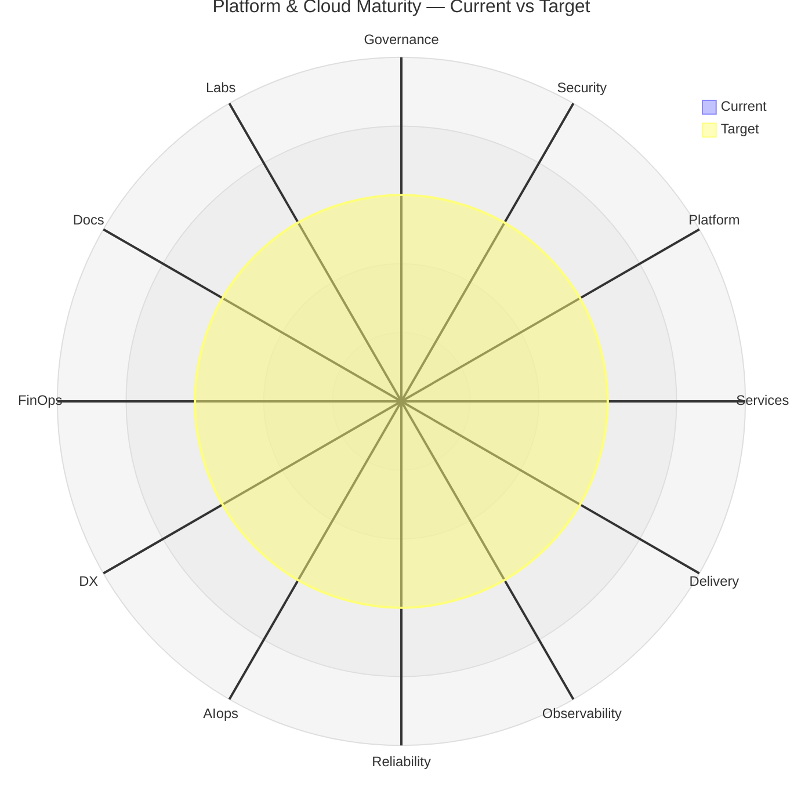

## Platform & Cloud Maturity Model (L1 → L5)

## Overview

This model defines maturity progression across core platform and cloud architecture pillars. It is
designed for practical adoption in Azure-centric environments with evolving observability and SRE
practices.

| Level | Name         | Description                       |
| ----- | ------------ | --------------------------------- |
| L1    | Ad Hoc       | Reactive, fragmented, tool-driven |
| L2    | Defined      | Basic standards, partial adoption |
| L3    | Standardized | Organization-wide consistency     |
| L4    | Measured     | SLO-driven, data-informed         |
| L5    | Optimized    | Autonomous, predictive systems    |

---

## Governance

- **L1**: No standards, teams operate independently
- **L2**: Basic policies (naming, tagging), inconsistent enforcement
- **L3**: Central governance model, enforced via pipelines
- **L4**: Policy-as-code (Azure Policy/OPA), audit + drift detection
- **L5**: Continuous compliance, auto-remediation

---

## Security

- **L1**: Static credentials, minimal controls
- **L2**: RBAC, secrets stored in Key Vault
- **L3**: Managed identities, network isolation
- **L4**: Integrated security (Defender, SIEM), vulnerability management
- **L5**: Zero-trust, automated threat response

---

## Platform (Infrastructure + Runtime)

- **L1**: Manual provisioning, snowflake environments
- **L2**: Infrastructure as Code introduced
- **L3**: Standardized templates (ACA, Functions, DBs)
- **L4**: Self-service platform (golden paths)
- **L5**: Fully abstracted, policy-driven provisioning

---

## Services

- **L1**: [[patterns/04-microservice-patterns/01-monolithic/01-monolithic|Monolithic]] systems
- **L2**: Basic service separation
- **L3**: Clear service boundaries, API contracts
- **L4**: Resilience patterns (retry,
  [[patterns/04-microservice-patterns/07-circuit-breaker/07-circuit-breaker|circuit breaker]])
- **L5**: Adaptive, self-optimizing services

---

## Delivery (CI/CD)

- **L1**: Manual deployments
- **L2**: Basic pipelines
- **L3**: Standardized CI/CD workflows
- **L4**: Progressive delivery (canary, blue/green)
- **L5**: Autonomous delivery (policy + metrics gating)

---

## Observability

- **L1**: Logs only
- **L2**: Metrics + logs, basic dashboards
- **L3**: Unified observability (metrics, logs, traces)
- **L4**: SLO-based alerts, actionable insights
- **L5**: Context-aware observability feeding AIops

---

## Reliability (SRE)

- **L1**: Reactive firefighting
- **L2**: Basic SLAs
- **L3**: SLOs and error budgets
- **L4**: Error budgets influence releases
- **L5**: Chaos engineering, auto-recovery

---

## AIops

- **L1**: Alert noise
- **L2**: Alert correlation
- **L3**: Anomaly detection
- **L4**: Root cause suggestions
- **L5**: Autonomous remediation

---

## Developer Experience (DX)

- **L1**: High friction, tribal knowledge
- **L2**: Basic documentation
- **L3**: Templates and onboarding guides
- **L4**: Developer portal, self-service
- **L5**: AI-assisted workflows

---

## FinOps

- **L1**: No visibility
- **L2**: Basic tracking
- **L3**: Cost allocation and dashboards
- **L4**: Optimization practices enforced
- **L5**: Automated cost optimization

---

## Documentation

- **L1**: Scattered
- **L2**: Centralized repository
- **L3**: Structured (runbooks, standards)
- **L4**: Versioned and system-linked
- **L5**: AI-queryable knowledge base

---

## Labs / Innovation

- **L1**: No experimentation
- **L2**: Ad hoc POCs
- **L3**: Structured experimentation
- **L4**: Roadmap-aligned innovation
- **L5**: Continuous innovation pipeline

---

## Recommended Target State

Focus on achieving **L3 maturity** across core pillars:

- Platform
- Delivery
- Observability
- Reliability

This enables:

- Consistent system behavior
- Scalable operations
- Foundation for AIops

---

## Notes

- Progression should be incremental; avoid skipping levels
- Observability (L3+) is a prerequisite for meaningful SRE and AIops
- Security and governance should evolve in parallel, not as afterthoughts

---

## Scoring Model (0–5 per pillar)

Each pillar is scored on an integer scale of 0–5. The scale extends the L1 → L5 rubric above with a
`0` for "absent / not started", which the level-based rubric does not cover.

| Score | Anchor       | Definition                                                                 |
| ----- | ------------ | -------------------------------------------------------------------------- |
| 0     | Absent       | Capability does not exist; no ownership, no artefacts, no signal           |
| 1     | Ad Hoc       | Reactive, fragmented, tool-driven (per L1)                                 |
| 2     | Defined      | Basic standards in writing, partial adoption (per L2)                      |
| 3     | Standardized | Org-wide consistency, enforced via templates / pipelines / policy (per L3) |
| 4     | Measured     | SLO-driven, metric-informed, drift detected automatically (per L4)         |
| 5     | Optimized    | Autonomous, predictive, self-healing or self-correcting (per L5)           |

### Scoring rules

- **Integer only.** No half-points — round down on partial coverage to keep gap analysis honest.
- **Score the weakest link.** A pillar is at the level of its least-mature workload, not its best
  one. If 90% of services are L3 and 10% are L1, the pillar score is 1 — those laggards are where
  the next investment goes.
- **Evidence-based.** Every score above 0 must point to a concrete artefact: a policy file, a
  dashboard, a runbook, an SLO definition, a CI gate, an incident retro that exercised the
  capability. If you can't link to evidence, the score is one level lower.
- **Re-score on cadence.** Pillars age. A score recorded six months ago is a hypothesis, not a fact.
  Default cadence: quarterly for active pillars, semi-annually for steady-state ones.

### Assessment table template

Use this table to capture a point-in-time snapshot. Keep a dated copy per assessment — the delta
over time is the actual signal.

| Pillar        | Current | Target | Gap | Owner | Evidence | Notes |
| ------------- | ------- | ------ | --- | ----- | -------- | ----- |
| Governance    |         |        |     |       |          |       |
| Security      |         |        |     |       |          |       |
| Platform      |         |        |     |       |          |       |
| Services      |         |        |     |       |          |       |
| Delivery      |         |        |     |       |          |       |
| Observability |         |        |     |       |          |       |
| Reliability   |         |        |     |       |          |       |
| AIops         |         |        |     |       |          |       |
| DX            |         |        |     |       |          |       |
| FinOps        |         |        |     |       |          |       |
| Documentation |         |        |     |       |          |       |
| Labs          |         |        |     |       |          |       |

`Gap = Target − Current`. Any pillar with `Gap ≥ 2` is a candidate for the next quarter's investment
plan.

---

## Radar Chart Structure

The 12 pillar scores form a natural radar / spider plot — one axis per pillar, two overlays (current
and target) showing the shape of the gap.

### Axes and dataset shape

- **Axes (12)**: Governance, Security, Platform, Services, Delivery, Observability, Reliability,
  AIops, DX, FinOps, Documentation, Labs
- **Range**: 0–5 per axis (must match scoring scale exactly)
- **Datasets**: at minimum two — `current` and `target`. Optional third — `peer-benchmark` (where
  available) or `previous-quarter` for trendlines.

### Portable data block

Capture scores in this structured form alongside the assessment table — it's what feeds any chart
renderer (mermaid, Grafana, matplotlib, Excel).

```yaml
maturity_assessment:
  date: 2026-05-01
  scope: lab          # lab | platform | both
  axes:
    - Governance
    - Security
    - Platform
    - Services
    - Delivery
    - Observability
    - Reliability
    - AIops
    - DX
    - FinOps
    - Documentation
    - Labs
  datasets:
    current:  [0, 0, 0, 0, 0, 0, 0, 0, 0, 0, 0, 0]
    target:   [3, 3, 3, 3, 3, 3, 3, 3, 3, 3, 3, 3]
```

Array order **must** match `axes` order — the chart breaks silently otherwise.

### Mermaid example

Mermaid radar charts (`radar-beta`) are supported in Mermaid v11+. MkDocs Material renders this when
the `mermaid2` plugin is enabled. Beta syntax may shift; treat the YAML block above as the canonical
source.



### Reading the chart

- **Symmetrical shape, low score** — practice is consistent but immature; invest broadly.
- **Spiky shape** — one or two pillars are far ahead of the rest; either over-invested there or
  under-invested everywhere else. Observability spiking above Reliability and AIops is a common
  pattern and usually means the data is collected but not yet acted on.
- **Target line inside current line on any axis** — over-invested. Rare, but worth flagging; usually
  a sign of vendor lock-in or sunk-cost gold-plating.
- **Inverted L-shape** (Governance + Security low, everything else high) — fragile. Compliance debt
  will pull the rest of the chart down on first audit or incident.

---

## Related

- [[projects/platform-shipsolid/08-strategy-planning/aiops-overview|AIOps Overview]] — the AIOps
  pillar scored above maps to this sandbox's current experimental state
- [[projects/platform-shipsolid/08-strategy-planning/future-readiness|Future-Readiness & Extensibility]]
  — the readiness checklist that feeds the Platform and Observability pillar scores
