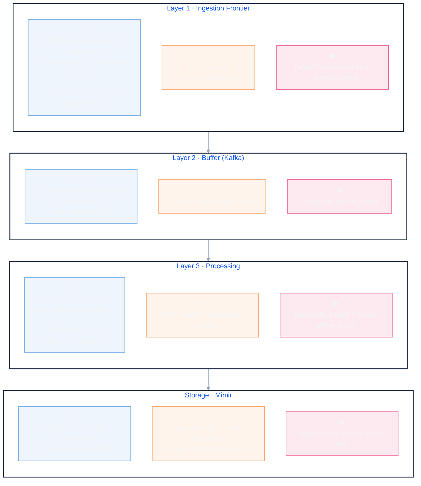

## Chapter 5 — System Design: Telemetry Ingestion Pipeline

> **Interview level:** Principal / Staff Engineer (L6/L7 bar) **Your angle:** You have lived
> experience with Alloy → [[mimir|Mimir]]/[[loki|Loki]]/[[tempo|Tempo]] at global scale. Use it to
> make every trade-off concrete, not theoretical.

---

## How to Use This Doc

Practice the five-step format from the study guide for each section:

1. Clarify requirements
2. High-level design
3. Deep dive
4. Observability of the system itself
5. Trade-offs at 10x scale

---

## Concept Map

The load-bearing ideas, condensed into one picture. If you can redraw this from memory, you can
carry the interview.

> **Mnemonic — 4 stations, 3 questions each:**
>
> ⚙ how it works · ⚖ the debate to raise · 👁 the signal to watch.
>
> One exception: multi-tenancy isn't a single station — it's enforced at every one
>
> (tenant ID at the gateway, cardinality budget at the processor, `X-Scope-OrgID` at storage).
>
> Never rely on a single enforcement point.

---

## 1. Clarify Requirements First

Full section moved to [[05-02-clarify-requirements|1. Clarify Requirements First]] — the
first-5-minutes clarifying questions — signal types, scale envelope, consistency/durability,
multi-tenancy, and protocol — whose answers change the entire architecture.

---

## 2. High-Level Architecture

Full section moved to [[05-03-high-level-architecture|2. High-Level Architecture]] — the producers →
gateway → Kafka → processors → storage diagram, gateway links, and the push-over-pull key insight to
state early.

---

## 3. Deep Dives

### 3.1 Layer 1: Ingestion Frontier

Full section moved to [[05-04-layer-1-ingestion-frontier|3.1 Layer 1: Ingestion Frontier]] —
responsibilities (each with its own dedicated companion note: protocol termination, TLS offload,
authentication, tenant identification and routing, rate limiting, schema validation), the Layer 1
concept diagram, the fan-in problem at 100K+ agents, protocol negotiation, batching, and
backpressure.

---

### 3.2 Layer 2: Durable Buffer (Kafka)

Full section moved to [[05-05-layer-2-durable-buffer-kafka|3.2 Layer 2: Durable Buffer (Kafka)]] —
topic design, partitioning strategy and hot-spots, retention, retry policies and delivery semantics,
producer configuration, consumer lag as the scaling trigger, and schema evolution.

---

### 3.3 Layer 3: Processing / Enrichment

Full section moved to [[05-06-layer-3-processing-enrichment|3.3 Layer 3: Processing / Enrichment]] —
the metric processor and cardinality enforcement, tail-based sampling and the span assembler, the
log processor, metric temporality (delta vs. cumulative), and Kubernetes metadata enrichment.

---

### 3.4 Scaling Each Layer

Full section moved to [[05-07-scaling-each-layer|3.4 Scaling Each Layer]] — the scaling unit and
trigger for the gateway, Kafka, each processor type, and storage.

---

### 3.5 Failure Modes and Mitigations

Full section moved to [[05-08-failure-modes-and-mitigations|3.5 Failure Modes and Mitigations]] —
what breaks at each layer, its impact, and the mitigation, from a gateway pod crash through to clock
skew between agents.

---

### 3.6 Multi-Tenancy

Full section moved to [[05-09-multi-tenancy|3.6 Multi-Tenancy]] — the isolation layers from network
inbound to storage, and the quota enforcement points at the gateway, processor, and storage.

---

### 3.7 Data Tiering and Compaction (Mimir/Thanos)

Full section moved to [[05-10-data-tiering-and-compaction|3.7 Data Tiering and Compaction]] — the
ingester-to-object-store journey, compaction levels, vertical compaction/dedup, and compaction
storms.

---

### 3.8 Global Deployment Topology

Full section moved to [[05-11-global-deployment-topology|3.8 Global Deployment Topology]] — regional
writes vs. a global cluster, async replication to a global query tier, and agent failover.

---

## 4. Observability of the Pipeline Itself

Full section moved to
[[05-12-observability-of-the-pipeline|4. Observability of the Pipeline Itself]] — what to instrument
at each layer, the pipeline's own SLOs, distributed tracing of the pipeline itself, and the
synthetic canary that catches stalls no component metric surfaces.

---

## 5. Trade-offs at 10x Scale

Full section moved to [[05-13-trade-offs-at-10x-scale|5. Trade-offs at 10x Scale]] — Kafka vs.
direct write, trace-assembly sharding, schema-on-read vs. write, sampling strategy, protocol choice,
and push vs. pull.

---

## 6. Interview Anchor Points (What to Say Out Loud)

Full section moved to
[[05-14-interview-anchor-points|6. Interview Anchor Points (What to Say Out Loud)]] — the sentences
that signal principal-level thinking, ready to say unprompted.

---

## 7. Component Map (What Exists in the Wild)

Full section moved to [[05-15-component-map|7. Component Map (What Exists in the Wild)]] — OSS vs.
managed options per layer, and where ShipSolid's own production experience maps onto each.

---

## 8. Quick-Reference Cheat Sheet

Full section moved to [[05-16-quick-reference-cheat-sheet|8. Quick-Reference Cheat Sheet]] — the
one-line answer for every load-bearing design decision in this doc.

---

## 9. Practice Interview Questions

Full section moved to [[05-17-practice-questions|9. Practice Interview Questions]] — Twelve
full-length practice prompts, each linked to its own worked answer.
