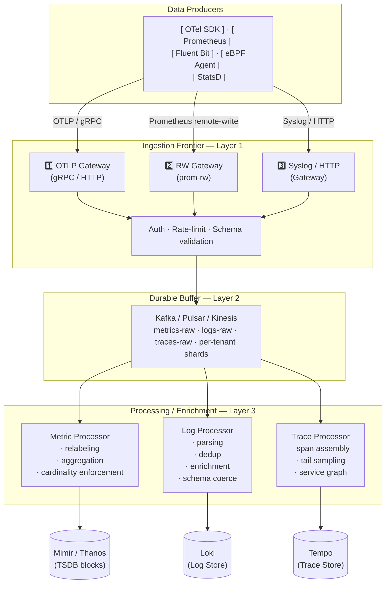

> **Appears in:** [[05-01-telemetry-ingestion-pipeline|Telemetry Ingestion Pipeline]] — this is §2
> of the full design, split into its own file so the root stays a table of contents.

## 2. High-Level Architecture

1️⃣ [[05-24-telemetry-gateways#1. OTLP Gateway|OTLP Gateway]]

2️⃣ [[05-24-telemetry-gateways#2. Prometheus Remote Write Gateway|Prometheus Remote Write Gateway]]

3️⃣ [[05-24-telemetry-gateways#3. Syslog Gateway|Syslog Gateway]]

## Key insight to state early

"I'm designing for [[03-push-vs-pull-ingestion|push-based ingestion rather than pull]], because at
10M agents, a central scraper creates a fan-out coordination problem. Agents push over
[[02-otlp-protocol|OTLP]]/gRPC. The gateway is stateless and scales horizontally. The buffer (Kafka)
decouples ingestion rate from processing rate."
