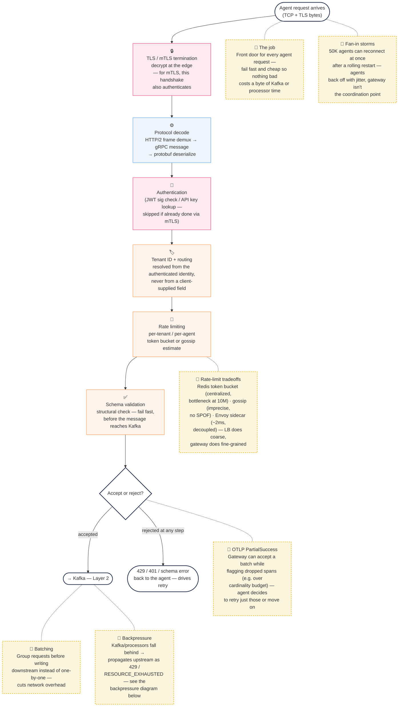
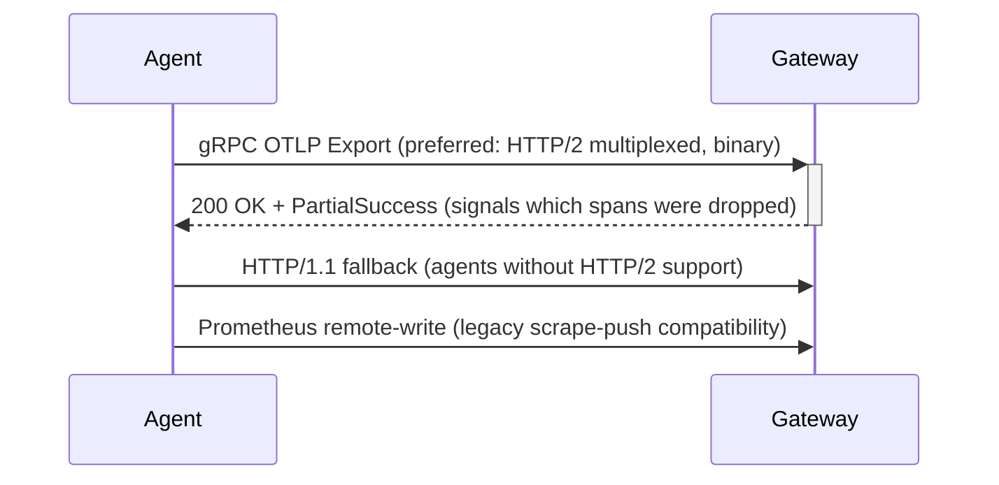
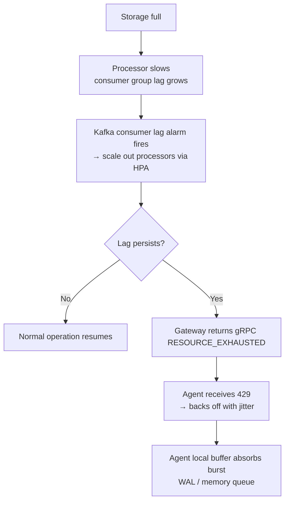

> **Appears in:** [[05-01-telemetry-ingestion-pipeline|Telemetry Ingestion Pipeline]] — §3,
> [[05-01-telemetry-ingestion-pipeline#3.1 Layer 1: Ingestion Frontier|Deep Dives]] — this is §3.1.

## 3.1 Layer 1: Ingestion Frontier

**Responsibilities:**

- [[05-20-protocol-termination|Protocol termination]]
  ([[03-2-protocol-inventory|full protocol inventory]]:
  [[networks/05-http-ecosystem/05-grpc/05-grpc|gRPC]], [[02-http1-vs-http2|HTTP/1.1, HTTP/2]])
  > Protocol termination is where the API gateway fully understands and handles the client's
  > communication protocol, then converts it into a standardised internal format for backend
  > services to process.
- [[02-tls-offload|TLS offload]]
  > This is about decryption happening at the gateway rather than at each backend service.
  >
  > When a client connects over HTTPS, the traffic is encrypted. TLS offload means your API gateway
  > decrypts that traffic—it terminates the TLS connection with the client. Then it sends the
  > decrypted data to your backend services, usually over your internal network which is trusted
  > anyway.
  >
  > Why? It saves your backend services from doing expensive encryption and decryption work. The
  > gateway handles it once, and everything downstream gets plaintext
  >
  > The key benefit is performance—you're offloading that cryptographic work from your services onto
  > specialised hardware or software at the edge. Your backends can focus on business logic instead
  > of encryption overhead.
- [[system-design/08-observability/05-telemetry-ingestion-pipeline/05-18-authentication|Authentication]]
  (mTLS, bearer token, API key)
  > This is where the API gateway verifies who the client actually is—checking their credentials,
  > tokens, API keys, whatever you're using.
  >
  > The gateway receives the request, looks at the authentication information provided—maybe a JWT
  > token in the header, or an API key—validates it, and confirms the client is legit. If it's
  > invalid, you reject right there at the edge rather than wasting resources processing bad
  > requests downstream.
- [[05-25-tenant-identification-and-routing|Tenant identification and routing]]
  > This is where you figure out which tenant or organisation the authenticated client belongs to,
  > and then you load that tenant's specific configuration or context.
  >
  > Say you've got a multi-tenant system serving multiple customers. Once you know who the client is
  > from authentication, you need to know which tenant they belong to. Maybe it's in their token, or
  > their API key, or a header. You identify that, then load that tenant's specific settings—their
  > rate limits, their data partitions, their preferences—so the rest of your pipeline knows how to
  > handle their request properly.
- [[05-21-rate-limiting-architecture|Initial rate limiting]] (per-tenant, per-agent)
  > This is your first line of defence against abuse—the gateway checks if the client is making too
  > many requests too quickly.
  >
  > You set limits like "this API key can make 100 requests per minute" or "this tenant can do 1000
  > requests per hour." When a request comes in, the gateway checks against those limits. If they're
  > within quota, it passes through. If they've exceeded it, the gateway rejects it right there
  > before it even gets to your backend.
  >
  > Why at the edge? Because you stop bad traffic early and save your backend resources. You're not
  > wasting compute on requests you're going to reject anyway.
- [[05-23-schema-validation-and-rejection|Schema validation and rejection]] (fail fast before the
  buffer)
  > This is where the gateway checks that the incoming request actually matches the shape and
  > structure you expect.
  >
  > Say your API expects a JSON body with specific fields like name, email, and age. The gateway
  > validates that the request has those fields, they're the right data types, required fields are
  > present, all that. If the request doesn't match your schema, you reject it immediately with an
  > error.
  >
  > Why do this at the edge? Again, you catch malformed requests before they waste backend
  > resources. Your backend services can assume every request that reaches them is already valid, so
  > they don't need to duplicate that validation logic.
- [[05-22-retry-policies|ACK back to the agent]] (critical: drives agent retry behavior)
  > Essentially means sending responses back to the client. Whether you're accepting the request or
  > rejecting it, the gateway sends that feedback back.
  >
  > If the request passes all the checks—authentication, rate limiting, schema validation—the
  > gateway accepts it and sends an acknowledgement. If it fails anywhere, the gateway rejects it
  > and sends back an error response explaining why, so the client knows what went wrong.
  >
  > It's the gateway's way of closing the loop with the client before anything goes deeper into your
  > system

**Layer 1 Mental Model:**

> Every arrow is also a rejection point — a request can fail at TLS (bad cert), decode (malformed
> frame), auth (invalid credential), tenant resolution (identity mismatch), rate limit (over quota),
> or schema validation (bad shape) — and the response in every case is the same design pattern: fail
> fast, tell the agent exactly why via the ACK, and never let a request that failed here consume a
> single byte of Kafka.
>
> One nuance the linear flow hides: for **mTLS** clients, TLS termination and authentication are the
> same handshake, not two sequential steps — the diagram separates them because JWT and API-key
> clients (who skip mTLS) still need a distinct authentication step after the frame is decoded. See
> [[system-design/08-observability/05-telemetry-ingestion-pipeline/05-18-authentication|Authentication]]
> for the three mechanisms and [[05-20-protocol-termination|Protocol Termination]] for the decode
> chain in full.

**Fan-in problem at 100K+ agents:**

Each agent maintains a persistent gRPC connection or reconnects on each push. The gateway fleet must
handle:

- Connection establishment storms (e.g., after a cluster rolling restart, 50K agents reconnect
  simultaneously)
- Thundering herd: use exponential backoff with jitter in agents; the gateway must not be the
  coordination point

**Protocol negotiation:**

[[02-otlp-protocol|OTLP]] PartialSuccess is a critical protocol feature: the gateway can signal
partial acceptance (e.g., "I accepted your metrics batch but dropped 3 spans because they exceeded
cardinality budget"). The agent can then decide whether to retry or log and move on.

**Batching:**

> Batching is grouping multiple requests together before sending them downstream. Instead of writing
> each request to Kafka individually, the gateway collects requests and sends them in bulk, which is
> more efficient and reduces network overhead.

**[[05-backpressure|Backpressure]] — how it flows upstream:**

> Backpressure is when a downstream system signals upstream that it can't keep up. When Kafka is
> full or slow, it tells the gateway to slow down. The gateway then queues locally, rejects
> requests, or applies backoff—preventing the system from getting overwhelmed and failing
> ungracefully.

**[[05-21-rate-limiting-architecture|Rate limiting architecture]]:**

> Rate limiting architecture determines how you enforce quotas across multiple gateway replicas at
> scale. Options include Redis token bucket for centralised control, gossip-based distribution for
> resilience, or Envoy sidecars for decoupled logic.

Do NOT implement per-request rate limiting inside the gateway pod — state won't be shared across
replicas. Use one of:

- **[[05-21-rate-limiting-architecture#Token Bucket in Redis|Token bucket in Redis]] / Dragonfly**
  (centralized, millisecond latency): each gateway pod checks Redis before accepting. Works at 100K
  agents; at 10M, Redis becomes a bottleneck.
- **[[05-21-rate-limiting-architecture#Gossip-Based Distributed Rate Limiting|Gossip-based distributed rate limiting]]**
  (Netflix Concurrency Limits, Envoy's global rate limit): each pod maintains a local estimate of
  the global rate, exchanges periodically. Slightly imprecise but no single point of failure.
- **[[05-21-rate-limiting-architecture#Envoy Sidecar with Global Rate Limit Service|Envoy sidecar with global rate limit service]]**
  (xDS-integrated): gRPC interceptor calls rate limit service per request. Adds latency (~2ms) but
  decouples the logic from business code.

At MAANG scale, the answer is usually: coarse-grained enforcement at the load balancer (LB token
bucket), fine-grained enforcement at the gateway with eventually-consistent distributed counters.
