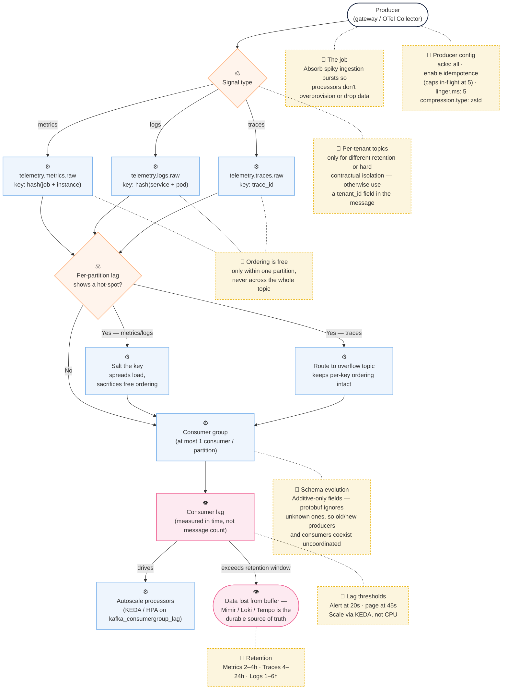

> **Appears in:** [[05-01-telemetry-ingestion-pipeline|Telemetry Ingestion Pipeline]] — §3,
> [[05-01-telemetry-ingestion-pipeline#3.2 Layer 2: Durable Buffer (Kafka)|Deep Dives]] — this is
> §3.2.

## 3.2 Layer 2: Durable Buffer (Kafka)

**Mental model:**



### **Why Kafka here?**

The ingestion rate peaks are spiky (deployments, incident storms). Without the buffer, the
[[05-06-layer-3-processing-enrichment|processing layer]] must either overprovision to handle peaks
or drop data. Kafka absorbs the burst and allows processors to drain at their own pace.

### **Topic design:**

```
telemetry.metrics.raw       ← raw OTLP metric payloads
telemetry.logs.raw
telemetry.traces.raw
telemetry.metrics.tenant-{id}   ← per-tenant topics for strong isolation
```

Per-tenant topics are expensive (each topic = directory on broker disk). Use them only when:

- Different retention policies per tenant are required
- Hard isolation is a contractual requirement
- Otherwise, use a `tenant_id` field inside the message + consumer-side filtering

### **Partitioning strategy:**

> This matters because Kafka only guarantees message ordering within a single partition — not across
> the whole topic. So your partition key determines whether you get ordering for free or have to
> reassemble it downstream.

| Signal  | Partition key          | Why                                                                  |
| ------- | ---------------------- | -------------------------------------------------------------------- |
| Metrics | `hash(job + instance)` | Keeps same time series on same partition → ordered writes per series |
| Logs    | `hash(service + pod)`  | Ordering within a log stream                                         |
| Traces  | `trace_id`             | All spans of a trace land on the same partition → assembly is local  |

> For metrics: your
> [[observability/02-metrics-engineering/07-metrics-storage-engines/07-metrics-storage-tsdb|time series database]]
> deduplicates samples based on timestamp plus label fingerprint. If samples arrive out of order,
> the TSDB can't tell if a later sample is a duplicate or a genuine new value. Ordering lets it
> reject replays cleanly.

> For logs: you need the sequence intact so when someone queries a log stream, they see events in
> the order they actually happened. Out-of-order logs are confusing and hard to debug.

> For traces: all the spans of a single trace need to arrive together on the same partition so the
> downstream assembler can stitch them into a coherent picture without waiting for spans to trickle
> in from other partitions minutes later. One partition per trace ID means assembly is local and
> fast.

> Lose ordering and you either get silent data loss, confusing queries, or traces that take forever
> to assemble. That's why the partition key matters — it buys you ordering for free from Kafka's
> guarantee.

> **Ordering is per-partition, not per-topic.** Kafka only guarantees message order within a single
> partition — there is no global ordering guarantee across a topic as a whole. The partition keys
> above matter for exactly this reason: `hash(job + instance)` keeps one series's samples in order
> because they always land on the same partition, not because the topic itself is ordered. State
> this explicitly if asked "is Kafka globally ordered?" — the answer is no, and conflating
> per-partition with per-topic ordering is an easy way to lose credibility on an otherwise strong
> answer.

#### **What Kafka actually guarantees:**

Kafka promises ordering within a single partition. Messages written to partition three always come
out of partition three in the exact order they went in. That's the guarantee.

So when you choose hash(job + instance) as your partition key, every sample from that same job and
instance hashes to the same partition number — say partition seven. Because they're all on partition
seven, Kafka's ordering guarantee applies to them. They come out in the order they went in.

But if those samples landed on different partitions, Kafka makes no promise about their relative
order. One could arrive at the consumer before the other even though it was produced later. That's
why the partition key is doing the heavy lifting — it's forcing all related messages onto the same
partition so you can lean on Kafka's per-partition ordering guarantee.

### **Partition hot-spots — detection and handling:**

Both partition keys above share a failure mode: **skew**. `hash(job + instance)` sends every sample
for one high-volume service to a single partition — a service instrumented far more heavily than its
peers, or a genuine traffic spike on one service, can overload that one partition while nine others
sit idle. `trace_id` has the same problem at the extreme end: one enormous distributed transaction
(a trace with thousands of spans, or a retry storm generating a burst of children under one
`trace_id`) pins an outsized amount of load onto a single partition for as long as that trace is in
flight.

Detect it with the same signal already flagged as the #1 pipeline health metric — consumer lag — but
broken down **per partition**, not aggregated per topic. A partition-level lag heatmap immediately
shows one partition falling behind while its siblings are healthy; an aggregate topic-level number
hides the imbalance until it's already severe.

Two ways to handle it once detected:

- **Salt the key:** append a bounded random or round-robin suffix to the partition key (e.g.,
  `hash(job + instance + salt(0-9))`) so one logical series/service spreads across N partitions
  instead of one. The cost: consumers now have to reassemble ordered state across those N partitions
  instead of getting it for free from Kafka's per-partition ordering — a fine trade for metrics (the
  TSDB doesn't need Kafka-level ordering, just eventual arrival) but a real problem for traces,
  where salting `trace_id` would scatter one trace's spans across partitions and break the "all
  spans of a trace land on one partition" invariant the assembler depends on.
- **Overflow topic:** route the top N noisiest keys (identified by a rolling rate check) to a
  dedicated overflow topic with its own consumer group, so one hot key can't starve the shared
  topic's consumers. This preserves per-key ordering (no salting needed) at the cost of an extra
  topic and a routing decision at produce time.

**One-liner for the interview:** "I'd salt metric keys because ordering isn't load-bearing there,
but I'd use an overflow topic for traces because span assembly needs every span for a `trace_id` on
the same partition — salting would break that invariant."

### **Retention:**

- Raw metrics: 2–4 hours (enough to drain any processor outage)
- Raw traces: 4–24 hours (tail sampling needs to hold spans until the root span arrives)
- Raw logs: 1–6 hours

After retention, data is considered lost from the buffer. The downstream stores (Mimir/Loki/Tempo)
are the durable source of truth.

**[[05-22-retry-policies|Retry policies and delivery semantics]]:**

Kafka supports exactly-once semantics (idempotent producers + transactional consumers) but it adds
latency and complexity. For telemetry:

- Metrics: at-least-once is fine (duplicate samples are typically deduplicated by the TSDB based on
  timestamp + label fingerprint)
- Logs: at-least-once with deduplication on a content hash + timestamp window
- Traces: at-least-once; trace stores handle duplicate spans by span ID deduplication

Only use exactly-once if there is a billing or compliance requirement (e.g., if metric samples drive
invoicing).

### **Kafka producer configuration — load-bearing at scale:**

```yaml
acks: all                                      # all ISR replicas must confirm — durability over throughput
enable.idempotence: true                       # no duplicate messages on retry (requires acks=all)
retries: 2147483647                            # effectively infinite — let delivery.timeout.ms cap it
delivery.timeout.ms: 120000                    # 2 min total delivery window; fail the batch after this
linger.ms: 5                                   # batch for 5ms — 10–50× throughput at cost of tail latency
batch.size: 65536                              # 64KB default; increase to 1MB for high-volume metric paths
compression.type: zstd                         # best ratio at lowest CPU cost for protobuf payloads
max.in.flight.requests.per.connection: 5       # hard cap enforced by the broker when idempotence is on
```

**That cap isn't advisory.** `enable.idempotence: true` doesn't just turn on dedup — it constrains
`max.in.flight.requests.per.connection` to at most 5 as a hard requirement; setting it higher throws
a configuration error at producer startup, not a warning. Worth having the mechanism ready if an
interviewer probes the exact number: 5 (not 1) is safe because the idempotent producer tags every
batch with a monotonically increasing sequence number per partition, so the broker can detect and
reject (or correctly reorder) out-of-order retries even with multiple requests in flight — the
sequence-number mechanism is specifically what let idempotence stop requiring `max.in.flight = 1`
without giving up the durability guarantee.

Hidden gotcha: `max.message.bytes` defaults to 1MB on the broker. A single trace from a long-running
distributed transaction (thousands of spans) can exceed this. Options:

- Split large OTLP batches at the gateway before producing (preferred — keeps Kafka tuned for the
  common case)
- Increase `max.message.bytes` broker-wide (affects all producers; raises memory pressure on the
  broker)

> Now here's the gotcha that bites people in production: max.message.bytes defaults to one megabyte
> on the broker. A single trace from a long-running distributed transaction — thousands of spans, or
> a retry storm — can exceed that limit and get rejected. Two ways to fix it. Option one, split
> large OTLP batches at the gateway before you produce to Kafka. Keeps Kafka tuned for the common
> case and doesn't blow up the broker. Option two, increase max.message.bytes broker-wide, but that
> affects all producers and raises memory pressure on the broker itself. Preferred move is splitting
> at the gateway.

### **Consumer lag — the SLO and the scaling trigger:**

Consumer lag tells you if processors are keeping up with incoming telemetry.

Think of it this way: producer config tells you if data gets into Kafka safely. Consumer lag tells
you if it's getting out fast enough. If lag is growing, processors are falling behind, and telemetry
is backing up.

Here's the first mistake people make: they measure lag in message count. Measure it in time, not
message count. Ten thousand messages means nothing — ten thousand messages per second versus ten per
second are completely different situations. Instead ask: _how many seconds of backlog are sitting in
Kafka right now?_

Your SLO should connect to the end-to-end budget from earlier — if your target is P99 under sixty
seconds from agent to query, consumer lag should stay under twenty seconds sustained. Alert at
twenty seconds for two minutes, page at forty-five seconds. That leaves buffer for the rest of the
pipeline to write to storage and serve queries.

The scaling trigger is the key insight though. Most people scale processors on CPU utilization.
Don't do that. A processor can look CPU-idle while actually I-O-bound waiting on a slow downstream
write to Mimir. Consumer lag is a far more direct signal — it tells you directly if you're keeping
up.

So you drive your Kubernetes autoscaler with kafka_consumergroup_lag, not CPU. Use KEDA or a custom
HPA backed by Prometheus.

Everything above describes the producer side in detail; the consumer side needs the same rigor,
because consumer lag is the single most important operational signal in this whole layer (per the
Concept Map's 👁 callout) — and it's very often the first follow-up question after walking through
topic/partition design in an interview.

- **SLO:** express lag as _time_, not just message count — a 10,000-message backlog means something
  very different at 10 msg/sec versus 10,000 msg/sec. Lag should stay within a fraction of the
  end-to-end ingestion SLO from [[05-12-observability-of-the-pipeline|§4]] (P99 < 60s for metrics).
  A reasonable target: alert at lag > 20s sustained for 2 minutes, page at lag > 45s — leaving
  headroom under the 60s end-to-end budget for the rest of the pipeline (write to Mimir, then
  query-side visibility).
- **Scaling trigger:** processor pod count scales on consumer group lag, not CPU — CPU can look idle
  while a processor is I/O-bound waiting on a slow downstream write, and lag is a far more direct
  proxy for "are we keeping up." In practice this means a custom HPA metric (KEDA's Kafka scaler, or
  a Prometheus-adapter-backed HPA) driven by `kafka_consumergroup_lag`.
- **Structural ceiling:** consumer parallelism is capped by partition count — Kafka assigns at most
  one consumer per partition within a group, so scaling pods past the partition count leaves the
  extras idle. If lag keeps growing even after scaling to match partition count, the fix isn't more
  pods, it's more partitions — but repartitioning a live topic isn't free, in two distinct ways:

  - **It's a stop-the-world operation for that consumer group.** Adding partitions triggers a
    consumer group rebalance — every member pauses, gets reassigned, then resumes. The fix for a lag
    incident is itself a brief lag-inducing operation, which is exactly why it can't be the
    first-reach tool mid-incident.
  - **It changes key→partition mapping going forward, not retroactively.** Messages already written
    stay on their original partition, but new messages with the same key can land on a _different_
    partition than before the resize — which interacts directly with the hot-spot handling above:
    repartitioning to relieve a hot partition can, going forward, redistribute that key onto a
    partition that's already carrying load from something else.

  **One-line mental note:** repartitioning is a lever of last resort, not a knob you turn during an
  active incident — plan the partition count for projected peak load ahead of time, and treat a live
  repartition as a scheduled operation, not an incident response.

### **Schema evolution — producers and consumers on different versions:**

OTLP payloads aren't static: new metric types get added, resource attributes gain fields,
instrumentation libraries add labels. At any point during a fleet-wide agent rollout, producers on
the new schema and producers still on the old one are writing to the same topic simultaneously, and
processors have to handle both without a coordinated flag day.

The mechanism that makes this tractable is the same one covered for gateway-side validation in
[[05-23-schema-validation-and-rejection#The forward-compatibility trap|Schema Validation and Rejection's forward-compatibility trap]]:
protobuf's wire format lets a consumer **ignore fields it doesn't recognize** instead of failing on
them. Applied at the buffer/processor boundary specifically:

- **Additive-only evolution:** new fields are always optional; existing required fields are never
  removed or repurposed. A processor built against an older schema simply doesn't read a new field —
  it doesn't error on its presence.
- **Consumers are the long pole, not producers:** processor fleets should be upgraded to understand
  a new field _before_ agents start sending it, not after. Getting this order backwards means the
  new field arrives at old processors that (correctly) ignore it — silent feature loss rather than
  an outage, but still worth catching via canary metrics on the new field's presence.
- **Breaking changes get a new topic, not a schema flag:** if a change genuinely can't be additive
  (a field's meaning changes, not just its presence), the fix isn't a version flag inside the
  message — it's a new topic (`telemetry.metrics.v2.raw`) with both versions' consumers running in
  parallel until the old version's agent population drops to zero, then the old topic and its
  consumer are retired. Branching on a schema version inside every consumer is a maintenance trap
  that compounds with every subsequent version.

**Answer, stated directly:** default to additive-only protobuf evolution so producers and consumers
can run different versions with zero coordination; reserve a parallel topic-and-consumer-group
migration for the rare genuinely breaking change, rather than version-branching inside a single
consumer.

**Meaning of serialization and deserialization:**

Serialization is turning a structured message into bytes so it can be sent over the wire.
Deserialization is the reverse — taking those bytes and turning them back into a structured message
you can read.

Think of it this way. A metric message has a name, a value, a timestamp, labels. That's structured
data in memory. To send it through Kafka, you can't just send the raw memory — you need to convert
it into a sequence of bytes that follows a standard format. That conversion is serialization.
Protobuf is the format that does that conversion.

On the other end, a consumer pulls those bytes out of Kafka. Those bytes are useless by themselves —
they're just 01010101. Deserialization is when the consumer says "I know this is protobuf, let me
decode these bytes back into a metric message with a name and value and timestamp that I can
actually work with."

Protobuf handles both directions. The producer serializes with it, Kafka carries the bytes, the
consumer deserializes with it. Same format on both ends, so it works.
