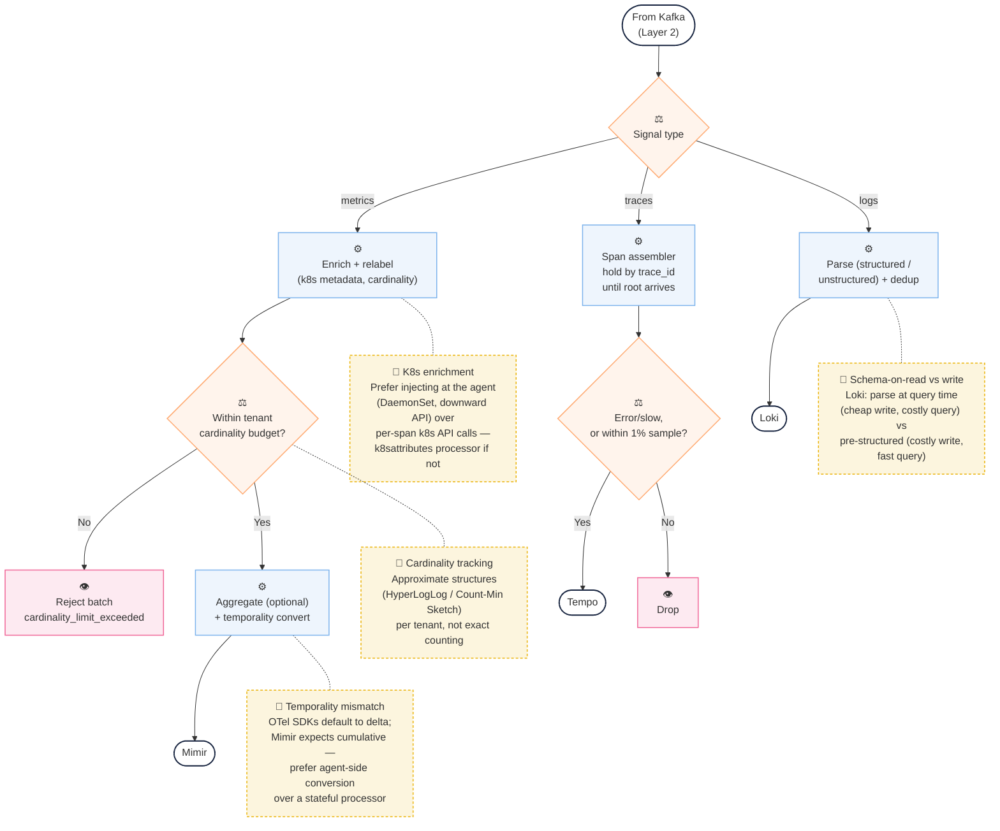
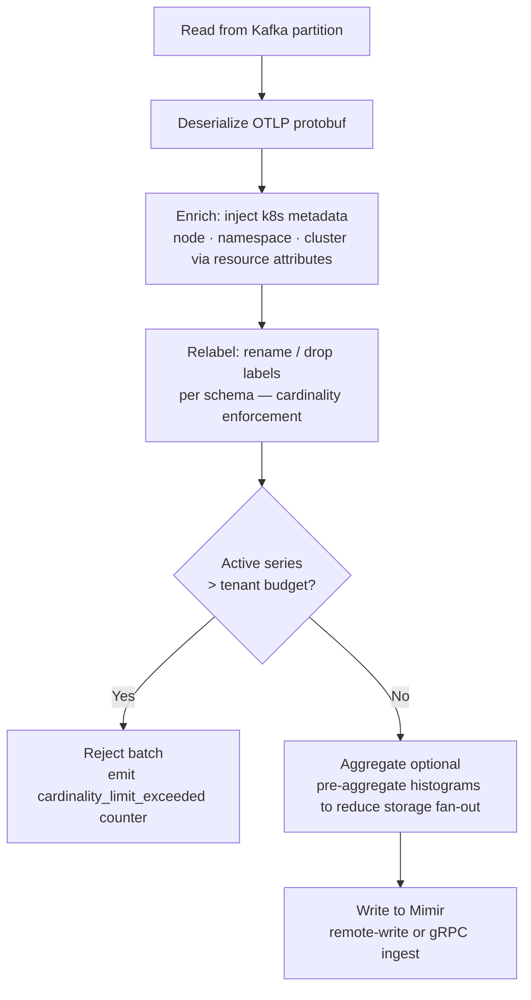
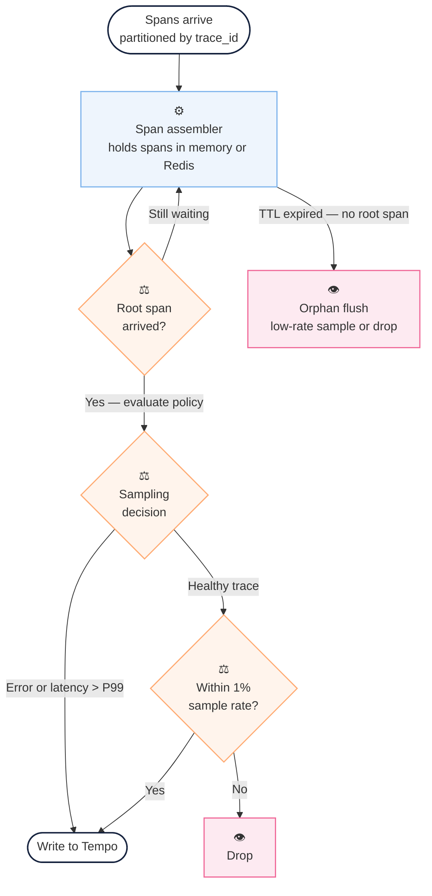

> **Appears in:** [[05-01-telemetry-ingestion-pipeline|Telemetry Ingestion Pipeline]] — §3,
> [[05-01-telemetry-ingestion-pipeline#3.3 Layer 3: Processing / Enrichment|Deep Dives]] — this is
> §3.3.

## 3.3 Layer 3: Processing / Enrichment

**Layer 3 Mental Model:**



---

### **Metric Processor**



The metric processor's job: it reads metric data from Kafka, cleans it up, and writes it to Mimir,
which is the long-term storage.

The pipeline has steps. First, you read from Kafka. Then you deserialize — that's turning the binary
protobuf bytes back into readable metric data. Then you enrich it — you add extra information that
wasn't in the original metric, like which Kubernetes namespace it came from. Then you relabel — you
rename or drop certain labels based on rules you've set. Then you write to Mimir.

But before you write, there's a critical gate: cardinality enforcement.

Here's the problem. A metric has labels — think service=payment, method=POST, status=200. That's
three label dimensions. Now imagine a service that uses user_id as a label. There are millions of
users. So you get millions of unique combinations of labels — one for each user. That's called
[[cardinality|high cardinality]].

If one tenant's service starts sending millions of unique label combinations, it bloats the shared
database for everyone — not just that tenant. The TSDB slows down, memory explodes, and every query
gets slower.

So the processor checks: "Does this tenant already have too many active series?" If yes, reject the
batch. Tell the tenant "your cardinality limit exceeded" so they know to fix their service.

So you reject batches that exceed cardinality, and you emit a counter that tells the tenant they've
hit the limit.

Now, before writing to Mimir, there's one more optional step: pre-aggregation. Some histograms can
be aggregated early to reduce how much data you write downstream. Not always necessary, but it's
there.

Then you write to Mimir via remote-write or gRPC ingest, and that's the end of the metric processor
pipeline.

**Cardinality enforcement is non-negotiable at scale.** A single misbehaving service can send 10M
unique label combinations and collapse a shared TSDB. Enforce at the processor:

- Track active series per tenant with an approximate data structure (HyperLogLog or Count-Min
  Sketch)
- Reject or drop metric families that exceed budget; emit a "cardinality limit exceeded" counter
  visible in the platform's self-telemetry
- Send the OTLP PartialSuccess signal back through the buffer (or emit a platform-level alert to the
  tenant)

---

### **Trace processor — [[05-19-head-vs-tail-sampling|tail-based sampling]]**

This one's fundamentally different from metrics because of a question you can't answer until the
trace is finished: was this trace interesting?

The problem with head-based sampling: You could decide at the very first span whether to keep the
trace or drop it. Simple, stateless. But you don't know yet if the trace will error out, or take ten
seconds when your P99 is two seconds. You're flying blind.

Tail-based sampling: You wait until the root span arrives — the span that started the whole request
— then you look at the full trace and decide. Did it error? Keep it. Did it exceed your P99 latency?
Keep it. Otherwise, maybe sample it at one percent and drop the rest.

Here's the flow. Spans arrive partitioned by trace_id, so all spans from one trace land on the same
processor. The processor holds them in memory or Redis in a span assembler. You keep checking: has
the root span arrived yet? Once it does, you evaluate your sampling policy. Error or slow? Write to
Tempo. Otherwise, flip a coin at one percent odds — if you lose, drop it.

The hard part: at one billion spans per second, you cannot hold every span in memory forever. So you
bound your window — keep spans for maybe the last thirty seconds in an LRU cache in memory, overflow
older ones to disk or Redis. And use a TTL — if the root span hasn't shown up in thirty seconds,
call it an orphan, sample it low, and move on.



The span assembler is the hardest part: at 1B spans/sec, you cannot hold everything in memory.
Solutions:

- Hash-partition spans to processors by trace_id so all spans of a trace land on the same worker
- Use a bounded in-memory LRU (hold spans for the last N seconds) + overflow to local disk or Redis
- TTL-based flush: if root span hasn't arrived in 30s, treat as orphan and drop or sample at low
  rate

---

### **Log Processor**

Logs are different again — the main decision is whether you parse them at write time or at query
time.

Schema-on-write: Parse the log at ingest, extract fields, enforce structure. More work upfront, but
queries are fast because the data is already structured.

Schema-on-read: Store the raw log as-is, parse it when someone queries. Cheaper writes, more
expensive queries.

Most systems use schema-on-read (that's Loki's model) because logs are voluminous and you often
don't know what fields you'll need to query until later.

One more thing: deduplication. Logs can arrive twice, so you hash the timestamp plus the log body,
keep that hash in a sliding five-minute window per stream, and drop exact duplicates.

- Parse structured (JSON, logfmt) vs unstructured (regex extraction, drain/spell-based pattern
  mining)
- Schema-on-read (Loki model): store raw, parse at query time via LogQL → lower write cost, higher
  query cost
- Schema-on-write (pre-structured model): parse at ingest, enforce schema → higher write cost, much
  faster queries
- Deduplication: hash(timestamp + body) within a sliding 5-minute window per stream

### **Metric temporality — the silent OTLP impedance mismatch**

**The problem:** OTLP defines two ways metrics can be reported. Cumulative means the value
accumulates from when the process started. Delta means the value is just the change since the last
export.

Most OTel SDKs, Java, Node, Go, default to delta. But Prometheus and Mimir expect cumulative. So
when delta metrics arrive at your processor, you have to convert them.

**How conversion works:** You keep a running total per series. When a delta sample arrives, you add
it to the running total, and that becomes the cumulative value you write to Mimir.
`Delta(5) + previous_cumulative(95) = new_cumulative(100)`.

**The catch:** That running total per series is state. At one billion active series, that state
doesn't fit on one machine. It's a stateful component in your pipeline, which changes the memory
footprint, the failure model, everything.

**The fix:** Push this upstream. Configure your agents to emit cumulative from the start, one config
flag, and you eliminate this stateful piece entirely from the pipeline.

If you can't do that, the OTel Collector has a `deltaToCumulative` processor, but it leaks state on
restart — meaning you see negative `rate()` values on your dashboards after a processor restart,
which is confusing and wrong.

The key question to ask an interviewer: "Are agents sending delta or cumulative?" Because it changes
whether this component is stateless or stateful.

---

OTLP defines two temporality modes for metrics:

| Mode       | Description                                                     | Default for                          |
| ---------- | --------------------------------------------------------------- | ------------------------------------ |
| Cumulative | Value accumulates from process start; `rate()` works directly   | Prometheus native                    |
| Delta      | Value = change since last export; must be summed before storage | Most OTel SDK langs (Java, Node, Go) |

The problem: OTel SDKs often default to delta temporality. Prometheus remote-write and Mimir expect
cumulative. The processor must convert:

```
Delta(t=100, value=5) + previous_cumulative(95) = Cumulative(t=100, value=100)
```

This requires **stateful per-series accumulation** in the processor. At 1B active series that state
doesn't fit on one machine:

- **Preferred fix:** Force agents to emit cumulative at the SDK level — one config flag
  (`temporality_preference: cumulative`), eliminates a stateful component from the pipeline
  entirely.
- **Pipeline fix:** The OTel Collector `deltaToCumulative` processor uses a local state store
  (bounded LRU). It leaks state on restart, causing counter resets visible as negative `rate()`
  values in dashboards.
- **Always ask the interviewer:** "Are agents sending delta or cumulative? Delta changes the
  processor from stateless to stateful, which changes the memory footprint, failure model, and
  restart semantics."

**Kubernetes metadata enrichment:**

A pod emits spans with `service.name = payment-service`. Queries filter by `namespace`, `cluster`,
`node` — labels the SDK doesn't inject. The processor must join on k8s state:

```
Span arrives: pod_name="payment-xyz-abc"
  → Join k8s metadata: namespace, node_name, cluster, app.kubernetes.io/version
  → Attach as resource attributes
  → Forward enriched span to Tempo
```

At 10K pods and 1M spans/sec you cannot call the k8s API per span:

1. **In-memory pod cache with informer watch:** Processor watches k8s pod events and caches metadata
   locally. Cache size = O(pod count), manageable. Cache invalidation happens on pod lifecycle
   events. Cold start gap: brief window after processor restart where enrichment is incomplete.
2. **Enrich at the agent (preferred):** Alloy/OTel Collector DaemonSet has local node access via
   downward API and can inject labels at source. Moves enrichment left, removes the hot path on the
   k8s API server, and survives processor restarts without gaps.
3. **OTel `k8sattributes` processor:** Standard implementation of option 1. Use this; don't reinvent
   it.
