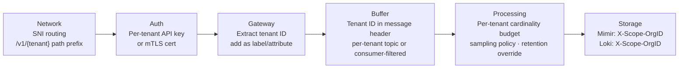

> **Appears in:** [[05-01-telemetry-ingestion-pipeline|Telemetry Ingestion Pipeline]] — §3,
> [[05-01-telemetry-ingestion-pipeline#3.6 Multi-Tenancy|Deep Dives]] — this is §3.6.

## 3.6 Multi-Tenancy

This is the principal-level differentiator question: "how do you add a new tenant without affecting
existing ones?"

**Isolation layers:**

**Quota enforcement points:**

1. **Gateway** — connection-level and request-rate limits (coarse)
2. **Processor** — cardinality budget, series-per-minute cap (fine-grained)
3. **Storage** — Mimir/Loki/Cortex all have per-tenant limits (bytes-per-second, active series cap)
   as a safety net

Always enforce at multiple layers. Never rely on a single enforcement point.
