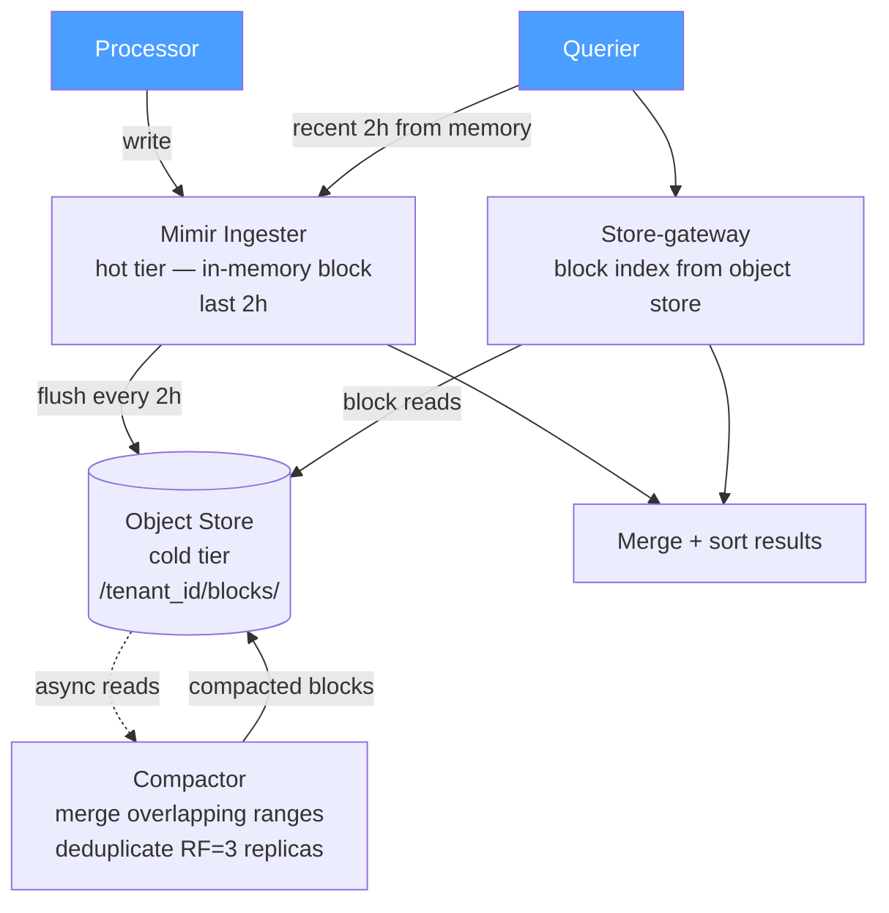

> **Appears in:** [[05-01-telemetry-ingestion-pipeline|Telemetry Ingestion Pipeline]] — §3,
> [[05-01-telemetry-ingestion-pipeline#3.7 Data Tiering and Compaction (Mimir/Thanos)|Deep Dives]] —
> this is §3.7.

## 3.7 Data Tiering and Compaction (Mimir/Thanos)

This section is commonly missing from candidate answers. The architecture diagram shows
[[mimir|Mimir]] as a black box, but the ingester → blocks → object store journey matters for
durability, query latency, and cost.

**Compaction levels:**

| Level | Time range | Produced from  | Purpose                           |
| ----- | ---------- | -------------- | --------------------------------- |
| L1    | 2h         | Ingester flush | Raw blocks; many small files      |
| L2    | 12h        | Compact L1 × 6 | Fewer files; faster range queries |
| L3    | 24h        | Compact L2 × 2 |                                   |
| L4    | 7d         | Compact L3 × 7 | Long-range scan efficiency        |

**Vertical compaction (deduplication):** With RF=3 ingesters, each series is written to three
ingesters simultaneously. After flush, the compactor deduplicates overlapping blocks by label
fingerprint + timestamp. Without vertical compaction, storage cost is 3×.

**Compaction storms:** When many tenants flush large volumes simultaneously, the compactor queue
backs up. Symptoms: query latency spikes as the store-gateway must scan un-compacted L1 blocks.
Mitigation: rate-limit ingester flushes per tenant, or run compactors per-tenant shard.

**Key config knobs to know:**

- `max-block-duration`: longer = fewer files per query; shorter = faster flush cycle (2h is the
  Mimir default)
- Compaction concurrency: limits CPU spike on the compactor
- Store-gateway lazy loading: don't load all block indices into memory at startup (critical at
  millions of blocks)
