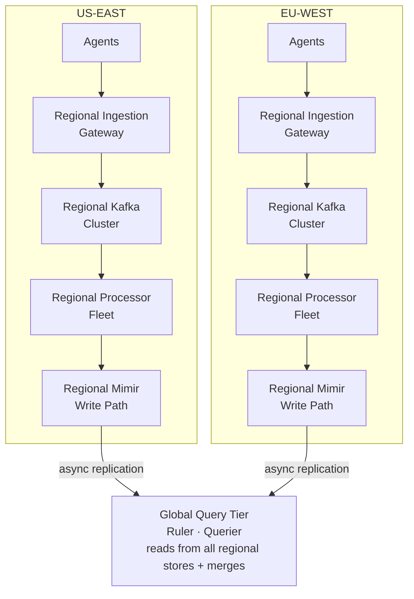

> **Appears in:** [[05-01-telemetry-ingestion-pipeline|Telemetry Ingestion Pipeline]] — §3,
> [[05-01-telemetry-ingestion-pipeline#3.8 Global Deployment Topology|Deep Dives]] — this is §3.8.

## 3.8 Global Deployment Topology

At Netflix/Google scale, a single-region ingestion cluster is both a single point of failure and
introduces cross-region write latency for globally distributed agents.

**Trade-off: regional isolation vs global query:**

| Approach                                         | Write latency           | Query complexity             | Failure blast radius                     |
| ------------------------------------------------ | ----------------------- | ---------------------------- | ---------------------------------------- |
| Regional writes + federated query                | Local (< 10ms)          | Fan-out query across regions | Single region; others unaffected         |
| Global single cluster                            | Cross-region (50–150ms) | Simple                       | Global — one cluster failure affects all |
| Regional writes + async cross-region replication | Local                   | Simple (global store)        | Replication lag window                   |

**Answer:** Regional writes + async replication for global query. Write latency stays local. A
region outage means that region's tenants lose telemetry for the outage duration — acceptable if the
alternative is global blast radius. This matches Mimir's multi-cluster deployment model and how
Grafana Cloud is actually architected.

**Agent failover:** If a region's gateway is unreachable, the agent must reroute. Options:

- DNS-based failover (low TTL, agent retries to secondary endpoint)
- Anycast routing (agent always sends to the same IP; routing layer redirects to healthy region)
- Agent-side fallback list (explicitly configured secondary endpoint in agent config)
