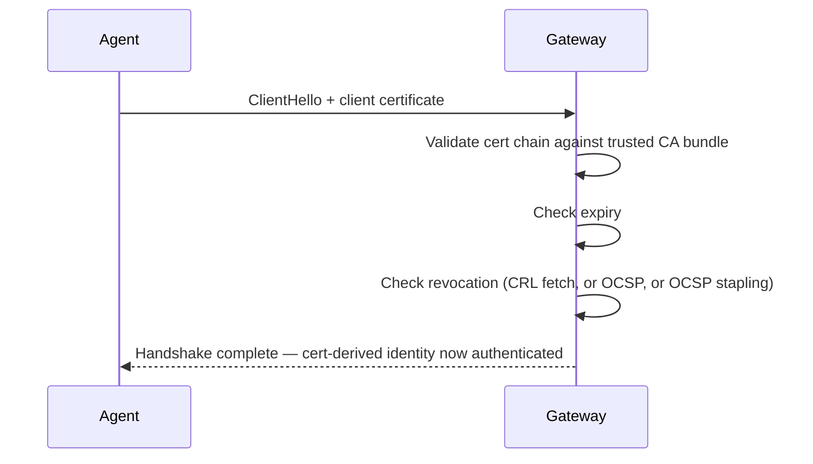
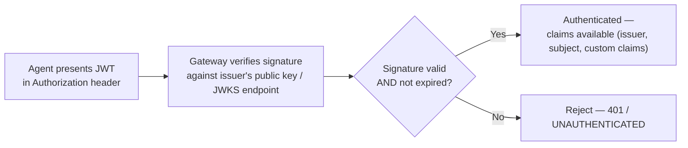
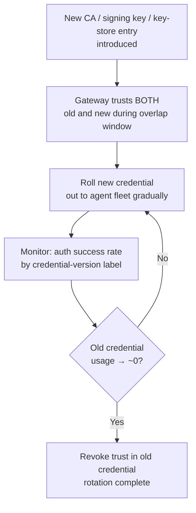

> **Appears in:** [[05-01-telemetry-ingestion-pipeline|Telemetry Ingestion Pipeline]] §3.1
> (ingestion frontier — authentication).

Worth separating cleanly from two adjacent notes before going further: **authentication** answers
"is this credential valid?" — it is not the same question as "which tenant does this credential
belong to?" (that's identity **resolution**, covered in
[[05-25-tenant-identification-and-routing|Tenant Identification and Routing]]), and for the mTLS
case specifically, the handshake that performs authentication is the same handshake that performs
TLS termination (covered in [[02-tls-offload|TLS Offload]]) — but the two are conceptually distinct
steps that happen to be fused into one round trip for that mechanism. This note is about the three
credential types themselves: what each one proves, how it's validated, and what it costs to operate
at agent-fleet scale.

---

## The three mechanisms

| Mechanism          | What it proves                                                        | Validation is...                                                                     | Revocation                                                           |
| ------------------ | --------------------------------------------------------------------- | ------------------------------------------------------------------------------------ | -------------------------------------------------------------------- |
| mTLS client cert   | Possession of the private key matching a cert signed by a trusted CA  | Stateless-ish — chain validation against the CA bundle, plus expiry/revocation check | Hard — requires CRL/OCSP or short cert lifetimes                     |
| Bearer token (JWT) | Possession of a token signed by a trusted issuer, at time of issuance | Fully stateless — verify the signature against the issuer's public key/JWKS          | Very hard — a valid-signature token can't be un-signed before expiry |
| API key            | Knowledge of a static secret, checked against an identity store       | Stateful — a lookup (usually a hashed comparison) against the key store              | Trivial — delete the row, next lookup fails immediately              |

The pattern worth stating explicitly: **stateless validation and fast revocation are in tension.**
JWTs are cheap to validate (no network round trip, just a signature check) precisely because they
carry no dependency on a live store — which is exactly what makes revoking one before its natural
expiry hard. API keys are the inverse: a network round trip on every request, but revocation is
instant because the store is the source of truth on every check.

---

## mTLS client certificates



**Why it's the strongest option:** authentication happens as part of the TLS handshake itself,
before a single byte of application data is exchanged — an unauthenticated agent never even
completes the connection. There's no separate "send me your token" round trip layered on top.

**The operational cost that's easy to underestimate — revocation checking:**

- **CRL (Certificate Revocation List):** the gateway periodically fetches a list of revoked cert
  serial numbers. Simple, but the list can grow large and there's a window between revocation and
  the next CRL fetch where a revoked cert still authenticates successfully.
- **OCSP (Online Certificate Status Protocol):** the gateway asks a responder "is this specific cert
  still valid?" per handshake — more up to date, but now every handshake has a dependency on the
  OCSP responder's availability and latency.
- **OCSP stapling:** the answer that scales — the _agent_ (not the gateway) periodically fetches a
  signed, time-stamped "not revoked" attestation from the OCSP responder and presents it during the
  handshake. The gateway just verifies the staple's signature and freshness — no per-handshake
  network call to a third party, and no CRL staleness window.

**Why short-lived certs are the pragmatic answer at fleet scale:** rather than solving general
revocation, many production systems (SPIFFE/SPIRE being the canonical example) issue certs with a
lifetime measured in hours, not years. A compromised cert simply stops working soon regardless of
whether revocation infrastructure caught it — this trades a PKI operational problem (frequent
reissuance) for a much smaller blast-radius window, and sidesteps CRL/OCSP complexity almost
entirely.

---

## Bearer tokens (JWT)



The appeal is that validation requires **no network call and no shared mutable state** — any gateway
pod can verify any token independently, as long as it has the issuer's public key cached (fetched
once from a JWKS endpoint, rotated infrequently). This is exactly what makes JWTs a good fit for a
horizontally-scaled, stateless gateway fleet: no per-request dependency on a central store, unlike
API keys.

The trade-off is the same one named above: **you cannot revoke a JWT early** without adding back the
very state you were trying to avoid (a deny-list, checked on every request — which is now exactly as
stateful as an API key lookup, with none of the benefit). The practical mitigation is short token
TTLs (minutes, not days) combined with a refresh-token flow, so a compromised token's usable window
is bounded even without active revocation.

---

## API keys

The simplest mechanism, and the right default for the long tail of low-sophistication producers that
can't easily manage a cert or a token refresh flow:

```
Agent → API key in header → Gateway hashes it → lookup in identity store (Redis/DB)
                                              → found + not revoked + not expired → authenticated
                                              → not found or revoked                → 401
```

Store the **hash** of the key, never the plaintext, so a store compromise doesn't hand out usable
credentials directly (same principle as password storage). The lookup is a network round trip on
every request unless cached — a short-TTL local cache (seconds, not minutes, to keep the revocation
window tight) is the usual compromise between "never trust a stale cache" and "don't hit the store
on every single request."

---

## Which one, and when

| Scale / context                                        | Recommended mechanism                                                                                           |
| ------------------------------------------------------ | --------------------------------------------------------------------------------------------------------------- |
| First-party agents you control (Alloy, OTel Collector) | mTLS with short-lived certs — strongest guarantee, and you control the rollout of cert-issuance tooling         |
| Third-party / SaaS tenant producers                    | API key at onboarding time (simplest integration), upgradeable to mTLS for tenants who need stronger guarantees |
| Service-to-service calls inside the platform itself    | JWT — stateless validation fits a mesh of many small internal services better than a shared key store           |

This composes with
[[05-35-q10-answer-self-service-tenant-onboarding|Q10 (self-service tenant onboarding)]]: a new
tenant is issued an API key or mTLS cert atomically as part of onboarding, bound to their tenant
record from the moment it's created — authentication and the tenant mapping it feeds are set up in
the same step, even though they're logically separate concerns.

---

## Credential rotation at fleet scale

The hard problem isn't validating one credential — it's rotating the _whole fleet's_ credentials
without a flag day. The pattern that works regardless of which mechanism is in use: **accept both
the old and new credential for an overlap window.**



Rotating a CA or signing key without an overlap window means every agent still presenting the old
credential gets a hard cutover failure simultaneously — at 10M agents, that's a self-inflicted
outage. Track the rollout with a metric like `telemetry_gateway_auth_success_total{cred_version}` so
"is it safe to revoke the old one yet" is an observable question, not a guess.

---

## Failure handling

Per the Layer 1 responsibility ordering, authentication happens immediately after protocol
termination and before tenant resolution, rate limiting, or schema validation — an unauthenticated
request should fail as early and cheaply as possible:

- **mTLS failure** fails during the TLS handshake itself — the connection never completes, so no
  application-layer resources are spent on it at all.
- **JWT/API key failure** fails after the connection is up but before any business logic runs —
  return the protocol-appropriate rejection (gRPC `UNAUTHENTICATED`, HTTP 401) immediately, and emit
  a metric labeled by failure reason (expired, invalid signature, unknown key, revoked) so auth
  failures are diagnosable in aggregate rather than only visible as a raw error count.

---

## Related

- [[05-01-telemetry-ingestion-pipeline|Telemetry Ingestion Pipeline (full design)]] — §3.1
  (ingestion frontier responsibilities)
- [[02-tls-offload|TLS Offload]] — where the mTLS handshake that performs authentication also
  terminates transport security
- [[05-25-tenant-identification-and-routing|Tenant Identification and Routing]] — the next step
  after authentication: mapping a validated credential to a tenant, and why that mapping must come
  from the authenticated identity, never a client-supplied field
- [[05-36-q11-answer-compromised-agent-threat-model|Q11: Compromised Agent Threat Model]] — what
  happens when a _valid_ credential is held by a compromised agent — authentication succeeding is
  not the same as the traffic being trustworthy
- [[05-35-q10-answer-self-service-tenant-onboarding|Q10: Self-Service Tenant Onboarding]] — where a
  tenant's credential is first issued
