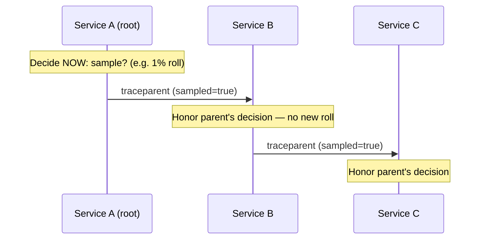
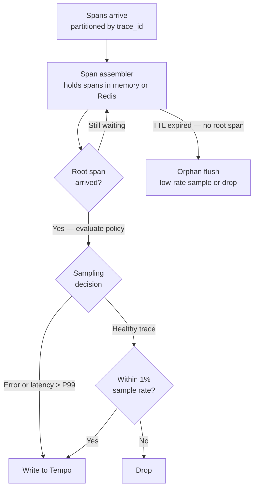

> **Appears in:** [[05-01-telemetry-ingestion-pipeline|Telemetry Ingestion Pipeline]] §3.3 (trace
> processor deep dive), §5 (head vs. tail trade-off).

Every distributed trace produces far more spans than anyone can afford to store. The question that
shapes the entire trace pipeline is: **when do you decide which traces to keep?**

---

## The core distinction

|                             | Head-based                                        | Tail-based                                                                     |
| --------------------------- | ------------------------------------------------- | ------------------------------------------------------------------------------ |
| **Decision point**          | At trace start — before any span outcome is known | After the trace completes — root span has arrived                              |
| **Decision made by**        | SDK or agent, independent per service             | A central span assembler holding the whole trace                               |
| **Memory requirement**      | None — stateless, decide and forward              | Must buffer every span until the trace resolves                                |
| **Can bias toward errors?** | No — the outcome doesn't exist yet                | Yes — that's the entire point                                                  |
| **Operational complexity**  | Low                                               | High — span assembly, [TTL/orphan handling](#orphan-handling), memory pressure |

## Head-based sampling

The decision is made the moment a trace starts, typically at the root span, and propagated to every
downstream span via the trace context (`sampled` flag in the W3C traceparent header). Every service
in the call chain honors the same decision — this is **consistent** or **parent-based** sampling,
and it's what makes head-based sampling viable at all: without propagation, each service would
sample independently and you'd get fragments instead of complete traces.



**Strength:** simple, stateless, zero memory overhead — the decision is made and forgotten
immediately, no span ever needs to be held waiting for a verdict.

**Weakness:** blind. A 1% head-sample rate means you keep 1% of _everything_, uniformly — including
the boring, healthy 99% and missing the interesting slow/errored 1% at the same uniform rate. You
cannot bias toward "traces I actually care about" because you don't yet know which traces those will
be.

## Tail-based sampling

The decision waits until the trace is (believed to be) complete — i.e., the root span has arrived —
and then applies a policy that can actually look at the outcome: did it error, was it slow, did it
touch a specific service.



**Strength:** intelligent. You can write a policy like "keep every errored trace, keep every trace
slower than P99, keep 1% of everything else" — which is what you actually want operationally: full
visibility into anomalies, a representative sample of the baseline.

**Weakness:** the span assembler is a genuinely hard distributed systems problem. Every span of a
trace has to land on the same worker (hash-partition by `trace_id`), that worker has to hold every
span in memory until the root arrives, and at high trace volume that memory footprint is
substantial. A trace that's still open (a slow trace — exactly the kind you most want to keep) sits
in memory the longest, which creates the failure mode covered in
[[05-28-q3-answer-trace-sampling-incident-peak-redesign|Q3: trace pipeline redesign under incident load]]:
a memory-pressured LRU evicts the oldest open traces first, and those are disproportionately the
slow ones you were trying to catch.

> **1% of everything**
>
> Here's what it means concretely:
>
> - **Errors and slow traces** are always kept (100% retention) — these are the traces you actually
>   care about operationally.
> - **Everything else** — the healthy, fast, boring traces that didn't trip any policy — you don't
>   need all of them. You just need a representative random sample to know what "normal" looks like
>   (baseline latency distributions, typical span counts, etc.), without paying to store every
>   single healthy request.
> - "1% of everything" = a flat 1% probabilistic sample applied uniformly across that leftover
>   bucket. In the YAML below it (line 105-107):
>
> ```yml
> - name: baseline
>   type: probabilistic
>   sampling_percentage: 1
> ```
>
> that's the literal implementation — a coin flip that keeps 1 in 100 traces from the "nothing
> interesting happened" bucket.
>
> **Why this matters:** it's the whole point of tail-based sampling over head-based. With head-based
> sampling (decided before the outcome is known), you're forced into one uniform rate for all traces
> — so "1% of everything" would mean you also lose 99% of your errors and slow traces, which is the
> opposite of what you want. Tail-based sampling lets you say "keep 100% of the interesting 1%, and
> only apply that cheap 1%-of-everything sampling to the boring 99%" — full anomaly visibility + a
> cost-bounded baseline, instead of one flat rate applied blindly to both.
>
> That's also why the doc calls head-based sampling "blind" at line 51-54 — its 1% rate has no way
> to distinguish an error from a healthy request, so it throws away the interesting cases at the
> same rate as everything else.

## Composite policies (what tail sampling actually looks like in practice)

Real tail-sampling configuration combines multiple policies with OR semantics — keep the trace if
_any_ policy says keep:

```yaml
processors:
  tail_sampling:
    decision_wait: 10s          # how long to wait for the root span before giving up
    num_traces: 500000          # bound on concurrently-open traces (memory cap)
    policies:
      - name: errors
        type: status_code
        status_codes: [ERROR]
      - name: slow
        type: latency
        threshold_ms: 500
      - name: baseline
        type: probabilistic
        sampling_percentage: 1
```

`decision_wait` and `num_traces` are the two knobs that directly trade memory for completeness —
wait longer and you catch more slow traces, but hold more open traces in memory at once.

## Orphan handling

Not every trace's root span arrives before the TTL(Time To Live) — a service crash mid-request, a
lost span, a misconfigured SDK. The assembler must decide what to do with a trace that times out
with no root: sample it at a low rate (some visibility into orphans, which are themselves often a
symptom of a problem) or drop it outright. Silently holding orphans forever is not an option — it's
an unbounded memory leak disguised as a sampling policy.

TTL(Time To Live)/orphan handling is the operational overhead specific to tail-based sampling — the
price you pay for waiting until a trace completes before deciding whether to keep it.

Here's the mechanism, tied to the flow in the note's mermaid diagram (line 62-70):

- A tail-based span assembler holds every span for a trace_id in memory (or Redis) until the root
  span arrives, at which point it can evaluate the sampling policy (error? slow? keep it).
- But not every trace's root span ever arrives — a service crashes mid-request, a span gets dropped
  in transit, an SDK is misconfigured. Without a cutoff, the assembler would hold that trace's spans
  forever, waiting for a root span that's never coming — an unbounded memory leak.
- TTL is that cutoff: a timer (the note's example config uses decision_wait) after which the
  assembler gives up waiting for the root span.
- Orphan handling is the policy for what to do with a trace that hits the TTL with no root span — an
  "orphan." The two choices are: sample it at a low rate anyway (orphans are often themselves a
  symptom of a problem worth some visibility into) or drop it outright.

## Which to choose

| Use case                                                     | Recommendation                                                                            |
| ------------------------------------------------------------ | ----------------------------------------------------------------------------------------- |
| Business-critical services (checkout, auth, payments)        | Tail-based — you need the errored/slow traces specifically                                |
| Internal infrastructure services (high volume, low variance) | Head-based at a higher flat rate (e.g. 10%) — aggregate rates are what you actually query |
| Both at the same layer                                       | Never — it multiplies complexity for no benefit; pick one per service class               |

This mirrors the trade-off table in the main design's
[[05-13-trade-offs-at-10x-scale|§5 trade-offs]]: tail-based for anything where you'd page someone
over what it catches, head-based everywhere else.

---

## Related

- [[05-01-telemetry-ingestion-pipeline|Telemetry Ingestion Pipeline (full design)]] — §3.3 (trace
  processor), §5 (head vs. tail trade-off)
- [[05-28-q3-answer-trace-sampling-incident-peak-redesign|Q3: Trace Pipeline Redesign Under Incident Load]]
  — what happens when tail-sampling's memory assumptions break under load
- [[02-tail-latency]] — why the traces tail-sampling is built to catch are the ones that matter most
- [[08-deadline-propagation]] — trace context propagation is the same mechanism head-based sampling
  decisions ride on
