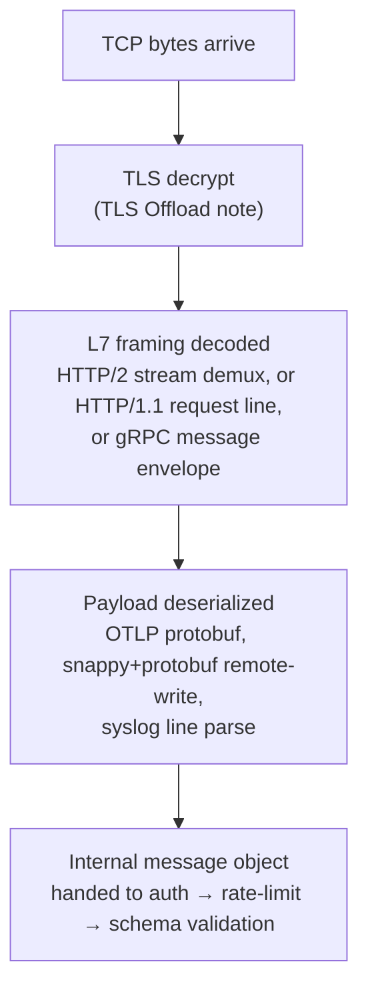

> **Appears in:** [[05-01-telemetry-ingestion-pipeline|Telemetry Ingestion Pipeline]] §3.1
> (ingestion frontier — protocol termination).

"Protocol termination" gets listed as a single bullet in the Layer 1 responsibilities, but it's
actually two distinct jobs happening at the same physical hop, worth separating cleanly in an
interview:

1. **Transport security ends** — the TLS (or mTLS) session is decrypted. This is covered on its own
   in [[02-tls-offload|TLS Offload]] — where to terminate it, what it costs to concentrate at the
   edge, and how mTLS re-encryption closes the defense-in-depth gap. Not repeated here.
2. **The wire protocol itself ends** — whatever framing and encoding the producer used (HTTP/2
   frames, gRPC message envelopes, Prometheus remote-write's snappy+protobuf, a raw syslog line)
   gets decoded into the internal message representation the rest of the pipeline operates on.
   **This is what this note is about.**

---

## The decode chain

Each arrow is a place a malformed or adversarial input can break something: a bad TLS handshake
never reaches step C, a frame that violates HTTP/2's flow-control rules never reaches step D, and a
protobuf blob that doesn't match the expected schema should be rejected at D, before it becomes an
"internal message object" the rest of the pipeline trusts implicitly.

---

## L4 vs L7 termination — where the smart part of "terminating" happens

The load balancer or proxy in front of the gateway fleet can inspect (and terminate) at two
different layers, and the choice changes what's possible downstream:

| Property                        | L4 termination (TCP/TLS only)                                     | L7 termination (HTTP/gRPC-aware)                                                                                                                                   |
| ------------------------------- | ----------------------------------------------------------------- | ------------------------------------------------------------------------------------------------------------------------------------------------------------------ | ------------------------------------ |
| What it sees                    | Raw bytes, IP/port, TLS SNI                                       | Content-type, gRPC method name, HTTP path, headers                                                                                                                 |
| Routing granularity             | Coarse — by port or SNI hostname only                             | Fine — can route `/v1/traces` vs `/v1/metrics` to different backends, or by declared protocol                                                                      |
| Protocol-aware health checks    | No — can't distinguish "TCP is up" from "gRPC service is healthy" | Yes — can issue a gRPC health-check RPC, not just a TCP connect                                                                                                    |
| Cost                            | Cheaper — less CPU per connection, simpler to scale               | More expensive — has to parse and understand the application protocol                                                                                              |
| Where tenant routing hints live | Not visible at this layer                                         | Visible — path prefix or header can inform routing (still must be cross-checked against the authenticated identity — see [[05-25-tenant-identification-and-routing | Tenant Identification and Routing]]) |

**Answer, stated directly:** L4 termination at the outermost load balancer (cheap, handles the raw
connection fan-in), L7 termination at the gateway itself (needs to be protocol-aware anyway, to
decode gRPC/OTLP/remote-write into an internal message). Don't pay for L7 parsing twice by putting a
full L7-aware proxy in front of an already-L7-aware gateway unless the extra hop buys something
concrete (e.g., a service mesh sidecar doing mTLS + observability of its own).

---

## Why HTTP/2 and gRPC framing specifically matter here

The [[05-04-layer-1-ingestion-frontier|Fan-in problem at 100K+ agents]] section in the main design
already covers the connection-storm failure mode; the reason HTTP/2 is the preferred termination
target (rather than HTTP/1.1) is a framing-level property worth stating explicitly: **HTTP/2
multiplexes many concurrent logical streams over one TCP connection**. An agent sending metrics,
logs, and traces over [[02-otlp-protocol|OTLP]]/gRPC doesn't need three connections or serialized
request/response pairs — it opens one connection and interleaves frames from multiple streams on it.
At 10M agents, this is the difference between the gateway fleet managing 10M connections (HTTP/2,
one per agent) versus a multiple of that under HTTP/1.1's one-request-per-connection (or limited
pipelining) model.

The trade-off worth naming: HTTP/2 stream multiplexing introduces **head-of-line blocking at the TCP
level** — if one packet is lost, every stream multiplexed on that connection stalls until
retransmission, because they all share the same underlying TCP byte stream. This is why HTTP/3
(QUIC, streams multiplexed over independent UDP-based streams) exists, but OTLP's primary transport
is still HTTP/2-based gRPC — worth flagging as a known limitation rather than a solved problem if an
interviewer probes on it.

The [[05-04-layer-1-ingestion-frontier|Protocol negotiation sequence diagram]] in the main design
shows the fallback chain (gRPC OTLP → HTTP/1.1 → Prometheus remote-write) for agents that can't
speak HTTP/2 — not repeated here.

---

## Connection lifecycle — the tuning knob that actually causes incidents

Termination isn't a one-time event per connection; the connection stays open and has to be managed
for its whole life:

- **Keepalive:** gRPC clients and servers negotiate `keepalive.time` / `keepalive.timeout` — how
  often a PING frame checks the connection is alive, and how long to wait for the PONG before
  declaring it dead. Set too aggressively, idle agents get disconnected and reconnect needlessly
  (contributing to the connection-storm problem); set too loosely, a half-dead connection (e.g.
  behind a NAT that silently dropped state) looks alive to the gateway for far longer than it
  should.
- **Max connection age:** many gRPC servers force-close and make the client re-establish a
  connection periodically (`MAX_CONNECTION_AGE`), specifically to allow load to redistribute across
  a fleet that's scaled up since the connection was opened — without this, an agent that connected
  when there were 10 gateway pods stays pinned to one of them even after the fleet scales to 100.
- **Idle timeout:** distinguishes a genuinely dead connection from one that's just quiet between
  export intervals — too short a timeout and low-frequency agents get churned unnecessarily.

These three settings, not the crypto handshake itself, are what actually shows up in on-call
incidents — a keepalive misconfiguration after a gateway redeploy is a far more common production
issue than a TLS problem.

---

## Per-protocol termination differences

Because this is a multi-protocol frontier, "termination" looks different depending on which gateway
receives the connection — OTLP gRPC framing, Prometheus remote-write's snappy-compressed protobuf
body, syslog's line-oriented framing over UDP/TCP/TLS, and so on. The full catalog of
protocol-specific gateways, what each accepts, and which clients use them lives in
[[05-24-telemetry-gateways|Telemetry Gateways]] — not duplicated here.

---

## Failure modes worth naming

| Failure                            | Where it surfaces                                                         | Mitigation                                                                                                                                              |
| ---------------------------------- | ------------------------------------------------------------------------- | ------------------------------------------------------------------------------------------------------------------------------------------------------- |
| Malformed frame / invalid protobuf | Decode step throws before the message reaches auth                        | Reject with a protocol-level error immediately; never forward partially-decoded data downstream                                                         |
| Oversized message                  | gRPC message exceeds configured max, or Kafka's `max.message.bytes` later | Reject at the gateway with a clear size-limit error rather than letting Kafka reject it several hops downstream — see the Kafka producer gotcha in §3.2 |
| TLS/protocol downgrade attempt     | Client tries HTTP/1.1 or a weaker TLS version than policy allows          | Reject explicitly rather than silently accepting a weaker connection — covered in TLS Offload                                                           |
| Connection storm after redeploy    | Mass reconnection when gateway pods restart                               | Exponential backoff with jitter in agents (see Fan-in problem, §3.1); staggered `MAX_CONNECTION_AGE` expiry avoids synchronized reconnects              |

---

## Related

- [[05-01-telemetry-ingestion-pipeline|Telemetry Ingestion Pipeline (full design)]] — §3.1 (fan-in
  problem, protocol negotiation, backpressure), §3.2 (Kafka `max.message.bytes` gotcha)
- [[02-tls-offload|TLS Offload]] — the transport security half of "termination," covered separately
- [[networks/05-http-ecosystem/05-grpc/05-grpc|gRPC]] and [[02-http1-vs-http2|HTTP/1.1 vs HTTP/2]] —
  the foundational protocol mechanics this note applies to the ingestion frontier specifically
- [[05-24-telemetry-gateways|Telemetry Gateways]] — the per-protocol catalog of gateways that each
  do their own flavor of termination
- [[05-25-tenant-identification-and-routing|Tenant Identification and Routing]] — how L7-visible
  routing hints (path, header) relate to the authenticated tenant identity
- [[05-21-rate-limiting-architecture|Rate Limiting Architecture]] — what runs immediately after
  termination completes
