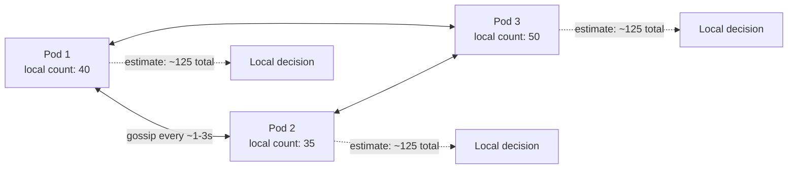
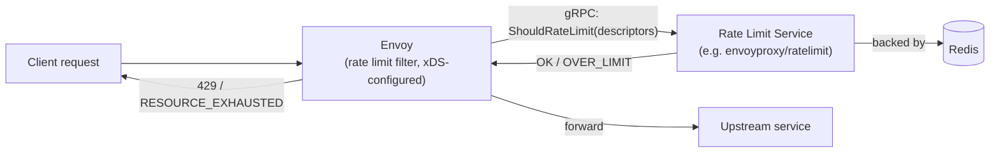

> **Appears in:** [[05-01-telemetry-ingestion-pipeline|Telemetry Ingestion Pipeline]] §3.1
> (ingestion frontier — rate limiting architecture).

The reason this needs a real architecture, and isn't just "add a counter": the ingestion gateway is
a fleet of stateless, horizontally-scaled pods. **Per-request rate limiting inside a single gateway
pod does not work** — each pod would enforce its own limit independently, so a tenant's effective
limit becomes `configured_limit × pod_count`, which drifts every time the fleet autoscales. Rate
limiting at this scale is fundamentally a distributed-state problem before it's a rate-limiting
problem.

```
Wrong:  each pod counts locally → limit = configured_limit × replica_count (drifts with autoscaling)
Right:  pods share state (strongly or eventually consistent) → limit holds regardless of replica count
```

There are three architectures worth knowing, each trading off precision, latency, and
single-point-of-failure risk differently.

---

## Token Bucket in Redis

**The algorithm:** each tenant (or agent, or route) gets a bucket with a fixed capacity that refills
at a steady rate. Every request consumes one token; if the bucket is empty, the request is rejected.
This is preferred over a naive fixed-window counter because it smooths bursts — a bucket that's been
idle can absorb a short burst up to its capacity, rather than allowing a full quota in the first
millisecond of every window and nothing for the rest of it.

```
Bucket: capacity=100, refill_rate=10/sec
  │
  ▼
Request arrives → bucket has tokens? → consume 1, allow
                                     → empty → reject (429)
  │
  ▼
Every 100ms: refill by (refill_rate × elapsed_time)
```

**Why Redis specifically:** Redis gives you a single shared, low-latency store that every gateway
pod can check before accepting a request — this is what makes the limit hold regardless of how many
pods are running. The check-and-decrement has to be atomic (a naive GET-then-SET from two pods
racing on the same key both see "1 token left" and both allow the request), so this is typically
implemented as a Lua script executed atomically inside Redis:

```lua
-- Simplified token bucket check, run atomically via EVAL
local key = KEYS[1]
local capacity = tonumber(ARGV[1])
local refill_rate = tonumber(ARGV[2])
local now = tonumber(ARGV[3])

local bucket = redis.call("HMGET", key, "tokens", "last_refill")
local tokens = tonumber(bucket[1]) or capacity
local last_refill = tonumber(bucket[2]) or now

local elapsed = now - last_refill
tokens = math.min(capacity, tokens + elapsed * refill_rate)

if tokens < 1 then
  return 0  -- reject
else
  tokens = tokens - 1
  redis.call("HMSET", key, "tokens", tokens, "last_refill", now)
  redis.call("EXPIRE", key, 3600)
  return 1  -- allow
end
```

**Trade-offs:**

| Property             | Detail                                                                                                                                                                                                                 |
| -------------------- | ---------------------------------------------------------------------------------------------------------------------------------------------------------------------------------------------------------------------- |
| Consistency          | Strong — every pod sees the same bucket state immediately                                                                                                                                                              |
| Latency added        | ~1ms intra-datacenter round trip per request (or per batch, if you locally cache and check periodically)                                                                                                               |
| Scaling ceiling      | Redis is largely single-threaded for command execution; a single instance tops out around 100K ops/sec. Works comfortably at 100K agents; becomes the bottleneck approaching 10M                                       |
| Mitigations at scale | Shard tenants across multiple Redis instances (hash tenant_id → shard); use Redis Cluster; or accept a local short-TTL cache (e.g. 100ms) of the last decision to cut round trips at the cost of slight over-admission |
| Failure mode         | Redis down → explicit choice: **fail open** (allow everything, risk overload) or **fail closed** (reject everything, guarantees safety but a Redis blip now looks like a full outage to every tenant)                  |

The fail-open/fail-closed choice is worth stating explicitly in an interview — it's a real design
decision with no universally correct answer, and depends on whether an accidental overload or an
accidental full rejection is the worse outcome for your system.

---

## Gossip-Based Distributed Rate Limiting

**The idea:** drop the central store entirely. Each gateway pod tracks its own local request count
per tenant, and periodically exchanges that count with a subset of its peers (a gossip protocol —
each round, tell a few random peers what you know; information propagates through the fleet in
`O(log N)` rounds without any single coordinator). Each pod maintains a running estimate of the
_global_ rate by combining its own local count with the most recent counts it's heard from peers.



**Trade-offs:**

| Property           | Detail                                                                                                                                                                                                   |
| ------------------ | -------------------------------------------------------------------------------------------------------------------------------------------------------------------------------------------------------- |
| Consistency        | Eventual — there's a propagation delay (the gossip interval, typically 1–3s) before all pods agree on the global count                                                                                   |
| Precision          | Imprecise by design — a burst can temporarily exceed the intended limit by roughly the amount that arrives within one gossip interval, spread across pods that haven't yet heard about each other's load |
| SPOF               | None — no central store to lose. This is the entire point: it scales horizontally with the gateway fleet itself, with no separate piece of infrastructure to capacity-plan                               |
| Right scale for it | Where Redis becomes the bottleneck (approaching the 10M-agent end of the scale envelope) and slight over-admission during bursts is an acceptable trade for removing a SPOF                              |

**A clarification worth making explicitly:** the main design's shorthand groups "Netflix Concurrency
Limits" in with gossip-based rate limiting, but they solve a related, not identical, problem.
Netflix's [concurrency-limits](https://github.com/Netflix/concurrency-limits) library is an
_adaptive concurrency limiter_ — it runs **locally per instance**, with no gossip or peer exchange
at all, and dynamically adjusts how many concurrent in-flight requests that one instance will accept
based on observed latency (using TCP congestion-control-inspired algorithms like Vegas/gradient). It
answers "how much concurrent load can _I_ handle right now," not "what's our _shared global_ rate
limit." The two techniques compose well — gossip-based limiting can set the shared tenant-level
budget, while each pod additionally runs an adaptive concurrency limiter to protect itself from its
own local resource exhaustion — but they are not the same mechanism, and conflating them is worth
catching yourself on in an interview.

---

## Envoy Sidecar with Global Rate Limit Service

**The idea:** rather than every service implementing rate-limit logic (Redis calls, gossip,
whatever), push the decision into the network layer. Envoy's rate limit filter intercepts each
request and makes a gRPC call to a separate **rate limit service** before deciding whether to
forward it.



The request is classified into **descriptors** — key/value pairs like `{tenant_id: "acme"}` or
`{route: "/v1/traces", tenant_id: "acme"}` — and the rate limit service (commonly the open-source
`envoyproxy/ratelimit`, which is itself usually Redis-backed) evaluates the configured limit for
that descriptor combination.

**Trade-offs:**

| Property              | Detail                                                                                                                                                                                                                                     |
| --------------------- | ------------------------------------------------------------------------------------------------------------------------------------------------------------------------------------------------------------------------------------------ |
| Where the logic lives | Entirely out of application code — configured declaratively via xDS, enforced uniformly across every service the mesh fronts                                                                                                               |
| Latency added         | ~2ms for the extra gRPC hop per request (or per connection, if you rate-limit at connection-establishment instead of per-request)                                                                                                          |
| Consistency           | As strong as the rate limit service's own backing store — typically Redis, so this is really the token-bucket-in-Redis pattern, just relocated behind a shared service and a proxy filter instead of called directly from application code |
| Operational win       | Centralized configuration and central enforcement means every service gets consistent rate-limit behavior automatically — no risk of one team's service "forgetting" to implement it                                                       |

This is worth recognizing as **not actually a fourth distinct algorithm** — under the hood it's
usually still a centralized store (Redis), the same as the first pattern. What's different is _where
the enforcement point lives_: instead of each application calling Redis directly, Envoy does it
uniformly for every service behind it, via a shared, purpose-built service rather than
per-application client code. See [[envoy]] for how the sidecar pattern this relies on works more
generally.

---

## Choosing an approach

The main design's answer, stated directly: **coarse-grained enforcement at the load balancer (simple
token bucket), fine-grained enforcement at the gateway with eventually-consistent distributed
counters.** In practice this usually means:

| Scale                            | Recommended approach                                                                                                                                                                |
| -------------------------------- | ----------------------------------------------------------------------------------------------------------------------------------------------------------------------------------- |
| Up to ~100K agents               | Token bucket in Redis — simplest to operate, strong consistency, latency is negligible                                                                                              |
| Approaching 10M agents           | Gossip-based (or sharded Redis) — Redis alone becomes the bottleneck; accept eventual consistency for horizontal scalability                                                        |
| Service-mesh-wide, many services | Envoy + global rate limit service — the win is uniform enforcement across every service without every team reimplementing the logic, independent of which underlying store backs it |

These aren't mutually exclusive — a real deployment commonly layers coarse LB-level limiting (cheap,
catches the worst abuse early) with fine-grained gateway-level limiting (precise, per-tenant) on
top.

---

## Related

- [[05-01-telemetry-ingestion-pipeline|Telemetry Ingestion Pipeline (full design)]] — §3.1 (rate
  limiting architecture), §3.6 (multi-tenancy quota enforcement points)
- [[05-backpressure|Backpressure]] — rate limiting is backpressure applied proactively, before the
  system is already overloaded
- [[envoy]] — the proxy underlying the sidecar + global rate limit service pattern
