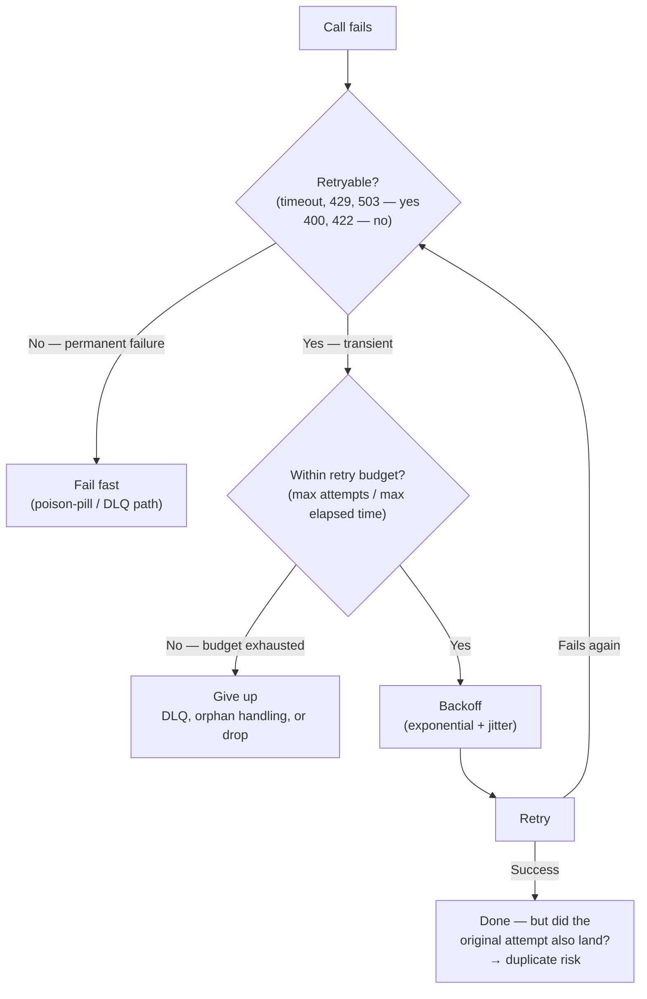
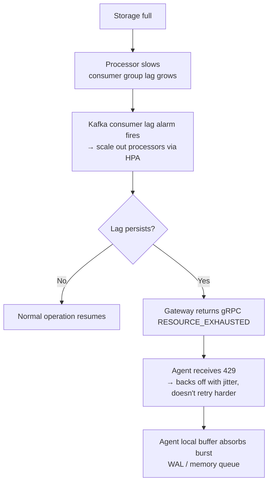
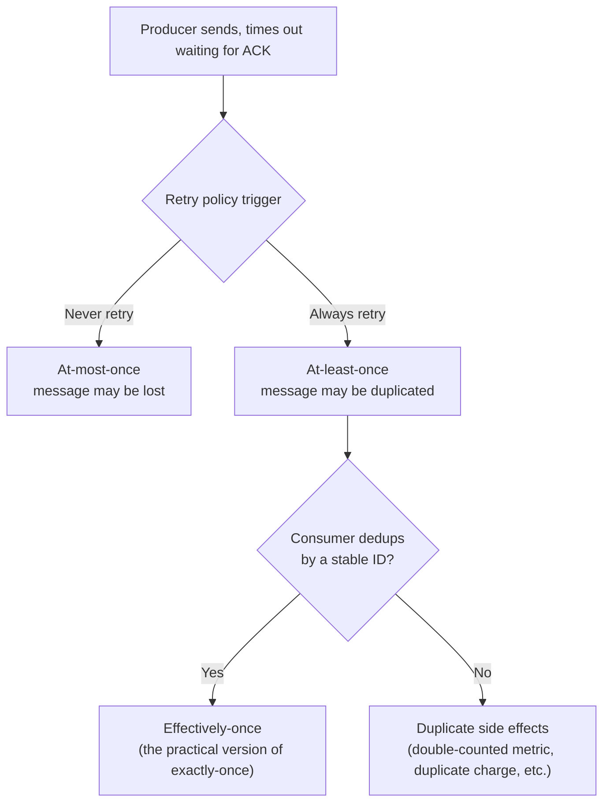

> **Appears in:** [[05-01-telemetry-ingestion-pipeline|Telemetry Ingestion Pipeline]] §1
> (consistency and durability requirements), §3.1 (agent retry/backoff, gateway ACK), §3.2 (Kafka
> producer/consumer semantics).

This looks like a question about delivery semantics — at-least-once vs exactly-once. It's actually a
retry-policy question wearing a delivery-semantics costume. Every hop in this pipeline answers the
same three questions — **is this failure worth retrying, how long before the next attempt, and when
do I give up** — before "at-least-once" or "exactly-once" ever enters the picture. The delivery
semantic a pipeline ends up with is the _accumulated side effect_ of those retry decisions across
every hop, not an independent design choice you make separately.

---

## The uncertain moment

```
Producer sends message ──▶ [ network / broker ] ──▶ ??? did it arrive?
                                                        │
                        Producer gets a timeout, not an answer.
                        Did the message get lost? Or did it arrive and
                        only the ACK got lost on the way back?
                        The producer cannot tell the difference.
```

The producer has exactly two choices when it can't confirm delivery: **retry** (risking a duplicate,
if the original actually did arrive) or **don't retry** (risking silent loss, if it didn't). Every
retry policy is a set of rules for which side of that coin you accept, and under what conditions.

## Anatomy of a retry policy — three knobs

A retry policy is not one decision, it's three, and getting any one of them wrong produces a
specific, recognizable failure mode:

| Knob        | Question it answers                | What gets it wrong                                                                                                        |
| ----------- | ---------------------------------- | ------------------------------------------------------------------------------------------------------------------------- |
| **Trigger** | Which failures are worth retrying? | Retrying a `400 Bad Request` forever (it will never succeed); _not_ retrying a `429`/`503` that would succeed next time   |
| **Backoff** | How long before the next attempt?  | Fixed-interval retries from thousands of clients synchronize into a thundering herd on the exact system that's struggling |
| **Budget**  | When do you stop?                  | No cap → a permanently-failing message or dependency retries forever, blocking everything queued behind it                |



That last edge — "did the original attempt also land?" — is where delivery semantics come from. It's
not a separate branch in the flowchart; it's the question the whole retry loop leaves unanswered
every time it takes the "retry" path.

## Backoff strategy: why exponential + jitter, not fixed-interval

**Fixed-interval retry** (always wait exactly N seconds) is the naive default, and it fails in a
specific way: when the thing that made everything fail simultaneously — a gateway rolling restart, a
regional outage — resolves, every client that was waiting retries at the same instant. That's a
thundering herd, and it's the [[05-04-layer-1-ingestion-frontier|gateway fan-in problem]] at 100K+
agents: 50K agents reconnecting simultaneously after a rolling restart.

**[[08-retry-with-jitter|Exponential backoff]]** (1s → 2s → 4s → … → capped at 60s, per the agent
WAL config in [[05-26-q1-answer-500m-ingest-zero-drop-rolling-deploy|Q1]]) spreads out load over
time instead of hammering the dependency at a constant rate while it's still recovering.

**Jitter** (randomizing each wait within a range, rather than a deterministic sequence) is what
actually breaks the synchronization — without it, exponential backoff alone still leaves every
client on the same schedule, just a slower one. The same fix shows up in an unrelated subsystem for
the same underlying reason: [[05-31-q6-answer-compactor-storm-diagnosis|Q6]] jitters ingester flush
schedules across tenants specifically because ingesters started at the same time otherwise
resynchronize their 2-hour flush boundaries over time — identical failure shape (correlated retries
becoming a self-inflicted storm), different subsystem (scheduled flush, not a failed RPC).

```yaml
# Alloy agent config — exponential backoff + jitter + a bounded retry budget
retry_on_failure:
  enabled: true
  initial_interval: 1s
  max_interval: 60s        # cap — without this, backoff grows unbounded
  max_elapsed_time: 120s   # budget — after this, give up and let the WAL hold the batch
retry_on_http_429: true    # treat backpressure as retryable, not a permanent failure
```

## Retry budgets and giving up

A retry policy needs a stopping condition on two different axes:

- **Max attempts / max elapsed time** — `delivery.timeout.ms = 120s` in the Kafka producer config
  ([[05-26-q1-answer-500m-ingest-zero-drop-rolling-deploy|Q1]]) bounds how long a single message can
  spend retrying before the producer gives up on it entirely.
- **What happens at that boundary** depends on what's failing:
  - **One bad message** (malformed payload that will never deserialize) is a **poison pill**
    ([[05-29-q4-answer-metric-point-journey-failure-points|Q4]]) — retrying it is pointless because
    the failure is permanent, not transient, and an unbounded retry blocks every message queued
    behind it on that partition. The fix is a retry-count cap _per message_, with overflow routed to
    a dead-letter destination instead of retried forever.
  - **One dependency** being down (not one message) calls for a
    [[07-circuit-breaker|circuit breaker]]: stop sending traffic to a dependency that's already
    failing, so retries stop amplifying the outage and the dependency gets room to recover. This is
    the same "stop trying, protect the shared resource" pattern
    [[05-27-q2-answer-cardinality-storm-detection-mitigation|Q2]] uses at the processor layer —
    there it's a cardinality-budget reject rather than a downstream-failure trip, but it's the same
    shape: fail fast at a cheap layer rather than let the failure propagate and get expensive
    downstream.

A retry policy that conflates these two — retrying a poison pill as if it were a transient failure,
or retrying against a dead dependency as if one more attempt might get lucky — is the single most
common root cause of "why is consumer lag growing on exactly one partition" or "why did a 10-minute
outage turn into an hour of recovery."

## Retry storms and the backpressure feedback loop

Retries aren't free even when they eventually succeed — every retry is additional load on a system
that, by definition, just failed to keep up. At scale this becomes a feedback loop the pipeline has
to close deliberately, not just tolerate:



The critical design choice: `429`/`RESOURCE_EXHAUSTED` is a **signal to slow the retry rate down**,
not a failure to retry around faster. A retry policy that treats backpressure as "just another
transient failure, retry immediately" turns a load-shedding signal into more load — exactly the
scenario exponential backoff with jitter exists to prevent. This is also why the gateway itself must
never become the coordination point for backpressure
([[05-04-layer-1-ingestion-frontier|main design]]) — the decision to slow down has to live in the
retrying client, where the backoff state actually is.

## The side effect of retrying: delivery semantics

A retry policy whose trigger rule is "always retry on uncertainty" produces **at-least-once**
delivery _by construction_ — not because anyone chose at-least-once as a semantic, but because
duplicates are the unavoidable consequence of that trigger rule. Delivery semantics are downstream
of the retry decision, not upstream of it:

| Semantic          | Retry policy                                                | What can go wrong                                                 | Cost                                             |
| ----------------- | ----------------------------------------------------------- | ----------------------------------------------------------------- | ------------------------------------------------ |
| **At-most-once**  | Never retry                                                 | Message silently lost                                             | Cheapest — fire and forget                       |
| **At-least-once** | Always retry on uncertainty                                 | Message delivered twice (or more)                                 | Cheap — consumer must handle duplicates          |
| **Exactly-once**  | Retry, but the _system_ guarantees no duplicate and no loss | Nothing, by definition — but achieving this is the expensive part | Highest — coordination overhead on every message |



**At-most-once** is rarely chosen deliberately for anything that matters — it's what you get by
default if you don't build retry logic at all. It shows up in fire-and-forget protocols like StatsD
over UDP, where the cost of guaranteeing delivery exceeds the value of any single sample.

**At-least-once** is the default for almost everything else, because retrying on uncertainty is the
safe default when duplicates are cheaper to handle than loss. The burden shifts downstream: whatever
consumes the message now has to tolerate seeing it more than once.

### Why "exactly-once" is expensive — the actual mechanism

There is no way for a producer to make a single network call that is guaranteed to have exactly one
effect on a remote system it can't see the internal state of — this is fundamentally the same shape
of problem as the [Two Generals' Problem](https://en.wikipedia.org/wiki/Two_Generals%27_Problem) in
distributed systems theory. What "exactly-once" systems actually do is **fake the outcome** through
one of two mechanisms — both of which exist specifically to absorb the duplicates a retry policy
creates:

**Mechanism 1: Idempotent producer (dedup at the write).** The producer attaches a unique,
monotonically increasing sequence number (per producer session) to every message. The receiver keeps
track of the last sequence number it accepted per producer and silently discards anything it's
already seen — a retry of an already-delivered message becomes a no-op instead of a duplicate.

```yaml
# Kafka producer config — this is exactly-once at the produce step only
enable.idempotence: true      # broker deduplicates retries by (producer_id, sequence_number)
acks: all                     # all ISR replicas must confirm before considering it sent
```

This solves duplication **on the hop between producer and broker** — it does not, by itself, make
the entire end-to-end pipeline exactly-once. A message can still be processed twice further
downstream if the _consumer_ crashes after processing but before committing its offset — a retry at
a different hop, with the same root cause.

**Mechanism 2: Transactional consume-process-produce (dedup across a boundary).** Kafka's
transactional API lets a consumer atomically commit "I processed message X" (its consumer offset)
together with "I produced message Y" (its output) as a single all-or-nothing unit. If the consumer
crashes between processing and committing, the whole transaction aborts and gets replayed from the
start — so from an outside observer's point of view, either both things happened or neither did.

```
Transaction boundary:
  ┌─────────────────────────────────────┐
  │ 1. Consume message X (offset N)     │
  │ 2. Process X → produce message Y    │
  │ 3. Commit offset N + produce Y      │  ← atomic: all or nothing
  └─────────────────────────────────────┘
```

**The catch that matters most in an interview:** this only guarantees exactly-once _within Kafka's
own transactional boundary_. The moment the pipeline writes to something outside that boundary — an
external database, an external API, a metric TSDB — the guarantee doesn't automatically extend
there. The external system needs its own idempotency (e.g., an upsert keyed by a unique ID) or the
guarantee silently stops at the Kafka boundary, and any retry past that point is back to producing
plain at-least-once duplicates.

### "Effectively-once" — what most systems actually build

Because true end-to-end exactly-once requires every hop in the chain (including external systems) to
participate in the same transactional or idempotency scheme, most real systems settle for:

```
Effectively-once = at-least-once retry policy + idempotent processing at the consumer
```

The message can arrive more than once; the consumer recognizes duplicates (by a stable ID, content
hash, or fingerprint) and processing a duplicate has no additional effect. This achieves the
_outcome_ users care about (no double-counting, no duplicate charges) without needing the expensive
coordination machinery of a literal exactly-once guarantee.

## Retry policy per hop, in this pipeline

Retry policy isn't set once for the whole pipeline — it's set per hop, and the duplicate risk
compounds across every hop that retries independently:

| Hop                                    | Retry trigger                       | Backoff                                                   | Budget                               | Duplicate risk              | Mitigation                                                                                                        |
| -------------------------------------- | ----------------------------------- | --------------------------------------------------------- | ------------------------------------ | --------------------------- | ----------------------------------------------------------------------------------------------------------------- |
| Agent → Gateway                        | No ACK / timeout                    | Exponential + jitter (1s → 60s)                           | WAL `max_age` (bounded local buffer) | Yes — ambiguous ACK         | Idempotency key + gateway-side dedup, tenant-scoped for the billing tenant                                        |
| Gateway → Kafka                        | Producer timeout                    | Kafka producer internal backoff                           | `delivery.timeout.ms = 120s`         | Yes                         | `enable.idempotence: true` — broker dedups by `(producer_id, sequence_number)`                                    |
| Kafka consume → Processor              | Consumer crash before offset commit | Consumer group rejoin, resumes from last committed offset | Consumer group session timeout       | Yes — reprocesses the batch | Accepted at-least-once; downstream store dedup (below). Billing tenant uses transactional consume-process-produce |
| Processor → Storage (Mimir/Loki/Tempo) | Remote-write timeout                | Exponential backoff                                       | Bounded retry queue                  | Yes                         | Idempotency key + storage-side dedup, tenant-scoped for the billing tenant                                        |

Full trace of how this plays out for the one tenant where duplicates aren't tolerable:
[[05-37-q12-answer-mixed-exactly-once-billing-tenant|Q12]].

### Which signals can tolerate the duplicates at-least-once produces

| Signal                                    | Retry policy                              | Why it's safe                                                                                                                               |
| ----------------------------------------- | ----------------------------------------- | ------------------------------------------------------------------------------------------------------------------------------------------- | --------------------------------------------------------------------------------------------------- |
| Metrics                                   | At-least-once                             | The TSDB deduplicates by timestamp + label fingerprint — a duplicate sample at the same timestamp is simply overwritten, not double-counted |
| Logs                                      | At-least-once                             | Dedup on a content hash + timestamp window within the log store                                                                             |
| Traces                                    | At-least-once                             | Trace stores deduplicate by span ID — a duplicate span is a no-op                                                                           |
| Billing-critical metrics (exception case) | Exactly-once (scoped to that tenant only) | See [[05-37-q12-answer-mixed-exactly-once-billing-tenant                                                                                    | Q12]] — the cost is only justified because a dollar amount depends on the count being exactly right |

The main design's stance, stated directly: **default every hop to always-retry (at-least-once), and
only pay for exactly-once where there is a billing or compliance requirement.** Everywhere else,
at-least-once plus a cheap dedup key at the storage layer gets you the same practical correctness at
a fraction of the latency and operational cost — paying for transactional coordination on every
metric sample, for a guarantee the TSDB's own dedup already provides for free, would be solving a
problem that doesn't exist.

## What retry policy choices cost

This is the number to have ready when someone asks "why not just always retry aggressively" or "why
not just always do exactly-once":

- **Latency** — transactional commits require additional coordination round trips per message (or
  per batch) compared to fire-and-forget or simple at-least-once acknowledgment.
- **Throughput** — transaction coordinators serialize commits; you trade raw throughput for the
  correctness guarantee.
- **Operational surface area** — a dedicated consumer group and transactional path, isolated from
  the shared processing fleet's default at-least-once path, per
  [[05-37-q12-answer-mixed-exactly-once-billing-tenant|Q12]]'s answer — because you cannot mix
  transactional and non-transactional consumption in the same consumer group.
- **Blast-radius amplification** — a retry policy that doesn't back off (or doesn't jitter) turns a
  transient dependency slowdown into a self-inflicted overload.
  [[05-32-q7-answer-regional-gateway-outage-blast-radius|Q7]]'s 10-minute regional outage stays a
  10-minute outage specifically because agents back off with jitter and buffer locally instead of
  retrying harder against an endpoint that's already down.
- **False confidence risk** — a bug in the exactly-once mechanism itself still produces
  internally-consistent-looking metrics. The only real check is reconciliation against a source of
  truth outside the pipeline, not a pipeline-internal counter.

---

## Related

- [[05-01-telemetry-ingestion-pipeline|Telemetry Ingestion Pipeline (full design)]] — §1
  (consistency/durability requirements), §3.1 (agent retry/backoff, gateway ACK), §3.2 (Kafka
  producer config and exactly-once vs at-least-once)
- [[05-26-q1-answer-500m-ingest-zero-drop-rolling-deploy|Q1: 500M ingest, zero-drop rolling deploy]]
  — source of the WAL + exponential backoff config and `delivery.timeout.ms` budget
- [[05-27-q2-answer-cardinality-storm-detection-mitigation|Q2: Cardinality storm detection & mitigation]]
  — the circuit-breaker pattern that pairs with retry budgets to protect a shared resource
- [[05-29-q4-answer-metric-point-journey-failure-points|Q4: Metric point journey failure points]] —
  poison-pill messages: the retry-budget failure mode at the single-message level
- [[05-31-q6-answer-compactor-storm-diagnosis|Q6: Compactor storm diagnosis]] — the same
  correlated-retry-becomes-a-storm failure shape, in scheduled flushes rather than failed RPCs
- [[05-32-q7-answer-regional-gateway-outage-blast-radius|Q7: Regional gateway outage blast radius]]
  — why backoff + jitter is what keeps an outage's blast radius from growing
- [[05-37-q12-answer-mixed-exactly-once-billing-tenant|Q12: Mixed exactly-once billing tenant]] —
  the one scenario in this design where exactly-once is actually worth the cost
- [[05-backpressure]] — the retry behavior that produces at-least-once duplicates is the same
  mechanism backpressure-driven agent retries rely on
