> **Appears in:** [[05-01-telemetry-ingestion-pipeline|Telemetry Ingestion Pipeline]] §2 (high-level
> architecture — ingestion frontier).

The diagram in the parent doc shows an **ingestion layer** where different telemetry protocols enter
the observability platform. Each gateway is responsible for a different ingestion protocol. The
[[02-otlp-protocol|OTLP]] Gateway is just one of them.

Here's what each gateway does.

| Gateway                                  | Accepts                 | Telemetry Type        | Typical Clients                                   |
| ---------------------------------------- | ----------------------- | --------------------- | ------------------------------------------------- |
| **OTLP Gateway**                         | OTLP/gRPC, OTLP/HTTP    | Metrics, Logs, Traces | OpenTelemetry SDKs, Grafana Alloy, OTel Collector |
| **Prometheus Remote Write (RW) Gateway** | Prometheus Remote Write | Metrics               | Prometheus, VictoriaMetrics Agent, Grafana Alloy  |
| **Syslog Gateway**                       | Syslog (UDP/TCP/TLS)    | Logs                  | Linux servers, routers, firewalls, switches       |
| **HTTP Log Gateway**                     | HTTP/REST               | Logs                  | Fluent Bit, Vector, custom applications           |
| **Kafka Gateway**                        | Kafka protocol          | Logs, Metrics, Events | Kafka producers                                   |
| **StatsD Gateway**                       | UDP StatsD              | Metrics               | Legacy applications                               |
| **Jaeger Gateway**                       | Jaeger gRPC/Thrift      | Traces                | Jaeger clients                                    |
| **Zipkin Gateway**                       | Zipkin HTTP             | Traces                | Zipkin clients                                    |
| **Fluentd/Fluent Bit Gateway**           | Fluent Forward protocol | Logs                  | Fluentd, Fluent Bit                               |
| **OpenMetrics Gateway**                  | HTTP scrape             | Metrics               | Prometheus exporters                              |

---

## 1. OTLP Gateway

**Purpose:** universal receiver for OpenTelemetry — metrics, logs, and traces over a single
protocol.

Ports:

```
4317  gRPC
4318  HTTP
```

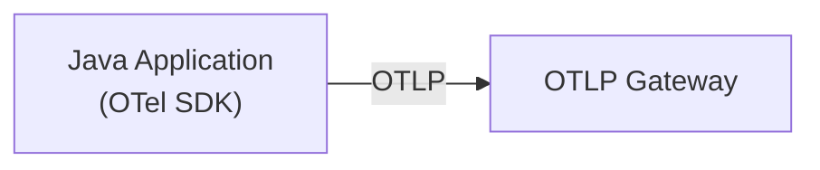

This is the industry standard for new instrumentation — prefer it over every protocol below unless a
producer can't emit it.

---

## 2. Prometheus Remote Write Gateway

Prometheus is a pull-based monitoring system. After scraping, it (or an agent) pushes the scraped
series onward via remote-write:

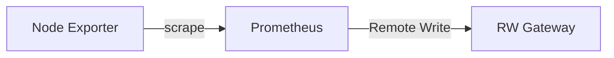

The gateway accepts the **Prometheus Remote Write** protocol.

Typical responsibilities:

- Authentication
- Rate limiting
- Compression
- Tenant routing
- Forward to Mimir

Used by:

- Prometheus
- Grafana Alloy
- Prometheus Agent
- VictoriaMetrics Agent

---

## 3. Syslog Gateway

Designed for traditional infrastructure. Receives logs from:

- Linux / Unix
- Routers, switches, firewalls
- Load balancers

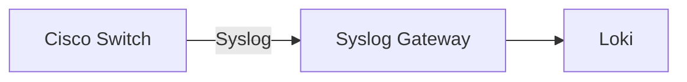

Usually supports UDP, TCP, and TLS transport.

---

## 4. HTTP Log Gateway

Some applications simply POST logs.

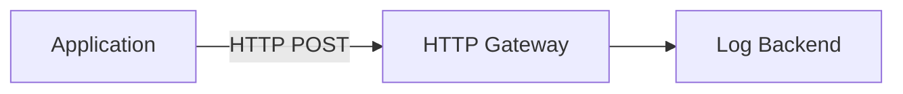

Common clients: [[fluent-bit|Fluent Bit]], Vector, custom agents. Useful when Syslog isn't
available.

---

## 5. Kafka Gateway

Many enterprises already use Kafka as their transport backbone.

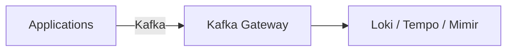

Advantages:

- Buffering
- Replay
- High throughput
- Decoupling producers and consumers

Common in very large deployments — the trade-off is operational cost: a consumer group, schema
registry, and offset-management story to run alongside it.

---

## 6. StatsD Gateway

Legacy metrics protocol, still common for older Java, Python, and Ruby applications.

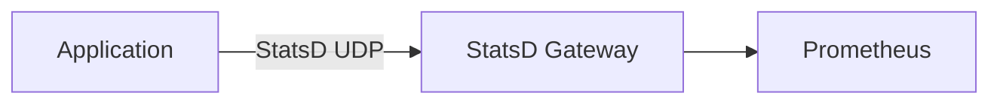

The gateway converts StatsD metrics into Prometheus/OpenTelemetry format.

---

## 7. Jaeger Gateway

Before OpenTelemetry, Jaeger was a popular tracing system.

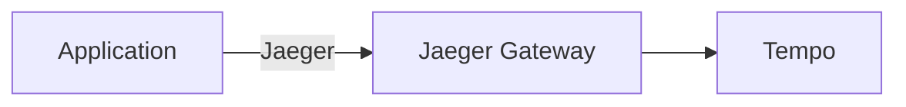

Purpose: receive Jaeger traces and convert them if needed.

---

## 8. Zipkin Gateway

Another legacy tracing protocol — many Spring Boot applications historically emitted Zipkin traces.

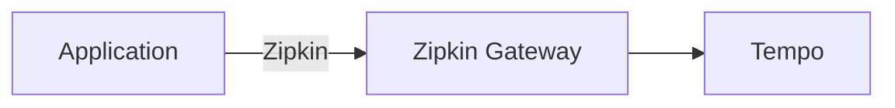

---

## 9. Fluent Bit / Fluentd Gateway

Log collectors often use the Fluent Forward protocol — common in Kubernetes.

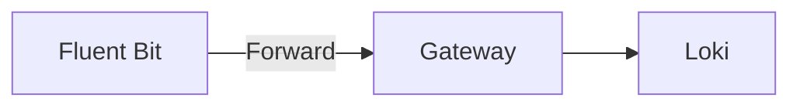

---

## 10. OpenMetrics Gateway

Some exporters expose metrics directly over HTTP scrape.

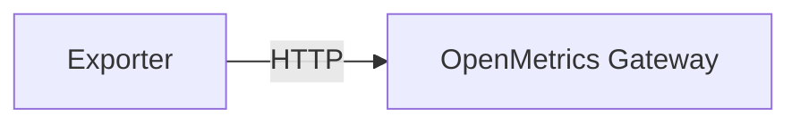

This converts scraped metrics into the internal format for storage.

---

## Why have multiple gateways?

An enterprise observability platform needs to support many telemetry producers, not just
OpenTelemetry.

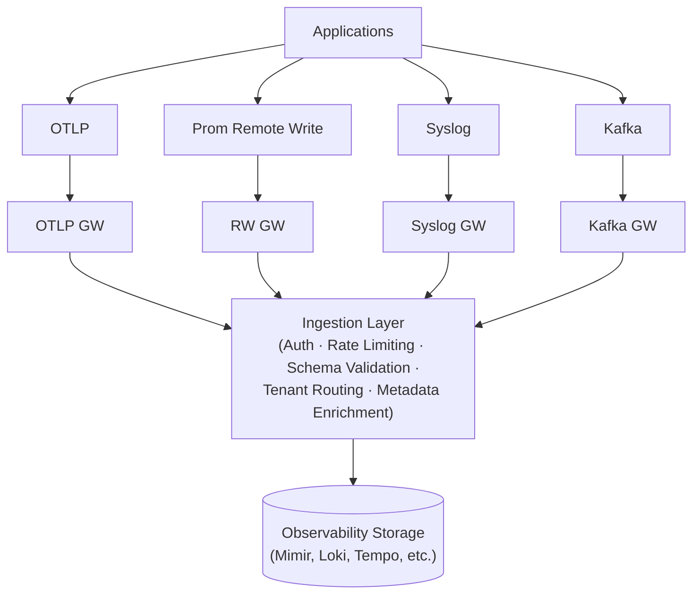

## In a Grafana Cloud deployment

For the Azure environment you described (Azure Container Apps, Azure Functions, AKS), you would
typically use:

- **OTLP Gateway** for modern applications instrumented with OpenTelemetry.
- **Prometheus Remote Write Gateway** for Prometheus metrics collected from Kubernetes clusters.
- **Syslog/HTTP Gateway** only if you have network devices, Linux hosts, or legacy systems producing
  syslog or HTTP-based logs.
- **StatsD, Jaeger, and Zipkin gateways** only during migrations from older observability stacks.
  For new deployments, OTLP is generally preferred because it provides a single protocol for
  metrics, logs, and traces.
