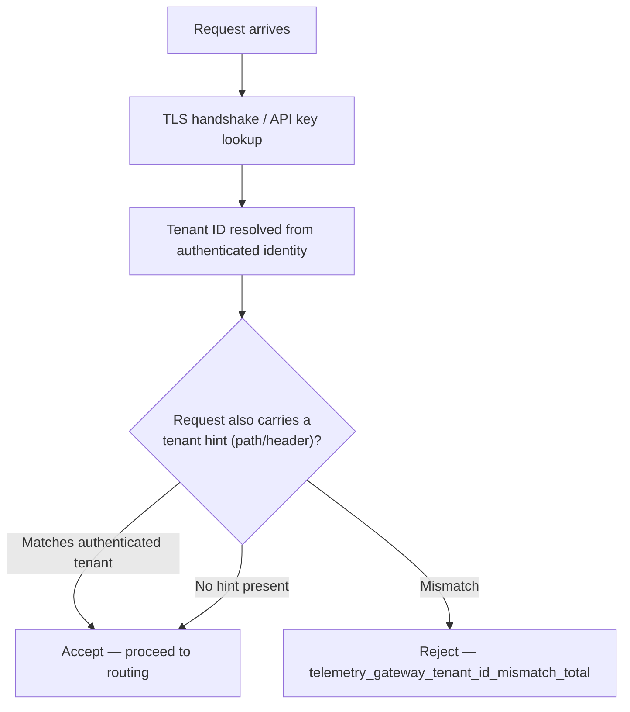

> **Appears in:** [[05-01-telemetry-ingestion-pipeline|Telemetry Ingestion Pipeline]] §3.1
> (ingestion frontier — tenant identification and routing).

The reason this is its own design question, not a one-liner: every downstream decision in the
pipeline — which cardinality budget applies, which Kafka partition/topic a message lands on, which
`X-Scope-OrgID` gets written to storage — depends on the platform having correctly answered "whose
data is this?" **before** the message leaves the gateway. Get tenant identification wrong and every
other isolation mechanism in [[05-09-multi-tenancy|§3.6 (Multi-Tenancy)]] is enforcing the wrong
boundary.

---

## Where the tenant ID actually comes from

There are four common mechanisms for identifying the tenant on an inbound request. They are not
interchangeable — the trust properties differ sharply:

| Mechanism                                             | How it works                                                                                                                | Trust level                                                                                                               |
| ----------------------------------------------------- | --------------------------------------------------------------------------------------------------------------------------- | ------------------------------------------------------------------------------------------------------------------------- |
| mTLS certificate SAN/CN                               | Gateway extracts tenant ID from the client cert's Subject Alternative Name, verified by the TLS handshake itself            | Strongest — cannot be forged without the private key                                                                      |
| API key → tenant mapping                              | Gateway looks up the presented API key in an identity store; the store, not the key itself, says which tenant it belongs to | Strong — as good as key issuance/rotation hygiene                                                                         |
| JWT claim (`tenant_id` in a signed token)             | Gateway verifies the token signature, reads the claim                                                                       | Strong if signature verification is enforced; a common bug is trusting the claim without checking the signature covers it |
| Path/subdomain/header (`/v1/{tenant}`, `X-Tenant-ID`) | Extracted directly from the request, no cryptographic binding                                                               | **Untrusted on its own** — trivially spoofable by anything that can reach the gateway                                     |

**The rule that matters most in an interview:** tenant identity must be derived from the
authenticated credential (the cert or the key-to-tenant lookup), never read directly from a
client-controlled field in the path, header, or payload body. A path-based or header-based tenant
hint is fine as a routing convenience (e.g., load-balancer-level sharding before termination), but
it must be **cross-checked against the authenticated identity** and the request rejected on mismatch
— this is exactly the "defense 1" fix in
[[05-36-q11-answer-compromised-agent-threat-model#Defense 1: Tenant ID comes from the certificate, never from the payload|Q11 (compromised agent threat model)]],
which covers the spoofing failure mode in depth. This note assumes that defense is already in place
and focuses on the identification-and-routing mechanics themselves.



---

## Propagating tenant identity downstream

Once resolved, the tenant ID has to survive every hop without being re-derived (re-deriving it at
each layer duplicates trust logic and multiplies the places a bug can leak isolation):

```
Gateway:    tenant ID resolved from cert/API-key → attached as a message header, not re-embedded in the body
Kafka:      tenant ID carried as a Kafka message header (or encoded in the partition/topic choice — see below)
Processor:  reads the header, not the payload, to apply per-tenant cardinality budget (§3.3) and enrichment
Storage:    tenant ID becomes the X-Scope-OrgID header on the Mimir/Loki write — this is what actually
            partitions data at rest
```

A common mistake worth naming explicitly: relabeling the tenant ID into a Prometheus **label**
(`tenant="acme"`) instead of using the storage layer's dedicated tenant header. Labels are just
another series dimension — putting the tenant in a label multiplies series cardinality by tenant
count and makes cross-tenant queries structurally possible (a permissions bug away from a data
leak). `X-Scope-OrgID` partitions tenants at the storage/query-routing level, entirely separate from
the label space.

---

## Routing patterns: how tenant ID becomes a physical routing decision

Knowing the tenant doesn't by itself decide isolation — that's a separate choice about how much
physical separation the data gets as it moves through the buffer and into storage:

| Pattern                                                | Isolation                                                                                                                        | Operational cost                                                                       | When to use                                                                                      |
| ------------------------------------------------------ | -------------------------------------------------------------------------------------------------------------------------------- | -------------------------------------------------------------------------------------- | ------------------------------------------------------------------------------------------------ | ----------------------------------------------- |
| Shared topic + `tenant_id` field + consumer filter     | Weakest — one noisy tenant can still cause topic-level lag for everyone                                                          | Lowest — one topic, no per-tenant broker-side bookkeeping                              | Default for the long tail of tenants with unremarkable volume                                    |
| Per-tenant Kafka topic                                 | Strong at the buffer layer — one tenant's backlog doesn't touch another's topic                                                  | High — each topic is a directory on broker disk; doesn't scale to thousands of tenants | Contractual hard-isolation requirements, or a small number of very large tenants                 |
| Shuffle-sharded downstream pool (ingesters/compactors) | Bounded — a tenant is pinned to a subset of the pool (e.g., 24 of 500 ingesters), so a spike inflates memory on only that subset | Moderate — requires a shard-assignment scheme, but no per-tenant infra to provision    | The general answer at MAANG scale — see [[05-27-q2-answer-cardinality-storm-detection-mitigation | Q2 (cardinality storm)]] for the full mechanism |

**Answer, stated directly:** shared topic with a `tenant_id` header for routing/filtering at the
buffer layer, combined with shuffle-sharding at the storage tier (ingesters, compactors). Per-tenant
topics are reserved for the small set of tenants where a topic-per-tenant is contractually required
— they don't scale as a default because Kafka topic count is itself an operational ceiling
(partition and file-handle overhead per topic).

---

## Regional / data-residency routing

Tenant identity also drives a coarser routing decision made before the request ever reaches a
gateway: **which region does this tenant's traffic land in at all.** This composes with the
[[05-11-global-deployment-topology|regional deployment topology]] in §3.8 — a tenant with an
EU-data-residency requirement is pinned to the EU region's gateway endpoint (via DNS routing, or
agent-side config pointing only at that region), and that pinning has to be enforced at the edge,
not left as an assumption the agent's config file happens to satisfy. Losing that pinning silently
(e.g., a DNS failover routing an EU tenant's agents to the US region during an outage) is a
compliance incident, not just an availability one — worth calling out explicitly if data residency
comes up in the interview.

---

## Failure mode: missing or unresolvable tenant ID

Per the Layer 1 responsibilities in §3.1 ("schema validation and rejection — fail fast before the
buffer"), a request that fails to resolve to a tenant should be rejected **at the gateway**, not
passed downstream with a placeholder or default tenant. Letting an unidentified request reach Kafka
means the processor or storage layer inherits a decision the gateway was in the best position to
make immediately, with full context on the auth failure reason (expired cert, unknown API key,
revoked credential) that gets lost by the time the message is a few hops downstream.

---

## Related

- [[05-01-telemetry-ingestion-pipeline|Telemetry Ingestion Pipeline (full design)]] — §3.1
  (ingestion frontier), §3.6 (multi-tenancy isolation layers), §3.8 (global deployment topology)
- [[05-36-q11-answer-compromised-agent-threat-model|Q11: Compromised Agent Threat Model]] — the
  spoofed-tenant-ID attack and the cert-derived-identity defense this note assumes
- [[05-27-q2-answer-cardinality-storm-detection-mitigation|Q2: Cardinality Storm Detection & Mitigation]]
  — the shuffle-sharding mechanism referenced above
- [[05-35-q10-answer-self-service-tenant-onboarding|Q10: Self-Service Tenant Onboarding]] — how a
  tenant gets its identity and default tier in the first place
- [[05-21-rate-limiting-architecture|Rate Limiting Architecture]] — the enforcement that runs once
  tenant identity is known
