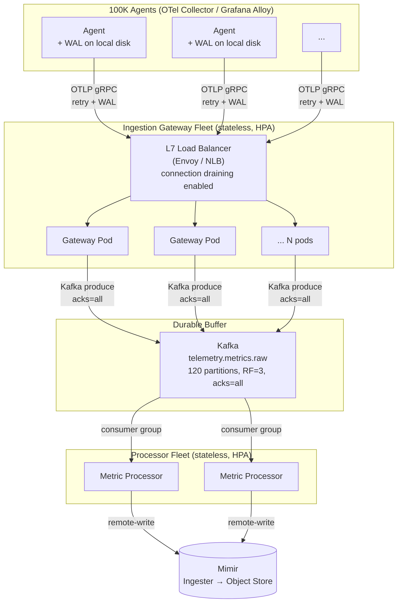
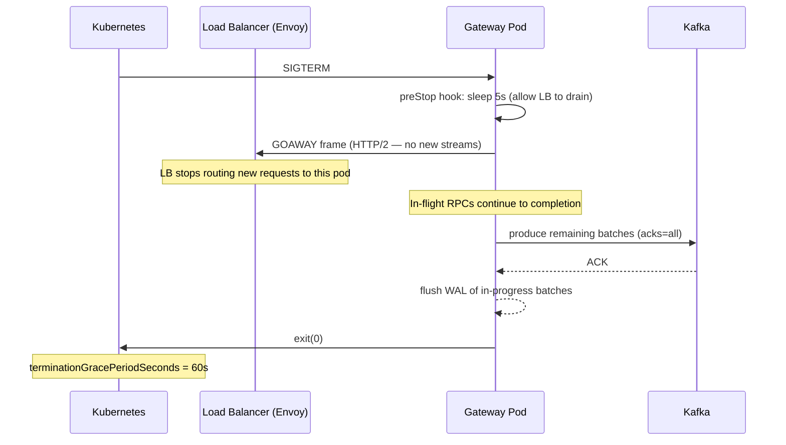
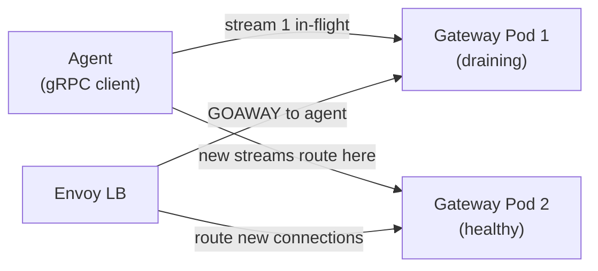
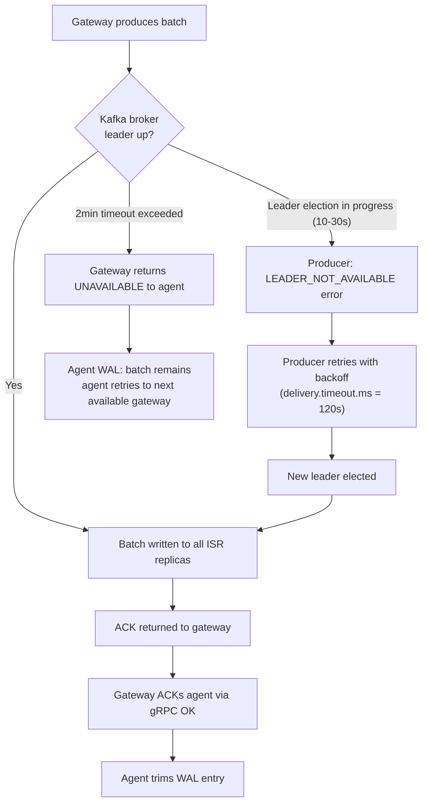
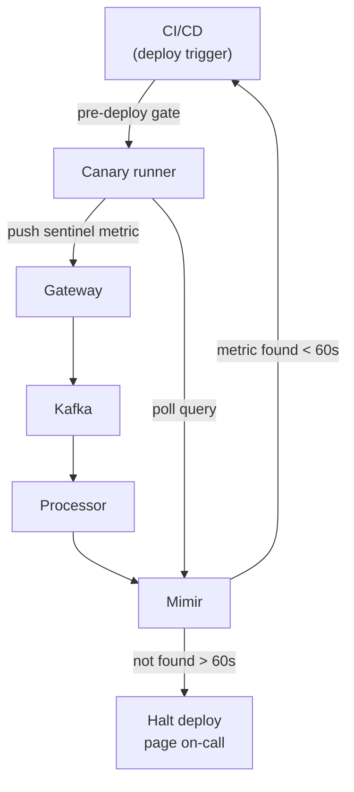

## Q1: Design a Telemetry Ingestion Pipeline

> **Prompt:** Design a telemetry ingestion pipeline that can ingest 500M metric samples/sec from
> 100K services globally. The system must never drop data during a rolling deployment of the
> ingestion tier.

> **The examiner's intent:** Can you design for operational continuity, not just steady-state
> throughput? The "never drop" constraint is the differentiator — it forces you to reason about the
> durability boundary, graceful shutdown, and agent-side resilience, not just raw scale math.

---

## Step 1: Clarify Requirements

Before drawing a box diagram, nail down the constraints. For this prompt:

**Confirm scale:**

- 500M samples/sec — is this peak or sustained? (Assume sustained; peaks will be higher.)
- 100K services — are these 100K unique Prometheus targets or 100K pods? (Pods → more agents.)
- "Globally" — how many regions? (Assume 3: US, EU, APAC. Roughly equal distribution.)

**Confirm the zero-drop constraint scope:**

- "Ingestion tier" only, or the full pipeline including processors and storage?
- Rolling deploy = one pod replaced at a time, or a percent-at-a-time canary? (Assume
  one-at-a-time.)
- What is the acceptable delay SLO for data in-flight during a restart? (Assume data must be
  queryable within 60 seconds of the agent sending it, even through a deploy.)

**Confirm signal type:**

- Metrics only (the prompt says "metric samples") — no traces or logs in scope.
- Protocol: OTLP remote-write, Prometheus remote-write, or both? (Assume OTLP as primary, prom-rw as
  compat.)

**What I'm NOT designing here:**

- Log or trace ingestion
- Query path (Mimir querier, Grafana dashboards)
- Multi-tenancy isolation (single internal platform assumed)

---

## Step 2: Scale Math

Do this out loud in an interview. Numbers anchor every component decision.

### Throughput

| Metric                                  | Value             | Derivation                                     |
| --------------------------------------- | ----------------- | ---------------------------------------------- |
| Global ingest rate                      | 500M samples/sec  | Given                                          |
| Per-region ingest rate                  | ~167M samples/sec | 500M / 3 regions                               |
| Services per region                     | ~33K              | 100K / 3                                       |
| Avg samples/sec per service             | 5,000             | 500M / 100K                                    |
| Sample size (OTLP protobuf, compressed) | ~20 bytes         | Prometheus label set + timestamp + value, zstd |
| Raw ingest bandwidth                    | **~10 GB/s**      | 500M × 20 bytes                                |
| Per-region bandwidth                    | **~3.3 GB/s**     | 10 GB/s / 3                                    |

### Active series

Each service sends ~5,000 samples/sec. If the scrape interval is 15s, that implies:

```
active_series ≈ 5,000 samples/sec × 15s = 75,000 series per service
active_series global = 75,000 × 100K = 7.5B series
```

7.5B active series is at the high end of a Mimir deployment. This will matter for ingester sizing
(we'll handle this in the storage deep dive).

### Gateway fleet sizing

Each gateway pod handles ~10K concurrent gRPC connections (Go / gRPC tuning). At 100K agents per
region, that means:

```
gateway_pods_per_region = 33K agents / 10K connections per pod = ~4 pods minimum
```

At 3.3 GB/s bandwidth per region, each pod handles ~825 MB/s. A 4-core gateway pod saturates at ~500
MB/s on TLS + protobuf deserialization. Real sizing: **~8 pods per region at steady state**, with
HPA to 24 pods at peak. This also gives headroom during rolling restarts (discussed below).

### Kafka sizing

At 3.3 GB/s per region (uncompressed), the Kafka write rate after compression (~3:1 for zstd on
protobuf) is ~1.1 GB/s. With RF=3, total broker write throughput is 3.3 GB/s.

```
partitions_needed = ceiling(throughput / partition_throughput)
                  = ceiling(1.1 GB/s / 100 MB/s) = ~12 partitions
```

In practice, use 120 partitions for operational headroom and future growth without rebalancing.

---

## Step 3: Architecture

### High-level diagram



### Durability boundary

The single most important design decision: **Kafka is the durability boundary, not the gateway.**

```
Agent WAL  →  Gateway (stateless)  →  Kafka (durable)  →  Processor  →  Mimir
                                          ↑
                              Data is safe once it lands here.
                              Gateway can be killed at any point
                              before this without data loss,
                              because the agent WAL replays.
```

This is the answer to "never drop during rolling deployment." The gateway fleet is intentionally
stateless and expendable. The agent absorbs the disruption.

---

## Step 4: Deep Dive — Zero-Drop Rolling Deployment

This is the core of the question. Cover all four layers of the zero-drop contract.

### Layer 1: Agent-side WAL (first line of defense)

Every agent (Grafana Alloy, OTel Collector) runs with a write-ahead log enabled. Before sending, the
agent persists the metric batch to local disk. It marks the batch as sent only after receiving a
confirmed ACK from the gateway (gRPC OK status, HTTP 200).

```mermaid
sequenceDiagram
    participant WAL as Agent WAL (disk)
    participant SDK as Agent Export Loop
    participant GW as Gateway Pod

    SDK->>WAL: write batch (pre-send)
    SDK->>GW: OTLP Export RPC
    alt Gateway healthy
        GW-->>SDK: OK (PartialSuccess or full)
        SDK->>WAL: mark batch as sent (trim WAL)
    else Gateway restarting (connection refused / UNAVAILABLE)
        GW--xSDK: connection error
        SDK->>SDK: exponential backoff + jitter (1s → 2s → 4s … max 60s)
        SDK->>WAL: batch remains; retry to secondary gateway
    end
```

**Key config in Alloy / OTel Collector:**

```yaml
# Grafana Alloy WAL config
prometheus.remote_write "mimir" {
  endpoint {
    url = "https://gateway.internal/api/v1/push"
  }
  wal {
    enabled   = true
    path      = "/var/lib/alloy/wal"
    max_age   = "4h"        # how long to retain unsent data on disk
    min_age   = "5m"        # minimum time before a segment is eligible for truncation
  }
  queue_config {
    max_samples_per_send  = 10000
    batch_send_deadline   = "5s"
    min_backoff           = "1s"
    max_backoff           = "60s"
    retry_on_http_429     = true
  }
}
```

The WAL provides: **up to 4 hours of resilience to a total gateway outage**. A rolling restart that
takes 10 minutes per pod is invisible to data completeness.

**Important:** The WAL does not help if the agent's local disk fills. Monitor
`prometheus_remote_storage_samples_pending` and `prometheus_wal_watcher_current_segment` on every
agent.

---

### Layer 2: Gateway graceful shutdown (second line of defense)

When Kubernetes sends `SIGTERM` to a gateway pod, the pod must:

1. Stop accepting **new** connections immediately (signal the load balancer)
2. Finish draining **in-flight** requests (connections already established)
3. ACK all in-flight metric batches to Kafka with `acks=all` before exiting
4. Exit cleanly

Without explicit handling, `SIGTERM` terminates the process immediately, dropping in-flight batches
that have been received but not yet produced to Kafka.



**Kubernetes manifest — critical settings:**

```yaml
spec:
  terminationGracePeriodSeconds: 60        # must be > max expected drain time
  containers:
    - name: gateway
      lifecycle:
        preStop:
          exec:
            command: ["/bin/sleep", "5"]   # give Envoy time to deregister this pod
      env:
        - name: GRPC_GRACEFUL_SHUTDOWN_TIMEOUT
          value: "45s"                     # drain window for active RPCs
```

The `preStop` sleep of 5 seconds gives the load balancer time to remove this pod from its upstream
pool before the process starts refusing connections. Without it, there is a race condition where the
LB still routes requests to a pod that is shutting down.

---

### Layer 3: Load balancer connection draining (third line of defense)

The load balancer (Envoy, AWS NLB, GCP NEG) must be configured to **drain** connections from a pod
being replaced, not hard-cut them.

For gRPC over HTTP/2: the LB sends a `GOAWAY` frame to the client, which signals "stop opening new
streams; existing streams complete normally." The client (agent) receives `GOAWAY` and opens a new
connection to a healthy pod. In-flight RPCs finish on the old connection.



**Envoy configuration for gRPC connection draining:**

```yaml
static_resources:
  clusters:
    - name: gateway_cluster
      connect_timeout: 1s
      type: STRICT_DNS
      lb_policy: ROUND_ROBIN
      http2_protocol_options: {}
      drain_connections_on_host_removal: true   # send GOAWAY on pod removal
      common_lb_config:
        healthy_panic_threshold:
          value: 30   # % healthy pods below which panic mode kicks in
```

**PodDisruptionBudget — non-negotiable at scale:**

During a rolling deploy, Kubernetes must guarantee that enough pods remain healthy to absorb traffic
from the pod being replaced. Without a PDB, Kubernetes could evict multiple pods simultaneously,
exceeding the WAL retry window.

```yaml
apiVersion: policy/v1
kind: PodDisruptionBudget
metadata:
  name: gateway-pdb
spec:
  maxUnavailable: 1          # only one pod can be down at a time
  selector:
    matchLabels:
      app: telemetry-gateway
```

With 8 pods per region and `maxUnavailable: 1`, the rolling deploy maintains 7/8 capacity at all
times. The remaining 7 pods must absorb the load from the 8th. Confirm this in your sizing:

```
capacity per pod = 3.3 GB/s / 8 = 413 MB/s
capacity with 7 pods = 413 MB/s × 7 = 2.9 GB/s (vs 3.3 GB/s required)
```

This is a **capacity gap** — at steady-state 100% load, removing one pod puts the fleet at 87%
capacity, which is insufficient for peak. The fix: **steady-state target at 65% utilization**, so
that a one-pod-down scenario leaves the fleet at 65% / 87% × 100 = ~75% — still headroom for peaks.

HPA should target CPU at 65%, not 80%.

---

### Layer 4: Kafka as the commit point (final guarantee)

Once a batch is produced to Kafka with `acks=all`, the data is durable regardless of what happens to
the gateway. This is the final and unconditional guarantee.

**Producer config for zero-drop:**

```yaml
# Every gateway produces with these settings — non-negotiable
acks: all                         # all in-sync replicas must confirm
enable.idempotence: true          # exactly-once per partition — no duplicates on retry
retries: 2147483647               # effectively infinite
delivery.timeout.ms: 120000       # 2-minute hard cap; if not delivered in 2min, the agent gets an error and retries from WAL
linger.ms: 5                      # 5ms batching window — 5000 samples/batch at 1M samples/sec per pod
batch.size: 1048576               # 1MB batch size — tune up from 64KB default for throughput
compression.type: zstd            # best ratio for protobuf
```

**What happens during a broker failure during a rolling gateway deploy:**



The agent's WAL provides the outer retry loop. Kafka's producer retry provides the inner loop.
Between the two, the 2-minute delivery window covers any realistic leader election or broker restart
scenario.

---

## Step 5: Observability of the Zero-Drop Guarantee

You cannot claim "never drop" without proving it. These are the signals to instrument.

### Key metrics

| Metric                                                    | What it tells you                                                      |
| --------------------------------------------------------- | ---------------------------------------------------------------------- |
| `telemetry_gateway_inbound_samples_total`                 | Samples received from agents                                           |
| `telemetry_gateway_kafka_produced_total`                  | Samples durably committed to Kafka                                     |
| `telemetry_gateway_drop_total{reason}`                    | The gap between the two — should be zero during a normal deploy        |
| `kafka_consumer_group_lag{topic="telemetry.metrics.raw"}` | Processing backlog — should not grow during a deploy                   |
| `prometheus_wal_watcher_samples_pending`                  | WAL backlog at agents — grows during a deploy; should drain within 60s |
| `prometheus_remote_storage_failed_samples_total`          | Agent-level drop counter — alert immediately if > 0                    |
| `gateway_graceful_shutdown_drain_duration_seconds`        | How long drain takes — must be < terminationGracePeriodSeconds         |

### The zero-drop SLO

```
drop_rate = sum(telemetry_gateway_drop_total) / sum(telemetry_gateway_inbound_samples_total)
SLO: drop_rate = 0.00% during any rolling deploy window
```

To measure this during a deploy:

```promql
# Drop rate during the last 10 minutes (rolling deploy window)
sum(rate(telemetry_gateway_drop_total[10m]))
/
sum(rate(telemetry_gateway_inbound_samples_total[10m]))
```

Alert: `> 0.001%` (one-in-a-hundred-thousand samples) should page on-call. In practice, this
threshold should never fire if the WAL, graceful shutdown, and PDB are correctly configured.

### Canary validation during every deploy

Before a rolling deploy starts, trigger a canary check: push a labeled sentinel metric through the
full pipeline and verify it appears in Mimir within the SLO window. If the canary fails, halt the
deploy.



---

## Summary: Zero-Drop Contract

| Layer         | Mechanism                                 | What it covers                                               |
| ------------- | ----------------------------------------- | ------------------------------------------------------------ |
| Agent         | WAL + retry with exponential backoff      | Gateway pod restart (any duration up to WAL max_age)         |
| Gateway       | `preStop` hook + gRPC `GOAWAY` drain      | In-flight RPCs at the moment of `SIGTERM`                    |
| Load balancer | Connection draining + `GOAWAY`            | Graceful client rerouting without dropping streams           |
| Kafka         | `acks=all` + idempotent producer          | Durability once received; survives broker restarts           |
| Kubernetes    | PodDisruptionBudget (`maxUnavailable: 1`) | Prevents simultaneous eviction of multiple pods              |
| Capacity      | HPA target at 65%                         | Ensures remaining fleet absorbs the load from a draining pod |

The zero-drop guarantee is not a single feature — it is the composition of all six layers. Any one
of them missing creates a gap.

---

## Trade-offs Stated (What to Say Out Loud)

**"I chose agent-side WAL as the primary protection, not gateway-side buffering."** Gateway-side
buffering (in-memory queue before Kafka produce) is tempting but wrong: if the gateway crashes
before flushing its in-memory buffer, data is lost. The WAL is on disk, survives crashes, and is
replayed by the agent on reconnect. This pushes durability to the edge, where it belongs.

**"The capacity gap during rolling deploy is the silent failure mode most teams miss."** You can
have perfect graceful shutdown and still drop data if the remaining fleet can't absorb 100% of
traffic. HPA at 65% utilization is the answer — it costs ~35% over-provisioning but buys the
headroom to tolerate any single pod going dark at peak.

**"Exactly-once from agent to Kafka would add ~15ms of latency per batch — not worth it here."** The
WAL + idempotent producer gives at-least-once with deduplication at the Mimir layer (by timestamp +
label fingerprint). Exactly-once (Kafka transactions) is a correctness guarantee for ordered
stateful streams — not needed when the downstream TSDB handles duplicates natively.

**"PodDisruptionBudget is the contract between the deploy pipeline and the ingestion platform."**
Without it, a poorly configured Helm rollout strategy or a node drain during a cluster upgrade can
evict multiple pods simultaneously. The PDB makes the guarantee enforceable by the cluster, not just
aspirational.

---

## Related

- [[05-01-telemetry-ingestion-pipeline|Telemetry Ingestion Pipeline (full design)]]
- [[03-push-vs-pull-ingestion|Push vs Pull Ingestion]]
