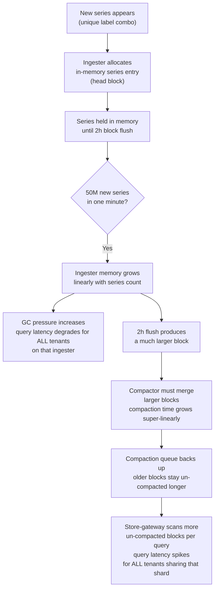
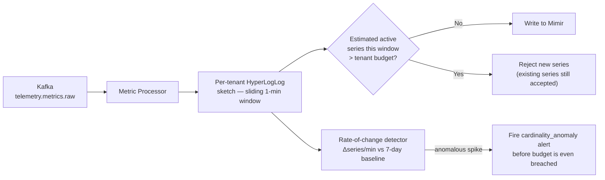
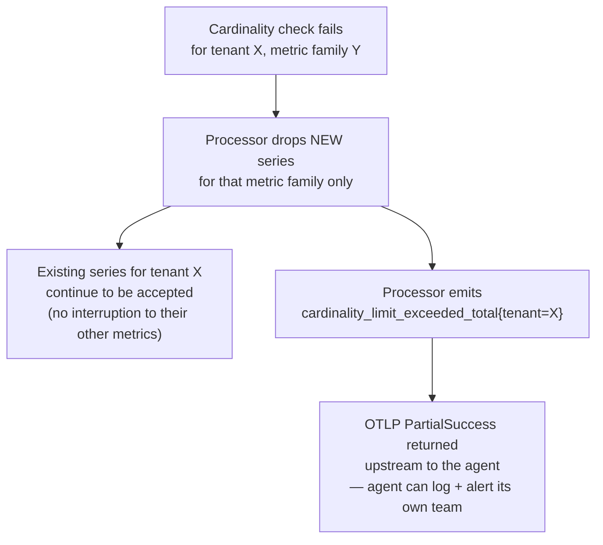

## Q2: Cardinality Storm Detection and Mitigation

> **Prompt:** A tenant is sending 50M unique label combinations per minute and causing TSDB
> compaction storms. How does your pipeline detect and mitigate this without affecting other
> tenants?

> **The examiner's intent:** Anyone can say "enforce a cardinality limit." The bar is whether you
> can explain _why_ cardinality kills a shared TSDB mechanically (not just "it gets slow"), where in
> the pipeline detection has to happen to be cheap enough to run continuously, and how you prevent
> one tenant's blast radius from becoming everyone's incident.

---

## Step 1: Clarify Requirements

**What counts as a "unique label combination"?**

- A time series in Prometheus/Mimir is uniquely identified by `metric_name + {label=value, ...}`.
  50M unique combinations/minute means 50M **new series** appearing in a 60-second window — not 50M
  samples. That distinction changes everything: this is a series-[[cardinality|cardinality]]
  problem, not a throughput problem.

**Is this a step change or a slow creep?**

- Assume step change: a deploy went out with a new label (e.g., `request_id` or `pod_ip` attached to
  a metric that used to be low-cardinality). This is the common real-world cause — cardinality
  storms are almost always caused by a code change, not organic growth.

**What does "without affecting other tenants" mean concretely?**

- No increase in query latency for other tenants' dashboards
- No ingester OOM or restart that would interrupt other tenants' write path
- No compactor backlog that delays other tenants' block availability

**Confirm the enforcement point is negotiable, detection point is not:**

- Detection must be cheap enough to run on every sample, for every tenant, continuously. Mitigation
  can be a few seconds behind — detection cannot be, because by the time a human looks at a
  dashboard, the storm has already happened.

---

## Step 2: Why Cardinality Storms Break a Shared TSDB

State the mechanism before the fix — this is what separates a mechanistic answer from a memorized
one.



The two failure surfaces:

1. **Ingester memory** — every active series costs a fixed in-memory overhead (series metadata,
   chunk buffer) regardless of sample rate. 50M new series is 50M fixed-cost allocations landing in
   the same minute, on whatever ingesters that tenant's series hash to.
2. **Compaction fan-out** — bigger blocks take longer to compact. If the offending tenant shares a
   compactor pool with others (rather than a per-tenant shard), the compactor's queue backs up for
   everyone waiting behind it.

This is why "affecting other tenants" is a real risk, not a hypothetical: **shared ingesters and
shared compactors are the coupling points.**

---

## Step 3: Detection Architecture

Detection cannot happen at the TSDB — by the time Mimir's own per-tenant limits reject a write, the
series has already been through the network, the buffer, and the processor. Push detection as far
upstream as possible.



**Why HyperLogLog, not exact counting:** an exact set of "all label combinations seen this minute"
for a tenant sending 50M series would itself need tens of GB of memory per processor replica. HLL
gives a ~2% error estimate of cardinality using a few KB of memory per tenant, which is the only way
this check can run inline on the hot path at this scale — this is the same trade-off called out in
the main design (§3.3, cardinality enforcement).

**Two independent triggers, not one:**

| Trigger                | What it catches                                              | Speed                           |
| ---------------------- | ------------------------------------------------------------ | ------------------------------- |
| Absolute budget breach | Tenant crosses a hard series-count ceiling                   | Immediate, deterministic        |
| Rate-of-change anomaly | Tenant's series count grows 100x faster than its 7-day trend | Catches it _before_ the ceiling |

The rate-of-change detector matters because a tenant with a generous static budget (say, 10M series)
could still cause a compaction storm by adding 8M series in one minute even though they never cross
the 10M ceiling. Static budgets alone miss velocity.

---

## Step 4: Mitigation — Immediate and Contained

### Immediate (seconds)



Reject at the metric-family granularity, not the whole tenant. A tenant sending a runaway
`http_request_duration_seconds{request_id=...}` metric should not lose their (well-behaved)
`cpu_usage` metric in the same push. This is the difference between a targeted fix and collateral
damage to the same tenant's other signals.

### Containment (minutes) — the "without affecting other tenants" guarantee

The reject-early check stops it from getting worse, but it doesn't undo isolation risk for series
_already_ written this window. Containment requires that the offending tenant's blast radius was
architecturally bounded before the incident:

| Isolation mechanism                                                      | What it bounds                                                                                                                                      |
| ------------------------------------------------------------------------ | --------------------------------------------------------------------------------------------------------------------------------------------------- |
| **Shuffle-sharding of ingesters** (Mimir)                                | Each tenant is pinned to a bounded subset of ingesters (e.g., 24 of 500), not all of them — a cardinality spike inflates memory on only that subset |
| **Per-tenant compactor concurrency limits**                              | Caps how many compaction jobs run for one tenant simultaneously, so its backlog can't starve the shared compactor pool                              |
| **Per-tenant ingestion rate limits** (Mimir `-ingester.instance-limits`) | Hard ceiling on `active_series` and `ingestion-rate` per tenant, enforced at the storage layer as the last line of defense                          |

This is why the main design insists on enforcing limits at **every layer** (§3.6): the processor
catches it early and cheaply; storage-layer per-tenant limits and shuffle-sharding are the backstop
if the processor check is ever bypassed or lagging.

### Medium term (the actual fix)

The processor-level reject is a circuit breaker, not a resolution. Within the incident:

1. Identify the offending metric family and label from
   `cardinality_limit_exceeded_total{tenant, metric_name}` — this tells you exactly which metric and
   which tenant, in one query.
2. Page the tenant (or their platform liaison) with the specific label causing the explosion —
   almost always a per-request identifier (`request_id`, `session_id`, `pod_ip`) that was added by a
   recent deploy.
3. Tenant either drops the label at the SDK/agent (relabeling rule as an immediate patch, code fix
   as the durable one) or the platform team adds a `metric_relabel_configs` drop rule at the agent
   for that specific label — buys time without waiting on the tenant's deploy cycle.

---

## Step 5: Observability

| Signal                                                                 | Purpose                                                        |
| ---------------------------------------------------------------------- | -------------------------------------------------------------- |
| `telemetry_processor_cardinality_estimate{tenant}`                     | Live HLL estimate, per tenant, per minute                      |
| `telemetry_processor_cardinality_limit_exceeded_total{tenant, metric}` | Which tenant, which metric family, is over budget              |
| `mimir_ingester_active_series{tenant}`                                 | Ground truth from storage — cross-check against the estimate   |
| `mimir_compactor_compaction_duration_seconds{tenant}`                  | Detects the compaction slowdown directly, per tenant           |
| `mimir_ingester_memory_series`                                         | Fleet-wide — catches the case where isolation itself has a gap |

**Alert design:**

```promql
# Rate-of-change anomaly — fires BEFORE the hard budget is breached
(
  rate(telemetry_processor_cardinality_estimate[5m])
  /
  avg_over_time(telemetry_processor_cardinality_estimate[7d:1h])
) > 20
```

`> 20x` the 7-day baseline growth rate is a strong anomaly signal independent of the absolute budget
— this is what catches a well-provisioned tenant before they ever hit their ceiling.

---

## Summary

| Layer      | Mechanism                                   | Guarantee                                                       |
| ---------- | ------------------------------------------- | --------------------------------------------------------------- |
| Detection  | HyperLogLog per-tenant sketch, 1-min window | Cheap enough to run on every sample, every tenant               |
| Detection  | Rate-of-change anomaly vs 7-day baseline    | Catches velocity spikes before the ceiling is hit               |
| Mitigation | Reject new series at metric-family grain    | Stops the tenant's other metrics from being caught in the blast |
| Isolation  | Shuffle-sharded ingesters                   | Bounds which ingesters absorb the memory spike                  |
| Isolation  | Per-tenant compactor concurrency limits     | Bounds compaction backlog to the offending tenant               |
| Backstop   | Storage-layer per-tenant hard limits        | Last line of defense if processor check is bypassed             |

---

## Trade-offs Stated (What to Say Out Loud)

**"Detection has to be approximate to be affordable."** Exact per-tenant series sets don't fit in
processor memory at this scale. A 2% error on a cardinality estimate is a rounding error; a
processor that OOMs trying to count exactly is an outage.

**"I reject at the metric-family level, not the tenant level."** Blocking an entire tenant because
one metric family misbehaves punishes their well-behaved signals too — that's an availability
regression the platform caused, not the tenant.

**"Isolation has to be provisioned before the incident, not reacted to during it."**
Shuffle-sharding and per-tenant compactor limits are capacity-planning decisions. If every tenant
shares the same ingester pool with no sharding, no amount of fast detection saves you from the blast
radius — the damage is architectural, not operational.

**"I'd rather over-alert on rate-of-change than rely on a static budget alone."** A generous static
budget catches the obvious runaway case but misses a fast, contained spike that never crosses the
ceiling yet still causes a compaction storm in the same minute.

---

## Related

- [[05-01-telemetry-ingestion-pipeline|Telemetry Ingestion Pipeline (full design)]] — §3.3
  (cardinality enforcement), §3.6 (multi-tenancy), §3.7 (compaction)
- [[05-26-q1-answer-500m-ingest-zero-drop-rolling-deploy|Q1: 500M Ingest, Zero Drop]]
