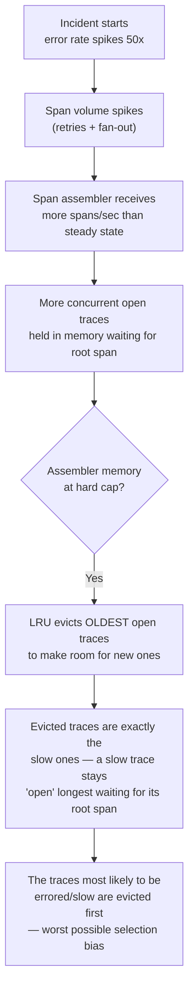
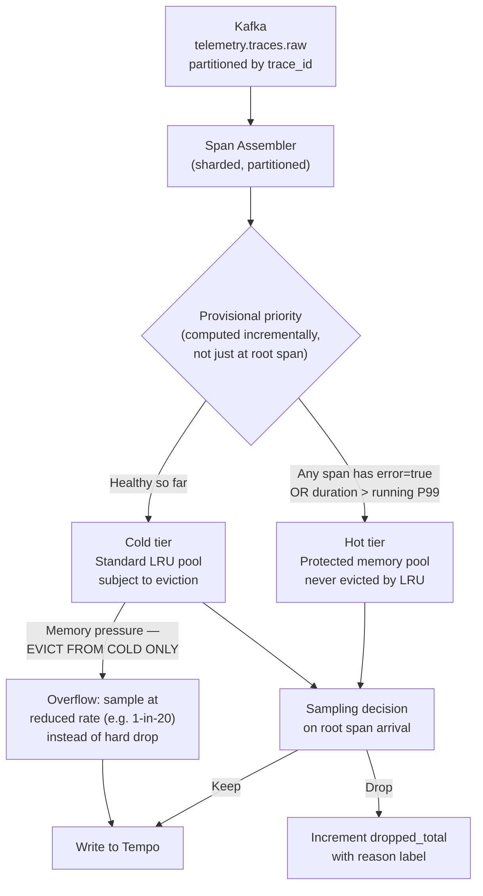

## Q3: Redesign a Trace Pipeline That Loses Spans Under Incident Load

> **Prompt:** Your trace sampling pipeline is losing spans during incident peaks — exactly when you
> need traces most. How do you redesign it?

> **The examiner's intent:** This is a load-shedding-under-correlated-failure question wearing a
> tracing costume. The bar is recognizing that the failure is correlated (incidents spike error rate
> and volume together, at the exact moment your sampling policy most wants to keep everything), and
> that the fix is a priority-aware, backpressure-aware redesign — not just "add more memory."

---

## Step 1: Clarify Requirements

**Confirm the current design (to diagnose against):**

- Tail-based sampling: spans are held by a span assembler (partitioned by `trace_id`) until the root
  span arrives, then a policy decides whether to keep the trace (§3.3 of the main design).
- Assume the assembler holds spans in a bounded in-memory LRU with TTL-based orphan flush.

**Confirm what "losing spans" means here:**

- Is it whole traces dropped (assembler evicts under memory pressure before the root span arrives),
  or trace fragments (spans arrive but the assembler can't hold the full set so keeps a partial
  trace)? Assume the former — it's the more common and more damaging failure.

**Confirm the correlation that makes this hard:**

- During an incident, span volume goes up (retries, fan-out amplification) **and** the fraction of
  traces you actually want (errored, slow) goes up **at the same time**. A sampling policy that is
  fine at steady state 1% keep-rate can be asked to keep 100x more traces in the same window,
  because the interesting-trace rate itself spiked.

**What's NOT in scope:**

- Redesigning the storage backend (Tempo) — assume it can absorb whatever is durably written.
- Changing head-based sampling policy for internal-infra traces — this is about the tail-sampling
  path for business-critical services.

---

## Step 2: Diagnose the Failure Mode



**The core insight to state out loud:** a memory-bounded LRU assembler, under pressure, evicts the
_oldest_ open traces first. But slow traces — the ones the sampling policy exists to keep — are, by
definition, open the longest. **The eviction policy is anti-correlated with the sampling policy's
goal.** This is the mechanistic root cause, not "not enough memory."

A secondary compounding factor: if the assembler is also the thing applying backpressure to Kafka
(consumer lag grows because it can't keep up), the **root spans themselves** arrive later, extending
every trace's open window further and making the eviction problem worse in a feedback loop.

---

## Step 3: Redesigned Architecture



### Fix 1: Provisional priority, computed incrementally

Don't wait for the root span to decide a trace matters. Any individual span carrying `error=true` or
exceeding a running P99 latency threshold immediately promotes its trace to a **protected memory
pool** that the LRU cannot evict. This flips the eviction bias: instead of evicting the oldest trace
regardless of signal, the assembler evicts from the pool of traces that have shown no error/latency
signal yet.

```yaml
# OTel Collector tail_sampling processor — priority-aware policy sketch
processors:
  tail_sampling:
    decision_wait: 10s
    num_traces: 500000            # bound on concurrently-open traces
    policies:
      - name: error-or-slow-protected
        type: and
        sub_policies:
          - type: status_code       # error=true → protected pool
            status_codes: [ERROR]
          - type: latency
            threshold_ms: 500       # running P99 substitute — see note below
      - name: baseline-sample
        type: probabilistic
        sampling_percentage: 1
```

**Note:** OTel Collector's built-in policies are static thresholds; a fully incremental "running
P99" promotion requires a custom policy or a sidecar that updates the threshold from the platform's
own self-telemetry (§4 of the main design) every 30–60s — worth naming as an extension point in the
interview even if the OSS processor doesn't ship it out of the box.

### Fix 2: Graceful degradation instead of hard drop under memory pressure

When the cold tier hits its memory cap, do not evict-and-lose. Instead, degrade to a lower sampling
rate for cold-tier traces (e.g., keep 1-in-20 instead of the steady-state 1-in-1 "evaluate on root
arrival" policy). This trades completeness for guaranteed non-zero visibility — you still get a
representative sample of healthy traffic during the incident, rather than a hole in the data.

### Fix 3: Decouple assembler backpressure from Kafka consumer lag

If the assembler's memory pressure slows its Kafka consumption, root spans queue up behind it,
extending every open trace's window and making eviction pressure worse — a feedback loop. Fix: give
the assembler a fast-path "peek" at span metadata (error flag, duration-so-far) without fully
deserializing/holding the whole span payload for cold-tier traces, so consumption rate stays
decoupled from assembly memory pressure. This is the same principle as [[05-backpressure]] isolation
in the main design's Layer 1 (§3.1) — the consuming component's slow path should not become the
pipeline's slow path.

### Fix 4: Horizontal headroom sized for incident multiples, not steady state

Trace assembler pods are sized in the main design's
[[05-07-scaling-each-layer|scaling table (§3.4)]] as "stateful shard pods, resharding is costly."
The redesign implication: **provision assembler memory headroom for a 10–20x incident multiplier**,
not steady-state P99. This is expensive to hold idle, so justify it with the SLO framing: "the
traces you need most are the ones this pipeline is most likely to drop under the current design —
that's an unacceptable SLO for the incident-response use case specifically."

---

## Step 4: Observability of the Redesign

| Metric                                                              | Purpose                                                                                      |
| ------------------------------------------------------------------- | -------------------------------------------------------------------------------------------- |
| `trace_assembler_protected_pool_size`                               | How many traces are currently shielded from eviction                                         |
| `trace_assembler_cold_pool_evicted_total{reason="memory_pressure"}` | Direct measure of the failure mode this redesign targets                                     |
| `trace_assembler_degraded_sample_rate`                              | Current cold-tier sampling rate — should show it stepping down during incidents, not to zero |
| `trace_assembler_kafka_consumer_lag`                                | Confirms Fix 3 — should stay flat even as protected-pool size spikes                         |
| `trace_dropped_total{reason, pool}`                                 | Breaks down drops by tier — protected-pool drops should be ~0 always                         |

**The SLO that actually matters here:** not "trace sampling success rate" in aggregate — that metric
can look fine while every dropped trace was an error trace. Track **error-trace keep-rate** as its
own SLO, separate from overall keep-rate:

```promql
sum(rate(trace_assembler_kept_total{signal="error"}[5m]))
/
sum(rate(trace_assembler_seen_total{signal="error"}[5m]))
```

Target: ≥ 99.9% even during a 20x incident-volume spike. This is the metric that would have caught
the original bug — an aggregate "spans dropped" counter looked acceptable right up until someone
went looking for the incident's own traces and found nothing.

---

## Summary

| Failure in the original design                                 | Fix                                                                   |
| -------------------------------------------------------------- | --------------------------------------------------------------------- |
| LRU evicts oldest trace first → biased against slow traces     | Protected pool for any trace showing error/latency signal early       |
| Memory cap → hard drop                                         | Graceful degradation to reduced sampling rate, never a hard cutoff    |
| Assembler backpressure slows Kafka consumption → feedback loop | Decouple metadata peek from full span retention on the cold path      |
| Sized for steady-state P99                                     | Provision for 10-20x incident multiplier; justify via error-trace SLO |

---

## Trade-offs Stated (What to Say Out Loud)

**"The bug isn't capacity, it's that the eviction policy and the sampling policy have opposite
goals."** You can throw more memory at an LRU and it will still evict the traces you most want to
keep first, just later in the incident. Fixing the priority function matters more than fixing the
size.

**"I'd rather degrade sample rate gracefully than hold a hard drop threshold."** A 1-in-20 sample of
healthy traffic during an incident still gives you a baseline to compare against; a hard drop gives
you nothing. Completeness is negotiable; total blindness is not.

**"Error-trace keep-rate has to be its own SLO, tracked separately from aggregate keep-rate."** An
aggregate metric can mask exactly the failure this question describes — it looked fine in the
dashboard while the specific traces the on-call engineer needed were the ones being dropped.

**"This costs real memory headroom held idle most of the time."** Provisioning for a 10-20x incident
multiplier is expensive. The justification is that the marginal cost of that headroom is much
smaller than the cost of an extended incident with no trace visibility into root cause.

---

## Related

- [[05-01-telemetry-ingestion-pipeline|Telemetry Ingestion Pipeline (full design)]] — §3.3
  (tail-based sampling), §3.4 (scaling), §5 (head vs tail sampling trade-off)
- [[05-26-q1-answer-500m-ingest-zero-drop-rolling-deploy|Q1: 500M Ingest, Zero Drop]]
