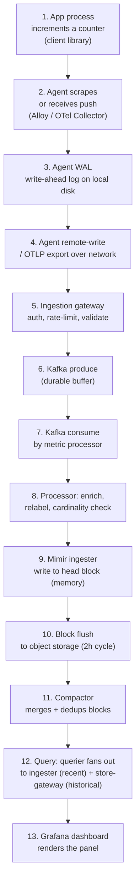

## Q4: Walk the Full Path of a Metric Data Point

> **Prompt:** Walk me through how a single metric data point travels from a Kubernetes pod to being
> queryable in a dashboard. Identify every failure point and how you'd detect it.

> **The examiner's intent:** This question rewards _completeness_, not depth on any one hop. The bar
> is naming every hop without skipping the boring ones (DNS, service discovery, WAL replay), and for
> each hop, naming the specific failure mode and the specific signal that would catch it — not a
> generic "monitor everything."

---

## The Full Journey

Thirteen hops. Each one is a place data can be delayed, dropped, or corrupted — and each has a
distinct detection signal.

---

## Hop-by-Hop Failure Analysis

### 1. App process → client library

**Failure:** Instrumentation bug — counter never incremented, wrong label, or the metric is
registered but the increment call path is never hit (dead code, wrong condition).

**Detection:** This is invisible to pipeline metrics — nothing downstream fired an error, because
nothing was ever emitted. The only catch is a **synthetic canary**
([[05-12-observability-of-the-pipeline|§4 of the main design]]) that independently verifies expected
metrics exist, or a code-review-time check (unit test asserting a metric increments on a known code
path).

### 2. Agent scrape / receive

**Failure:** Scrape target down (pull) or agent unreachable (push); scrape timeout; agent itself
crashed or OOMed.

**Detection:** `up{job=...} == 0` (Prometheus's own scrape-health metric) for pull. For push,
`otelcol_receiver_accepted_metric_points` flatlining per source is the signal — a silent drop looks
like zero, not an error.

### 3. Agent WAL

**Failure:** Local disk full — WAL can't accept new writes; agent starts dropping samples at the
SDK/exporter boundary.

**Detection:** `prometheus_wal_watcher_current_segment` combined with node-level
`node_filesystem_avail_bytes` on the agent's WAL volume. This is the failure mode called out in
[[05-26-q1-answer-500m-ingest-zero-drop-rolling-deploy|Q1]] — the WAL is the durability guarantee
during a gateway restart, but only if it has disk headroom.

### 4. Agent → network → gateway

**Failure:** DNS resolution failure to the gateway endpoint; TLS handshake failure (expired cert,
clock skew); network partition; gateway unreachable (connection refused).

**Detection:** `prometheus_remote_storage_failed_samples_total{reason="connection_error"}` at the
agent. Cross-check with gateway-side `telemetry_gateway_active_connections` — if the agent shows
failures but the gateway shows no corresponding attempt, the break is upstream of the gateway (DNS,
network), not the gateway itself.

### 5. Ingestion gateway

**Failure:** Auth rejection (expired token, clock skew on mTLS cert); rate limit triggered
(RESOURCE_EXHAUSTED); schema validation rejection (malformed OTLP payload).

**Detection:** `telemetry_gateway_requests_total{status_code}` broken out by rejection reason. A
spike in `401`/`403` means an auth/cert issue; a spike in `429` means rate limiting (expected under
backpressure, see [[05-26-q1-answer-500m-ingest-zero-drop-rolling-deploy|Q1]]'s backpressure chain).

### 6. Kafka produce

**Failure:** Broker unavailable (leader election in progress); `max.message.bytes` exceeded for an
oversized batch; producer buffer full.

**Detection:** Gateway-side Kafka producer error metrics (`kafka_producer_record_error_total`);
`under_replicated_partitions` on the broker side as a leading indicator before producer errors even
appear.

### 7. Kafka consume

**Failure:** Consumer group rebalance storm (frequent pod restarts trigger repeated rebalances,
stalling consumption); consumer stuck on a poison-pill message (malformed payload that repeatedly
fails to deserialize and blocks the partition).

**Detection:** `kafka_consumer_group_lag` — the single most important pipeline health signal
(explicitly called out in the main design's cheat sheet, §8). A poison pill shows as lag growing on
one specific partition while others drain normally — the per-partition breakdown is what
distinguishes "processor is slow" from "one bad message is stuck."

### 8. Processor: enrich, relabel, cardinality check

**Failure:** k8s metadata enrichment cache miss (pod not yet in the informer's cache — a cold-start
gap after processor restart, [[05-06-layer-3-processing-enrichment|§3.3]]); cardinality budget
rejection (see [[05-27-q2-answer-cardinality-storm-detection-mitigation|Q2]]).

**Detection:** `telemetry_processor_enrichment_cache_miss_total` and
`telemetry_processor_cardinality_limit_exceeded_total{tenant}`. A cache-miss spike right after a
processor deploy is expected and should self-heal within the informer's resync interval — alert only
if it persists past that window.

### 9. Mimir ingester write

**Failure:** Out-of-order sample rejected (clock skew between agents exceeds the out-of-order
ingestion window, default configurable up to ~1h); ingester OOM under memory pressure (see
[[05-27-q2-answer-cardinality-storm-detection-mitigation|Q2]]'s cardinality-storm mechanism).

**Detection:** `cortex_ingester_out_of_order_samples_total` (Mimir's own rejection counter) and
`mimir_ingester_memory_series` for the OOM risk.

### 10. Block flush to object storage

**Failure:** Object store write failure (Azure Blob throttling, transient network error); flush
takes longer than the 2h cycle under high series count, delaying the next flush window.

**Detection:** `cortex_ingester_shipper_upload_failures_total`; the write is retried, so this is
usually a latency problem, not a data-loss one, unless retries are exhausted.

### 11. Compactor

**Failure:** Compaction storm (see [[05-31-q6-answer-compactor-storm-diagnosis|Q6]]) — un-compacted
blocks pile up, store-gateway query latency degrades because it scans more, smaller blocks per
query.

**Detection:** `cortex_compactor_runs_completed_total` vs `cortex_compactor_runs_started_total` gap
growing; store-gateway's own `cortex_bucket_store_series_blocks_queried` count trending up (more
blocks scanned per query = compaction falling behind).

### 12. Query fan-out

**Failure:** Store-gateway loads too many block indices into memory at once (not lazy-loading, per
§3.7); querier timeout on fan-out to a slow ingester or store-gateway shard.

**Detection:** `cortex_querier_request_duration_seconds` broken down by whether the query hit the
ingester path (recent data) or store-gateway path (historical) — isolates whether the slowdown is in
"hot" or "cold" data.

### 13. Grafana dashboard render

**Failure:** Dashboard panel query itself is expensive (unbounded label matcher, e.g. `{job=~".+"}`
across all series) and times out at the Grafana data source layer, independent of backend health.

**Detection:** Grafana's own query inspector / data source health metrics; distinguishable from a
pipeline failure because the same query run directly against Mimir's API succeeds or fails
identically — isolates "dashboard problem" from "pipeline problem."

---

## The Meta-Answer: End-to-End Detection Beats Hop-by-Hop Alerting

Instrumenting all thirteen hops individually is necessary but not sufficient — a gap **between** two
correctly-instrumented hops (e.g., a config drift that silently misroutes traffic around a hop)
won't show up in any single hop's metrics. This is why the main design's **synthetic canary** (§4)
exists: a labeled sentinel metric pushed through the full path every 60 seconds, polled at the query
layer, with an SLO on end-to-end latency. The canary is what catches the failure mode that no
individual hop's dashboard would show — and it's the answer to give first, before the hop-by-hop
breakdown, because it demonstrates you understand that end-to-end coverage is a different problem
than component coverage.

---

## Summary Table

| #   | Hop                  | Primary failure                            | Primary signal                                              |
| --- | -------------------- | ------------------------------------------ | ----------------------------------------------------------- |
| 1   | App instrumentation  | Metric never emitted                       | Synthetic canary (nothing else catches this)                |
| 2   | Agent scrape/receive | Target down / agent unreachable            | `up == 0`, receiver accepted-points flatline                |
| 3   | Agent WAL            | Local disk full                            | `wal_watcher_current_segment` + disk free space             |
| 4   | Network to gateway   | DNS / TLS / partition                      | `remote_storage_failed_samples_total{reason}`               |
| 5   | Ingestion gateway    | Auth reject / rate limit                   | `gateway_requests_total{status_code}`                       |
| 6   | Kafka produce        | Broker unavailable / oversized message     | Producer error metrics, `under_replicated_partitions`       |
| 7   | Kafka consume        | Rebalance storm / poison pill              | `consumer_group_lag` (per-partition breakdown)              |
| 8   | Processor            | Enrichment cache miss / cardinality reject | `enrichment_cache_miss_total`, `cardinality_limit_exceeded` |
| 9   | Mimir ingester       | Out-of-order reject / OOM                  | `out_of_order_samples_total`, `ingester_memory_series`      |
| 10  | Block flush          | Object store write failure                 | `shipper_upload_failures_total`                             |
| 11  | Compactor            | Compaction storm                           | Compaction backlog gap, blocks-queried-per-query trend      |
| 12  | Query fan-out        | Store-gateway memory / querier timeout     | `querier_request_duration_seconds` by path                  |
| 13  | Dashboard render     | Expensive panel query                      | Grafana query inspector, isolate vs direct API call         |

---

## Trade-offs Stated (What to Say Out Loud)

**"I'd lead with the canary, not the hop list."** Thirteen correctly-instrumented hops still miss
the class of failure that lives in the gaps between them — routing misconfiguration, a
silently-dropped enrichment step. An end-to-end synthetic is the only thing that catches "the
pipeline looks healthy everywhere and the data still isn't there."

**"Every hop's failure signal has to distinguish itself from its neighbors."** A generic "errors
increased" alert doesn't tell the on-call engineer which of thirteen hops to look at. Each signal
above is chosen specifically because it's hard to confuse with a failure at an adjacent hop (e.g.,
per-partition Kafka lag isolates a poison pill from a general processor slowdown).

**"Some failures are only visible by absence, not by an error counter."** Hop 1 (instrumentation
bug) and parts of hop 4 (silent network drop) never increment an error metric anywhere — this is
exactly why "monitor error rates" is an incomplete answer, and why the canary and dashboard-vs-API
comparison techniques matter.

---

## Related

- [[05-01-telemetry-ingestion-pipeline|Telemetry Ingestion Pipeline (full design)]] — §4 (pipeline
  observability, synthetic canary), §8 (cheat sheet)
- [[05-26-q1-answer-500m-ingest-zero-drop-rolling-deploy|Q1: 500M Ingest, Zero Drop]]
- [[05-27-q2-answer-cardinality-storm-detection-mitigation|Q2: Cardinality Storm]]
- [[05-31-q6-answer-compactor-storm-diagnosis|Q6: Compactor Storm Diagnosis]]
