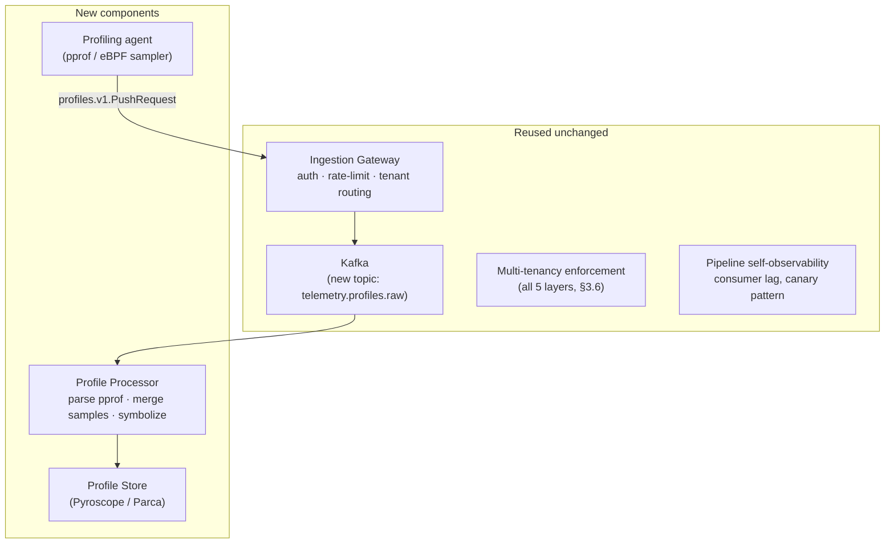
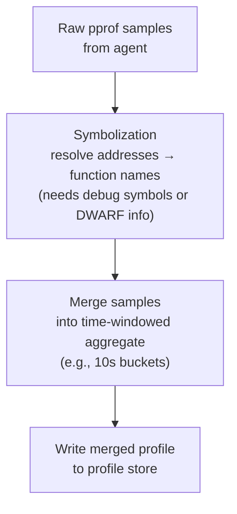
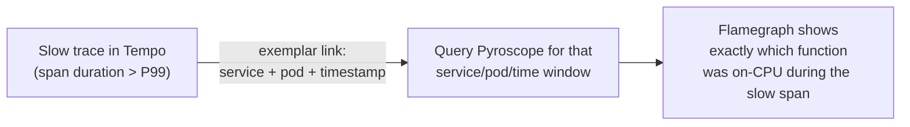

## Q5: Add Continuous Profiling Without a Full Redesign

> **Prompt:** How would you add a new signal type (continuous profiling) to an existing metrics +
> logs + traces pipeline without a full redesign?

> **The examiner's intent:** Tests whether your architecture was actually extensible or just
> happened to work for three signals. The bar is identifying exactly which components are
> signal-agnostic and reusable (gateway, buffer, multi-tenancy) versus which ones are genuinely
> signal-specific and need new code (the processor, the store) — and justifying that split.

---

## Step 1: What Profiling Actually Is (and why it's a fourth signal, not a variant of traces)

Continuous profiling captures **stack traces sampled at a fixed frequency** (e.g., 100Hz) from a
running process — "what line of code is on-CPU right now, across the fleet, continuously" — as
opposed to traces, which capture **request-scoped causal chains** across services. The data model is
fundamentally different:

| Signal   | Data model                                                    | Cardinality driver                | Query pattern                            |
| -------- | ------------------------------------------------------------- | --------------------------------- | ---------------------------------------- |
| Metrics  | Time series of numbers                                        | Label combinations                | Aggregation over time                    |
| Logs     | Unstructured/structured text lines                            | Log volume                        | Full-text / label filter                 |
| Traces   | DAG of spans, request-scoped                                  | Span count, trace_id              | Trace-by-ID lookup, service graph        |
| Profiles | Stack-trace samples, aggregated into a flamegraph-shaped tree | Unique stack depth × symbol count | Time-range aggregation into a flamegraph |

Profiles look like a merge of "metric-like" (sampled continuously, aggregated over time) and
"trace-like" (a tree structure) — but neither existing processor handles the pprof/folded-stack wire
format or the flamegraph merge operation. This is why it's a fourth pipeline, not a mode of an
existing one.

---

## Step 2: What's Reusable As-Is



**Reused, no code changes:**

- **Ingestion gateway** — protocol termination, auth, rate limiting, and tenant identification are
  signal-agnostic by design (§3.1 of the main design already frames the gateway as protocol-plural:
  OTLP, remote-write, syslog). Add a fourth route (`/api/v1/profiles/push` or OTLP profiles signal,
  once stabilized) alongside the existing three.
- **Kafka buffer** — add one new topic (`telemetry.profiles.raw`), same durability/retention
  reasoning as the other three signals. Partition key: `hash(service + pod)`, same pattern as logs,
  since profiles are also a per-instance stream rather than needing trace-id-style co-location.
- **Multi-tenancy enforcement** — every layer named in [[05-09-multi-tenancy|§3.6]] (network, auth,
  gateway, processor, storage) already exists as a pattern applied per-topic/per-tenant; profiling
  inherits the same quota and isolation model without new design work, just new config.
- **Self-observability pattern** — the synthetic canary and consumer-lag-first alerting philosophy
  ([[05-12-observability-of-the-pipeline|§4]]) extend directly: add a profiling canary that pushes a
  labeled synthetic profile and polls the profile store for it.

**This reuse is the actual point of the question.** If the gateway, buffer, and tenancy model were
built signal-aware instead of signal-agnostic, this would require a full redesign. The fact that
they aren't is the payoff of the original architecture decision in
[[05-03-high-level-architecture|§2]] ("push-based ingestion... the gateway is stateless").

---

## Step 3: What's New

### New agent-side capability

Profiling requires either:

- **eBPF-based always-on profiling** (e.g., Grafana Pyroscope's eBPF agent, Parca Agent) — no code
  changes to instrumented services, runs as a DaemonSet, samples the whole node's processes.
- **In-process pprof/async-profiler integration** — language-runtime-specific (Go `pprof`, Java
  async-profiler, Python py-spy) — richer symbol info but requires per-language agent wiring.

Recommendation: eBPF DaemonSet first (zero instrumentation burden, matches the "enrich at the agent"
principle already used for k8s metadata in §3.3), with in-process profiling as an opt-in enhancement
for services that need finer-grained (e.g., per-goroutine) resolution.

### New processor: symbolization and merge



Symbolization is the genuinely new engineering lift: raw eBPF samples are just memory addresses;
turning them into readable function names requires access to the binary's debug symbols, which for
compiled languages (Go, Rust) may need a symbol server or must be embedded at build time. This is
the one piece of net-new complexity that doesn't map onto an existing pipeline concept — call this
out explicitly as the actual cost of adding the signal, not the pipeline plumbing.

### New store

Mimir/Loki/Tempo don't model a flamegraph-shaped tree efficiently. Use a purpose-built profile store
— **Grafana Pyroscope** (or Parca) — which stores merged stack-trace trees indexed by time range and
labels, analogous to how Tempo indexes spans by trace_id. Reuse the same object-storage backend
(Azure Blob, same account as Mimir/Loki/Tempo) to avoid a new storage-tier operational surface.

---

## Step 4: Integration — Making Profiles Useful, Not Just Ingested

The value of a fourth signal is in **cross-signal correlation**, not standalone ingestion:



Wire this via a shared resource-attribute contract: every signal (metric, log, trace, profile) must
carry the same `service.name`, `pod`, and time window labels so Grafana can pivot from a slow trace
span directly into the profile store's flamegraph for that exact pod and time range. This is the
actual deliverable of "adding a signal" — an isolated profiling pipeline that isn't cross-linked to
the other three is a much weaker answer.

---

## Step 5: Cardinality and Cost Implications

Profiles are sampled continuously (not request-scoped like traces), so volume is a function of node
count × sample rate, not request rate — a fundamentally different cost driver than the other three
signals:

```
profile_volume ≈ node_count × sample_rate (100Hz) × avg_stack_depth × symbolized_frame_size
```

At 10K nodes and 100Hz sampling, this is a fixed, predictable cost (unlike traces, which spike with
traffic). Flag this in the interview: **continuous profiling has an inverted cost profile compared
to the other three signals** — its cost is proportional to fleet size, not to request volume or
error rate, which means it doesn't get more expensive during an incident (a genuine advantage) but
does need its own separate cardinality/cost budget conversation with the platform's FinOps process
(§j-finops in this repo's pillar structure), since it isn't captured by the existing per-signal
budgets.

---

## Summary

| Component            | Status                 | Why                                                                     |
| -------------------- | ---------------------- | ----------------------------------------------------------------------- |
| Ingestion gateway    | Reused unchanged       | Signal-agnostic by design — add one more route                          |
| Kafka buffer         | Reused, new topic      | Same durability model, same partitioning philosophy as logs             |
| Multi-tenancy        | Reused unchanged       | All 5 enforcement layers are pattern-based, not signal-specific         |
| Self-observability   | Reused pattern         | Canary + consumer-lag alerting philosophy extends directly              |
| Profiling agent      | **New**                | eBPF or in-process sampler — no equivalent exists for other signals     |
| Symbolization        | **New, hardest part**  | Address → function-name resolution has no analog in metrics/logs/traces |
| Profile store        | **New**                | Flamegraph-shaped data doesn't fit Mimir/Loki/Tempo's models            |
| Cross-signal linking | **New, highest value** | The actual payoff — pivot from a slow trace to its profile              |

---

## Trade-offs Stated (What to Say Out Loud)

**"The reusability here isn't luck — it's a direct payoff of designing the gateway and buffer as
signal-agnostic in the first place."** If the gateway had OTLP-metric-specific logic baked into its
core request path instead of being a thin, protocol-plural front door, this would be a full redesign
instead of an additive one.

**"Symbolization is the actual new engineering cost, not the pipeline plumbing."** It's tempting to
present this as "just add a fourth topic" — the honest answer is that resolving raw addresses to
function names for compiled languages is nontrivial and is where most of the implementation risk
lives.

**"Profiling's cost model is inverted relative to the other three signals — that's worth flagging
proactively."** Traces and logs get more expensive exactly when you need them most (incidents).
Profiling's cost is flat, proportional to fleet size — a genuine operational advantage, but it means
it needs its own budget conversation rather than being folded into existing per-signal cost
tracking.

**"I would not skip the cross-signal linking step."** A profiling pipeline that ingests data but
isn't wired to pivot from a slow trace span is technically a new signal but not yet a useful one —
the value is in the correlation, and that's the part worth defending time for even under a
"minimal-change" constraint.

---

## Related

- [[05-01-telemetry-ingestion-pipeline|Telemetry Ingestion Pipeline (full design)]] — §2 (push-based
  architecture rationale), §3.6 (multi-tenancy), §7 (component map)
- [[05-26-q1-answer-500m-ingest-zero-drop-rolling-deploy|Q1: 500M Ingest, Zero Drop]]
