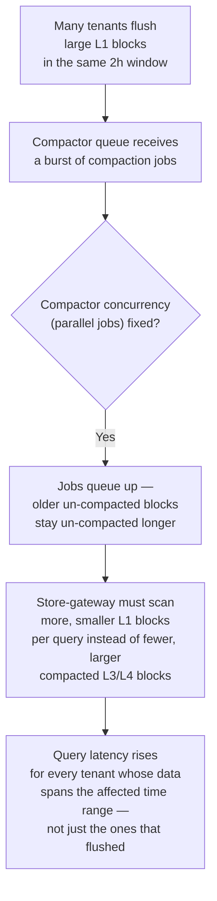
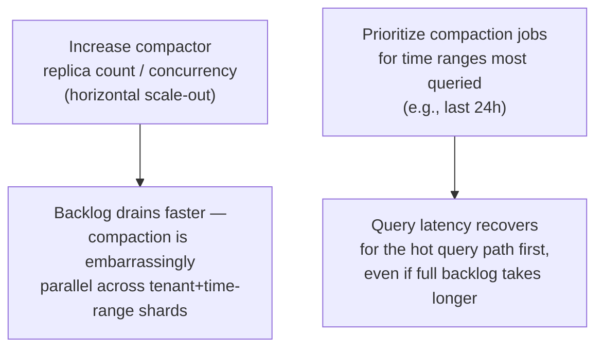

## Q6: Diagnose and Mitigate a Compactor Storm Without Pausing Ingestion

> **Prompt:** The compactor queue is backing up and query latency is spiking during a large
> multi-tenant flush. Diagnose the failure mode and describe how you'd mitigate it without pausing
> ingestion.

> **The examiner's intent:** This is a live-incident diagnosis question — the bar is a disciplined
> narrowing process (not guessing), and recognizing the specific constraint "without pausing
> ingestion" rules out the easy answer (stop writes, let the compactor catch up) and forces a design
> that keeps the write path and the compaction path decoupled.

---

## Step 1: Confirm the Symptom, Not the Assumed Cause

Before touching anything, separate two things that look identical from a dashboard but have
different fixes:

| Symptom                                     | Likely cause                                                                                    |
| ------------------------------------------- | ----------------------------------------------------------------------------------------------- | -------------------------- |
| Query latency up, ingestion latency normal  | Compactor backlog — store-gateway scanning more, smaller un-compacted blocks                    |
| Query latency up, ingestion latency also up | Shared resource contention (CPU/disk/network) between ingesters and compactor on the same nodes |
| Query latency up only for specific tenants  | Per-tenant cardinality spike (see [[05-27-q2-answer-cardinality-storm-detection-mitigation      | Q2]]), not a general flush |

Confirm via: `cortex_compactor_runs_completed_total` rate vs `cortex_compactor_runs_started_total`
rate (backlog growing?), and whether `mimir_ingester_active_series` shows a broad increase across
many tenants (consistent with "large multi-tenant flush," as stated in the prompt) versus one tenant
spiking (which would point back to Q2's scenario instead).

Assume confirmed: this is a genuine multi-tenant simultaneous-flush event — e.g., many tenants'
batch jobs all emit their end-of-day metrics in the same 2-hour block-flush window, producing a wave
of large L1 blocks that all need compacting at once.

---

## Step 2: Root Cause — Why Compaction Falls Behind



**Key mechanism to state:** compaction backlog degrades _query_ latency, not _ingestion_ latency,
because the ingester write path (head block → 2h flush → object store) is architecturally decoupled
from the compactor (an async background process reading from object storage per
[[05-10-data-tiering-and-compaction|§3.7]] of the main design). This decoupling is exactly why
"without pausing ingestion" is achievable — ingestion was never actually coupled to the compactor's
health in the first place. The interviewer is testing whether you know that, or whether you'll reach
for "pause writes" as a reflex.

**Why it hits tenants who didn't flush:** if compaction is shared infrastructure without per-tenant
sharding, a backlog caused by tenant A's flush wave slows the compactor's overall throughput,
delaying compaction for tenant B's blocks too, even though B's flush behavior was unremarkable. This
is the same shared-resource coupling risk named in
[[05-27-q2-answer-cardinality-storm-detection-mitigation|Q2]].

---

## Step 3: Mitigation Without Pausing Ingestion

### Immediate (minutes)



1. **Scale out the compactor fleet.** Compaction jobs are parallelizable by tenant and time-range
   shard — this is explicitly a horizontally-scalable batch workload, unlike the ingester (which is
   scaled by the ring, per [[05-07-scaling-each-layer|§3.4]]). Add compactor replicas; the queue
   drains proportionally. This is the direct, safe lever because it doesn't touch the write path at
   all.
2. **Prioritize by query-hot time range.** If the compactor processes its queue in arrival order,
   the oldest backlog entry isn't necessarily the one hurting query latency most. Reorder the queue
   (or run a separate high-priority lane) for the time ranges most actively queried — typically
   "last 24h" dashboards — so user-visible latency recovers before the full historical backlog
   clears.
3. **Confirm store-gateway isn't also resource-starved.** If the compactor and store-gateway share a
   node pool, a compaction-heavy period can starve store-gateway CPU too, compounding the query
   latency problem independent of block count. Check node-level CPU/memory before assuming the
   backlog itself is the whole story.

### What NOT to do

**Do not pause ingestion.** The prompt rules this out explicitly, and mechanically it wouldn't even
help: ingestion writes to the ingester's head block and flushes to object storage; the compactor
reads from object storage independently. Pausing ingestion doesn't reduce the compactor's existing
backlog — it only stops new blocks from being _added_ to the backlog, while doing nothing to drain
what's already queued. This is worth saying explicitly: the naive fix doesn't even solve the stated
problem.

**Do not manually delete or skip blocks.** Tempting under pressure, but skips vertical deduplication
(§3.7) for those blocks, permanently inflating storage cost 3x for that time range (RF=3 replicas
never merged) and is very hard to reverse.

### Medium term — prevent recurrence

1. **Stagger tenant flush windows.** If many tenants' block-flush cycles are aligned (e.g., all
   started their ingesters at the same time, so all 2h flush boundaries coincide), jitter the flush
   interval per tenant/shard so flushes spread across the 2h window instead of bursting together.
2. **Per-tenant or per-shard compactor pools.** Mirrors the shuffle-sharding isolation from
   [[05-27-q2-answer-cardinality-storm-detection-mitigation|Q2]] — bounds the blast radius so one
   tenant cohort's flush wave can't starve compaction capacity for unrelated tenants.
3. **Autoscale the compactor on queue depth, not a fixed replica count.** Treat
   `cortex_compactor_queue_length` (or the started-vs-completed gap) as an HPA signal, the same way
   the main design autoscales processors on Kafka consumer lag (§3.4).

---

## Step 4: Observability

| Metric                                                           | Purpose                                                             |
| ---------------------------------------------------------------- | ------------------------------------------------------------------- |
| `cortex_compactor_runs_started_total` / `_completed_total`       | Backlog size — the gap between these two rates                      |
| `cortex_bucket_store_series_blocks_queried`                      | Direct proxy for "query is scanning too many un-compacted blocks"   |
| `cortex_compactor_group_compaction_runs_completed_total{tenant}` | Per-tenant breakdown — confirms multi-tenant vs single-tenant cause |
| `cortex_querier_request_duration_seconds`                        | The user-visible symptom — should recover once mitigation lands     |
| Node-level CPU/memory on compactor+store-gateway pool            | Rules out shared-resource starvation as a compounding factor        |

**Alert to add going forward:**

```promql
# Backlog growing, not just non-zero — the trend matters more than the instantaneous count
increase(cortex_compactor_runs_started_total[1h])
-
increase(cortex_compactor_runs_completed_total[1h])
> 50
```

A sustained growing gap (not just a momentary blip) is the leading indicator that should page before
query latency degrades — catching this before dashboards get slow is strictly better than diagnosing
it after the fact.

---

## Summary

| Step                 | Action                                                                              | Why it doesn't touch ingestion                            |
| -------------------- | ----------------------------------------------------------------------------------- | --------------------------------------------------------- |
| Confirm symptom      | Distinguish compactor backlog from resource contention or single-tenant cardinality | Diagnosis, no action yet                                  |
| Immediate mitigation | Scale out compactor replicas                                                        | Compactor reads from object storage; write path untouched |
| Immediate mitigation | Prioritize compaction by query-hot time range                                       | Reorders existing queue; doesn't add or remove writes     |
| Prevent recurrence   | Stagger tenant flush windows                                                        | Spreads load; doesn't gate ingestion                      |
| Prevent recurrence   | Per-tenant compactor sharding                                                       | Isolates blast radius per tenant cohort                   |
| Prevent recurrence   | Autoscale compactor on backlog depth                                                | Same HPA pattern already used for processors              |

---

## Trade-offs Stated (What to Say Out Loud)

**"Pausing ingestion doesn't even solve this — that's the first thing I'd rule out, not the last."**
The compactor's backlog is already queued in object storage; stopping new writes only prevents the
backlog from growing further, it does nothing to drain what's already there. The constraint in the
prompt isn't arbitrary — it reflects that the naive fix is also the wrong fix.

**"Compaction is the one part of this pipeline that's cleanly decoupled from the write path — that's
by design, and it's what makes this mitigatable without a service disruption."** The ingester →
object store → compactor chain (§3.7) means each stage can degrade independently without cascading
backward, which is exactly the property this incident needs.

**"I'd prioritize by query-hot time range before I'd worry about draining the full historical
backlog."** User-visible pain is concentrated on recent data almost always; recovering that first is
higher-value than clearing three-week-old un-compacted blocks that nobody is querying yet.

**"Staggering flush windows is a cheap prevention lever that's easy to miss."** If nothing enforces
jitter across tenants' ingesters, they tend to synchronize over time (all restarted around the same
deploy, same 2h cadence) — this is the same "thundering herd" class of problem as the connection
storms in [[05-26-q1-answer-500m-ingest-zero-drop-rolling-deploy|Q1]], just on a 2-hour period
instead of a deploy event.

---

## Related

- [[05-01-telemetry-ingestion-pipeline|Telemetry Ingestion Pipeline (full design)]] — §3.4
  (scaling), §3.7 (data tiering and compaction)
- [[05-27-q2-answer-cardinality-storm-detection-mitigation|Q2: Cardinality Storm Detection and Mitigation]]
- [[05-29-q4-answer-metric-point-journey-failure-points|Q4: Metric Point Journey]]
