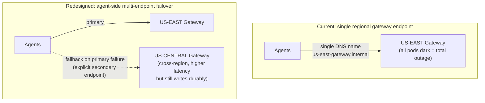

## Q7: Regional Gateway Outage — Consequences and Blast Radius Redesign

> **Prompt:** One region's ingestion gateway just went dark for 10 minutes. Walk through what
> happens to agents, to buffered data, and to dashboards during that window — then explain what
> you'd change in the design to shrink the blast radius.

> **The examiner's intent:** Two distinct skills in one question: first, tracing a failure's effects
> forward through a system you've already designed (mechanical, not creative); second, recognizing
> that "shrink the blast radius" at the regional level is a topology question, not a retry-tuning
> question — the fix lives in §3.8 of the main design, not in Layer 1.

---

## Step 1: Confirm the Baseline Topology

Per the main design's global deployment topology ([[05-11-global-deployment-topology|§3.8]]):
regional writes, async cross-region replication, global query tier. Assume US-EAST's ingestion
gateway fleet (all pods, not just one) becomes fully unreachable for 10 minutes — a total regional
gateway outage, not a single-pod failure (that case is already covered by
[[05-26-q1-answer-500m-ingest-zero-drop-rolling-deploy|Q1]]'s rolling-deploy resilience).

**What's explicitly NOT down:** Kafka, processors, Mimir/Loki/Tempo in that region are assumed
healthy — only the gateway fleet (or the network path to it) is unreachable. This isolates the
question to the gateway's specific blast radius rather than a full regional disaster (that's a
different, larger question).

---

## Step 2: Walk the Consequences Forward

```mermaid
sequenceDiagram
    participant Agent as US-EAST Agents (WAL-backed)
    participant GW as US-EAST Gateway (dark)
    participant KAFKA as US-EAST Kafka
    participant MIMIR as US-EAST Mimir
    participant GQ as Global Query Tier

    Note over Agent,GW: t=0: Gateway becomes unreachable
    Agent->>GW: OTLP export attempt
    GW--xAgent: connection refused / timeout
    Agent->>Agent: WAL retains batch, exponential backoff begins
    Note over Agent: t=0 to t=10min: WAL accumulates unsent data\n(within its 4h retention window — no loss yet)

    Note over KAFKA,MIMIR: Kafka has nothing new to consume\nfrom this region — processors idle, no backlog forms
    Note over MIMIR: No NEW samples land — existing series\ngo stale (no new points, not deleted)

    Note over GQ: Dashboards querying US-EAST data\nsee a 10-minute gap for that region\n(other regions' data unaffected)

    Note over Agent,GW: t=10min: Gateway recovers
    GW-->>Agent: connections accepted again
    Agent->>GW: WAL replay — buffered 10min of data flushed
    GW->>KAFKA: produce backlog (burst, ~10min worth compressed into replay window)
    Note over KAFKA,MIMIR: Brief processing burst as backlog drains;\nconsumer lag spikes then recovers
```

### Agents

Every agent in US-EAST hits connection failures on export. The agent-side WAL (established in
[[05-26-q1-answer-500m-ingest-zero-drop-rolling-deploy|Q1]] as the primary durability layer) buffers
locally and retries with [[08-retry-with-jitter|exponential backoff + jitter]]. At a 10-minute
outage, this is well within the WAL's typical 4-hour retention — **no data loss at the agent
layer**, assuming disk headroom holds.

### Buffered data (Kafka / processors)

Because nothing new is arriving from the gateway, Kafka and the processor fleet in US-EAST simply go
idle for this region's topics — no backlog forms _during_ the outage. The backlog forms **after**
recovery, when 10 minutes of WAL-buffered data replays in a burst. Consumer lag will spike briefly
at t=10min and drain — this is expected and should not itself page on-call if it clears within a
normal window (compare against the processor scaling triggers in §3.4).

### Dashboards

Any dashboard querying **only US-EAST data** shows a genuine 10-minute gap once the outage starts —
there is no data to show because none arrived yet (this is not a query-layer bug, it's an honest
reflection of reality). Once the WAL replays, that gap backfills with correctly-timestamped
historical points — Mimir accepts these as normal remote-write samples with past timestamps (within
the out-of-order ingestion window, §3.5). Global dashboards that aggregate across all three regions
show a partial dip (roughly 1/3 of expected volume, matching the regional split from
[[05-26-q1-answer-500m-ingest-zero-drop-rolling-deploy|Q1]]'s scale math) rather than a total
blackout — this is the direct payoff of the regional-write topology named in §3.8: **the other two
regions' agents, gateways, and dashboards are completely unaffected.**

### The one place this can still go wrong

If the outage exceeds the agent WAL's retention window (4h default), agents begin dropping data
permanently — this is the actual failure boundary to name, not the 10-minute window itself. A
10-minute outage is comfortably inside that boundary; the real risk is a _longer_ regional outage
combined with high write volume filling local disk before the network recovers.

---

## Step 3: Redesign to Shrink the Blast Radius

The walkthrough above shows the topology already contains this failure well — the redesign question
is really "how do we shrink it further," not "how do we fix a broken design."



### Fix 1: Agent-side cross-region fallback endpoint

Per §3.8's own framing of agent failover options (DNS failover, anycast, agent-side fallback list),
the concrete choice here: configure each agent with an explicit secondary gateway endpoint in a
different region. On repeated primary-connection failure (e.g., 3 consecutive failures), the agent
fails over to the secondary. This trades a latency increase (cross-region write, 50–150ms per §3.8's
own trade-off table) for **zero WAL accumulation** during the outage — data keeps flowing, just
through a farther gateway, tagged with its true origin region for correct routing downstream.

```yaml
# Grafana Alloy — cross-region fallback sketch
prometheus.remote_write "mimir" {
  endpoint {
    url = "https://us-east-gateway.internal/api/v1/push"
  }
  endpoint {
    url = "https://us-central-gateway.internal/api/v1/push"   # fallback, cross-region
  }
}
```

**Trade-off to name:** this only helps if the outage is gateway-specific and the agent's network
path to a _different_ region's gateway is healthy — it does not help in a full regional network
partition (the agent can't reach anything outside its own region). That's a distinct, larger failure
mode.

### Fix 2: Reduce the blast radius of "gateway fleet" itself

If a single control-plane misconfiguration (bad rollout, bad certificate rotation) can take down the
_entire_ regional gateway fleet simultaneously, that's the actual root cause worth designing against
directly — not just mitigating its downstream effect. Apply the same PodDisruptionBudget and
canary-gated rollout discipline from [[05-26-q1-answer-500m-ingest-zero-drop-rolling-deploy|Q1]] to
the gateway's own deployment pipeline: a bad config should be caught by a pre-deploy canary before
it reaches 100% of the fleet, which is a fundamentally different failure than "the region's network
is unreachable."

### Fix 3: Shrink WAL exposure with local batching adjustments

Independent of network topology, reduce how much data is at risk per unit of outage time by keeping
agent WAL flush cadence and local disk headroom sized for a _multi-hour_ outage, not just the
10-minute case in this prompt — the redesign lever here is capacity planning (disk size, `max_age`
in the WAL config from [[05-26-q1-answer-500m-ingest-zero-drop-rolling-deploy|Q1]]), not
architecture.

---

## Step 4: Observability to Detect This Class of Outage Fast

| Signal                                                           | Purpose                                                                                              |
| ---------------------------------------------------------------- | ---------------------------------------------------------------------------------------------------- | ------------------------------------------------------------------------------------- |
| `telemetry_gateway_active_connections` (regional, fleet-wide)    | Drop to near-zero across the whole fleet = total outage, not one pod                                 |
| `prometheus_wal_watcher_samples_pending` (aggregated per region) | Rising across nearly all agents in a region simultaneously — correlated failure, not a scattered one |
| Regional synthetic canary ([[05-12-observability-of-the-pipeline | §4]])                                                                                                | Fails immediately, independent of any single metric — the fastest, most direct signal |
| Cross-region dashboard volume by region label                    | Confirms other regions unaffected — validates the blast-radius containment claim                     |

The regional canary is the fastest detector here: it's designed to catch exactly "the pipeline looks
unreachable end-to-end," and pages before anyone needs to correlate WAL and connection metrics
manually.

---

## Summary

| Aspect              | Current behavior (10-min outage)                                | Redesign to shrink blast radius                             |
| ------------------- | --------------------------------------------------------------- | ----------------------------------------------------------- |
| Agents              | WAL buffers locally, retries with backoff                       | Add cross-region fallback endpoint — avoid buffering at all |
| Data loss           | None (within WAL retention)                                     | N/A — already zero for this window                          |
| Dashboards          | Honest 10-min gap for US-EAST-only views; global views dip ~1/3 | Fallback keeps data flowing, gap shrinks toward zero        |
| Root cause exposure | Entire gateway fleet can go dark from one bad rollout           | Canary-gated gateway deploys, same discipline as Q1         |
| Detection speed     | Depends on correlating multiple metrics                         | Regional synthetic canary pages immediately                 |

---

## Trade-offs Stated (What to Say Out Loud)

**"The regional topology already contained this well — a 10-minute outage in one region shows as a
partial dip globally, not a global outage. That's the payoff of §3.8's regional-write decision, and
it's worth saying explicitly before proposing new fixes."**

**"Cross-region agent fallback trades latency for availability, and it only covers gateway-specific
outages, not full network partitions — I'd name that limitation, not oversell the fix."**

**"The actual root cause worth chasing is why an entire regional gateway fleet went dark
simultaneously — that smells like a correlated failure (bad rollout, cert expiry), not independent
pod failures. Fixing the rollout discipline prevents the next occurrence; fixing agent retries only
mitigates this one."**

**"WAL retention and disk headroom are capacity-planning levers, not architecture — cheap to fix,
easy to overlook, and they set the actual hard ceiling on how long an outage can last before real
data loss starts."**

---

## Related

- [[05-01-telemetry-ingestion-pipeline|Telemetry Ingestion Pipeline (full design)]] — §3.8 (global
  deployment topology), §4 (synthetic canary)
- [[05-26-q1-answer-500m-ingest-zero-drop-rolling-deploy|Q1: 500M Ingest, Zero Drop]]
