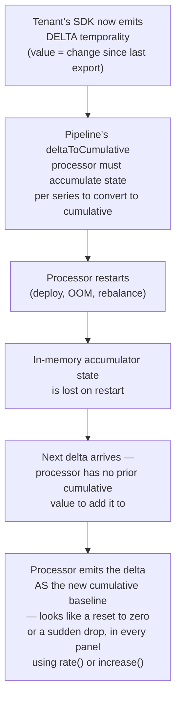
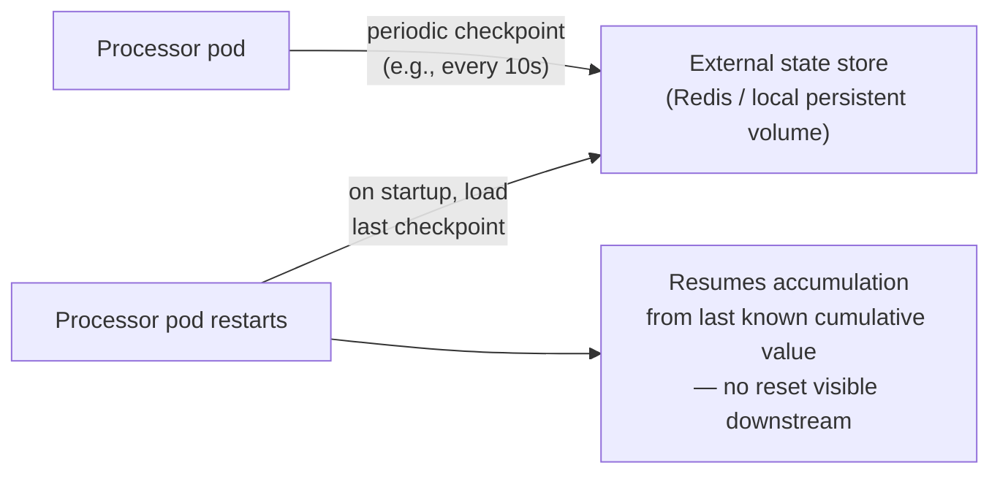

## Q8: Diagnose Counter Resets After an OTel SDK Upgrade

> **Prompt:** A tenant upgraded their OTel SDK and now every counter in their dashboard resets to
> zero every few minutes. Diagnose the root cause and fix it without asking the tenant to change
> their instrumentation.

> **The examiner's intent:** This is the temporality bug named explicitly in the main design (§3.3)
> as "the silent OTLP impedance mismatch," turned into a live debugging scenario. The bar is
> recognizing the symptom pattern instantly (periodic resets = state loss, not a data problem). The
> real skill being tested is the constraint: fix it **without** touching the tenant's code — meaning
> the fix has to live entirely in the pipeline.

---

## Step 1: Read the Symptom Precisely

"Every counter resets to zero every few minutes" is a very specific fingerprint:

- Not "counters are wrong" (which could be a labeling or aggregation bug)
- Not "counters are missing" (which would point to a drop somewhere upstream)
- Specifically **periodic resets to exactly zero** — this pattern is almost always a **stateful
  component restarting and losing its accumulated state**, not a data-loss or mislabeling issue.

**What changed:** the tenant upgraded their OTel SDK. Cross-reference against the main design's own
callout ([[05-06-layer-3-processing-enrichment|§3.3]]): "Most OTel SDK langs (Java, Node, Go)
default to delta temporality." This is the first hypothesis to test, not a guess — SDK upgrades
commonly reset config to library defaults, and the OTel default for many language SDKs is delta.

---

## Step 2: Confirm the Hypothesis



**Confirmation steps, in order (cheapest first):**

1. Check the tenant's export config or ask them directly (even though the fix won't touch their
   code, confirming the temporality setting is a one-message question, not an instrumentation
   change): "Is `OTEL_EXPORTER_OTLP_METRICS_TEMPORALITY_PREFERENCE` set, or did the upgrade revert
   it to the SDK default?" Most SDKs default to `cumulative` for sync instruments but some (notably
   some Java and Node exporter defaults) ship `delta` as the default for asynchronous/observable
   instruments.
2. Correlate the reset frequency ("every few minutes") against the `deltaToCumulative` processor's
   pod restart cadence (`kube_pod_container_status_restarts_total` for that processor deployment) —
   if restarts line up with the observed reset cadence, this confirms the mechanism rather than just
   the theory.
3. Check `telemetry_processor_temporality_conversions_total{tenant, mode="delta"}` (if this counter
   exists in the processor — add it if it doesn't, per Step 4) to confirm this tenant's traffic is
   now flowing through the delta path at all, which it may not have been pre-upgrade.

---

## Step 3: Fix Without Touching Tenant Instrumentation

The constraint rules out the "preferred fix" named in the main design (§3.3: enforce cumulative at
the SDK level) — that requires the tenant to change a config flag. Every remaining option has to
live in the pipeline.

### Option A: Make the deltaToCumulative processor's state durable across restarts



Move the per-series accumulator state out of process memory and into a durable store (Redis, or a
persistent volume with periodic snapshot) that survives pod restart. This directly fixes the root
cause: the processor no longer loses its accumulated baseline when it restarts. Cost: added latency
(checkpoint write) and a new stateful dependency for what was previously a stateless processing tier
— worth naming as the real trade-off of this fix.

### Option B (faster to ship, addresses symptom not restart frequency): Reduce processor restart frequency for this path

If restarts are frequent because of aggressive HPA scale-down, frequent deploys, or OOM from
undersized memory limits, fixing the restart cadence reduces how often the reset is visible even
without full state durability. This is a mitigation, not a fix — it narrows the window, doesn't
close it — and should be framed that way in the interview rather than presented as equivalent to
Option A.

### Option C (architecturally cleanest, but a bigger lift): Push the conversion to the querier via `rate()`/`increase()` semantics instead of a stateful processor

Prometheus's [[02-promql-functions|`rate()` and `increase()`]] functions already tolerate counter
resets by design (they detect a decrease and treat it as a reset, not a negative rate) — but this
only produces _correct_ query-time results if the underlying stored values are self-consistent
cumulative counters, which delta-native storage isn't. This option means storing delta natively and
only converting at query time — a genuinely different storage/query architecture (this is closer to
how some native delta-temporality backends work) and is out of scope for a same-week fix; name it as
the "if I were rearchitecting" answer, not the immediate one.

**Recommended immediate fix:** Option A (durable checkpoint state) — it directly targets the
confirmed root cause, requires no tenant-side change, and is a bounded, deployable change to the
processor.

---

## Step 4: Add Observability So This Class of Bug Is Caught Automatically Next Time

The bug shipped silently because nothing detected "a counter went backward" as an anomaly before a
human noticed the dashboard. Add:

| Metric                                                                  | Purpose                                                                                                                                                                  |
| ----------------------------------------------------------------------- | ------------------------------------------------------------------------------------------------------------------------------------------------------------------------ |
| `telemetry_processor_counter_reset_detected_total{tenant, metric_name}` | Increment whenever the deltaToCumulative processor observes a value lower than its last known cumulative baseline for a series — the exact signature of this bug         |
| `telemetry_processor_temporality_mode{tenant}`                          | Gauge showing which temporality mode the processor is currently converting for each tenant — makes an unexpected mode switch (like this SDK upgrade) visible immediately |
| `telemetry_processor_accumulator_state_restore_total{result}`           | Confirms, per restart, whether the durable checkpoint (Option A) was successfully restored or started cold                                                               |

**Alert to add:**

```promql
# Fires the moment a tenant's temporality mode changes — catches the NEXT
# SDK upgrade before it manifests as a dashboard complaint
changes(telemetry_processor_temporality_mode[1h]) > 0
```

This converts a bug that was previously discovered by a tenant complaint into one the platform
detects proactively at the moment of the underlying config change — a stronger answer than just
fixing this one instance.

---

## Summary

| Step                | Finding / Action                                                                                           |
| ------------------- | ---------------------------------------------------------------------------------------------------------- |
| Symptom read        | Periodic reset-to-zero = stateful component losing state, not a data bug                                   |
| Hypothesis          | SDK upgrade reverted to delta temporality default (§3.3's known impedance mismatch)                        |
| Confirmation        | Correlate reset cadence with processor restart cadence; check export config                                |
| Root cause          | `deltaToCumulative` processor's in-memory accumulator lost on restart                                      |
| Fix (chosen)        | Durable checkpoint state (Redis/PV) survives processor restart — no tenant change needed                   |
| Fix (rejected here) | Enforce cumulative at SDK — violates the "no instrumentation change" constraint                            |
| Prevention          | Detect counter-reset pattern and temporality-mode changes proactively, alert before it reaches a dashboard |

---

## Trade-offs Stated (What to Say Out Loud)

**"The symptom pattern told me almost everything before I looked at a single log line — periodic
reset-to-zero is a signature, not a mystery."** Recognizing that pattern instantly, and connecting
it to the delta/cumulative impedance mismatch already known to exist in this pipeline, is what turns
this from a multi-hour investigation into a same-day fix.

**"The 'no instrumentation change' constraint rules out the actually-preferred fix, and that's worth
saying, not hiding."** Enforcing cumulative at the SDK is the cheaper, more robust long-term answer.
Taking it off the table means accepting a stateful, more operationally expensive processor as the
cost of not touching the tenant's code — a real trade-off, not a free lunch.

**"I would not ship this fix without also shipping the detection metric."** Fixing this one tenant's
instance without adding `counter_reset_detected_total` means the next tenant who upgrades their SDK
into delta mode has the exact same bad experience, discovered the same slow way — via a dashboard
complaint instead of a page.

---

## Related

- [[05-01-telemetry-ingestion-pipeline|Telemetry Ingestion Pipeline (full design)]] — §3.3 (metric
  temporality — the silent OTLP impedance mismatch)
- [[05-29-q4-answer-metric-point-journey-failure-points|Q4: Metric Point Journey]]
